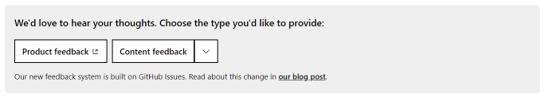

# Contributing to Microsoft Azure Documentation

Thank you for taking the time to contribute to the Microsoft Azure documentation.

This guide covers some general topics related to contribution and refers to our [contributor guide](/contribute/content) for more detailed explanations when required.

## Code of Conduct

This project has adopted the [Microsoft Open Source Code of Conduct](https://opensource.microsoft.com/codeofconduct/).

For more information, see the [Code of Conduct FAQ](https://opensource.microsoft.com/codeofconduct/faq/) or contact [opencode@microsoft.com](mailto:opencode@microsoft.com) with any additional questions or comments.

## How can I contribute?

There are many ways to contribute to the documentation. Review the following sections to find out which one is right for you.

### Report bugs and suggesting enhancements

Please use the Feedback tool at the bottom of any article to submit bugs and suggestions.

### Edit in GitHub

Follow the guidance for [Quick edits to existing documents](/contribute/content/#quick-edits-to-documentation) in our contributor guide.

## Pull requests

Review the guidance for [pull-request processing](/contribute/content/process-pull-request) in our contributor guide.
