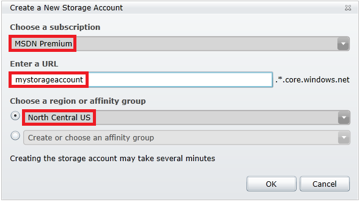

  <properties linkid="dev-net-how-to-use-blog-storage-service-java" urlDisplayName="Blob Storage" headerExpose="" pageTitle="How to Use the Blob Storage Service from Java" metaKeywords="" footerExpose="" metaDescription="" umbracoNaviHide="0" disqusComments="1" />
  <h1>How to Use the Blob Storage Service from Java</h1>
  
This guide will show you how to perform common scenarios using the Windows Azure Blob storage service. The samples are written in Java and use the <a href="http://msdn.microsoft.com/en-us/library/windowsazure/hh690953(v=vs.103).aspx">Windows Azure SDK for Java</a>. The scenarios covered include <strong>uploading</strong>, <strong>listing</strong>, <strong>downloading</strong>, and <strong>deleting</strong> blobs. For more information on blobs, see the <a href="#bkmk_NextSteps">Next Steps</a> section.

  <h2>
    What is Blob Storage</h2>
  
Windows Azure Blob storage is a service for storing large amounts of unstructured data that can be accessed from anywhere in the world via HTTP or HTTPS. A single blob can be hundreds of gigabytes in size, and a single storage account can contain up to 100TB of blobs. Common uses of Blob storage include:

  <ul>
    <li>Serving images or documents directly to a browser</li>
    <li>Storing files for distributed access</li>
    <li>Streaming video and audio</li>
    <li>Performing secure backup and disaster recovery</li>
    <li>Storing data for analysis by an on-premise or Windows Azure-hosted service</li>
  </ul>
  
You can use Blob storage to expose data publicly to the world or privately for internal application storage.

  <h2>
    Table of Contents</h2>
  <ul>
    <li>
      <a href="#bkmk_Concepts">Concepts</a>
    </li>
    <li>
      <a href="#bkmk_CreateWinAzureStorAcct">Create a Windows Azure Storage Account</a>
    </li>
    <li>
      <a href="#bkmk_CreateJavaApp">Create a Java Application</a>
    </li>
    <li>
      <a href="#bkmk_ConfigApp">Configure your Application to Access Blob Storage</a>
    </li>
    <li>
      <a href="#bkmk_SetupConnectString">Setup a Windows Azure Storage Connection String</a>
    </li>
    <li>
      <a href="#bkmk_CreateContainer">How to Create a Container</a>
    </li>
    <li>
      <a href="#bkmk_UploadBlobToContainer">How to Upload a Blob into a Container</a>
    </li>
    <li>
      <a href="#bkmk_ListBlobs">How to List the Blobs in a Container</a>
    </li>
    <li>
      <a href="#bkmk_DownloadBlobs">How to Download Blobs</a>
    </li>
    <li>
      <a href="#bkmk_DeleteBlob">How to Delete a Blob</a>
    </li>
    <li>
      <a href="#bkmk_DeleteBlobContainer">How to Delete a Blob Container</a>
    </li>
    <li>
      <a href="#bkmk_NextSteps">Next Steps</a>
    </li>
  </ul>
  <h2>
    Concepts</h2>
  
The Blob service contains the following components:

  

    
  

  <ul>
    <li>
      <strong>URL format:</strong> Blobs are addressable using the following URL format:   http://&lt;<em>storage account</em>&gt;.blob.core.windows.net/&lt;<em>container</em>&gt;/&lt;blob&gt; The following URL addresses one of the blobs in the diagram: http://sally.blob.core.windows.net/movies/MOV1.AVI</li>
    <li>
      <strong>Storage Account: </strong>All access to Windows Azure Storage is done through a storage account. This is the highest level of the namespace for accessing blobs. An account can contain an unlimited number of containers, as long as their total size is under 100TB.</li>
    <li>
      <strong>Container: </strong>A container provides a grouping of a set of blobs. All blobs must be in a container. An account can contain an unlimited number of containers. A container can store an unlimited number of blobs.</li>
    <li>
      <strong>Blob:</strong> A file of any type and size. There are two types of blobs that can be stored in Windows Azure Storage. Most files are block blobs. A single block blob can be up to 200GB in size. This tutorial uses block blobs. Page blobs, another blob type, can be up to 1TB in size, and are more efficient when ranges of bytes in a file are modified frequently</li>
  </ul>
  <h2>
    Create a Windows Azure Storage Account</h2>
  
To use storage operations, you need a Windows Azure storage account. You can create a storage account by following these steps. (You can also create a storage account using the REST API.)

  

    <strong>How to Create a Storage Account using the Management Portal</strong>
  

  <ol>
    <li>Log into the <a href="http://windows.azure.com/">Windows Azure Management Portal</a>.</li>
    <li>In the navigation pane, click <strong>Hosted Services, Storage Accounts &amp; CDN</strong>.</li>
    <li>At the top of the navigation pane, click <strong>Storage Accounts</strong>.</li>
    <li>On the ribbon, in the <strong>Storage</strong> group, click <strong>New Storage Account</strong>.   The <strong>Create a New Storage Account</strong> dialog box opens. </li>
    <li>In <strong>Choose a Subscription</strong>, select the subscription that the storage account will be used with.</li>
    <li>In <strong>Enter a URL</strong>, type a subdomain name to use in the URI for the storage account. The entry can contain from 3-24 lowercase letters and numbers. This value becomes the host name within the URI that is used to address Blob, Queue, or Table resources for the subscription.</li>
    <li>Choose a region or an affinity group in which to locate the storage. If you will be using storage from your Windows Azure application, select the same region where you will deploy your application.</li>
    <li>Finally, take note of your <strong>Primary access key</strong> in the right-hand column. You will need this in subsequent steps to access storage. </li>
  </ol>
  <h2>
    Create a Java Application</h2>
  
In this guide, you will use storage features which can be run within a Java application locally, or in code running within a web role or worker role in Windows Azure. We assume you have downloaded and installed the Java Development Kit (JDK), and followed the instructions in <a href="http://msdn.microsoft.com/en-us/library/windowsazure/hh690953(v=vs.103).aspx">Download the Windows Azure SDK for Java</a> to install the Windows Azure Libraries for Java and the Windows Azure SDK, and have created a Windows Azure storage account in your Windows Azure subscription.

  
You can use any development tools to create your application, including Notepad. All you need is the ability to compile a Java project and reference the Windows Azure Libraries for Java.

  <h2>
    Configure your Application to Access Blob Storage</h2>
  
Add the following import statements to the top of the Java file where you want to use Windows Azure storage APIs to access blobs:

  <pre class="prettyprint">// Include the following imports to use blob APIs
import com.microsoft.windowsazure.services.core.storage.*;
import com.microsoft.windowsazure.services.blob.client.*;</pre>
  <h2>
    Setup a Windows Azure Storage Connection String</h2>
  
A Windows Azure storage client uses a storage connection string to store endpoints and credentials for accessing storage services. When running in a client application, you must provide the storage connection string in the following format, using the name of your storage account and the Primary access key for the storage account listed in the Management Portal for the <em>AccountName</em> and <em>AccountKey</em> values. This example shows how you can declare a static field to hold the connection string:

  <pre class="prettyprint">// Define the connection-string with your values
public static final String storageConnectionString = 
    "DefaultEndpointsProtocol=http;" + 
    "AccountName=your_storage_account;" + 
    "AccountKey=your_storage_account_key";</pre>
  
In an application running within a role in Windows Azure, this string can be stored in the service configuration file, ServiceConfiguration.cscfg, and can be accessed with a call to the <strong>RoleEnvironment.getConfigurationSettings</strong> method. Here’s an example of getting the connection string from a <strong>Setting</strong> element named <em>StorageConnectionString</em> in the service configuration file:

  <pre class="prettyprint">// Retrieve storage account from connection-string
String storageConnectionString = 
    RoleEnvironment.getConfigurationSettings().get("StorageConnectionString");</pre>
  <h2>
    How to Create a Container</h2>
  
A CloudBlobClient object lets you get reference objects for containers and blobs. The following code creates a <strong>CloudBlobClient</strong> object.

  <pre class="prettyprint">// Retrieve storage account from connection-string
CloudStorageAccount storageAccount =
    CloudStorageAccount.parse(storageConnectionString);

// Create the blob client
CloudBlobClient blobClient = storageAccount.createCloudBlobClient();</pre>
  
All blobs reside in a container. Use the <strong>CloudBlobClient</strong> object to get a reference to the container you want to use. You can create the container if it doesn’t exist with the <strong>createIfNotExist</strong> method, which will otherwise return the existing container. By default, the new container is private, so you must specify your storage account key (as you did above) to download blobs from this container.

  <pre class="prettyprint">// Get a reference to a container
// The container name must be lower case
CloudBlobContainer container = blobClient.getContainerReference("mycontainer");

// Create the container if it does not exist
container.createIfNotExist();</pre>
  
If you want to make the files public, you can set the container’s permissions.

  <pre class="prettyprint">// Create a permissions object
BlobContainerPermissions containerPermissions = new BlobContainerPermissions();

// Include public access in the permissions object
containerPermissions.setPublicAccess(BlobContainerPublicAccessType.CONTAINER);

// Set the permissions on the container
container.uploadPermissions(containerPermissions);</pre>
  
Anyone on the internet can see blobs in a public container, but public access is limited to reading only.

  <h2>
    How to Upload a Blob into a Container</h2>
  
To upload a file to a blob, get a container reference and use it to get a blob reference. Once you have a blob reference, you can upload any stream by calling upload on the blob reference. This operation will create the blob if it doesn’t exist, or overwrite it if it does. This code sample shows this, and assumes that the container has already been created.

  <pre class="prettyprint">// Retrieve storage account from connection-string
CloudStorageAccount storageAccount =
    CloudStorageAccount.parse(storageConnectionString);

// Create the blob client
CloudBlobClient blobClient = storageAccount.createCloudBlobClient();

// Retrieve reference to a previously created container
CloudBlobContainer container = blobClient.getContainerReference("mycontainer");

// Create or overwrite the "myimage.jpg" blob with contents from a local file
CloudBlockBlob blob = container.getBlockBlobReference("myimage.jpg");
File source = new File("c:\\myimages\\myimage.jpg");
blob.upload(new FileInputStream(source), source.length());</pre>
  <h2>
    How to List the Blobs in a Container</h2>
  
To list the blobs in a container, first get a container reference like you did to upload a blob. You can use the container’s <strong>listBlobs</strong> method with a for loop. The following code outputs the Uri of each blob in a container to the console.

  <pre class="prettyprint">// Retrieve storage account from connection-string
CloudStorageAccount storageAccount =
    CloudStorageAccount.parse(storageConnectionString);

// Create the blob client
CloudBlobClient blobClient = storageAccount.createCloudBlobClient();

// Retrieve reference to a previously created container
CloudBlobContainer container = blobClient.getContainerReference("mycontainer");

// Loop over blobs within the container and output the URI to each of them
for (ListBlobItem blobItem : container.listBlobs()) {
    System.out.println(blobItem.getUri());
}</pre>
  
The blob service has the concept of directories within containers, as well. This is so that you can organize your blobs in a more folder-like structure.

  
For example, you could have a container named “photos”, in which you might upload blobs named “rootphoto1”, “2010/photo1”, “2010/photo2”, and “2011/photo1”. This would create the virtual directories “2010” and “2011” within the “photos” container. When you call <strong>listBlobs</strong> on the “photos” container, the collection returned will contain <strong>CloudBlobDirectory</strong> and <strong>CloudBlob</strong> objects representing the directories and blobs contained at the top level. In this case, directories “2010” and “2011”, as well as photo “rootphoto1” would be returned. You can use the <strong>instanceof</strong> operator to distinguish these objects.

  
Optionally, you can pass in parameters to the <strong>listBlobs</strong> method with the <strong>useFlatBlobListing</strong> parameter set to true. This will result in every blob being returned, regardless of directory. For more information, see CloudBlobContainer.listBlobs in the Javadocs documentation.

  <h2>
    How to Download Blobs</h2>
  
To download blobs, follow the same steps as you did for uploading a blob in order to get a blob reference. In the uploading example, you called upload on the blob object. In the following example, call download to transfer the blob contents to a stream object such as a <strong>FileOutputStream</strong> that you can use to persist the blob to a local file.

  <pre class="prettyprint">// Retrieve storage account from connection-string
CloudStorageAccount storageAccount =
    CloudStorageAccount.parse(storageConnectionString);

// Create the blob client
CloudBlobClient blobClient = storageAccount.createCloudBlobClient();

// Retrieve reference to a previously created container
CloudBlobContainer container = blobClient.getContainerReference("mycontainer");

// For each item in the container
for (ListBlobItem blobItem : container.listBlobs()) {
    // If the item is a blob, not a virtual directory
    if (blobItem instanceof CloudBlob) {
        // Download the item and save it to a file with the same name
        CloudBlob blob = (CloudBlob) blobItem;
        blob.download(new FileOutputStream(blob.getName()));
    }
}</pre>
  <h2>
    How to Delete a Blob</h2>
  
To delete a blob, get a blob reference, and call <strong>delete</strong>.

  <pre class="prettyprint">// Retrieve storage account from connection-string
CloudStorageAccount storageAccount =
    CloudStorageAccount.parse(storageConnectionString);

// Create the blob client
CloudBlobClient blobClient = storageAccount.createCloudBlobClient();

// Retrieve reference to a previously created container
CloudBlobContainer container = blobClient.getContainerReference("mycontainer");

// Retrieve reference to a blob named "myimage.jpg"
CloudBlockBlob blob = container.getBlockBlobReference("myimage.jpg");

// Delete the blob
blob.delete();</pre>
  <h2>
    How to Delete a Blob Container</h2>
  
Finally, to delete a blob container, get a blob container reference, and call delete.

  <pre class="prettyprint">// Retrieve storage account from connection-string
CloudStorageAccount storageAccount =
    CloudStorageAccount.parse(storageConnectionString);

// Create the blob client
CloudBlobClient blobClient = storageAccount.createCloudBlobClient();

// Retrieve reference to a previously created container
CloudBlobContainer container = blobClient.getContainerReference("mycontainer");

// Delete the blob container
container.delete();</pre>
  <h2>
    Next Steps</h2>
  
Now that you’ve learned the basics of blob storage, follow these links to learn how to do more complex storage tasks.

  <ul>
    <li>See the MSDN Reference: <a href="http://msdn.microsoft.com/en-us/library/windowsazure/gg433040.aspx">Storing and Accessing Data in Windows Azure</a></li>
    <li>Visit the Windows Azure Storage Team Blog: <a href="http://blogs.msdn.com/b/windowsazurestorage/">http://blogs.msdn.com/b/windowsazurestorage/</a></li>
  </ul>