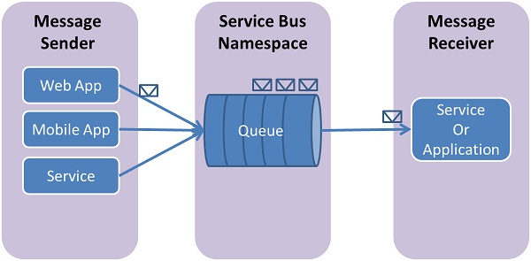
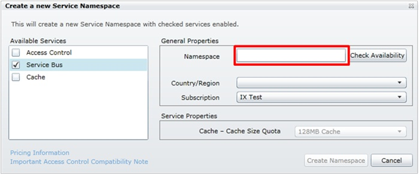
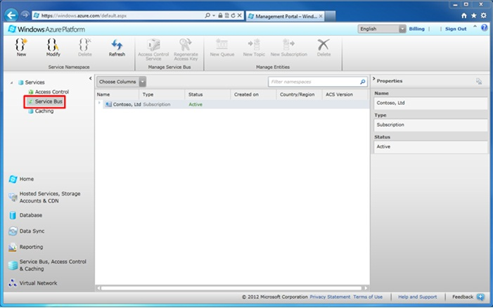
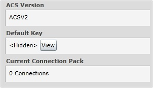

<?xml version="1.0" encoding="utf-8"?>
<body>
  <properties linkid="dev-java-how-to-service-bus-queues" urlDisplayName="Service Bus Queues" headerExpose="" pageTitle="Service Bus Queues - How To - Java - Develop" metaKeywords="" footerExpose="" metaDescription="" umbracoNaviHide="0" disqusComments="1" />
  <h1>
     How to Use Service Bus Queues
  </h1>
  
This guide will show you how to use Service Bus queues. The samples are written in Java and use the <a href="http://msdn.microsoft.com/en-us/library/windowsazure/hh690953(v=vs.103).aspx"> Windows Azure SDK for Java</a>. The scenarios covered include <strong>creating queues</strong>, <strong>sending and receiving messages</strong>, and <strong> deleting queues</strong>.

  <h2>Table of Contents</h2>
  <ul>
    <li>
      <a href="#bkmk_WhatAreSvcBusQueues">What are Service Bus Queues?</a>
    </li>
    <li>
      <a href="#bkmk_CreateSvcNamespace">Create a Service Namespace</a>
    </li>
    <li>
      <a href="#bkmk_ObtainDefaultMngmntCredentials">Obtain the Default Management Credentials for the Namespace</a>
    </li>
    <li>
      <a href="#bkmk_ConfigApp">Configure Your Application to Use Service Bus</a>
    </li>
    <li>
      <a href="#bkmk_HowToCreateQueue">How to: Create a Security Token Provider</a>
    </li>
    <li>
      <a href="#bkmk_HowToCreateQueue">How to: Create a Queue</a>
    </li>
    <li>
      <a href="#bkmk_HowToSendMsgs">How to: Send Messages to a Queue</a>
    </li>
    <li>
      <a href="#bkmk_HowToReceiveMsgs">How to: Receive Messages from a Queue</a>
    </li>
    <li>
      <a href="#bkmk_HowToHandleAppCrashes">How to: Handle Application Crashes and Unreadable Messages</a>
    </li>
    <li>
      <a href="#bkmk_NextSteps">Next Steps</a>
    </li>
  </ul>
  <h2>
    What are Service Bus Queues?</h2>
  
Service Bus Queues support a <strong>brokered messaging communication</strong> model. When using queues, components of a distributed application do not communicate directly with each other, they instead exchange messages via a queue, which acts as an intermediary. A message producer (sender) hands off a message to the queue and then continues its processing. Asynchronously, a message consumer (receiver) pulls the message from the queue and processes it. The producer does not have to wait for a reply from the consumer in order to continue to process and send further messages. Queues offer <strong>First In, First Out (FIFO)</strong> message delivery to one or more competing consumers. That is, messages are typically received and processed by the receivers in the order in which they were added to the queue, and each message is received and processed by only one message consumer.

  

    
  

  
Service Bus queues are a general-purpose technology that can be used for a wide variety of scenarios:

  <ul>
    <li>Communication between web and worker roles in a multi-tier Windows Azure application</li>
    <li>Communication between on-premises apps and Windows Azure hosted apps in a hybrid solution</li>
    <li>Communication between components of a distributed application running on-premises in different organizations or departments of an organization</li>
  </ul>
  
Using queues can enable you to scale out your applications better, and enable more resiliency to your architecture.

  <h2>
    Create a Service Namespace</h2>
  
To begin using Service Bus queues in Windows Azure, you must first create a service namespace. A service namespace provides a scoping container for addressing Service Bus resources within your application.

  
To create a service namespace:

  <ol>
    <li>Log on to the <a href="http://windows.azure.com/">Windows Azure Management Portal</a>.</li>
    <li>In the lower left navigation pane of the Management Portal, click <strong>Service Bus, Access Control &amp; Caching</strong>.</li>
    <li>In the upper left pane of the Management Portal, click the <strong> Service Bus</strong> node, and then click the <strong>New</strong> button. </li>
    <li>In the <strong>Create a new Service Namespace</strong> dialog, enter a <strong>Namespace</strong>, and then to make sure that it is unique, click the <strong>Check Availability</strong> button. </li>
    <li>After making sure the namespace name is available, choose the country or region in which your namespace should be hosted (make sure you use the same country/region in which you are deploying your compute resources), and then click the <strong>Create Namespace</strong> button. Having a compute instance is optional, and the service bus can be consumed from any application with internet access.   The namespace you created will then appear in the Management Portal and takes a moment to activate. Wait until the status is <strong>Active</strong> before moving on.</li>
  </ol>
  <h2>
    Obtain the Default Management Credentials for the Namespace</h2>
  
In order to perform management operations, such as creating a queue, on the new namespace, you need to obtain the management credentials for the namespace.

  <ol>
    <li>In the left navigation pane, click the <strong>Service Bus</strong> node, to display the list of available namespaces:  </li>
    <li>Select the namespace you just created from the list shown:  </li>
    <li>The right-hand <strong>Properties</strong> pane will list the properties for the new namespace:  </li>
    <li>The <strong>Default Key</strong> is hidden. Click the <strong>View</strong> button to display the security credentials:  </li>
    <li>Make a note of the <strong>Default Issuer</strong> and the <strong> Default Key</strong> as you will use this information below to perform operations with the namespace.</li>
  </ol>
  <h2>
    Configure Your Application to Use Service Bus</h2>
  
Add the following import statements to the top of the Java file:

  <pre class="prettyprint">  // Include the following imports to use service bus APIs   import com.microsoft.windowsazure.services.serviceBus.*;   import com.microsoft.windowsazure.services.serviceBus.models.*;   import com.microsoft.windowsazure.services.core.*;   import javax.xml.datatype.*;</pre>
  <h2>
    How to Create a Queue</h2>
  
Management operations for Service Bus queues can be performed via the <strong> ServiceBusContract</strong> class. A <strong>ServiceBusContract</strong> object is constructed with an appropriate configuration that encapsulates the token permissions to manage it, and the <strong>ServiceBusContract</strong> class is the sole point of communication with Azure.

  
The <strong>ServiceBusService</strong> class provides methods to create, enumerate, and delete queues. The example below shows how a <strong> ServiceBusService</strong> can be used to create a queue named "TestQueue" within a "HowToSample" service namespace:

  <pre class="prettyprint">  String issuer = "&lt;obtained from portal&gt;";
  String key = "&lt;obtained from portal&gt;"; 
  Configuration config = 
  ServiceBusConfiguration.configureWithWrapAuthentication(“HowToSample”, issuer, 
key); 
  ServiceBusContract service = ServiceBusService.create(config); 
  QueueInfo queueInfo = new QueueInfo("TestQueue");
  try
  {      CreateQueueResult result = service.createQueue(queueInfo);
  } catch (ServiceException e) {      System.out.print("ServiceException encountered: ");
     System.out.println(e.getMessage());
     System.exit(-1);
  }</pre>
  
There are methods on QueueInfo that allow properties of the queue to be tuned (for example: to set the default "time-to-live" value to be applied to messages sent to the queue). The following example shows how to create a queue named "TestQueue" with a maximum size of 5GB:

  <pre class="prettyprint">  long maxSizeInMegabytes = 5120;
  QueueInfo queueInfo = new QueueInfo("TestQueue");
  queueInfo.setMaxSizeInMegabytes(maxSizeInMegabytes);  
  CreateQueueResult result = service.createQueue(queueInfo);</pre>
  

    <strong>Note: </strong>You can use the <strong>listQueues</strong> method on <strong>ServiceBusContract</strong> objects to check if a queue with a specified name already exists within a service namespace.

  <h2>
    How to Send Messages to a Queue</h2>
  
To send a message to a Service Bus Queue, your application will obtain a <strong>ServiceBusContract</strong> object. The below code demonstrates how to send a message for the "TestQueue" queue we created above within our "HowToSample" service namespace:

  <pre class="prettyprint">  String issuer = "&lt;obtained from portal&gt;";
  String key = "&lt;obtained from portal&gt;"; 
  Configuration config = 
  ServiceBusConfiguration.configureWithWrapAuthentication(“HowToSample”, issuer, 
key);
  ServiceBusContract service = ServiceBusService.create(config); 
  QueueInfo queueInfo = new QueueInfo("TestQueue");
  try
  {
     CreateQueueResult result = service.createQueue(queueInfo);
     BrokeredMessage message = new BrokeredMessage("sendMessageWorks");
     service.sendQueueMessage("TestQueue", message);
  } catch (ServiceException e) {
     System.out.print("ServiceException encountered: ");
     System.out.println(e.getMessage());
     System.exit(-1);
  }</pre>
  
Messages sent to (and received from ) Service Bus queues are instances of the <strong>BrokeredMessage</strong> class. <strong>BrokeredMessage</strong> objects have a set of standard methods (such as <strong>getLabel</strong>, <strong> getTimeToLive</strong>, <strong>setLabel</strong>, and <strong>setTimeToLive</strong>), a dictionary that is used to hold custom application specific properties, and a body of arbitrary application data. An application can set the body of the message by passing any serializable object into the constructor of the <strong> BrokeredMessage</strong>, and the appropriate serializer will then be used to serialize the object. Alternatively, a <strong>java.IO.InputStream</strong> can be provided.

  
The following example demonstrates how to send five test messages to the "TestQueue" <strong>MessageSender</strong> we obtained in the code snippet above:

  <pre class="prettyprint">  for (int i=0; i&lt;5; i++)
  {
     // Create message, passing a string message for the body
     BrokeredMessage message = new BrokeredMessage("Test message " + i); 
     // Set some additional custom app-specific property
     message.setProperty("TestProperty", "TestValue" + i);  
     // Send message to the queue
     service.sendQueueMessage("TestQueue", message);
  }</pre>
  
Service Bus queues support a maximum message size of 256 KB (the header, which includes the standard and custom application properties, can have a maximum size of 64 KB). There is no limit on the number of messages held in a queue but there is a cap on the total size of the messages held by a queue. This queue size is defined at creation time, with an upper limit of 5 GB.

  <h2>
    How to Receive Messages from a Queue</h2>
  
The primary way to receive messages from a queue is to use a <strong> ServiceBusContract</strong> object. Received messages can work in two different modes: <strong>ReceiveAndDelete</strong> and <strong>PeekLock</strong>.

  
When using the <strong>ReceiveAndDelete</strong> mode, receive is a single-shot operation - that is, when Service Bus receives a read request for a message in a queue, it marks the message as being consumed and returns it to the application. <strong>ReceiveAndDelete</strong> mode (which is the default mode) is the simplest model and works best for scenarios in which an application can tolerate not processing a message in the event of a failure. To understand this, consider a scenario in which the consumer issues the receive request and then crashes before processing it. Because Service Bus will have marked the message as being consumed, then when the application restarts and begins consuming messages again, it will have missed the message that was consumed prior to the crash.

  
In <strong>PeekLock</strong> mode, receive becomes a two stage operation, which makes it possible to support applications that cannot tolerate missing messages. When Service Bus receives a request, it finds the next message to be consumed, locks it to prevent other consumers receiving it, and then returns it to the application. After the application finishes processing the message (or stores it reliably for future processing), it completes the second stage of the receive process by calling <strong>Delete</strong> on the received message. When Service Bus sees the <strong>Delete</strong> call, it will mark the message as being consumed and remove it from the queue.

  
The example below demonstrates how messages can be received and processed using <strong>PeekLock</strong> mode (not the default mode). The example below does an infinite loop and processes messages as they arrive into our "TestQueue":

  <pre class="prettyprint">  ReceiveMessageOptions opts = ReceiveMessageOptions.DEFAULT;
  opts.setReceiveMode(ReceiveMode.PEEK_LOCK); 
  while(true)
  { 
     ReceiveQueueMessageResult resultQM = service.receiveQueueMessage("TestQueue", opts);
     BrokeredMessage message = resultQM.getValue();  
     if (message != null &amp;&amp; message.getMessageId() != null)
     {
        try 
        {
           System.out.println("Body: " + message.toString());
           System.out.println("MessageID: " + message.getMessageId());
           System.out.println("Custom Property: " + message.getProperty("TestProperty")); 
           // Remove message from queue
           System.out.println("Deleting this message.");
           service.deleteMessage(message);
        }
        catch (Exception ex)
        {
           // Indicate a problem, unlock message in queue
           System.out.println("Inner exception encountered!");
           service.unlockMessage(message);
        }
     }
     else
     {
        System.out.println("Finishing up - no more messages.");
        break; // Added to handle no more messages in the queue.
        // Could instead wait for more messages to be added.
     }
  }
</pre>
  <h2>
    How to Handle Application Crashes and Unreadable Messages</h2>
  
Service Bus provides functionality to help you gracefully recover from errors in your application or difficulties processing a message. If a receiver application is unable to process the message for some reason, then it can call the <strong>unlockMessage</strong> method on the received message (instead of the <strong>deleteMessage</strong> method). This will cause Service Bus to unlock the message within the queue and make it available to be received again, either by the same consuming application or by another consuming application.

  
There is also a timeout associated with a message locked within the queue, and if the application fails to process the message before the lock timeout expires (e.g., if the application crashes), then Service Bus will unlock the message automatically and make it available to be received again.

  
In the event that the application crashes after processing the message but before the <strong>deleteMessage</strong> request is issued, then the message will be redelivered to the application when it restarts. This is often called <strong>At Least Once Processing</strong>, that is, each message will be processed at least once but in certain situations the same message may be redelivered. If the scenario cannot tolerate duplicate processing, then application developers should add additional logic to their application to handle duplicate message delivery. This is often achieved using the <strong> getMessageId</strong> method of the message, which will remain constant across delivery attempts.

  <h2>
    Next Steps</h2>
  
Now that you've learned the basics of Service Bus queues, see the MSDN topic <a href="http://msdn.microsoft.com/en-us/library/windowsazure/hh367516.aspx"> Queues, Topics, and Subscriptions</a> for more information.

</body>