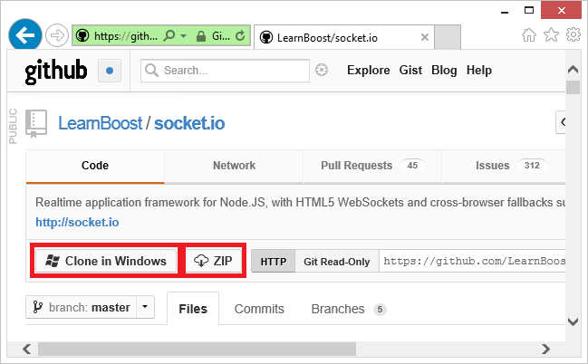

  <properties linkid="dev-nodejs-worker-app-with-socketio" urlDisplayName="App Using Socket.IO" headerExpose="" pageTitle="Node.js Application using Socket.io" metaKeywords="Azure Node.js socket.io tutorial, Azure Node.js socket.io, Azure Node.js tutorial" footerExpose="" metaDescription="A tutorial that demonstrates using socket.io in a node.js application hosted on Windows Azure" umbracoNaviHide="0" disqusComments="1" />
  <h1 id="socket.ioonwindowsazure">Node.js Application using Socket.io</h1>
  
Socket.io provides realtime communication between between your node.js server and clients. This tutorial will walk you through hosting a socket.io based chat application on Windows Azure. For more information on Socket.io, see <a href="http://socket.io/">http://socket.io/</a>.

  

    <strong>Note:</strong> The sample in this tutorial demonstrates using the Socket.IO API on Windows Azure. For simplicity, the sample is limited to running with a single Windows Azure worker role instance. This means that it should not be used in a production setting, because production applications must have at least two instances of each role in order to meet the <a href="http://www.windowsazure.com/en-us/support/sla/">Windows Azure Compute SLA</a>. To scale the application to work with multiple role instances, you could use a technology like Service Bus to share the socket.io store state across instances. For examples, see the Service Bus Queues and Topics usage samples in the <a href="https://github.com/WindowsAzure/azure-sdk-for-node">Windows Azure SDK for Node.js GitHub repository</a>.

  
A screenshot of the completed application is below:

  

    
  

  <h2>Objectives</h2>
  
In this tutorial you will learn how to:

  <ul>
    <li>Take into account Windows Azure specific considerations for Socket.io</li>
    <li>Create a Windows Azure worker role application</li>
  </ul>
  <h2>Key Technologies</h2>
  <ul>
    <li>Windows Azure Cloud Apps</li>
    <li>Node.js Socket.IO library</li>
  </ul>
  <h2>Setup</h2>
  
This tutorial assumes that you have installed the <a href="https://www.windowsazure.com/en-us/develop/nodejs/">Windows Azure SDK for Node.js</a> and have downloaded and installed the publishing settings for your Windows Azure subscription. If you have not performed these tasks, the <a href="https://www.windowsazure.com/en-us/develop/nodejs/tutorials/getting-started/">Node.js Web Application</a> tutorial will guide you through this process.

  <h2>Tutorial Segments</h2>
  <ol>
    <li>
      <a href="#windowsazureconsiderations">Windows Azure Considerations</a>
    </li>
    <li>
      <a href="#hostingthechatexampleinawebrole">Hosting the Chat Example in a Worker Role</a>
    </li>
    <li>
      <a href="#summary">Summary and Next Steps</a>
    </li>
  </ol>
  <h2 id="windowsazureconsiderations">Windows Azure Considerations</h2>
  
When an application is hosted on Windows Azure, it only has access to the ports configured in the ServiceDefinition.csdef file. By default, the projects created using the <strong>New-AzureService</strong> cmdlet provided by the <a href="https://www.windowsazure.com/en-us/develop/nodejs/">Windows Azure SDK for Node.js</a> open port 80. However when running the project in the Windows Azure emulator this port may be modified to a different port such as 81. To ensure that your application always receives traffic on correct port, you should use <strong>process.env.port</strong>, which will be mapped to the correct port at runtime. For example:

  <pre class="prettyprint">app.listen(process.env.port);
</pre>
  
If your node application runs in a Web role (created using the <strong>Add-AzureNodeWebRole</strong> cmdlet,) you must configure Socket.io to use a transport other than WebSocket. This is because the Web role makes use of IIS7, which doesn’t currently support WebSockets. The following is an example of configuring Socket.io to use long-polling:

  <pre class="prettyprint">io.configure(function () {
  io.set("transports", ["xhr-polling"]);
  io.set("polling duration", 10);
});
</pre>
  

    <strong>Note</strong>: This tutorial uses a Worker role, so the above Web role specific configuration is not used.

  <h2 id="hostingthechatexampleinawebrole">Hosting the Chat Example in a Worker Role</h2>
  
The following steps will guide you through the process of creating a Windows Azure deployment project that will host the Socket.io chat example in a Worker role.

  <h3 id="createaproject">Create a Project</h3>
  <ol>
    <li>
      
On the <strong>Start</strong> menu, click _<em>All Programs, Windows Azure SDK Node.js - November 2011</em>, right-click <strong>Windows Azure PowerShell for Node.js</strong>, and then select <strong>Run As Administrator</strong>. Opening your Windows PowerShell environment this way ensures that all of the Node command-line tools are available. Running with elevated privileges avoids extra prompts when working with the Windows Azure Emulator.

      
    </li>
    <li>
      
Create a new <strong>node</strong> directory on your C drive, and change to the c:\node directory:

      
    </li>
    <li>
      
Enter the following commands to create a new solution named <strong>chatapp</strong> and a worker role named <strong>WorkerRole1</strong>:

      <pre class="prettyprint">PS C:\node&gt; New-AzureService chatapp
PS C:\node\chatapp&gt; Add-AzureNodeWorkerRole</pre>
      
You will see the following response:

      
    </li>
  </ol>
  <h3 id="downloadthechatexample">Download the Chat Example</h3>
  
For this project, we will use the <a href="https://github.com/LearnBoost/socket.io/tree/master/examples/chat">chat example</a> from the Socket.io GitHub repository. Perform the following steps to download the example and add it to the project you previously created.

  <ol>
    <li>
      
Click the <strong>ZIP</strong> button to download a .zip archive of the project.

      
    </li>
    <li>
      
In Windows Explorer, right click the downloaded .zip file and select <strong>Extract All</strong>. When prompted, select a directory to extract the files to and then click Extract. The folder containing the extracted files should open.

      
    </li>
    <li>
      
Navigate the folder structure until you arrive at the examples\chat folder. Copy the contents of this folder to the C:\node\chatapp\WorkerRole1 folder created earlier.

      
      
After the copy operation completes, the contents of the WorkerRole1 folder should appear as follows:

      
    </li>
    <li>
      
In the C:\node\chatapp\WorkerRole1 folder, delete the server.js file, and then rename the app.js file to server.js. This removes the default server.js file created previously by the <strong>Add-AzureNodeWorkerRole</strong> cmdlet and replaces it with the application file from the chat example.

    </li>
  </ol>
  <h3 id="modifyserver.jsandinstallmodules">Modify Server.js and Install Modules</h3>
  
Before testing the application in the Windows Azure emulator, we must make some minor modifications. Perform the following steps to the server.js file:

  <ol>
    <li>
      
Open the server.js file in Notepad or other text editor.

    </li>
    <li>
      
Modifiy the require statement for socket.io by removing the ‘../../lib/’ from the beginning of the string. The modified statement should appear as:

      <pre class="prettyprint">, sio = require('socket.io');</pre>
      
This will ensure that the socket.io library is correctly loaded from the node_modules folder when the application is run.

    </li>
    <li>
      
To ensure the application listens on the correct port, open server.js in Notepad or your favorite editor, and then change the following line by replacing <strong>3000</strong> with <strong>process.env.port</strong>:

      <pre class="prettyprint">app.listen(3000, function () {</pre>
    </li>
    <li>
      
Also remove the line that begins with <strong>console.log</strong> as this is not useful when running in the Windows Azure emulator or after deployment to Windows Azure.

    </li>
  </ol>
  
After saving the changes to server.js, use the following steps to install required modules, and then test the application in the Windows Azure emulator:

  <ol>
    <li>
      
If it is not already open, start the <strong>Windows Azure PowerShell for Node.js</strong> from the Start menu by expanding <strong>All Programs, Windows Azure SDK Node.js - November 2011</strong>, right-click <strong>Windows Azure PowerShell for Node.js</strong>, and then select <strong>Run As Administrator</strong>.

    </li>
    <li>
      
Change directories to the folder containing your application. For example, C:\node\chatapp\WorkerRole1.

    </li>
    <li>
      
To install the modules required by this application, use the following npm command:

      <pre class="prettyprint">PS C:\node\chatapp\WorkerRole1&gt; npm install</pre>
      
This will install the modules listed in the package.json file. After the command completes, you should see output similar to the following:

      
    </li>
    <li>
      
Since this example was originally a part of the Socket.io GitHub repository, and directly referenced the Socket.io library by relative path, Socket.io was not referenced in the package.json file, so we must install it by issuing the following command:

      <pre class="prettyprint">PS C:\node\chatapp\WorkerRole1&gt; npm install socket.io</pre>
    </li>
  </ol>
  <h3 id="testanddeploy">Test and Deploy</h3>
  <ol>
    <li>
      
Launch the emulator by issuing the following command:

      <pre class="prettyprint">PS C:\node\chatapp\WorkerRole1&gt; Start-AzureEmulator -launch</pre>
      

        <strong>Note</strong>: If the browser window does not open automatically, you can manually open it and browse to the address returned by the <strong>Start-AzureEmulator</strong> command.

    </li>
    <li>
      
When the browser window opens, enter a nickname and then hit enter. This will all you to post messages as a specific nickname. To test multi-user functionality, open additional browser windows using the same URL and enter different nicknames.

      
    </li>
    <li>
      
After testing the application, stop the emulator by issuing the following command:

      <pre class="prettyprint">PS C:\node\chatapp\WorkerRole1&gt; Start-AzureEmulator -launch</pre>
    </li>
    <li>
      
To deploy the application to Windows Azure, use the <strong>Publish-AzureService</strong> cmdlet. For example:

      <pre class="prettyprint">PS C:\node\chatapp\WorkerRole1&gt; Publish-AzureService -name chatapp -location "North Central US" -launch</pre>
      
Be sure to use a unique name, otherwise the publish process will fail. After publishing is complete, you should see the following response.

      
      
After the deployment has completed, the browser will open and navigate to the deployed service.

      
    </li>
  </ol>
  
Your application is now running on Windows Azure, and can relay chat messages between different clients using Socket.io.

  <h2>
    Summary and Next Steps</h2>
  
In this tutorial, you learned how to host a sample chat application in a Windows Azure worker role and use the Socket.io library to provide realtime communication between between your Node.js server and clients.

  <h3>Next Steps</h3>
  <ul>
    <li>Learn more about web roles and worker roles by reading the conceptual overviews at <a>Creating a Hosted Service for Windows Azure</a>.</li>
    <li>Explore more Windows Azure features in the <a>Windows Azure How-to Guides for Node.js</a></li>
    <li>Complete more end-to-end <a>Node.js tutorials</a></li>
  </ul>