<?xml version="1.0" encoding="utf-8"?>
<body>
  <properties linkid="dev-nodejs-mongodb" urlDisplayName="Web App with MongoDB" headerExpose="" pageTitle="Node.js Web Application with Storage on MongoDB" metaKeywords="" footerExpose="" metaDescription="" umbracoNaviHide="0" disqusComments="1" />
  <h1>Node.js Web Application with Storage on MongoDB</h1>
  
This tutorial describes how to use MongoDB to store and access data from a Windows Azure application written in Node.js. This guide assumes that you have some prior experience using Windows Azure and Node.js. For an introduction to Windows Azure and Node.js, see <a href="http://www.windowsazure.com/en-us/develop/nodejs/tutorials/getting-started/">Node.js Web Application</a>. The guide also assumes that you have some knowledge of MongoDB. For an overview of MongoDB, see the <a href="http://www.mongodb.org/">MongoDB website</a>.

  
In this tutorial, you will learn how to:

  <ul>
    <li>
      
Add MongoDB support to an existing Windows Azure service that was created using the Windows Azure SDK for Node.js.

    </li>
    <li>
      
Use npm to install the MongoDB driver for Node.js.

    </li>
    <li>
      
Use MongoDB within a Node.js application.

    </li>
    <li>
      
Run your MongoDB Node.js application locally using the Windows Azure compute emulator.

    </li>
    <li>
      
Publish your MongoDB Node.js application to Windows Azure.

    </li>
  </ul>
  
Throughout this tutorial you will build a simple web-based task-management application that allows retrieving and creating tasks stored in MongoDB. MongoDB is hosted in a Windows Azure worker role, and the web application is hosted in a web role.

  
The project files for this tutorial will be stored in <strong><em>C:\node</em></strong> and the completed application will look similar to:

  

    
  

  <h2>Setting up the deployment environment</h2>
  
Before you can begin developing your Windows Azure application, you need to get the tools and set up your development environment. For details about getting and installing the Windows Azure SDK for Node.js, see <a href="http://www.windowsazure.com/en-us/develop/nodejs/tutorials/getting-started/#setup">Setup the Development Environment</a> in the Node.js Web Application tutorial.

  
NOTE: this tutorial requires Node 0.6.10 or above. This version is included in the current Windows Azure SDK for Node.js; however if you have installed a previous version you will need to <a href="http://www.windowsazure.com/en-us/develop/nodejs/tutorials/getting-started/#setup">upgrade to the latest version</a>.

  <h2>Install Windows Azure Tools for MongoDB and Node.js</h2>
  
To get MongoDB running inside Windows Azure and to create the necessary connections between Node and MongoDB, you will need to install the <a href="http://downloads.mongodb.org/azure/AzureMongoDeploymentCmdlets.msi">AzureMongoDeploymentCmdlets</a> package.

  <ol>
    <li>
      
Download and run the Windows Azure Tools for MongoDB and Node.js MSI from the <a href="http://downloads.mongodb.org/azure/AzureMongoDeploymentCmdlets.msi">MongoDB download site</a>.

      
    </li>
  </ol>
  <h2>Launching Windows Azure PowerShell for Node.js</h2>
  
The Windows Azure SDK for Node.js includes a Windows PowerShell environment that is configured for Windows Azure and Node development. Installing the Windows Azure Tools for MongoDB and Node.js also configured the enviroment to include the MongoDB Windows PowerShell cmdlets.

  <ol>
    <li>
      
On the <strong>Start</strong> menu, click <strong>All Programs</strong>, click <strong>Windows Azure SDK for Node.js - November 2011</strong>. Some of the commands require Administrator permissions, so right-click <strong>Windows PowerShell for Node.js</strong> and click <strong>Run as administrator</strong>.

      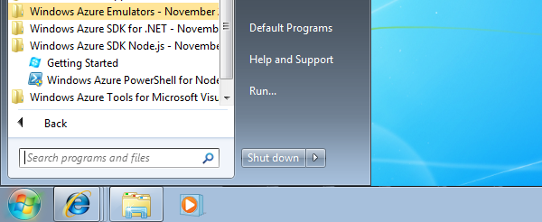
    </li>
  </ol>
  <h2>Download the MongoDB Binary Package</h2>
  <ol>
    <li>
      
You must download the MongoDB binaries as a separate package, in addition to installing the Windows Azure Tools for MongoDB and Node.js. Use the <strong>Get-AzureMongoDBBinaries</strong> cmdlet to download the binaries:

      <pre class="prettyprint">PS C:\&gt; Get-AzureMongoDBBinaries
</pre>
      
You will see the following response:

      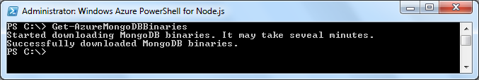
    </li>
  </ol>
  <h2>Create a new application</h2>
  <ol>
    <li>
      
Create a new <strong>node</strong> directory on your C drive and change to the c:\node directory. If you have completed other Windows Azure tutorials in Node.js, this directory may already exist.

      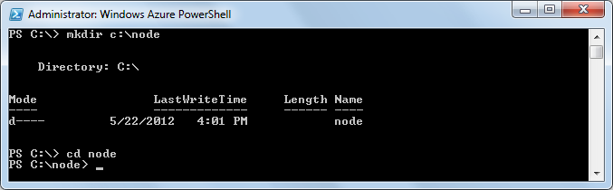
    </li>
    <li>
      
Use the <strong>New-AzureService</strong> cmdlet to create a new solution:

      <pre class="prettyprint">PS C:\node&gt; New-AzureService tasklistMongo
</pre>
      
You will see the following response:

      
    </li>
    <li>
      
Enter the following command to add a new web role instance:

      <pre class="prettyprint">PS C:\node\tasklistMongo&gt; Add-AzureNodeWebRole
</pre>
      
You will see the following response:

      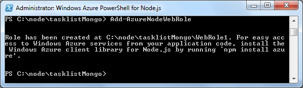
    </li>
    <li>
      
Enter the following command to change to the newly generated directory:

      <pre class="prettyprint">PS C:\node\tasklistMongo&gt; cd WebRole1
</pre>
    </li>
    <li>
      
To get started, you will create a simple application that shows the status of your running MongoDB database. Run the following command to copy starter code into your server.js file:

      <pre class="prettyprint">PS C:\node\tasklistMongo\WebRole1&gt; copy "C:\Program Files (x86)\MongoDB\Windows Azure\Nodejs\Scaffolding\MongoDB\NodeIntegration\WebRole\node_modules\azureMongoEndpoints\examples\showStatusSample\mongoDbSample.js" server.js
</pre>
    </li>
    <li>
      
Enter the following command to open the updated file in notepad.

      <pre class="prettyprint">PS C:\node\tasklistMongo\WebRole1&gt; notepad server.js
</pre>
      
You can see that the file is querying the mongoDB database to display status.

    </li>
    <li>
      
Close the file when you are done reviewing it.

    </li>
    <li>
      
The server.js code references a worker role called ReplicaSetRole that hosts MongoDB. Enter the following command to create ReplicaSetRole (which is the default role name) as a new MongoDB worker role:

      <pre class="prettyprint">PS C:\node\tasklistMongo\WebRole1&gt; Add-AzureMongoWorkerRole
</pre>
      

        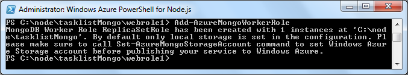
      

    </li>
    <li>
      
The final step before you can deploy is joining the roles running Node and MongoDB so the web application can communicate with MongoDB. Use the following command to integrate them.

      <pre class="prettyprint">PS C:\node\tasklistMongo\WebRole1&gt; Join-AzureNodeRoleToMongoRole WebRole1
</pre>
      

        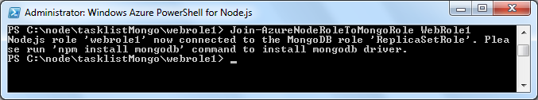
      

    </li>
    <li>
      
The response of the <strong>Join-AzureNodeRoleToMongoRole</strong> command shows the npm (node package manager) command to use to install the MongoDB driver for Node.js. Run the following command to install the MongoDB driver:

      <pre class="prettyprint">PS C:\node\tasklistMongo\WebRole1&gt; npm install mongodb
</pre>
    </li>
    <li>
      
By default your application will be configured to include one WebRole1 instance and one ReplicaSetRole instance. In order to enable MongoDB replication, you need three instances of ReplicaSetRole. Run the following command to specify that three instances of ReplicaSetRole should be created:

      <pre class="prettyprint">PS C:\node\tasklistMongo\WebRole1&gt; Set-AzureInstances ReplicaSetRole 3
</pre>
    </li>
  </ol>
  <h2>Running Your Application Locally in the Emulator</h2>
  <ol>
    <li>
      
Enter the following command to run your service in the emulator and launch a browser window:

      <pre class="prettyprint">PS C:\node\tasklistMongo\WebRole1&gt; Start-AzureEmulator -launch
</pre>
      
A browser will open and display content similar to the details shown in the screenshot below. This indicates that the service is running in the compute emulator and is working correctly.

      
      
Running the application in the emulator also starts instances of mongod.exe and AzureEndpointsAgent.exe running on your local machine. You will see three console windows open for the mongod.exe instances—one for each replicated instance. A fourth console window will open for AzureEndpointsAgent.exe. Calling Stop-AzureEmulator will also cause the instances of these applications to stop.

      

        <strong>Note:</strong> In some cases, your browser window may launch and attempt to load the web application before your worker role instances are running, which will cause an error message to be displayed in the browser. If this occurs, refreshing the page in the browser when the worker role instances are running will result in the page being displayed correctly.

    </li>
    <li>
      
To stop the compute emulator, enter the following command:

      <pre class="prettyprint">PS C:\node\tasklistMongo\WebRole1&gt; Stop-AzureEmulator
</pre>
    </li>
  </ol>
  <h2>Creating a Node.js application using express and other tools</h2>
  
In this section you will pull additional module packages into your application using npm. You will then extend your earlier application using the express module to build a task-list application that stores data in MongoDB.

  
For the task-list application you will use the following modules (in addition to the mongodb module that you installed earlier):

  <ul>
    <li>
      
express - A web framework inspired by Sinatra.

    </li>
    <li>
      
node-uuid - A utility library for creating universally unique identifiers (UUIDs) (similar to GUIDs)

    </li>
  </ul>
  <ol>
    <li>
      
To install the modules, enter the command below from WebRole1 folder:

      <pre class="prettyprint">PS C:\node\tasklistMongo\WebRole1&gt; npm install express node-uuid
</pre>
    </li>
    <li>
      
You will use the scaffolding tool included with the express package, by entering the command below from WebRole1 folder:

      <pre class="prettyprint">PS C:\node\tasklistMongo\WebRole1&gt; .\node_modules\.bin\express
</pre>
    </li>
    <li>
      
You will be prompted to overwrite your earlier application. Enter <strong>y</strong> or <strong>yes</strong> to continue, and express will generate a folder structure for building your application.

      
    </li>
    <li>
      
Delete your existing server.js file and rename the generated app.js file to server.js. This is needed because the Windows Azure web role in your application is configured to dispatch HTTP requests to server.js.

      <pre class="prettyprint">PS C:\node\tasklistMongo\WebRole1&gt; del server.js
PS C:\node\tasklistMongo\WebRole1&gt; ren app.js server.js
</pre>
    </li>
    <li>
      
To install the jade engine, enter the following command:

      <pre class="prettyprint">PS C:\node\tasklistMongo\WebRole1&gt; npm install
</pre>
      
npm will now download additional dependencies defined in the generated package.json file

    </li>
  </ol>
  <h2>Using MongoDB in a Node application</h2>
  
In this section you will extend your application to create a web-based task-list application that you will deploy to Azure. The task list will allow a user to retrieve tasks, add new tasks, and mark tasks as completed. The application will utilize MongoDB to store task data.

  <h3>Create the connector for the MongoDB driver</h3>
  <ol>
    <li>
      
The <em>taskProvider.js</em> file will contain the connector for the MongoDB driver for the tasklist application. The MongoDB driver taps into the existing Windows Azure resources to provide connectivity. Enter the following command to create and open the taskProvider.js file:

      <pre class="prettyprint">PS C:\node\tasklistMongo\WebRole1&gt; notepad taskProvider.js
</pre>
    </li>
    <li>
      
At the beginning of the file add the following code to reference required libraries:

      <pre class="prettyprint">var AzureMongoEndpoint = require('azureMongoEndpoints').AzureMongoEndpoint;
var mongoDb = require('mongodb').Db;
var mongoDbConnection = require('mongodb').Connection;
var mongoServer = require('mongodb').Server;
var bson = require('mongodb').BSONNative;
var objectID = require('mongodb').ObjectID;
</pre>
    </li>
    <li>
      
Next, you will add code to set up the <strong>TaskProvider</strong> object. This object will be used to perform interactions with the MongoDB database.

      <pre class="prettyprint">var TaskProvider = function() {
  var self = this;
  
  // Create mongodb azure endpoint
  var mongoEndpoints = new AzureMongoEndpoint('ReplicaSetRole', 'MongodPort');
  
  // Watch the endpoint for topologyChange events
  mongoEndpoints.on('topologyChange', function() {
    if (self.db) {
      self.db.close();
      self.db = null;
    }
    
    var mongoDbServerConfig = mongoEndpoints.getMongoDBServerConfig();
    self.db = new mongoDb('test', mongoDbServerConfig, {native_parser:false});
    self.db.open(function() {});
  });
  
  mongoEndpoints.on('error', function(error) {
    throw error;
  });
};
</pre>
      
Note that the <strong>mongoEndpoints</strong> object is used to get the MongoDB endpoint listener. This listener keeps track of the IP addresses associated with the running MongoDB servers and will automatically be updated as MongoDB server instances come on and off line.

    </li>
    <li>
      
The remaining code to finish off the MongoDB driver is fairly standard code that you may be familiar with from previous MongoDB projects:

      <pre class="prettyprint">TaskProvider.prototype.getCollection = function(callback) {
  var self = this;

  var ensureMongoDbConnection = function(callback) {
    if (self.db.state !== 'connected') {
      self.db.open(function (error, client) {
        callback(error);
      });
    } else {
      callback(null);      
    }
  }

  ensureMongoDbConnection(function(error) {
    if (error) {
      callback(error);
    } else {
      self.db.collection('task', function(error, task_collection) {
        if (error) {
          callback(error);
        } else {
          callback(null, task_collection);
        }
      });
    }
  });
};

TaskProvider.prototype.findAll = function(callback) {
  this.getCollection(function(error, task_collection) {
    if (error) {
      callback(error)
    } else {
      task_collection.find().toArray(function(error, results) {
        if (error) {
          callback(error)
        } else {
          callback(null, results)
        }
      });
    }
  });
};

TaskProvider.prototype.save = function(tasks, callback) {
  this.getCollection(function (error, task_collection) {
    if (error) {
      callback(error)
    } else {
      if (typeof (tasks.length) == "undefined") {
        tasks = [tasks];
      }

      for (var i = 0; i &lt; tasks.length; i++) {
        task = tasks[i];
        task.created_at = new Date();
      }
      
      task_collection.insert(tasks, function (err) {
        callback(null, tasks);
      });
    }
  });
};

exports.TaskProvider = TaskProvider;
</pre>
    </li>
    <li>
      
Save and close the taskprovider.js file.

    </li>
  </ol>
  <h3>Modify server.js</h3>
  <ol>
    <li>
      
Enter the following command to open the server.js file:

      <pre class="prettyprint">PS C:\node\tasklistMongo\WebRole1&gt; notepad server.js
</pre>
    </li>
    <li>
      
Include the node-uuid, home, and azure modules. The home module does not exist yet, but you will create it shortly. Add the code below after the line that ends with express.createServer().

      

        
      

      <pre class="prettyprint">var TaskProvider = require('./taskProvider').TaskProvider;
var taskProvider = new TaskProvider();
var Home = require('./home');
var home = new Home(taskProvider);
</pre>
    </li>
    <li>
      
Replace the existing code in the route section with the code below. It will create a home controller instance and route all requests to "/" or "/home" to it.

      

        
      

      <pre class="prettyprint">//Routes
var home = new Home(taskProvider);
app.get('/', home.showItems.bind(home));
app.get('/home', home.showItems.bind(home));
</pre>
    </li>
    <li>
      
Replace the last two lines of the file with the code below. This configures Node to listen on the environment PORT value provided by Windows Azure when published to the cloud.

      

        
      

      <pre class="prettyprint">app.listen(process.env.port);
</pre>
    </li>
    <li>
      
Save and close the server.js file.

    </li>
  </ol>
  <h2>Create the home controller</h2>
  
The home controller will handle all requests for the task list site.

  <ol>
    <li>
      
Create a new home.js file in Notepad, using the command below. This will be the controller for handling the logic for the task list.

      <pre class="prettyprint">PS C:\node\tasklistMongo\WebRole1&gt; notepad home.js
</pre>
    </li>
    <li>
      
Replace the contents with the code below and save the file. The code below uses the javascript module pattern. It exports a Home function. The Home prototype contains the functions to handle the actual requests.

      <pre class="prettyprint">module.exports = Home;
function Home (taskProvider) {
  this.taskProvider = taskProvider;
};
Home.prototype = {
  showItems: function (req, res) {
    var self = this;
    this.getItems(function (error, tasklist) {
      if (!tasklist) {
        tasklist = [];
      }
      self.showResults(res, tasklist);
    });
  },
  getItems: function (callback) {
    this.taskProvider.findAll(callback);
  },
  showResults: function (res, tasklist) {
    res.render('home', { title: 'Todo list', layout: false, tasklist: tasklist });
  },
};
</pre>
      
Your home controller now includes three functions:

      <ul>
        <li>
          

            <em>showItems</em> handles the request.

        </li>
        <li>
          

            <em>getItems</em> uses the table client to retrieve open task items from your tasks table. Notice that the query can have additional filters applied; for example, the above query filters only show tasks where completed is equal to false.

        </li>
        <li>
          

            <em>showResults</em> calls the Express render function to render the page using the home view that you will create in the next section.

        </li>
      </ul>
    </li>
    <li>
      
Save and close the home.js file.

    </li>
  </ol>
  <h3>Modify the home view using jade</h3>
  <ol>
    <li>
      
From the Windows PowerShell command window, change to the views folder and create a new home.jade file by calling the following commands:

      <pre class="prettyprint">PS C:\node\tasklistMongo\WebRole1&gt; cd views
PS C:\node\tasklistMongo\WebRole1\views&gt; notepad home.jade
</pre>
    </li>
    <li>
      
Replace the contents of the home.jade file with the code below and save the file. The form below contains functionality for reading and updating the task items. (Note that currently the home controller only supports reading; you will change this later.) The form contains details for each item in the task list.

      <pre class="prettyprint">html
head
title Index
body
h1 My ToDo List
form
table(border="1")
  tr
    td Name
    td Category
    td Date
    td Complete
    each item in tasklist
      tr
        td #{item.name}
        td #{item.category}
        td #{item.date}
        td
          input(type="checkbox", name="completed", value="#{item.RowKey}")
</pre>
    </li>
    <li>
      
Save and close the home.jade file.

    </li>
  </ol>
  <h2>Run your application locally in the emulator</h2>
  <ol>
    <li>
      
In the Windows PowerShell window, enter the following command to launch your service in the compute emulator and display a web page that calls your service.

      <pre class="prettyprint">PS C:\node\tasklistMongo\WebRole1\views&gt; Start-AzureEmulator -launch
</pre>
      
When the emulator is running, your browser will display the following page, showing the structure for task items that will be retrieved from MongoDB:

      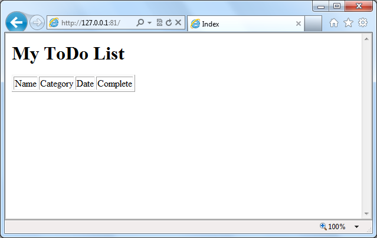
    </li>
  </ol>
  <h2>Adding new task functionality</h2>
  
In this section you will update the application to support adding new task items.

  <ol>
    <li>
      
First, add a new route to server.js. In the server.js file, add the following line after the last route entry for /home, and then save the file.

      

        
      

      <pre class="prettyprint">app.post('/home/newitem', home.newItem.bind(home));
</pre>
      
The routes section should now look as follows:

      <pre class="prettyprint">// Routes
var home = new Home(client);
app.get('/', home.showItems.bind(home));
app.get('/home', home.showItems.bind(home));
app.post('/home/newitem', home.newItem.bind(home));
</pre>
    </li>
    <li>
      
In order to use the node-uuid module to create a unique identifier, add the following line at the top of the home.js file after the first line where the module is exported.

      

        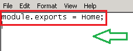
      

      <pre class="prettyprint">var uuid = require('node-uuid');
</pre>
    </li>
    <li>
      
To implement the new item functionality, create a newItem function. In your home.js file, paste the following code after the last function and then save the file.

      

        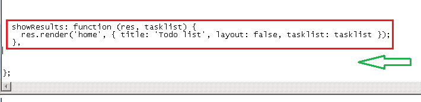
      

      <pre class="prettyprint">newItem: function (req, res) {
  var self = this;
  var createItem = function (resp, tasklist) {
    if (!tasklist) {
      tasklist = [];
    }
    var count = tasklist.length;
    var item = req.body.item;
    item.completed = false;

    var newtasks = new Array();
    newtasks[0] = item;
    
    self.taskProvider.save(newtasks,function (error, tasks) {
    self.showItems(req, res);
    });
  };
  this.getItems(createItem);
},
</pre>
      
The newItem function performs the following tasks:

      <ul>
        <li>
          
Extracts the posted item from the body.

        </li>
        <li>
          
Inserts the item into the tasks table by calling the insertEntity function.

        </li>
        <li>
          
Renders the page by calling the save function.

        </li>
      </ul>
    </li>
    <li>
      
Now, update the view by adding a new form to allow the user to add an item. In the home.jade file, paste the following code at the end of the file and save. Note that in Jade, whitespace is significant, so do not remove any of the spacing below.

      <pre class="prettyprint">hr
form(action="/home/newitem", method="post")
  table(border="1")
    tr
      td Item Name:
      td
        input(name="item[name]", type="textbox")
    tr
      td Item Category:
      td
        input(name="item[category]", type="textbox")
    tr
      td Item Date:
      td
        input(name="item[date]", type="textbox")
        input(type="submit", value="Add item")
</pre>
    </li>
    <li>
      
Because the Windows Azure emulator is already running, you can browse the updated application:

      <pre class="prettyprint">PS C:\node\tasklistMongo\WebRole1\views&gt; start http://localhost:81/home
</pre>
      
The browser will open and display the following page:

      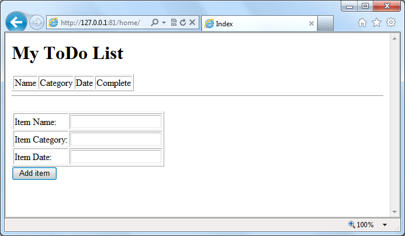
    </li>
    <li>
      
Enter the following values:

      <ul>
        <li>
          

            <strong>Item Name:</strong> New task functionality

        </li>
        <li>
          

            <strong>Item Category:</strong> Site work

        </li>
        <li>
          

            <strong>Item Date:</strong> 01/05/2012

        </li>
      </ul>
    </li>
    <li>
      
Then click <strong>Add item</strong>.

      
The item will be added to your tasks table in MongoDB and displayed as shown in the screenshot below.

      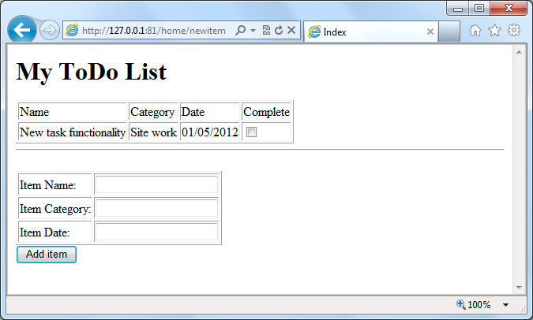
    </li>
    <li>
      
Enter the following command to stop the Windows Azure compute emulator.

      <pre class="prettyprint">PS C:\node\tasklistMongo\WebRole1\views&gt; Stop-AzureEmulator
</pre>
    </li>
  </ol>
  <h2>Deploying the application to Windows Azure</h2>
  
In order to deploy your application to Windows Azure, you need an account. Once you are logged in with your account, you can download a Windows Azure publishing profile, which will authorize your machine to publish deployment packages to Windows Azure using the Windows PowerShell commands.

  <h3>Create a Windows Azure account</h3>
  
If you do not already have a Windows Azure account, you can sign up for a free trial account.

  <ol>
    <li>
      
Open a web browser, and browse to <a href="http://www.windowsazure.com">http://www.windowsazure.com</a>.

    </li>
    <li>
      
To get started with a free account, click on <strong>Free Trial</strong> in the upper right corner and follow the steps

    </li>
  </ol>
  <h3>Download the Windows Azure Publishing Settings</h3>
  
If this is the first Node.js application that you are deploying to Windows Azure, you will need to install publishing settings to your machine before deploying. For details about downloading and installing Windows Azure publishing settings, see <a href="http://www.windowsazure.com/en-us/develop/nodejs/tutorials/getting-started/#download_publishing_settings">Downloading the Windows Azure Publishing Settings</a> in the Node.js Web Application tutorial.

  <h3>Publish the Application</h3>
  <ol>
    <li>
      
MongoDB requires access to a Windows Azure storage account to store data and replication information. Before publishing, run the following command to set the proper storage account. This command is specifying a storage account called <strong>taskListMongo</strong> that will be used to store the MongoDB data. This account will be automatically created if it doesn't already exist. <strong>Subscription-1</strong> is the default subscription name that is used when you create a free trial account. Your subscription name may be different; if so, replace <strong>Subscription-1</strong> with the name of your subscription.

      <pre class="prettyprint">PS C:\node\tasklistMongo\WebRole1\views&gt; Set-AzureMongoStorageAccount -StorageAccountName taskListMongo -Subscription "Subscription-1"
      </pre>
    </li>
    <li>
      
Publish the application using the <strong>Publish-AzureService</strong> command, as shown below. Note that the name specified must be unique across all Windows Azure services. For this reason, taskListMongo is prefixed with Contoso, the company name, to make the service name unique.

      <pre class="prettyprint">PS C:\node\tasklistMongo\WebRole1\views&gt; Publish-AzureService -name ContosoTaskListMongo -location "North Central US" -launch
      </pre>
      
After the deployment is complete, the browser will also open to the URL for your service and display a web page that calls your service.

    </li>
  </ol>
  <h2>Stop and Delete the Application</h2>
  
Windows Azure bills role instances per hour of server time consumed, and server time is consumed while your application is deployed, even if the instances are not running and are in the stopped state. With your web role plus three instances of the MongoDB worker role, your application is currently running four Windows Azure instances.

  
The following steps describe how to stop and delete your application.

  <ol>
    <li>
      
In the Windows PowerShell window, call the <strong>Stop-AzureService</strong> command to stop the service deployment created in the previous section:

      <pre class="prettyprint">PS C:\node\tasklistMongo\WebRole1\views&gt; Stop-AzureService
</pre>
      
Stopping the service may take several minutes. When the service is stopped, you will receive a message indicating that it has stopped.

    </li>
    <li>
      
To delete the service, call the <strong>Remove-AzureService</strong> command:

      <pre class="prettyprint">PS C:\node\tasklistMongo\WebRole1\views&gt; Remove-AzureService
      </pre>
    </li>
    <li>
      
When prompted, enter <strong>Y</strong> to delete the service.

      
After the service has been deleted you will receive a message indicating that the service has been deleted.

    </li>
  </ol>
</body>