<?xml version="1.0" encoding="utf-8"?>
<body>
  <properties linkid="dev-nodejs-basic-web-app-with-express" urlDisplayName="Web App With Express" headerExpose="" pageTitle="Web App With Express" metaKeywords="Azure Node.js hello world tutorial, Azure Node.js hello world, Azure Node.js Getting Started tutorial, Azure Node.js tutorial, Azure Node.js Express tutorial" footerExpose="" metaDescription="An tutorial that builds on the Web app tutorial, and demonstrates how to use the Express module" umbracoNaviHide="0" disqusComments="1" />
  <h1 id="node.jswebapplicationusingexpress">Node.js Web Application using Express</h1>
  
Node.js includes a minimal set of functionality in the core runtime. Developers often use 3rd party modules to provide additional functionality when developing a Node.js application. In this tutorial you will extend the application created in the <a href="http://www.windowsazure.com/en-us/develop/nodejs/tutorials/getting-started/">Node.js Web Application</a> tutorial by using modules.

  
This tutorial assumes that you have completed the <a href="http://www.windowsazure.com/en-us/develop/nodejs/tutorials/getting-started/">Node.js Web Application</a> tutorial.

  
You will learn:

  <ul>
    <li>How to use node package manager (npm) to install a module</li>
    <li>How to use the Express module</li>
  </ul>
  
A screenshot of the complted application is below:

  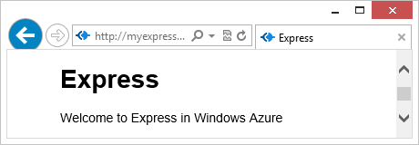
  <h2 id="installingmodules">Installing Modules</h2>
  
Node modules can be installed using the node package manager. The command format used to install a module using the package manager is <em>npm install &lt;module_name&gt;</em>. Packages installed in this way are stored in the <strong>node_modules</strong> folder in the directory the command is ran in. Node automatically looks for modules within the <strong>node_modules</strong> folder in the application folder, so it is important that you run the npm command from the folder that contains your application when installing modules.

  
Perform the following steps to add the Express module to the application you created through the <a href="http://www.windowsazure.com/en-us/develop/nodejs/tutorials/getting-started/">Node.js Web Application</a> tutorial.

  <ol>
    <li>
      
If it is not already open, start the Windows Azure PowerShell for Node.js from the <strong>Start</strong> menu by expanding <strong>All Programs, Windows Azure SDK Node.js - November 2011</strong>, right-click <strong>Windows Azure PowerShell for Node.js</strong>, and then select <strong>Run As Administrator</strong>.

    </li>
    <li>
      
Change directories to the folder containing your application. For example, C:\node\tasklist\WebRole1.

    </li>
    <li>
      
Install the Express module by issuing the following command:

      <pre class="prettyprint">PS C:\node\tasklist\WebRole1&gt; npm install express
</pre>
      

        <strong>Note</strong>: By default, the command above installs the latest version of the modules. This tutorial was created with Express version 2.5.5. If you encounter problems using a newer version of Express, you can install the 2.5.5 version by using <strong>npm install express@2.5.5</strong>.

      
The output of the npm command should look similar to the result below. You can see the list of modules installed as well as any dependencies.

      

        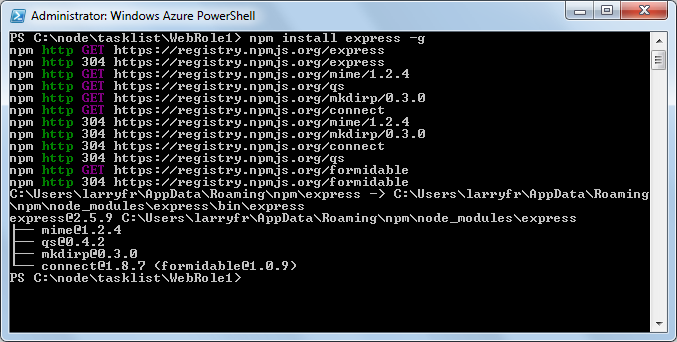
      

    </li>
  </ol>
  <h2 id="generatinganexpressapplication">Generating an Express Application</h2>
  
The Express (<a href="http://expressjs.com/">expressjs.com</a>) module provides a web framework for building MVC applications. It provides APIs for processing HTTP requests and supports view template engines for generating HTTP responses. It also includes a various tools and add-ons required by MVC applications, including the ability to generate basic MVC scaffolding for a web application.

  
Perform the following steps to replace the existing application with one generated using the Express scaffolding tool.

  <ol>
    <li>
      
To create an Express web application using the scaffolding tool, enter the command below:

      <pre class="prettyprint">PS C:\node\tasklist\WebRole1&gt; .\node_modules\.bin\express
</pre>
    </li>
    <li>
      
You are prompted to overwrite your earlier application. Enter <strong>y</strong> or <strong>yes</strong> to continue. Express generates the app.js file and a folder structure for building your application.

      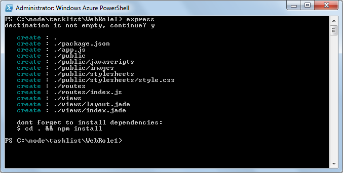
    </li>
    <li>
      
Delete your existing server.js and rename the generated app.js file to server.js. by entering the commands below. This is required because the Windows Azure WebRole in our application is configured to dispatch HTTP requests to server.js.

      <pre class="prettyprint">PS C:\node\tasklist\WebRole1&gt; del server.js
PS C:\node\tasklist\WebRole1&gt; ren app.js server.js
</pre>
    </li>
    <li>
      
View the directory contents:

      <pre class="prettyprint">PS C:\node\tasklist\WebRole1&gt; ls
</pre>
      
      
Note that several files and folders have been created as part of the Express scaffolding, including the package.json file which defines additional dependencies required for this application.

    </li>
    <li>
      
To install additional dependencies defined in the package.json file, enter the following command:

      <pre class="prettyprint">PS C:\node\tasklist\WebRole1&gt; npm install
</pre>
      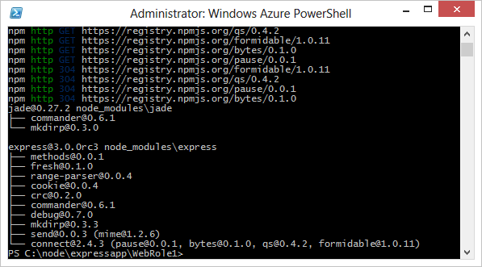
    </li>
    <li>
      
Open the server.js file in Notepad, using the following command:

      <pre class="prettyprint">PS C:\node\tasklist\WebRole1&gt; notepad server.js
</pre>
    </li>
    <li>
      
Replace the last two lines of the file with the code below.

      <pre class="prettyprint">app.listen(process.env.port);
</pre>
      
      
This configures Node to listen on the environment PORT value provided by Windows Azure when published to the cloud.

      

        <strong>Note</strong>: At the time of this writing, express scaffolding sometimes generated LF-only line breaks (Unix-style). If you’re experiencing this, you can open the file in WordPad or Visual Studio and save, thereby replacing LF with CRLF line breaks. Save the server.js file.

    </li>
    <li>
      
Use the following command to run the application in the Windows Azure emulator:

      <pre class="prettyprint">PS C:\node\tasklist\WebRole1&gt; Start-AzureEmulator -launch
</pre>
      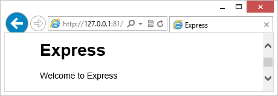
    </li>
  </ol>
  <h2 id="modifyingtheview">Modifying the View</h2>
  
Now you’ll modify the view to display the message “Welcome to Express in Windows Azure”.

  <ol>
    <li>
      
Enter the following command to open the index.jade file:

      <pre class="prettyprint">PS C:\node\tasklist\WebRole1&gt; notepad views/index.jade
</pre>
      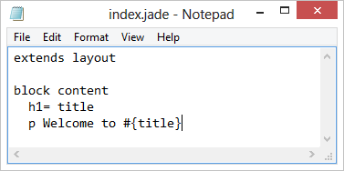
      
As mentioned earlier, Jade is the view engine you are using here. Notice that it uses a style that does not require any tags. For more information on the Jade view engine, see <a href="http://jade-lang.com">http://jade-lang.com</a>.

    </li>
    <li>
      
Modify the last line of text by appending <strong>in Windows Azure</strong>.

      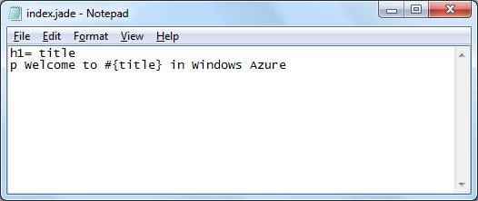
    </li>
    <li>
      
Save the file and exit Notepad.

    </li>
    <li>
      
Refresh your browser and you will see your changes.

      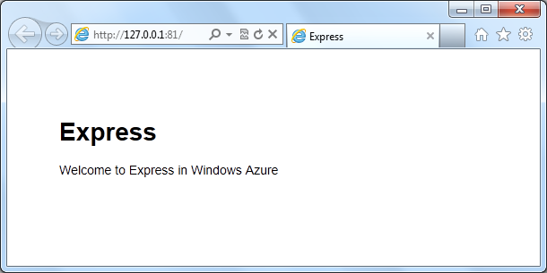
    </li>
  </ol>
  <h2 id="creatinganewview">Creating a New View</h2>
  
For the task list application add a new Home view. This view will display existing tasks and allow adding new tasks and marking tasks as completed. For now, the view just has a static placeholder.

  <ol>
    <li>
      
From the Windows Azure Powershell window, enter the following command to create a new home view template.

      <pre class="prettyprint">PS C:\node\tasklist\WebRole1&gt; notepad views/home.jade
</pre>
    </li>
    <li>
      
Select “Yes” to create the new file. Paste the contents below into home.jade. Save the file and close it.

      <pre class="prettyprint">h1= title
p A work in progress.
</pre>
    </li>
    <li>
      
In order to have your app handle the home request you will modify the server.js adding a route entry for <strong>/home</strong>. First open server.js.

      <pre class="prettyprint">PS C:\node\tasklist\WebRole1&gt; notepad server.js
</pre>
    </li>
    <li>
      
Add the home route after the default route as shown below:

      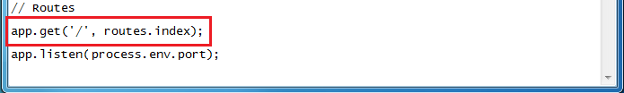
      <pre class="prettyprint">app.get('/home', function(req, res){
  res.render('home', {
    title: 'Home'
  });
});
</pre>
      
The <strong>app.get</strong> call tells node to handle requests using an HTTP GET. The first parameter of the function call specifies which URL should be handled, in this case <strong>/home</strong>. Next a callback is provided for handling the actual request. The first parameter is the incoming request, the second parameter is the response. The next line instructs Express to render <strong>home.jade</strong> (.jade is not required) passing in <strong>Home</strong> as the title.

    </li>
    <li>
      
Browse the Express hello world application running in the emulator, navigating to the new Home view you just added.

      <pre class="prettyprint">PS C:\node\tasklist\WebRole1&gt; start http://localhost:81/home
</pre>
      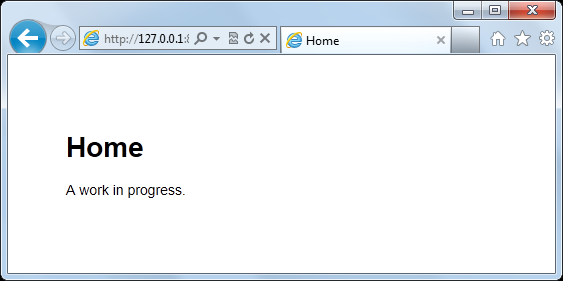
    </li>
  </ol>
  <h2 id="re-publishingtheapplicationtowindowsazure">Re-Publishing the Application To Windows Azure</h2>
  
Now that we augmented the Hello World application to use Express, you can publish it to Windows Azure by updating the deployment to the existing hosted service. In the Windows PowerShell window, call the <strong>Publish-AzureService</strong> cmdlet to redeploy your hosted service to Windows Azure.

  <pre class="prettyprint">PS C:\node\tasklist\WebRole1&gt; Publish-AzureService -launch
</pre>
  
Since there is a previous deployment of this application, Windows Azure performs an in-place update. As such, the cmdlet completes faster than the initial deployment. After the deployment is complete, you see the following response:

  

    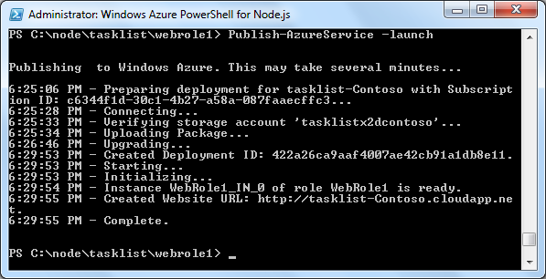
  

  
As before, because you specified the <strong>–launch</strong> option, the browser opens and displays your application running in Windows Azure when publishing is completed.

  

    
  

</body>