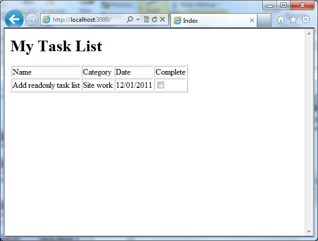
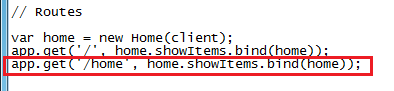
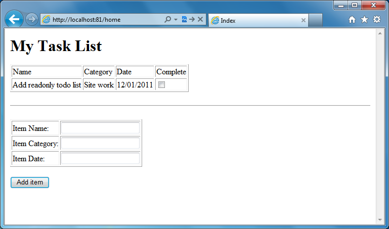
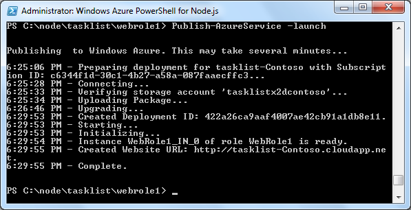
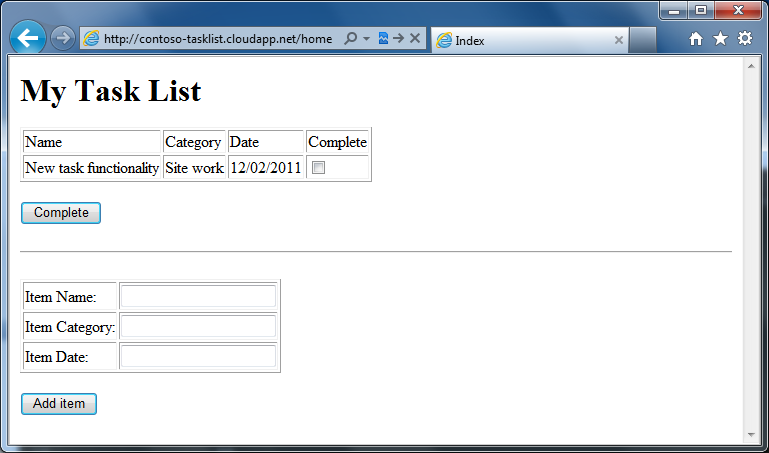
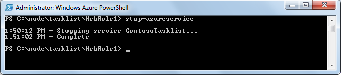
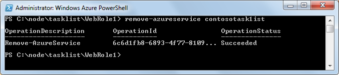

  <properties umbracoNaviHide="0" pageTitle="Web App with Storage" metaKeywords="Azure Node.js hello world tutorial, Azure Node.js hello world, Azure Node.js Getting Started tutorial, Azure Node.js tutorial, Azure Node.js Express tutorial" metaDescription="A tutorial that builds on the Web App with Express tutorial by adding Windows Azure Storage services and the Azure module." linkid="dev-nodejs-basic-web-app-with-storage" urlDisplayName="Web App with Storage" headerExpose="" footerExpose="" disqusComments="1" />
  <h1 id="node.jswebapplicationusingstorage">Node.js Web Application using Storage</h1>
  
In this tutorial, you will extend the application created in the <a href="http://www.windowsazure.com/en-us/develop/nodejs/tutorials/web-app-with-express/">Node.js Web Application using Express</a> tutorial by using the Windows Azure Client Libraries for Node.js to work with storage services. You will extend your application to create a web-based task-list application that you can deploy to Windows Azure. The task list allows a user to retrieve tasks, add new tasks, and mark tasks as completed.

  
The task items are stored in Windows Azure Storage. Windows Azure Storage provides unstructured data storage that is fault-tolerant and highly available. Windows Azure Storage includes several data structures where you can store and access data, and you can leverage the storage services from the APIs included in the Windows Azure SDK for Node.js or via REST APIs. For more information, see <a href="http://msdn.microsoft.com/en-us/library/windowsazure/gg433040.aspx">Storing and Accessing Data in Windows Azure</a>.

  
This tutorial assumes that you have completed the <a href="http://www.windowsazure.com/en-us/develop/nodejs/tutorials/getting-started/">Node.js Web Application</a> and <a href="http://www.windowsazure.com/en-us/develop/nodejs/tutorials/web-app-with-express/">Node.js with Express</a> tutorials.

  
You will learn:

  <ul>
    <li>How to work with the Jade template engine</li>
    <li>How to work with Windows Azure Storage services</li>
  </ul>
  
A screenshot of the completed application is below:

  
  <h2 id="settingstoragecredentialsinweb.config">Setting Storage Credentials in Web.Config</h2>
  
To access Windows Azure Storage, you need to pass in storage credentials. To do this, you utilize web.config application settings. Those settings will be passed as environment variables to Node, which are then read by the Windows Azure SDK.

  

    <strong>Note</strong>: Storage credentials are only used when the application is deployed to Windows Azure. When running in the emulator, the application will use the storage emulator.

  
Perform the following steps to retrieve the storage account credentials and add them to the web.config settings:

  <ol>
    <li>
      
If it is not already open, start the Windows Azure PowerShell for Node.js from the <strong>Start</strong> menu by expanding <strong>All Programs, Windows Azure SDK Node.js - November 2011</strong>, right-click <strong>Windows Azure PowerShell for Node.js</strong>, and then select <strong>Run As Administrator</strong>.

    </li>
    <li>
      
Change directories to the folder containing your application. For example, C:\node\tasklist\WebRole1.

    </li>
    <li>
      
From the Windows Powershell window enter the following cmdlet to retrieve the storage account information:

      <pre class="prettyprint">PS C:\node\tasklist\WebRole1&gt; Get-AzureStorageAccounts
</pre>
      
This retrieves the list of storage accounts and account keys associated with your hosted service.

      

        <strong>Note</strong>: Since the Windows Azure SDK for Node.js creates a storage account when you deploy a service, a storage account should already exist from deploying your application in the previous guides.

    </li>
    <li>
      
Open the web.cloud.config file containing the environment settings that are used when the application is deployed to Windows Azure:

      <pre class="prettyprint">PS C:\node\tasklist\WebRole1&gt; notepad web.cloud.config
</pre>
    </li>
    <li>
      
Insert the following block under <strong>configuration</strong> element, substituting {STORAGE ACCOUNT} and {STORAGE ACCESS KEY} with the account name and the primary key for the storage account you want to use for deployment:

      <pre class="prettyprint">&lt;appSettings&gt;
  &lt;add key="AZURE_STORAGE_ACCOUNT" value="{STORAGE ACCOUNT}"/&gt;
  &lt;add key="AZURE_STORAGE_ACCESS_KEY" value="{STORAGE ACCESS KEY}"/&gt;
&lt;/appSettings&gt;
</pre>
      
    </li>
    <li>
      
Save the file and close notepad.

    </li>
  </ol>
  <h2 id="installmodules">Install Modules</h2>
  
In order to use Windows Azure Storage services, you must install the Azure module for node. You must also install the node-uuid module, as this will be used to generate universally unique identifiers (UUIDs). To install these modules, enter the command below:

  <pre class="prettyprint">PS C:\node\tasklist\WebRole1&gt; npm install node-uuid azure
</pre>
  
After the command completes, the modules have been added to the <strong>node_modules</strong> folder. Perform the following steps to make use of these modules in your application:

  <ol>
    <li>
      
Open the server.js file:

      <pre class="prettyprint">PS C:\node\tasklist\WebRole1&gt; notepad server.js
</pre>
    </li>
    <li>
      
Add the code below after the line that ends with express.createServer() to include the node-uuid, home, and azure modules. The home module does not exist yet, but you will create it shortly.

      
      <pre class="prettyprint">var uuid = require('node-uuid');
var Home = require('./home');
var azure = require('azure');
</pre>
    </li>
    <li>
      
Add code to create a storage table client passing in storage account and access key information.

      

        <strong>Note</strong>: When running in the emulator, the SDK will automatically use the emulator even though storage account information has been provided via web.config.

      <pre class="prettyprint">var client = azure.createTableService();
</pre>
    </li>
    <li>
      
Next, create a table in Windows Azure Storage called tasks. The logic below creates a new table if it doesn't exist, and populates the table with some default data.

      <pre class="prettyprint">//table creation
client.createTableIfNotExists('tasks', function(error){
    if(error){
        throw error;
    }

    var item = {
        name: 'Add readonly task list',
        category: 'Site work',
        date: '12/01/2011',
        RowKey: uuid(),
        PartitionKey: 'partition1',
        completed: false
    };

    client.insertEntity('tasks', item, function(){});

});
</pre>
    </li>
    <li>
      
Replace the existing code in the route section with the code below, which creates a home controller instance and routes all requests to <strong>/</strong> or <strong>/home</strong> to it.

      
      <pre class="prettyprint">var home = new Home(client);
app.get('/', home.showItems.bind(home));
app.get('/home', home.showItems.bind(home));
</pre>
      
Notice that instead of handling the request inline, you are now delegating the command to a Home object. The <strong>bind</strong> command is necessary to ensure that these references are properly resolved locally within the home controller.

    </li>
  </ol>
  <h2 id="creatingthehomecontroller">Creating the Home Controller</h2>
  
You must now create a home controller, which handles all requests for the task list site. Perform the following steps to create the controller:

  <ol>
    <li>
      
Create a new home.js file in Notepad. This file will contain the controller code that hands the logic for the task list.

      <pre class="prettyprint">PS C:\node\tasklist\WebRole1&gt; notepad home.js
</pre>
    </li>
    <li>
      
Replace the contents with the code below and save the file. The code below uses the javascript module pattern. It exports a Home function. The Home prototype contains the functions to handle the actual requests.

      <pre class="prettyprint">var azure=require('azure');
module.exports = Home;

function Home (client) {
    this.client = client;
};

Home.prototype = {
    showItems: function (req, res) {
        var self = this;
        this.getItems(false, function (resp, tasklist) {
            if (!tasklist) {
                tasklist = [];
            }			
            self.showResults(res, tasklist);
        });
    },

    getItems: function (allItems, callback) {
        var query = azure.TableQuery
            .select()
            .from('tasks');
	
        if (!allItems) {
            query = query.where('completed eq ?', 'false');
        }
        this.client.queryEntities(query, callback);
     },

     showResults: function (res, tasklist) {
        res.render('home', { 
            title: 'Todo list', 
            layout: false, 
            tasklist: tasklist });
     },
};</pre>
      
Your home controller now includes three functions:

      <ul>
        <li>
          <em>showItems</em> handles the request.</li>
        <li>
          <em>getItems</em> uses the table client to retrieve open task items from your tasks table. Notice that the query can have additional filters applied; for example, the above query filters only show tasks where completed is equal to false.</li>
        <li>
          <em>showResults</em> calls the Express render function to render the page using the home view that you will create in the next section.</li>
      </ul>
    </li>
  </ol>
  <h3 id="modifyingthehomeview">Modifying the Home View</h3>
  
The Jade template engine uses a markup syntax that is less verbose than HTML and it is the default engine for working with Express. Perform the following steps to create a view that supports displaying task-list items:

  <ol>
    <li>
      
From the Windows PowerShell command window, edit home.jade file by using the following command:

      <pre class="prettyprint">PS C:\node\tasklist\WebRole1\views&gt; notepad home.jade
</pre>
    </li>
    <li>
      
Replace the contents of the home.jade file with the code below and save the file. The form below contains functionality for reading and updating the task items. (Note that currently the home controller only supports reading; you will change this later.) The form contains details for each item in the task list.

      <pre class="prettyprint">html
head
    title Index
body
    h1 My ToDo List

    form
        table(border="1")
            tr
                td Name
                td Category
                td Date
                td Complete

                each item in tasklist
                    tr
                        td #{item.name}
                        td #{item.category} 
                        td #{item.date} 
                        td 
                            input(type="checkbox", name="completed", value="#{item.RowKey}") 
</pre>
    </li>
  </ol>
  <h2 id="runningtheapplicationinthecomputeemulator">Running the Application in the Compute Emulator</h2>
  <ol>
    <li>
      
In the Windows PowerShell window, enter the following cmdlet to launch your service in the compute emulator and display a web page that calls your service.

      <pre class="prettyprint">PS C:\node\tasklist\WebRole1&gt; Start-AzureEmulator -launch
</pre>
      
Your browser displays the following page, showing the task item that was retrieved from Windows Azure Storage:

      
    </li>
  </ol>
  <h2 id="addingnewtaskfunctionality">Adding New Task Functionality</h2>
  
In this section you update the application to support adding new task items.

  <h3 id="addinganewroutetoserver.js">Adding a New Route to Server.js</h3>
  
In the server.js file, add the following line after the last route entry for<strong>/home</strong>, and then save the file.

  

    
  

  <pre class="prettyprint">    app.post('/home/newitem', home.newItem.bind(home));
</pre>
  
The routes section should now look as follows:

  <pre class="prettyprint">   // Routes

   var home = new Home(client);
   app.get('/', home.showItems.bind(home));
   app.get('/home', home.showItems.bind(home));
   app.post('/home/newitem', home.newItem.bind(home));
</pre>
  <h3 id="addingthenode-uuidmodule">Adding the Node-UUID Module</h3>
  
To use the node-uuid module to create a unique identifier, add the following line at the top of the home.js file after the first line where the module is exported.

  

    
  

  <pre class="prettyprint">   var uuid = require('node-uuid');
</pre>
  <h3 id="addingthenewitemfunctiontohomecontroller">Adding the New Item Function to Home Controller</h3>
  
To implement the new item functionality, create a <strong>newItem</strong> function. In your home.js file, paste the following code after the last function and then save the file.

  

    
  

  <pre class="prettyprint">   newItem: function (req, res) {
       var self = this;
       var createItem = function (resp, tasklist) {
           if (!tasklist) {
               tasklist = [];
           }

           var count = tasklist.length;

           var item = req.body.item;
           item.RowKey = uuid();
           item.PartitionKey = 'partition1';
           item.completed = false;

           self.client.insertEntity('tasks', item, function (error) {
               if(error){  
                   throw error;
               }
               self.showItems(req, res);
           });
       };

       this.getItems(true, createItem);
   },
</pre>
  
The <strong>newItem</strong> function performs the following tasks:

  <ul>
    <li>Extracts the posted item from the body.</li>
    <li>Sets the <strong>RowKey</strong> and <strong>PartitionKey</strong> values for the new item. These values are required to insert the item into the Windows Azure table. A UUID is generated for the <strong>RowKey</strong> value.</li>
    <li>Inserts the item into the tasks table by calling the <strong>insertEntity</strong> function.</li>
    <li>Renders the page by calling the <strong>getItems</strong> function.</li>
  </ul>
  <h3 id="addingthenewitemformtothehomeview">Adding the New Item Form to the Home View</h3>
  
Now, update the view by adding a new form to allow the user to add an item. In the home.jade file, paste the following code at the end of the file and save. Note that in Jade, whitespace is significant, so do not remove any of the spacing below.

  <pre class="prettyprint">    hr
    form(action="/home/newitem", method="post")
        table(border="1")    
            tr
                td Item Name: 
                td 
                    input(name="item[name]", type="textbox")
            tr
                td Item Category: 
                td 
                    input(name="item[category]", type="textbox")
            tr
                td Item Date: 
                td 
                    input(name="item[date]", type="textbox")
        input(type="submit", value="Add item")
</pre>
  <h3 id="runningtheapplicationintheemulator">Running the Application in the Emulator</h3>
  <ol>
    <li>
      
Because the Windows Azure emulator is already running, you can browse the updated application:

      <pre class="prettyprint">PS C:\node\tasklist\WebRole1&gt; start http://localhost:81/home
</pre>
      
The browser opens and displays the following page:

      image</li>
    <li>
      
Enter for <strong>Item Name:</strong> "New task functionality", <strong>Item Category:</strong> "Site work", and for <strong>Item Date:</strong> "12/02/2011". Then click <strong>Add item</strong>.

      
The item is added to your tasks table in Windows Azure Storage and displayed as shown in the screenshot below.

    </li>
  </ol>
  

    image

  <h2 id="re-publishingtheapplicationtowindowsazure">Re-Publishing the Application to Windows Azure</h2>
  
Now that the application is completed, publish it to Windows Azure by updating the deployment to the existing hosted service.

  <ol>
    <li>
      
In the Windows PowerShell window, call the following cmdlet to redeploy your hosted service to Windows Azure. Your storage settings and location were previous saved and do not need to be re-entered.

      <pre class="prettyprint">PS C:\node\tasklist\WebRole1&gt; Publish-AzureService -launch
</pre>
      
After the deployment is complete, the following response appears:

      
      
As before, because you specified the <strong>-launch</strong> option, the browser opens and displays your application running in Windows Azure when publishing is completed.

      
    </li>
  </ol>
  <h2 id="stoppinganddeletingyourapplication">Stopping and Deleting Your Application</h2>
  
After deploying your application, you may want to disable it so you can avoid costs or build and deploy other applications within the free trial time period.

  
Windows Azure bills web role instances per hour of server time consumed. Server time is consumed once your application is deployed, even if the instances are not running and are in the stopped state.

  
The following steps show you how to stop and delete your application.

  <ol>
    <li>
      
In the Windows PowerShell window, stop the service deployment created in the previous section with the following cmdlet:

      <pre class="prettyprint">PS C:\node\tasklist\WebRole1&gt; Stop-AzureService
</pre>
      
Stopping the service may take several minutes. When the service is stopped, you receive a message indicating that it has stopped.

      
    </li>
    <li>
      
To delete the service, call the following cmdlet:

      <pre class="prettyprint">PS C:\node\tasklist\WebRole1&gt; Remove-AzureService
</pre>
    </li>
    <li>
      
When prompted, enter <strong>Y</strong> to delete the service.

      
Deleting the service may take several minutes. After the service has been deleted you receive a message indicating that the service was deleted.

      
    </li>
  </ol>