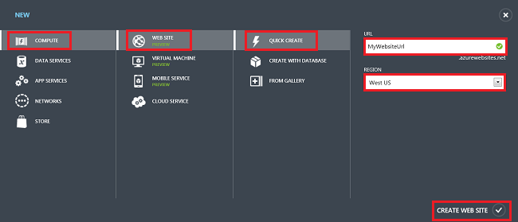

<properties linkid="dev-php-how-to-php-website" urlDisplayName="PHP Web Site" pageTitle="How to create a PHP website in Windows Azure Web Sites" metaKeywords="PHP Azure Web Sites" metaDescription="Learn how to create a PHP website in Windows Azure Web Sites" metaCanonical="" umbracoNaviHide="0" disqusComments="1" writer=“bswan" editor="mollybos" manager="paulettm" />

#How to create a PHP website in Windows Azure Web Sites

This article will show you how to create a PHP website in [Windows Azure Web Sites][waws] by using the [Windows Azure Management Portal], the [Windows Azure Command Line Tools for Mac and Linux][xplat-tools], or the [Windows Azure PowerShell cmdlets][powershell-cmdlets].

In general, creating a PHP website is no different that creating *any* website Windows Azure Web Sites. By default, PHP is enabled for all websites. For information about configuring PHP (or providing your own customized PHP runtime), see [How to configure PHP in Windows Azure Web Sites][configure-php].

Each option described below shows you how to create a website in a shared hosting environment at no cost, but with some limitations on CPU usage and bandwidth usage. For more information, see [Windows Azure Web Sites Pricing][websites-pricing]. For information about how to upgrade and scale your website, see [How to scale Web Sites][scale-websites].

##Table of Contents
* [Create a website using the Windows Azure Portal](#portal)
* [Create a website using the Windows Azure Command Line Tools for Mac and Linux](#XplatTools)
* [Create a website using the Windows Azure PowerShell cmdlets](#PowerShell)

<h2 id="portal">Create a PHP website using the Windows Azure Portal</h2>

When you create a website in the Windows Azure Portal, you have three options: **QUICK CREATE**, **CREATE WITH DATABASE**, and **FROM GALLERY**. The instructions below will cover the **QUICK CREATE** option. For information about the other two options, see [Create a PHP-MySQL Windows Azure web site and deploy using Git][website-mysql-git] and [Create a WordPress web site from the gallery in Windows Azure][wordpress-gallery].

To create a PHP website using the Windows Azure Portal, do the following:

1. Login to the [Windows Azure Management Portal].
2. Click **+NEW** at the bottom of the page, then click **COMPUTE**, **WEB SITE**, and **QUICK CREATE**. Provide a **URL** for your website and select the **REGION** for your website. Finally, click **CREATE WEB SITE**.

	

<h2 id="XplatTools">Create a PHP website using the Windows Azure Command Line Tools for Mac and Linux</h2>

To create a PHP website using the Windows Azure Command Line Tools for Mac and Linux do the following:

1. Install the Windows Azure Command Line Tools by following the instructions here: [How to install the Windows Azure Command Line Tools for Mac and Linux](/en-us/develop/php/how-to-guides/command-line-tools/#Download).

2. Run the following command from a command prompt:

		azure site create MySiteName

The URL for the newly created website will be  `http://MySiteName.azurewebsites.net`.  
 
Note that you can execute the `azure site create` command with any of the following options:

* `--location [location name]`. This option allows you to specify the location of the data center in which your website is created (e.g. "West US"). If you omit this option, you will be promted to choose a location.
* `--hostname [custom host name]`. This option allows you to specify a custom hostname for your website.
* `--git`. This option allows you to use git to publish to your website by creating git repositories in both your local application directory and in your website's data center. Note that if your local folder is already a git repository, the command will add a new remote to the existing repository, pointing to the repository in your website's data center.

For information about additional options, see [How to create and manage a Windows Azure Web Site](/en-us/develop/php/how-to-guides/command-line-tools/#WebSites).

<h2 id="PowerShell">Create a PHP website using the Windows Azure PowerShell cmdlets</h2>

To create a PHP website using the Windows Azure PowerShell cmdlets, do the following:

1. Install the Windows Azure PowerShell cmdlets by following the instructions here: [Get started with Windows Azure PowerShell](/en-us/develop/php/how-to-guides/powershell-cmdlets/#GetStarted).
2. Open a PowerShell command prompt and execute the following command:

		New-AzureWebSite MySiteName

The URL for the newly created website will be  `http://MySiteName.azurewebsites.net`.  
 
Note that you can execute the `New-AzureWebSite` command with any of the following options:

* `-Location [location name]`. This option allows you to specify the location of the data center in which your website is created (e.g. "West US"). If you omit this option, you will be promted to choose a location.
* `-Hostname [custom host name]`. This option allows you to specify a custom hostname for your website.
* `-Git`. This option allows you to use git to publish to your website by creating git repositories in both your local application directory and in your website's data center. Note that if your local folder is already a git repository, the command will add a new remote to the existing repository, pointing to the repository in your website's data center.

For information about additional options, see [How to: Create and manage a Windows Azure Web Site](/en-us/develop/php/how-to-guides/powershell-cmdlets/#WebSite).

<h2 id="NextSteps">Next steps</h2>

Now that you have created a PHP website in Windows Azure Web Sites, you can manage, configure, monitor, deploy to, and scale your site. For more information, see the following links:

* [How to configure Web Sites](/en-us/manage/services/web-sites/how-to-configure-websites/)
* [How to configure PHP in Windows Azure Web Sites][configure-php]
* [How to manage Web Sites](/en-us/manage/services/web-sites/how-to-manage-websites/)
* [How to monitor Web Sites](/en-us/manage/services/web-sites/how-to-monitor-websites/)
* [How to scale Web Sites](/en-us/manage/services/web-sites/how-to-monitor-websites/)
* [Publishing with Git](/en-us/develop/php/common-tasks/publishing-with-git/)

For end-to-end tutorials, visit the [PHP Developer Center - Tutorials](/en-us/develop/php/tutorials/) page.

[waws]: /en-us/manage/services/web-sites/
[Windows Azure Management Portal]: http://windows.azure.com/
[xplat-tools]: /en-us/develop/php/how-to-guides/command-line-tools/
[powershell-cmdlets]: /en-us/develop/php/how-to-guides/powershell-cmdlets/
[configure-php]: /en-us/develop/php/common-tasks/configure-php-web-site/
[website-mysql-git]: /en-us/develop/php/tutorials/website-w-mysql-and-git/
[wordpress-gallery]: /en-us/develop/php/tutorials/website-from-gallery/
[websites-pricing]: /en-us/pricing/details/#header-1
[scale-websites]: /en-us/manage/services/web-sites/how-to-scale-websites/

