<properties linkid="django-ptvs-tutorial" urlDisplayName="Django with Python Tools for Visual Studio" pageTitle="Django with Python Tools for Visual Studio 2.0 Beta - Windows Azure tutorial" metaKeywords="Azure Django Web Site, Azure Django Cloud Service, PTVS" metaDescription="A tutorial that teaches you how to build a Django web application hosted on Windows Azure using Python Tools for Visual Studio 2.0 Beta." metaCanonical="" disqusComments="1" umbracoNaviHide="0" />

#Django with Python Tools for Visual Studio 2.0 Beta

##Overview
In this tutorial, we'll use Python Tools for Visual Studio 2.0 Beta to create a simple Django application. The application will allow users to vote on polls. We'll first use a local sqlite3 database, then move on to a SQL Server or MySQL database on Azure. We'll show how to enable the Django admin interface, and use it to add polls to our database. We'll also use the Django shell integrated in Visual Studio.  Finally, we'll deploy our application to an Azure Web Site and Azure Cloud Service.

This tutorial focuses on Python Tools for Visual Studio and Windows Azure. For more details on Django and the polls application built in this tutorial, see [https://www.djangoproject.com/](https://www.djangoproject.com/).

**Note:** This tutorial is also encapsulated in a [Youtube video](http://www.youtube.com/watch?v=S7A7VNnsA_8).

##Requirements
To complete the tutorial, you'll need

- [Windows Azure account](http://windows.azure.com)
- [Python Tools for Visual Studio 2.0 Beta](http://pytools.codeplex.com)
- [Python 2.7 (32-bit)](http://www.python.org/download/)
- [MySQL-python](http://code.google.com/p/soemin/downloads/detail?name=MySQL-python-1.2.3.win32-py2.7.exe&can=2&q=) (only needed for MySQL database)
- A supported Visual Studio SKU:
  - VS 2010 Pro or higher
  - VS 2012 Pro or higher
  - VS 2013 Pro or higher. Azure Cloud Services publishing is not available (coming soon).
  - VS 2013 Integrated Shell. Azure Cloud Services and Azure Web Sites publishing are not available. You will need to install [IIS Express](http://www.microsoft.com/web/gallery/install.aspx?appid=IISExpress).
- Windows Azure Tools 2.0 or later

You can use the Web Platform installer to install the Windows Azure Tools. In Web Platform installer, search for these, which will install the Windows Azure Tools (not available for VS 2013 yet):

- Windows Azure SDK for .NET (VS 2010 SP1)
- Windows Azure SDK for .NET (VS 2012)

##Create the project

Python Tools for Visual Studio supports Python Virtual Environments.  We'll create a django project and use a Virtual Environment to install our dependencies.  This is the recommended way to set up projects that are published to Azure Web Sites or Cloud Services.

1. Open Visual Studio, File/New Project, Django application, with the name **tutorial**.

	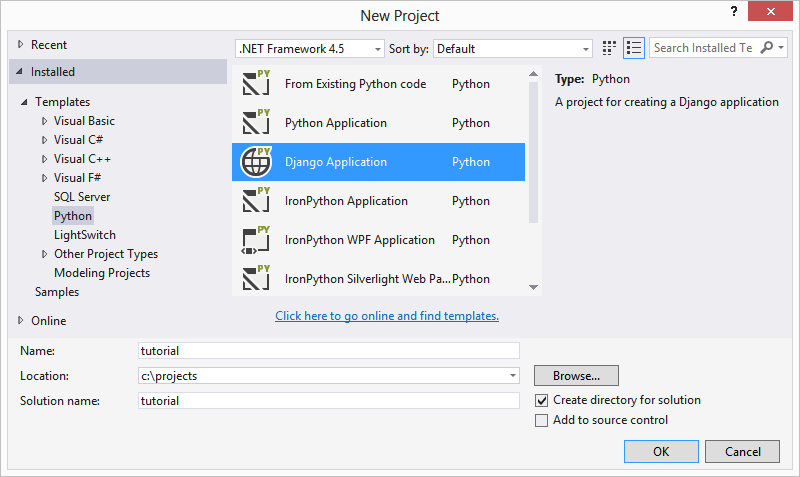

1. Create a new virtual environment.  In solution explorer, right-click on **Python Environments** and select **Add Virtual Environment**.

	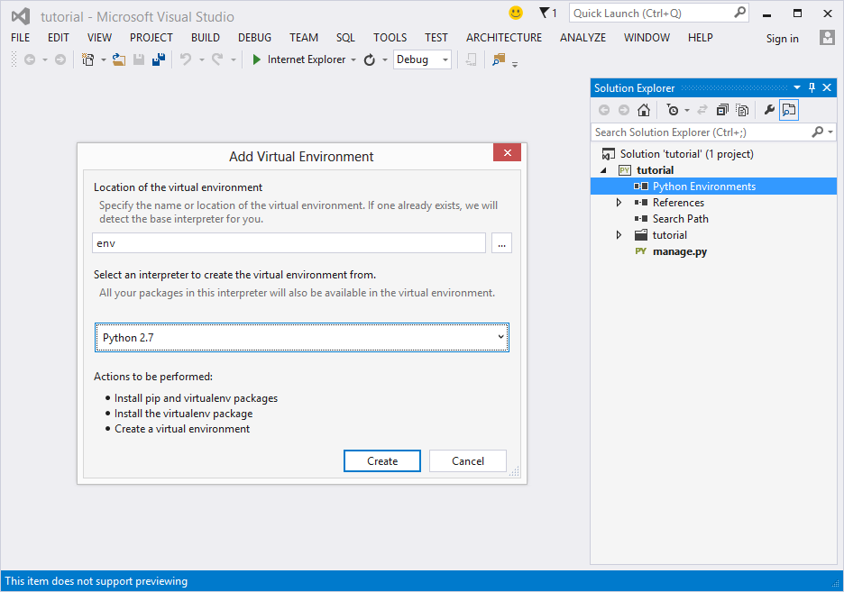

1. Select Python 2.7 as the base Python Interpreter and accept the default name **env**. PTVS will install pip and/or virtualenv if you don't have them installed already.

1. Right-click on **env** and Install Python package: **django**

	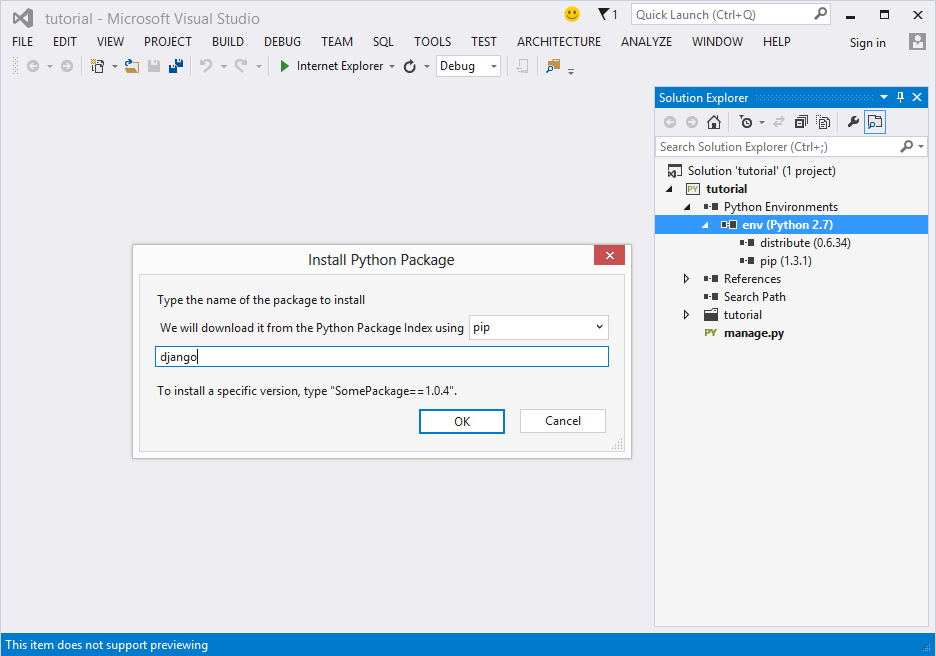

1. Django has a large number of files, so it will take some time to install. You can view the progress in the output window.

	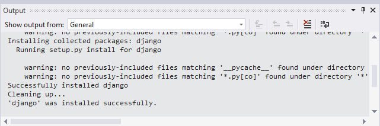

	**Beta Note:** In rare cases, you may see a failure in the output window. If this happens, check if the error is related to cleanup. Sometimes the cleanup will fail but installation will still be successful (scroll up in the output window to verify this). This is due to PTVS getting a lock on the newly created temporary files/folders, which prevents the pip cleanup step from deleting them.

1. Right-click on **env** and Install Python package: **pytz** (optional but recommended, used by django for timezone support)

**Note:** In solution explorer, under References, you'll see a node for Django 1.4. This is used for Windows Azure Cloud Service deployment, to install Python and Django on the target machine. Don't delete the reference to Django 1.4 from the references note. Since we are using a virtual environment and installing our own Django package in it, the Django package installed in our virtual environment will be used.

##Create the polls application

In this section we will add an application to handle voting in polls.

A Django project can have multiple applications. In this tutorial, the name of our project is 'tutorial' and corresponds to the Visual Studio project. The name of the application we are adding is 'polls' and will be a folder under our project node.

1. Select the **project node**, **Add->Django app**, with the name **polls**. This will create a folder for the application, with boilerplate code for commonly used application files.

	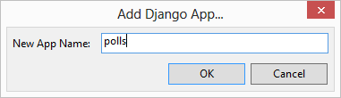

1. In **tutorial/settings.py**, add the following to **INSTALLED\_APPS**:

		'polls',

1. and uncomment from **INSTALLED_APPS**:

		'django.contrib.admin',

1. Replace **tutorial/urls.py** with the following code:

        from django.conf.urls import patterns, include, url

        from django.contrib import admin
        admin.autodiscover()

        urlpatterns = patterns('',
            url(r'^', include('polls.urls', namespace="polls")),
            url(r'^admin/', include(admin.site.urls)),
        )

1. Replace **polls/models.py** with the following code:

        from django.db import models

        class Poll(models.Model):
            question = models.CharField(max_length=200)
            pub_date = models.DateTimeField('date published')

            def __unicode__(self):
                return self.question

        class Choice(models.Model):
            poll = models.ForeignKey(Poll)
            choice_text = models.CharField(max_length=200)
            votes = models.IntegerField(default=0)

            def __unicode__(self):
                return self.choice_text

1. Replace **polls/views.py** with the following code:

		from django.shortcuts import get_object_or_404, render
		from django.http import HttpResponseRedirect
		from django.core.urlresolvers import reverse
		from polls.models import Choice, Poll
		
		def vote(request, poll_id):
		    p = get_object_or_404(Poll, pk=poll_id)
		    try:
		        selected_choice = p.choice_set.get(pk=request.POST['choice'])
		    except (KeyError, Choice.DoesNotExist):
		        # Redisplay the poll voting form.
		        return render(request, 'polls/detail.html', {
		            'poll': p,
		            'error_message': "You didn't select a choice.",
		        })
		    else:
		        selected_choice.votes += 1
		        selected_choice.save()
		        # Always return an HttpResponseRedirect after successfully dealing
		        # with POST data. This prevents data from being posted twice if a
		        # user hits the Back button.
		        return HttpResponseRedirect(reverse('polls:results', args=(p.id,)))
		
1. Add a new Python file **polls/urls.py** with the following code:

	    from django.conf.urls import patterns, url
	    from django.views.generic import DetailView, ListView
	    from polls.models import Poll
	
	    urlpatterns = patterns('',
	        url(r'^$',
	            ListView.as_view(
	                queryset=Poll.objects.order_by('-pub_date')[:5],
	                context_object_name='latest_poll_list',
	                template_name='polls/index.html'),
	            name='index'),
	        url(r'^(?P<pk>\d+)/$',
	            DetailView.as_view(
	                model=Poll,
	                template_name='polls/detail.html'),
	            name='detail'),
	        url(r'^(?P<pk>\d+)/results/$',
	            DetailView.as_view(
	                model=Poll,
	                template_name='polls/results.html'),
	            name='results'),
	        url(r'^(?P<poll_id>\d+)/vote/$', 'polls.views.vote', name='vote'),
	    )
	
1. Create a new item **polls/admin.py** with the following code:

		from django.contrib import admin
		from polls.models import Choice, Poll
		
		class ChoiceInline(admin.TabularInline):
		    model = Choice
		    extra = 3
		
		class PollAdmin(admin.ModelAdmin):
		    fieldsets = [
		        (None,               {'fields': ['question']}),
		        ('Date information', {'fields': ['pub_date'], 'classes': ['collapse']}),
		    ]
		    inlines = [ChoiceInline]
		    list_display = ('question', 'pub_date')
		    list_filter = ['pub_date']
		    search_fields = ['question']
		    date_hierarchy = 'pub_date'
		
		admin.site.register(Poll, PollAdmin)

1. Under **polls/templates** folder, create a new folder named **polls**.

1. Move the file **polls/templates/index.html** to the **polls/templates/polls** folder using drag & drop or cut/paste.

1. Replace **polls/templates/polls/index.html** with the following markup:

        <html>
        <head></head>
        <body>
        
            <ul>
            
                <li><a href="">{{ poll.question }}</a></li>
            
            </ul>
        
            
No polls are available.

        
        </body>
        </html>

1. Create a new Django HTML template **polls/templates/polls/detail.html** with the following:

        <html>
        <head></head>
        <body>
        <h1>{{ poll.question }}</h1>
        
<strong>{{ error_message }}</strong>

        <form action="" method="post">
        
        
            <input type="radio" name="choice" id="choice{{ forloop.counter }}" value="{{ choice.id }}" />
            <label for="choice{{ forloop.counter }}">{{ choice.choice_text }}</label> 
        
        <input type="submit" value="Vote" />
        </form>
        </body>
        </html>

1. Create a new Django HTML template **polls/templates/polls/results.html** with the following:

        <html>
        <head></head>
        <body>
        <h1>{{ poll.question }}</h1>
        <ul>
        
            <li>{{ choice.choice_text }} -- {{ choice.votes }} vote{{ choice.votes|pluralize }}</li>
        
        </ul>
        <a href="">Vote again?</a>
        </body>
        </html>

1. You should now have the following files in your project:

	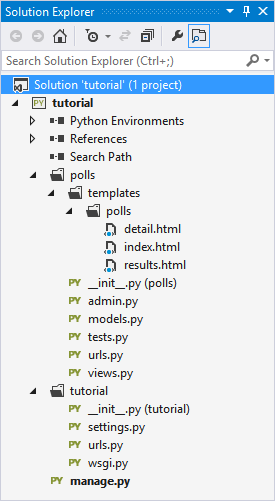

##Create a sqlite3 database locally

Our web application is almost ready to use, but first we need to configure a database.  To test our web site locally, we'll create a sqlite3 database.  This is a very lightweight database which doesn't require any additional installation.  The database file will be created in the project folder.

1. In **tutorial/settings.py**, add the following import to the top of the file:

        from os import path

1. Add the following definition near the top of the file, after the import:

		PROJECT_ROOT = path.dirname(path.abspath(path.dirname(__file__)))

1. Change the DATABASES section to the following code:

        DATABASES = {
            'default': {
                'ENGINE': 'django.db.backends.sqlite3',
                'NAME': path.join(PROJECT_ROOT, 'db.sqlite3'),
                'USER': '',
                'PASSWORD': '',
                'HOST': '',
                'PORT': '',
            }
        }

1. Right-click on the project node and select **Django Sync DB**.  A Django management interactive window will appear.  Since the database doesn't exist yet, it will prompt you to create administrator credentials.  Enter a user name and password. Email is optional.

	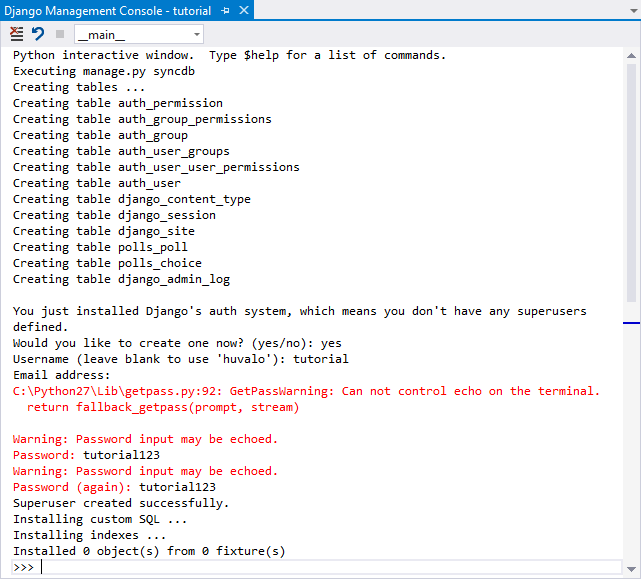

1. Start the web site with F5 or CTRL-F5. This will launch the django development server and start your web browser. The root url for the web site displays the index of polls, but there aren't any in the database yet.

	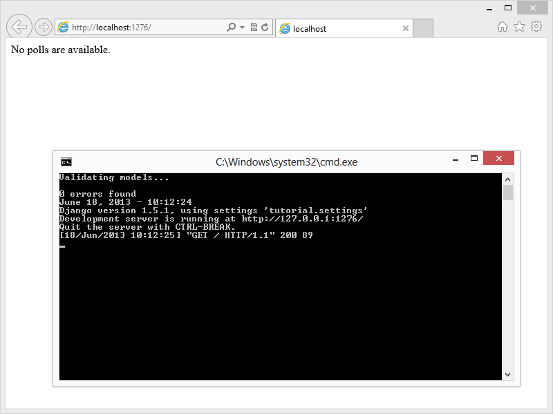

1. Navigate to **http://localhost:{port}/admin**. You can get the port number from the development server console window. Login using the credentials you created in the previous step.

1. Use the admin interface to add one or two polls.  Do not spend too much time adding polls to the local database. We'll switch to a cloud database later and repopulate the database then.

	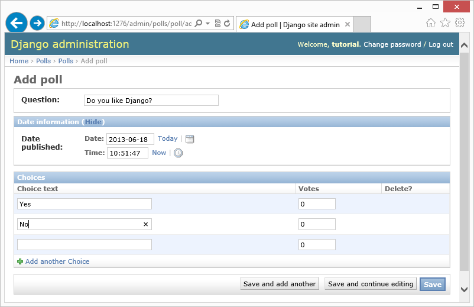

1. Navigate to **http://localhost:{port}/**.  You'll see an index of the polls you've added.

	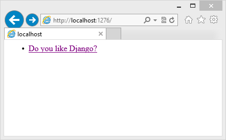

1. Click on one of the polls to go to the voting page.

	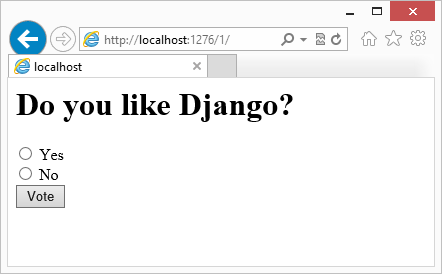

1. Submit your vote, and you'll be redirected to the results page where you should see the vote count incremented.

	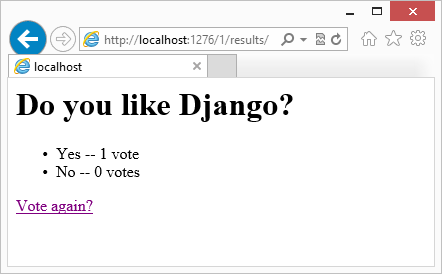

##Use stylesheets and other static files

In this section, we'll update the look of our site to use a stylesheet. Static files such as stylesheets are treated differently so it's important to store them in the right location.

1. In **tutorial/settings.py**, change the assignment of **STATIC_ROOT** to:

        STATIC_ROOT = path.join(PROJECT_ROOT, 'static').replace('\\','/')

1. Under **polls** folder, create a new folder named **static**.

1. Under **polls/static** folder, create a new folder named **polls**.

1. Under **polls/static/polls** folder, create a new folder named **images**.

1. Add a new text file **polls/static/polls/style.css** with the following:

        body {
            color: darkblue;
            background: white url("images/background.jpg");
        }
		
1. Add an existing image to the **polls/static/polls/images** folder, and name it **background.jpg**.

1. You should now have the following files in your project:

	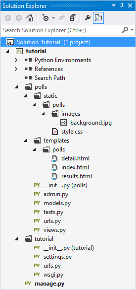

1. Edit the header of all templates to refer to the stylesheet with the following markup:

        <head>
        
        <link rel="stylesheet" type="text/css" href="" />
        </head>

1. Run the web site again.  The index, poll and results pages will use the stylesheet we created, with dark blue text and a background image.

	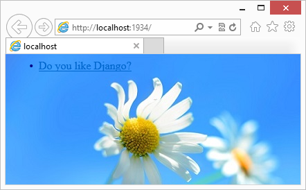

##Debugging

Python Tools for Visual Studio has special support for debugging Django templates.

1. Open **polls/templates/polls/index.html** and place a breakpoint using **F9** on this line:

        

1. Start debugging using **F5**. Visual Studio will break in the template.

1. Open the **Locals Window** from **Debug->Windows->Locals** and you'll see the **latest\_poll\_list** variable and its value.

1. You can press **F10** to step just like in regular Python code.  Inside the for loop, you should see the value of **poll**:

	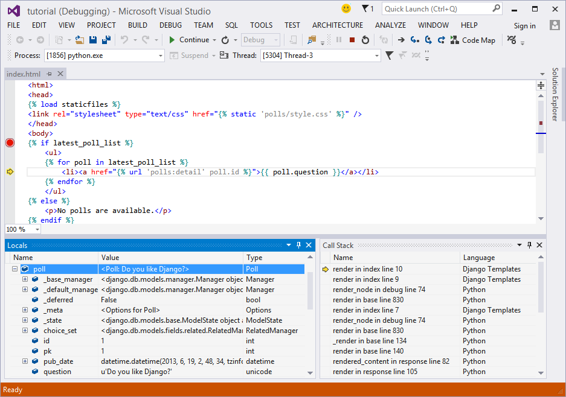

##Create a database on Azure

Now that we've verified that our poll application works locally, let's switch to using a database hosted on Azure.

In the following 2 sections we'll show how to use a SQL database and a MySQL database.  Both of these are hosted services.

Another option would be to create a Virtual Machine and install a database server.  See instructions [here](http://www.windowsazure.com/en-us/manage/linux/common-tasks/mysql-on-a-linux-vm/) for setting up MySQL on an Azure Linux VM.

**Note:** It's possible to use a sqlite3 database on Azure (for development purposes only, we do not recommend using it in production). You'll need to add the **db.sqlite3** file to your project in order to deploy the database with your django application.

###SQL Database

In this section, we'll create a SQL database on Azure, add the necessary packages to our virtual environment and change our settings to use the new database.

1. In the Azure portal, select **SQL DATABASES**.

1. First create a server to host the database.  Select **SERVERS** and **ADD**.

1. In the **CONFIGURE** tab of the newly created server, you'll see your current client IP address displayed. Next to it, click on **ADD TO THE ALLOWED IP ADDRESSES**.

	**Note:** Sometimes Azure doesn't detect the client IP address correctly. If you get an error when you synchronize the database, you should copy/paste the IP address from the error message and add it to the allowed IP addresses.

1. Next, we'll create the database. In the **DATABASES** tab, click on **ADD** from the bottom bar.

1. In Visual Studio, we'll install the packages required to access SQL Server databases from Django into our virtual environment.

1. Right-click on **env** and Install Python package: **pyodbc** using **easy\_install**.

	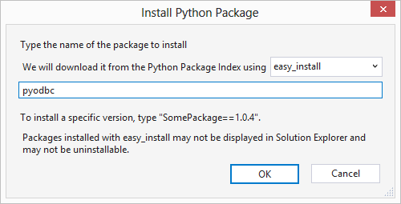

1. Right-click on **env** and Install Python package: **django-pyodbc-azure** using **pip**.

	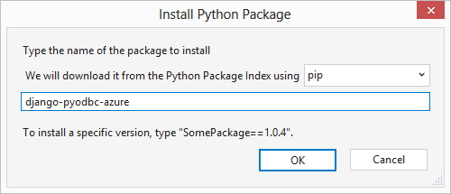

1. Edit **tutorial/settings.py** and change the **DATABASES** definition to the following, replacing **NAME**, **USER**, **PASSWORD**, and **HOST** to the values listed in the ClearDB control panel:

        DATABASES = {
            'default': {
                'ENGINE': 'sql_server.pyodbc',
                'NAME': '<database name>',
                'USER': '<user name>@<server name>',
                'PASSWORD': '<user password>',
                'HOST': '<server name>.database.windows.net',
                'PORT': '',
                'OPTIONS': {
                    'driver': 'SQL Server Native Client 10.0',
                    'MARS_Connection': True,
                },
            }
        }

	You'll have to make sure to use a driver that you have installed on your machine.  Open **Administrative Tools** from the start menu/screen, **ODBC Data Sources (32-bit)**. The drivers are listed under the **Drivers** tab.
	
	When running on an Azure Web Site, both **SQL Server Native Client 10.0** and **SQL Server Native Client 11.0** will work.
	
1. Synchronize the database and create admin credentials like we did for the local sqlite3 database.

###MySQL Database

In this section, we'll create a MySQL database on Azure, add the necessary packages to our virtual environment and change our settings to use the new database.

In the Azure Store, you can add various services to your account, including a MySQL database.  We can create a trial account for free, and small databases are free up to a certain size.

1. In the Azure portal, select **NEW**->**STORE**->**APP SERVICES**->**ClearDB MySQL Database**.  Create a database with the free plan.

1. Next, we'll install the packages required to access MySQL databases from Django into our virtual environment.

1. Manually copy **MySQL-python** from your global CPython 2.7 installation's **lib/site-packages** into your virtual environment **lib/site-packages**:
	1. Copy all **\_mysql*.\*** files
    1. Copy **MySQL\_python-1.2.3-py2.7.egg-info** folder
    1. Copy **MySQLdb** folder

	TIP: You can quickly navigate to your Python install folder using the Interpreters Window.  Open the Interpreters Window using **Ctrl-K,`** and click on the **View in File Explorer** link.

1. Edit **tutorial/settings.py** and change the **DATABASES** definition to the following, replacing **NAME**, **USER**, **PASSWORD**, and **HOST** to the values listed in the ClearDB control panel:

        DATABASES = {
            'default': {
                'ENGINE': 'django.db.backends.mysql',
                'NAME': '<database name>',
                'USER': '<user name>',
                'PASSWORD': '<user password>',
                'HOST': '<host url>',
                'PORT': '',
            }
        }

1. Synchronize the database and create admin credentials like we did for the local sqlite3 database.

##Using the Django Shell

1. Right-click on the project node and select **Validate Django App**.

	**Beta Note:** There is a bug in PTVS 2.0 Beta that prevents the shell from working if you use the **Open Django Shell** command without first using either **Validate Django App** or **Django Sync DB**. **Validate Django App** doesn't change any state, and launches the shell, so it is a good workaround. This will be fixed after Beta.

1. In this interactive window, we can access our database using our models.  Enter the following code to add a poll to the database:

		from polls.models import Poll, Choice
		from django.utils import timezone

		p = Poll(question="Favorite way to host Django on Azure?", pub_date=timezone.now())
		p.save()

		p.choice_set.create(choice_text='Web Site', votes=0)
		p.choice_set.create(choice_text='Cloud Service', votes=0)
		p.choice_set.create(choice_text='Virtual Machine', votes=0)

	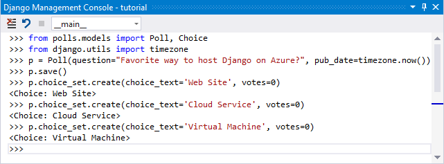

1. The static analysis of the models provides a limited view of the full API.  In the interactive window, you'll get IntelliSense against the live objects, so this is a great way to explore the API.  Here are some things to try in the interactive window:

		# all poll objects
		Poll.objects.all()

		# primary key for poll
		p.id

		# all choice objects for the poll
		p.choice_set.all()

		# get object by primary key
		Poll.objects.get(pk=1)

	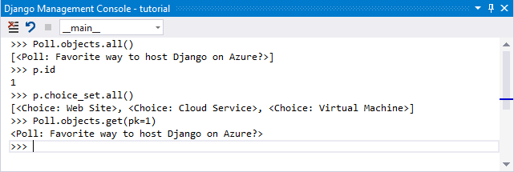

1. Start the web site.  You should see the poll we added using the Django shell.

##Publish to Azure

Now that our database is on Azure, the next step is to host the web site itself on Azure.

Azure has a few options for hosting Django applications:

- Web Site
- Cloud Service
- Virtual Machine

Python Tools for Visual Studio has publishing capabilities to Azure Web Sites and Cloud Services.  The next 2 sections describe these, and you can choose to go through either or both of them.

In both cases, PTVS takes care of configuring IIS for you, and will generate a web.config file for you if one is not already in the project.  Static files will be collected automatically (manage.py collectstatic) as long as you have set STATIC_ROOT in your settings.py.

Hosting Django in a Virtual Machine is out of scope for this tutorial.  It involves creating a VM with your desired operating system (Windows or Linux), installing Python and manually deploying the Django application. 

###Azure Web Site

1. First we'll need to create a Web Site.  Using the Azure portal, click on **NEW**->**COMPUTE**->**WEB SITE**->**QUICK CREATE**.  Pick any name that's available.

1. Once it is created, download the publish profile for the web site.

1. In Visual Studio, right-click on the project node and select **Publish**.

1. Import the web site publish profile file you downloaded previously.

1. Accept the defaults and click **Publish** to initiate the publishing.

1. When publishing has completed, a web browser will open to the published web site.

	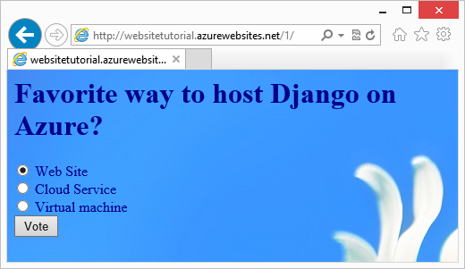

###Azure Cloud Service

1. Right-click on the project node and **Add Windows Azure Cloud Service Project**.  This will add a new project to the solution, with the .Azure suffix. This new project is marked as the startup project in the solution.

####Run in Emulator

**Beta Note:** There are issues in PTVS 2.0 Beta with Virtual Environments and the Azure Emulator. These will be fixed after Beta.

1. You'll need to **restart Visual Studio as an Administrator** to be able to run in the compute emulator.

1. Start debugging with **F5** and the app will run and deploy in the compute emulator. Verify that the admin interface works and you can vote on polls.

1. You can now restart Visual Studio if you wish to not continue as an administrator.

####Publish

1. Next you'll publish the Cloud Service to Windows Azure. Right-click on the Cloud Service project and **Publish**.

1. You'll need to import your Azure subscription publish profile.  You can click on the link in the dialog to download the profile from the Azure portal.

1. Select **Create New** in the Cloud Service combo box to create a new Cloud Service. You can use any name that is available.

1. Click **Publish** to initiate the publishing.

1. This will take longer than publishing to a Web Site, as it needs to provision a VM for the Cloud Service.

1. When the operation has completed, open a web browser by clicking on the link in the deployment window.

	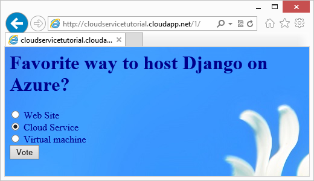

##Conclusion

In this tutorial, we've developed a Django application using Python Tools for Visual Studio.  We used 3 different databases: sqlite3, SQL Server and MySQL databases.  Finally, we published the application to Windows Azure Web Sites and Cloud Services.
