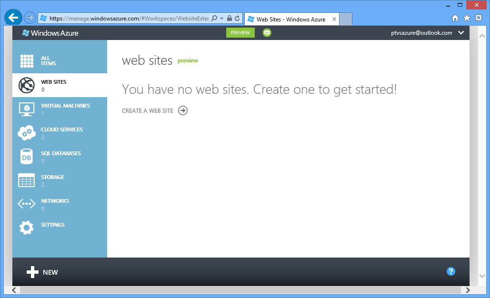
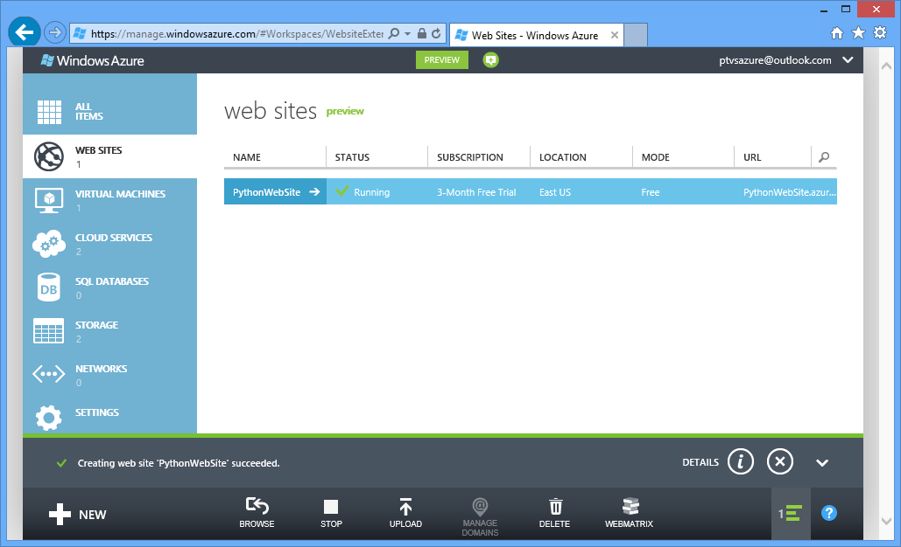
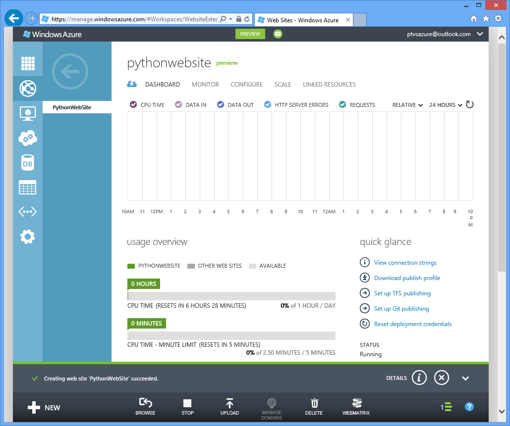
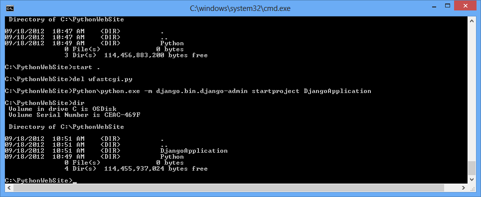
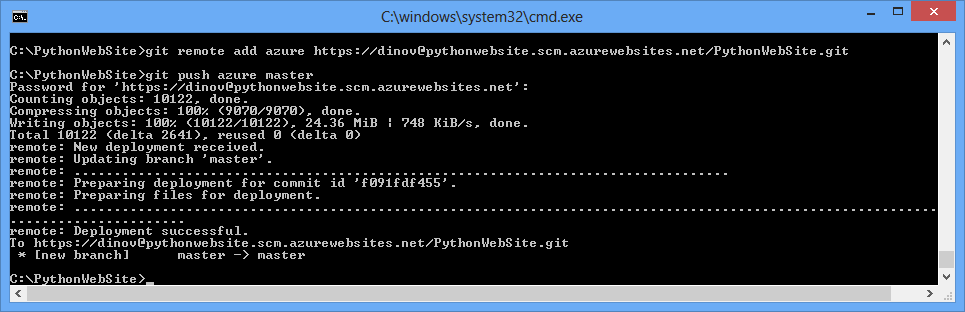
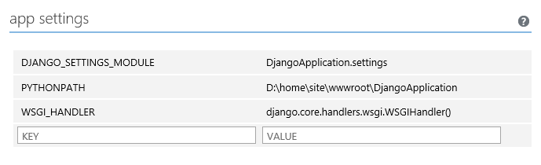
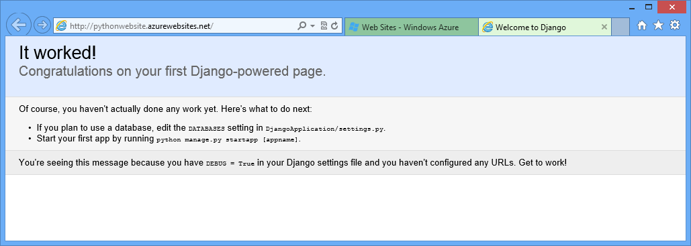

<properties linkid="develop-python-web-site-with-django" urlDisplayName="Web Sites with Django" pageTitle="Python Web Sites with Django - Windows Azure tutorial" metaKeywords="Windows Azure django   django website" metaDescription="A tutorial that introduces you to running a Python web site on Windows Azure." metaCanonical="" disqusComments="1" umbracoNaviHide="0" />

# Creating Web Sites with Django

In this tutorial we’ll describe how to get started running Python on Windows Azure Web Sites.  Windows Azure Web Sites provide limited free hosting and rapid deployment – and now you can use Python!  As your app grows you can switch to paid hosting, and you can also integrate with all of the other Windows Azure services.  

We’ll show you how to deploy an application built using the Django web framework.  We’ll walk through the steps of deploying your application and any required libraries, including Django.  We’ll put this all into a Git repository which makes it quick and simple to push updates to your web site.  And finally we’ll configure the newly created site via Windows Azure so that it runs your Python application.  

This tutorial uses Python 2.7 and Django 1.4.  You can either get these on your own or you can quickly and easily install these by using the Windows Installer link on [http://www.windowsazure.com/en-us/develop/python/](http://www.windowsazure.com/en-us/develop/python/).  

**Note**: Windows Azure web sites now come with Python 2.7 and wfastcgi handler pre-installed.  However, web frameworks such as Django are not included.  You can still use a different Python interpreter if you prefer.  You just need to include it in the Git repository and configure the web site to use that interpreter instead of the Python 2.7 interpreter already installed.

You’ll also need to install Git for pushing the site to Windows Azure – we recommend [msysgit](http://code.google.com/p/msysgit/).  There are also other deployment options available but this tutorial will cover using Git.  Once you have Python, Django, and Git installed you’ll have everything you need to get going.

**Note**: TFS publishing is currently not supported for Python projects.

## Web Site Creation on Portal

The first step in creating your app is to create the web site via the Windows Azure Management Portal.  To do this you’ll need to login to the portal and then select the WEB SITES from the left hand side:

Then click on the NEW button in the bottom left corner:

And then click Quick Create, enter an URL, and select Create Web Site:

The site will be quickly setup:

And then you can click on the site name to go to the dashboard.  

Next, we want to add support for publishing via Git.  This can be done by clicking on the “Set up Git publishing” button along the right hand side.  After setting up Git publishing you’ll momentarily see a page informing you the repo is being created and then you’ll be taken to the deployments tab after the repo has been created which includes instructions on how to connect.  

## Web Site Development

Now that we’ve created our Git repository in Windows Azure we’ll start filling it in with the web site from our local machine.  The first step is to clone the existing empty site using the url provided:

From here we’re ready to setup the enlistment with the web site.  We’ll need to do a few things:

1.  Include the Django library and other libraries that we’ll be using to run the web site.
2.  Include the Django application code.

First, we’ll include the Django library.  To do this we’ll create a new directory called site-packages and copy our installed version of Django there with these commands:

	mkdir site-packages
	cd site-packages
	xcopy /s C:\Python27\lib\site-packages\* .

This copies all the libraries located in site-packages, including Django.  If there are libraries that are not used by your web site, feel free to remove them.

 
Next we’ll create our initial Django application.  You can do this just as you’d create any other Django application from the command line or you can use [Python Tools for Visual Studio](http://pytools.codeplex.com/) to create the project.  We’ll show you both of the options here.

**Option 1:** 
To create the new project from the command line you just need to run this command which will create the Django application into the DjangoApplication folder:

	 C:\Python27\python.exe -m django.bin.django-admin startproject DjangoApplication

**Option 2:**  
You can also create your new site using Python Tools for Visual Studio.  Start Visual Studio with Python Tools for Visual Studio installed and select File->New Project.  Drill into the Python projects under Other Languages and select “Django Application”.  Enter “DjangoApplication” for the name of the project, and make sure that “Create directory for solution” is unchecked to get the exact same directory structure as creating a Django application from the command line.  This option will get you setup with a Visual Studio solution and project file giving you a great local development experience including template debugging and intellisense.

Now we just need to add all of the files we’ve just added and push the site to Git.  To do this we need to run a few commands:

	git add DjangoApplication site-packages
	git commit -m "Initial site"
	git remote add azure https://dinov@pythonwebsite.scm.azurewebsites.net/PythonWebSite.git
	git push azure master

The first command will add our untracked files to be tracked.  The second command will commit the files we just added into the repository.  The third command adds a remote with the name “azure” for our repository.  And finally we take the changes and push them to the remote repository which will also kick off the deployment.  After doing this we should see a result like:

After doing the push you’ll see the Windows Azure portal refresh and display the active deployment:

## Web Site Configuration

We need to configure the web site to know about our Django project and to use the wfastcgi handler.  To do this we can click on the Configure tab along the top of the screen where we’ll want to scroll down to the bottom half of the page which contains app settings and handler mappings.  

All of the settings that are set here will turn into environment variables during the actual request.  This means that we can use this to configure the DJANGO\_SETTINGS\_MODULE environment variable as well as PYTHONPATH and WSGI\_HANDLER.  If your application has other configuration values you could assign these here and pick them up out of the environment.  Sometimes you’ll want to set something which is a path to a file in your web site, for example we’ll want to do this for PYTHONPATH.  When running as a Windows Azure web site your web site will live in “D:\home\site\wwwroot\” so you can use that in any location where you need a full path to a file on disk.

For setting up a Django application we need to set three environment variables.  The first is DJANGO\_SETTINGS\_MODULE which provides the module name of the Django application which will be used to configure everything.  The second is the PYTHONPATH environment variable so that we can find the package which the settings module lives in.  The third is WSGI\_HANDLER.  It's a module/package name, followed by the attribute in the module to be used; for example mypackage.mymodule.handler.  Add parentheses to indicate that the attribute should be called.  So for these variables we will set them up as:
                
	DJANGO_SETTINGS_MODULE    DjangoApplication.settings
	PYTHONPATH                D:\home\site\wwwroot\DjangoApplication;D:\home\site\wwwroot\site-packages
	WSGI_HANDLER              django.core.handlers.wsgi.WSGIHandler()

Then we need to configure our handler mapping.  For this we register the handler for all extensions, using the path to the Python interpreter and the path to the wfastcgi.py script:

	EXTENSION                 *
	SCRIPT PROCESSOR PATH     D:\python27\python.exe
	ADDITIONAL ARGUMENTS      D:\python27\scripts\wfastcgi.py

At this point we’re ready to click on the Save button at the bottom.

Finally we can go back to the Dashboard, and go down to the SITE URL on the left hand side and click on the link and we’ll open our new Django site:

## Next Steps

From here you can continue the development of your Django application using the tools you’re already using.  If you’re using [Python Tools for Visual Studio](http://pytools.codeplex.com/) for development you will likely want to install [VisualGit](http://code.google.com/p/visualgit/) to get source control integration within Visual Studio.  

Likely your app will have additional dependencies beyond Python and Django.  If you installed using the installer from [http://www.windowsazure.com/en-us/develop/python/](http://www.windowsazure.com/en-us/develop/python/) you’ll already have PIP installed and can use this to quickly add new dependencies.  For example, to install the Natural Language toolkit and all of its dependencies:

	pip install nltk

You then need to update the site-packages directory by copying from C:\Python27\Lib\site-packages into your local site-packages directory.

Then do “git status” to see the newly added files, and “git add” followed by “git commit” to commit the to the repo.  Finally you can do a “git push” which will deploy the updated web site to Windows Azure.

Likewise you can go into the DjangoApplication directory and use manage.py as you would typically to start adding new applications to your Django project.  
