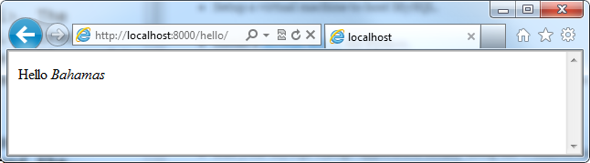
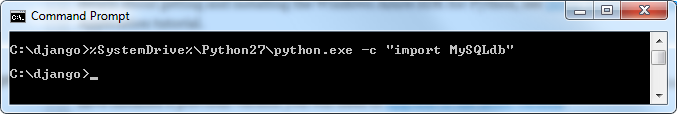
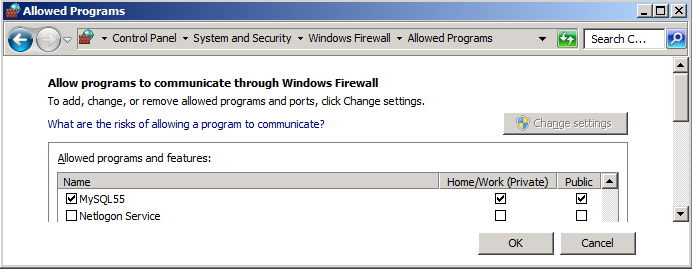

  <properties linkid="dev-python-mysql" urlDisplayName="Web App with MySQL" headerExpose="" pageTitle="Django Hello World - MySQL Edition" metaKeywords="" footerExpose="" metaDescription="" umbracoNaviHide="0" disqusComments="1" />
  <h1>Django Hello World - MySQL Edition</h1>
  
This tutorial describes how to use MySQL to access data from a Windows Azure application written in the Django Python web framework. This guide assumes that you have some prior experience using Windows Azure and Django. For an introduction to Windows Azure and Django, see <a href="http://www.windowsazure.com/en-us/develop/python/tutorials/getting-started/" style="color:red;">Django Hello World</a>. The guide also assumes that you have some knowledge of MySQL. For an overview of MySQL, see the <a href="http://dev.mysql.com/doc/">MySQL website</a>.

  
In this tutorial, you will learn how to:

  <ul>
    <li>
      
Setup a virtual machine to host MySQL.

    </li>
    <li>
      
Install a <a href="http://pypi.python.org/pypi/MySQL-python/1.2.3">MySQL driver</a> for Python.

    </li>
    <li>
      
Configure an existing Django application to use a MySQL database.

    </li>
	<li>
      
Use MySQL directly from Python.

    </li>
    <li>
      
Run your MySQL Django application locally using the Windows Azure compute emulator.

    </li>
    <li>
      
Deploy the MySQL virtual machine to Azure.

    </li>
    <li>
      
Publish your MySQL Django application to Windows Azure.

    </li>
  </ul>

  
You will expand upon the <a href="TODO" style="color:red;">Django Hello World</a> sample by utilizing a MySQL database, hosted in an Azure VM,
  to find an interesting replacement for <i>World</i>. The replacement will in turn be determined via a MySQL-backed Django <i>counter</i> app. As was the case for the Hello World sample, this Django application will again be hosted in a web role.

  
The project files for this tutorial will be stored in <strong><em>C:\django\helloworld\*</em></strong> and the completed application will look similar to:

  

    
  

  
  <h2>Setting up your development environment</h2>
  
Before you can begin developing your Windows Azure application, you need to get the tools and set up your development environment. For details about getting and installing the Windows Azure SDK for Python, see <a href="http://www.windowsazure.com/en-us/develop/python/tutorials/getting-started/#setup">Setup the Development Environment</a> in the Python "Hello World" Application tutorial.

  
<b>NOTE</b> This tutorial requires Python 2.7 and Django 1.4. These versions are included in the current Windows Azure SDK for Python; however if you have installed a previous version you will need to <a href="http://www.windowsazure.com/en-us/develop/python/tutorials/getting-started/#setup">upgrade to the latest version</a>.

<h2>Install the MySQL Python package</h2>

You must download and install the MySQL Python package, in addition to installing the Windows Azure SDK for Python. You can install it directly <a href="http://www.codegood.com/download/10/">from this link</a>. Once completed, run the following command to verify your installation:

<pre class="prettyprint">%SystemDrive%\Python27\python.exe -c "import MySQLdb"
</pre>

The expected output is empty:

<h2>Setting up a virtual machine to host MySQL</h2>
<ol>
  <li style="color:red;">
    
Follow the instructions given <a href="http://msdn.microsoft.com/en-us/library/windowsazure/gg433121.aspx">here</a> to create a Windows Server 2008 R2 virtual machine.

  </li>
  <li>
    
Install <a href="http://www.microsoft.com/en-us/download/details.aspx?id=17851">Microsoft .NET Framework 4</a> on the virtual machine. This is a prerequisite for hosting the VM in Azure.

  </li>
  <li>
    
Install the latest version of <a href="http://dev.mysql.com/downloads/">MySQL</a> for Windows on the virtual machine. Some useful hints are:
    <ul>
      <li>Do a <i>Full</i> installation.</li>
      <li>Set the MySQL configuration as <i>Dedicated</i>.</li>
      <li>Enable TCP/IP Networking on port <i>3306</i> (the default).</li>
    </ul>

  </li>
  <li>
  
After MySQL has finished installing, click the Windows <i>Start</i> menu and run the freshly installed <i>MySQL 5.5 Command Line Client</i>.  Next, enter the following commands:<pre class="prettyprint">
	CREATE USER 'testazureuser'@'%' IDENTIFIED BY 'testazure';
	CREATE DATABASE djangoazure;
	GRANT ALL ON djangoazure.* TO 'testazureuser'@'%';
	GRANT ALL ON world.* TO 'testazureuser'@'%';
	
	USE world;
	SELECT name from country LIMIT 1;
</pre>

You should now see this response:

      
  

  </li>
  <li>
  
Give MySQL access through the Windows Firewall
	<ol>
		<li>Click the Windows <i>Start</i> button and then the <i>Control Panel</i>.</li>
        <li>Click <i>Check Firewall Status</i>.</li>
        <li>Click <i>Allow a program or feature through Windows Firewall</i>.</li>
        <li>Scroll down to <i>MySQL55</i> in the <i>Allowed programs and features</i> list and ensure that <b>both</b> <i>Home/Work (Private)</i> and <i>Public</i> are checked.</li>

	</ol>

You should end up with this:

      
  

  </li>
  
</ol>

  <h2>Extend the Django Hello World application</h2>
  <ol>
    <li>
      
Follow the instructions given in the <a href="TODO">Django Hello World</a> tutorial to create a trivial "Hello World" web application in Django.

    </li>
    <li>
      
Open <strong><em>C:\django\helloworld\helloworld\settings.py</em></strong> in your favorite text editor.  Modify the <b><i>DATABASES</i></b> global dictionary to read:<pre class="prettyprint">
DATABASES = {
    'default': {
        'ENGINE': <b style="color:orange;">'django.db.backends.mysql'</b>,
        'NAME': <b style="color:orange;">'djangoazure'</b>,               
        'USER': <b style="color:orange;">'testazureuser'</b>,  
        'PASSWORD': <b style="color:orange;">'testazure'</b>,
        'HOST': <b style="color:red;">'127.0.0.1'</b>, 
        'PORT': <b style="color:orange;">'3306'</b>,
    }
}
</pre>
As you can see, we've just given Django instructions on where to find our MySQL database.   <b>IMPORTANT NOTE</b> You <b style="color:red;">must</b> change the <i>HOST</i> key to match your own MySQL VM's IP address. At this point, <i>HOST</i> should be set to whatever the <i>ipconfig</i> Windows command reports it as being.  You'll need to update this key once again after you've actually uploaded the VM to Windows Azure and obtained a <b>permanent</b> IP address for it.  After you've modified <i>HOST</i> to match the MySQL VM's current IP address, please save this file and close it.

    </li>
    <li>
      
Now that we've referenced our <i>djangoazure</i> database, let's do something useful with it! To this end, we'll create a model for a trivial <i>counter</i> app.  To instruct Django to create this, run the following commands:<pre class="prettyprint">
cd C:\django\helloworld
%SystemDrive%\Python27\python.exe manage.py startapp counter
</pre>If Django doesn't report any output from the final command above, it succeeded.

    </li>
    <li>
      
Append the following text to <strong><em>C:\django\helloworld\helloworld\counter\models.py</em></strong>:<pre class="prettyprint">class Counter(models.Model):
    count = models.IntegerField()
    def __unicode__(self):
        return u'%s' % (self.count)</pre>All we've done here is defined a subclass of Django's <i>Model</i> class named <i>Counter</i> with a single integer field, <i>count</i>. This trivial counter model will end up recording the number of hits to our Django application.

    </li>
    <li>
      
Next we make Django aware of <i>Counter</i>'s existence:
		<ol>
			<li>Edit <strong><em>C:\django\helloworld\helloworld\settings.py</em></strong> again. Add <i>'counter'</i> to the <i>INSTALLED_APPS</i> tuple.</li>
			<li>From a command prompt, please run:<pre class="prettyprint">cd C:\django\helloworld
%SystemDrive%\Python27\python manage.py sql counter
%SystemDrive%\Python27\python manage.py syncdb
</pre>These commands store the <i>Counter</i> model in the live Django database, and result in output similar to the following:<pre>C:\django\helloworld> %SystemDrive%\Python27\python manage.py sql counter
BEGIN;
CREATE TABLE `counter_counter` (
    `id` integer AUTO_INCREMENT NOT NULL PRIMARY KEY,
    `count` integer NOT NULL
)
;
COMMIT;

C:\django\helloworld> %SystemDrive%\Python27\python manage.py syncdb
Creating tables ...
Creating table auth_permission
Creating table auth_group_permissions
Creating table auth_group
Creating table auth_user_user_permissions
Creating table auth_user_groups
Creating table auth_user
Creating table django_content_type
Creating table django_session
Creating table django_site
Creating table counter_counter

You just installed Django's auth system, which means you don't have any superusers defined.
Would you like to create one now? (yes/no): no
Installing custom SQL ...
Installing indexes ...
Installed 0 object(s) from 0 fixture(s)</pre></li>
		</ol>

    </li>
    <li>
      
Replace the contents of <strong><em>C:\django\helloworld\helloworld\views.py</em></strong>. The new implementation of the <i>hello</i> function below uses our <i>Counter</i> model in conjunction with a separate sample database, <i>world</i> (distributed with MySQL), to generate a suitable replacement for the "<i>World</i>" string:

      <pre class="prettyprint">
from django.http import HttpResponse

from MySQLdb import connect
from settings import DATABASES
from counter.models import Counter

def getCountry(intId):
    #Connect to the MySQL sample database 'world'
    connection = connect(db='world',
                         user=DATABASES['default']['USER'],
                         passwd=DATABASES['default']['PASSWORD'],
                         host=DATABASES['default']['HOST'],  
                         port=int(DATABASES['default']['PORT']))
    cur = connection.cursor()

    #Execute a trivial SQL query which returns the name of 
    #all countries contained in 'world'
    cur.execute("SELECT name from country")
    tmp = cur.fetchall()
    
    #Clean-up after ourselves
    cur.close()
    connection.close()

    if intId >= len(tmp):
        return "countries exhausted"
    return tmp[intId][0]

def hello(request):
    if len(Counter.objects.all())==0:
        #when the database corresponding to 'helloworld.counter' is 
        #initially empty...
        c = Counter(count=0)
        c.save()
    else:
        c = Counter.objects.all()[0]
    c.count += 1
    c.save()
   
    world = getCountry(int(c.count))
    return HttpResponse("&lt;html&gt;&lt;body&gt;Hello &lt;em&gt;" + world + "&lt;/em&gt;&lt;/body&gt;&lt;/html&gt;")
</pre>
    </li>
  </ol>

<h2>Running Your Application Locally</h2> 
  
Before running your application in the Azure emulator, let's run it as a normal Django application to ensure everything's working properly:<pre class="prettyprint">
pushd C:\django\helloworld
%SystemDrive%\Python27\python.exe manage.py runserver
"%ProgramFiles%\Internet Explorer\iexplore.exe" http://localhost:<b style="color:orange;">8000</b>/hello
</pre>

Note, that you might need to change port <b style="color:orange;">8000</b> to another port depending upon how Django configured your application locally.

You should see output similar to the following in your web browser:

  

Refresh the web browser a few times and you should see the message change from "<i>Hello Aruba</i>" to "<i>Hello <em>&lt;some other country&gt;</em></i>".
  
  <h2>Running Your Application Locally in the Emulator</h2> 

  
Start the Azure emulator and open the Django webpage exactly as you did in the <a href="TODO" style="color:red;">Django Hello World</a> tutorial

  
You should see output similar to the following in your web browser:

  
  
  <h2>Deploying your MySQL virtual machine to Azure</h2>
  
Windows Azure includes the ability to host Windows Server 2008 R2 virtual machines in an Azure <i>VM</i> role. Please follow the instructions found <a href="http://msdn.microsoft.com/en-us/library/windowsazure/gg465385.aspx">here</a> to accomplish this.

Once you've done this, please re-open <strong><em>C:\django\helloworld\helloworld\settings.py</em></strong>, and modify the <i>HOST</i> key in the <i>DATABASES</i> global dictionary to reflect the permanent IP address of your Azure MySQL VM.

  <h2>Deploying the application to Windows Azure</h2>
  
From here, all you need to do is duplicate the steps performed in the <a href="TODO" style="color:red;">Django Hello World</a> tutorial to publish the MySQL derivation to Azure.  On top of this, you'll need to:
  <ul style="color:red;">
    <li>
      
#TODO: "Open up TCP port for MySQL" Status: to be written by dfugate; I'm sure we need to do something special to open up port 3771 to outside traffic in Azure before this tutorial will work. Not quite sure how to make this happen yet...
 dictionary to reflect the permanent IP address of your Azure MySQL VM.
    </li>
  </ul>

