<properties linkid="develop-python-django-with-visual-studio" urlDisplayName="Django with Visual Studio" pageTitle="Django with Visual Studio (Python) - Windows Azure tutorial" metaKeywords="Azure Django web app, Azure Django virtual machine" metaDescription="A tutorial that teaches you how to build a Django web application hosted in a Windows Azure virtual machine." metaCanonical="" disqusComments="1" umbracoNaviHide="0" />

# Python Django Web Application using Visual Studio

**Note:** This tutorial is also encapsulated in [Youtube video](http://www.youtube.com/watch?v=UsLti4KlgAY).

Developing for Windows Azure is easy when using the available tools.
This tutorial assumes you have no prior experience using Windows Azure.
On completing this guide, you will have a Django application up and running in the cloud.

You will learn:

-   How to create a basic Django application
-   How to run and debug your Django application locally using the Django test server
-   How to run your Django application locally in the compute emulator
-   How to publish and re-publish your application to Windows Azure.

By following this tutorial, you will build a simple Hello World web
application. The application will be hosted in an instance of a web role
that, when running in Windows Azure, is itself hosted in a dedicated
virtual machine (VM).

A screenshot of the completed application is below:

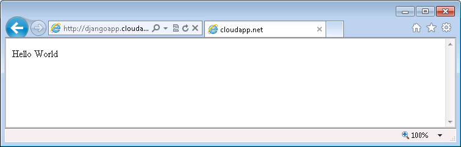

## Setting Up the Development Environment

Before you can begin developing your Windows Azure application, you need to get the tools and set up your development environment. For details about getting and installing the Windows Azure SDK for Python, see [How to Install Python][].

NOTE
This tutorial requires Python 2.7 and Django 1.4. These versions are included in the current Windows Azure SDK for Python.

## Creating a New Django Application

To create a new Django application first launch Visual Studio and then create a new project using **File->New Project**.  Find the Python tab (either available at the top-level, or in the Other Languages area) and select the Django Application template:

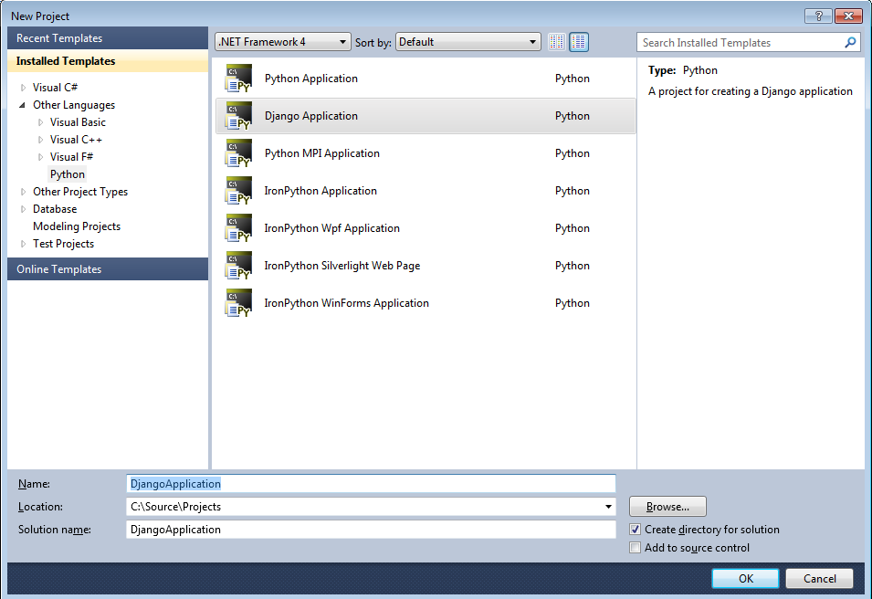

**Click OK** and you'll have created your first Django app.

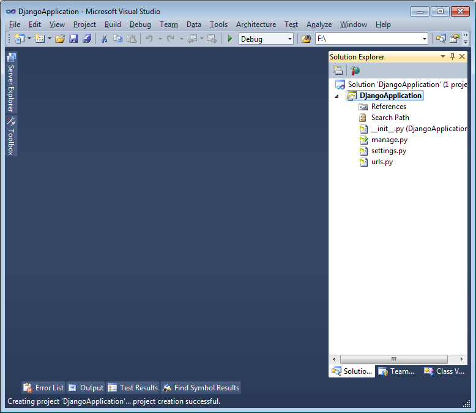

Next you'll want to start developing the first Django app.  You can right click on the project node and select **Add New Django app**... to setup a new app within your project:

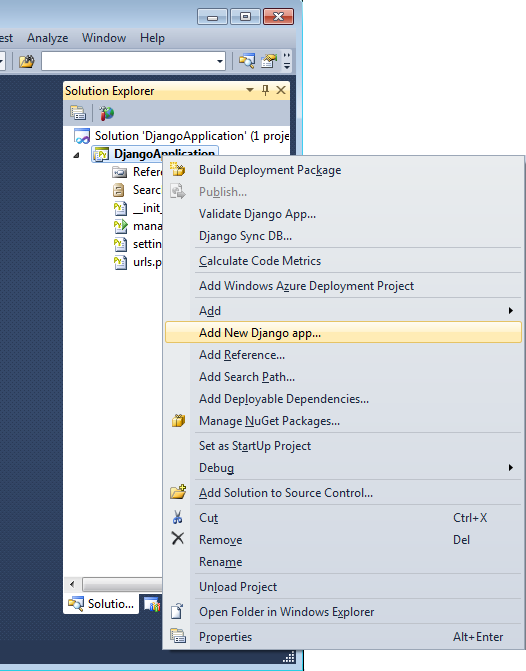

After which you can enter the new name for your application:

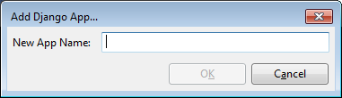

After entering a name for the application and clicking **OK** a new app is added to your project:

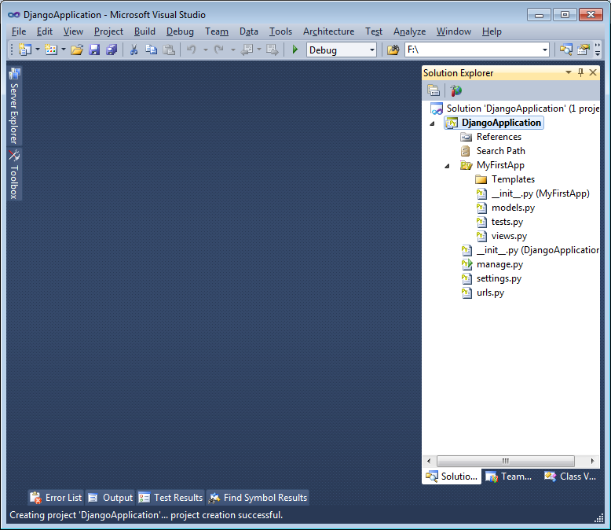

Now update **settings.py** so that your application is registered.  This will cause Django to automatically discover template files which are added to your apps Templates directory. Add the application name to the INSTALLED_APPS section:

	'DjangoApplication.MyFirstApp',

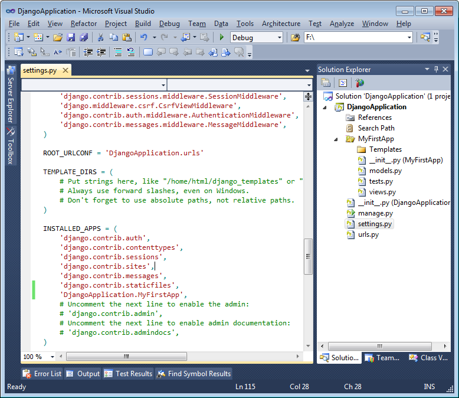

Next lets add some code to the app's **views.py** so that we can return a simple template file:

	from django.http import HttpResponse
	from django.template.loader import render_to_string
	def home(request):
		return HttpResponse(render_to_string(
											'index.html',
											{'content': 'Hello World'}
											))

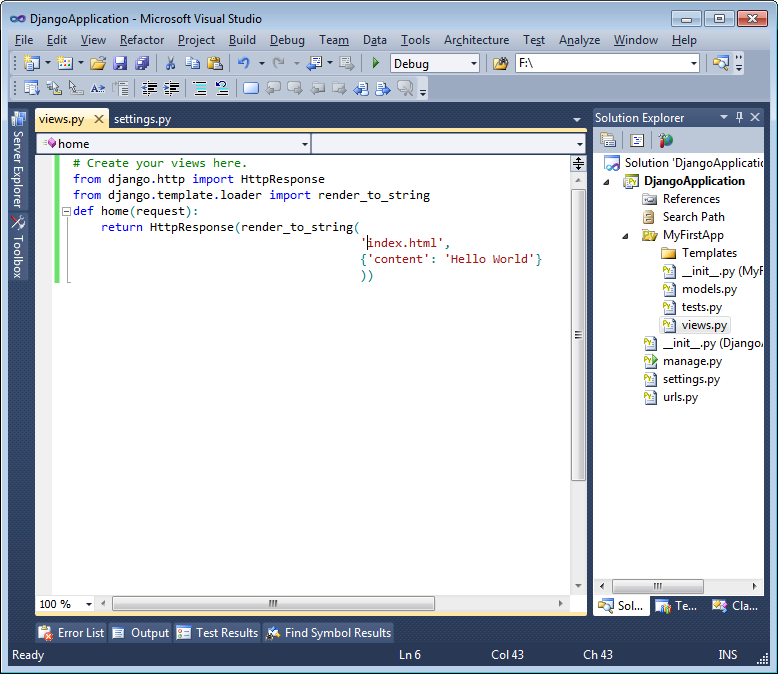

And then lets add a simple template file that will be rendered when you visit this view.  To do this we can right click on the Templates folder and select **"Add new Item"**:

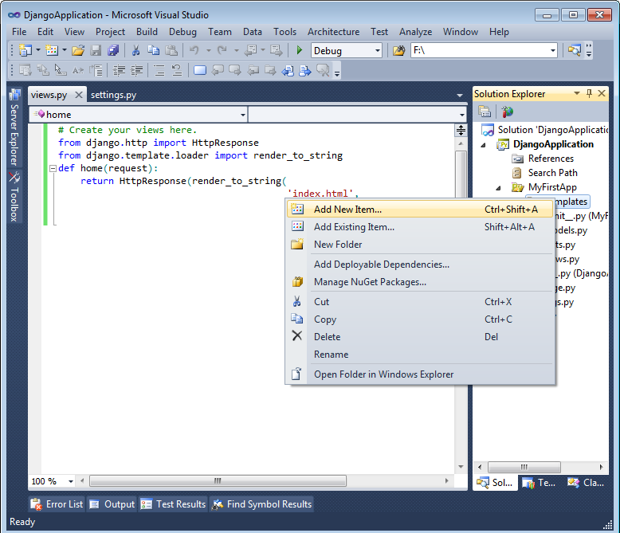

You can now select "Django HTML Template" from the template list and enter **index.html** in as the filename:

After which the template is added to the project and is open.  Here you can see the start of some syntax highlighting for the template tags:

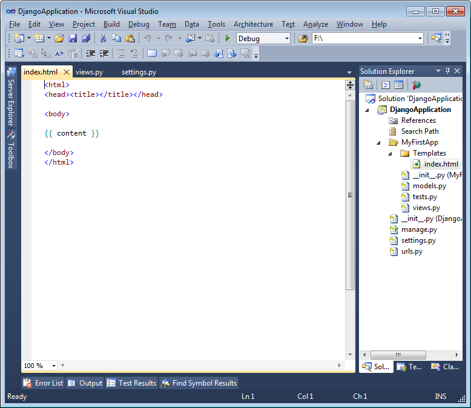

You could go ahead and start updating the template at this point to change the rendered HTML and you'll get nice intellisense while doing so:

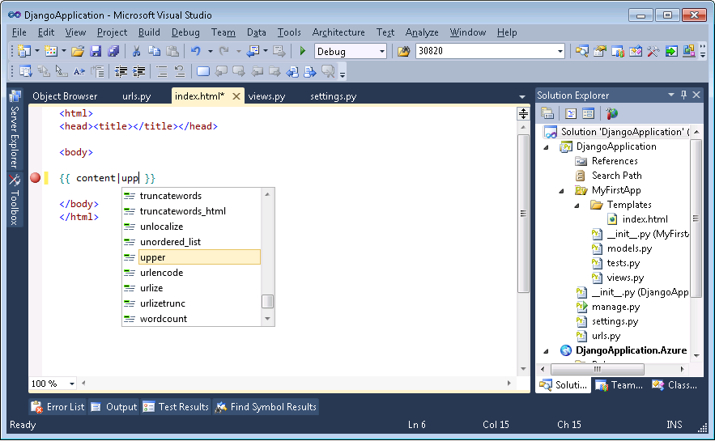

You can leave the capitilization in or out, it won't change the results of this tutorial much one way or another.  Finally you just need to register your view with the url patterns in **urls.py**.  Add this to the **urlpatterns**:

	url(r'^$', 'DjangoApplication.MyFirstApp.views.home', name='home'),

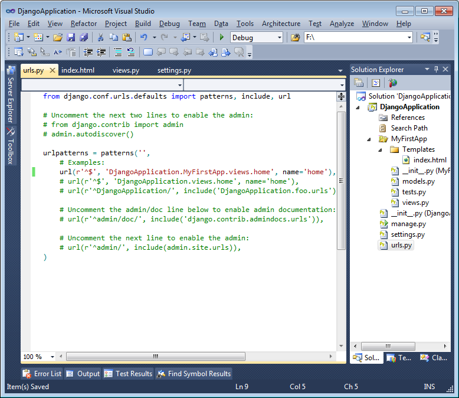

## Running your Application Locally in the Test Server

At this point you've created your very first Django application.  Now you can run it locally by just **pressing F5**.  

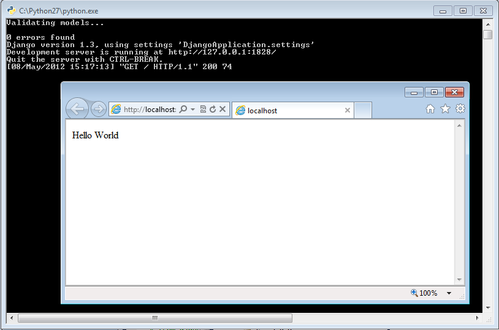

This will start your Python interpreter running Django's **manage.py** to run the test server.  Once the test server is successfully launched it will also launch a web browser to view the web site.  Because you launched with F5 this is launched under the debugger so we can also set breakpoints either in any of the Python code such as the view code or in the template files themselves:

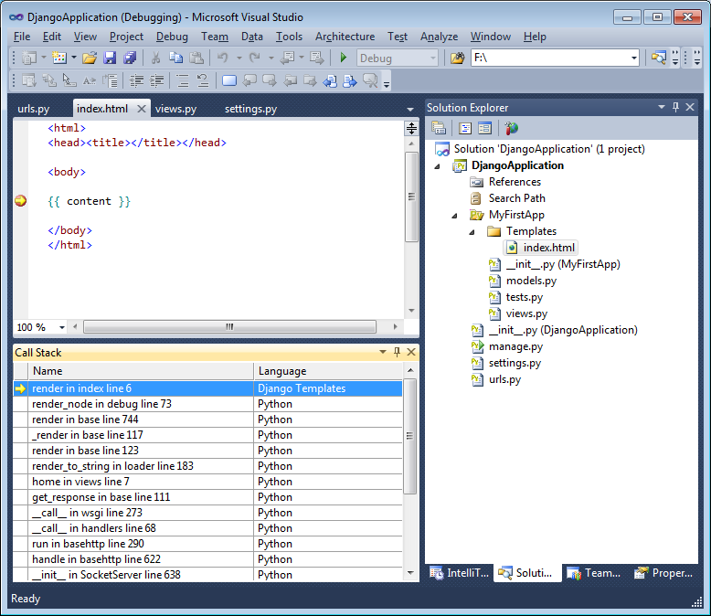

You can now **click the stop button** and move onto running in the Windows Azure compute emulator.

## Running Your Application Locally in the Emulator	

To run inside of the compute emulator you simply need to add a Windows Azure deployment project to your solution for the Django project.  This can be done by right clicking on the Django project node in Solution Explorer and selecting **"Add Windows Azure Cloud Service Project"**:

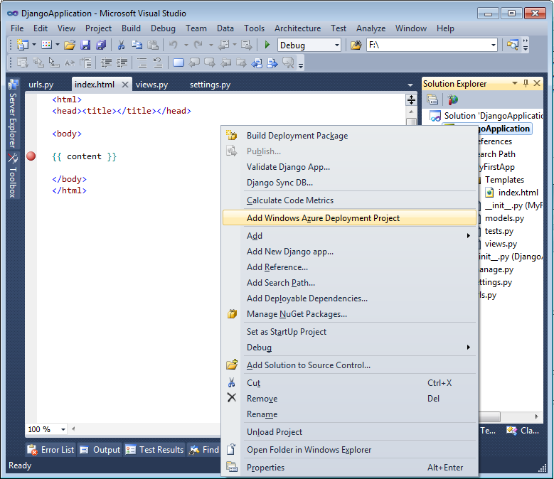

After executing this command you'll see a newly added project in solution explorer:

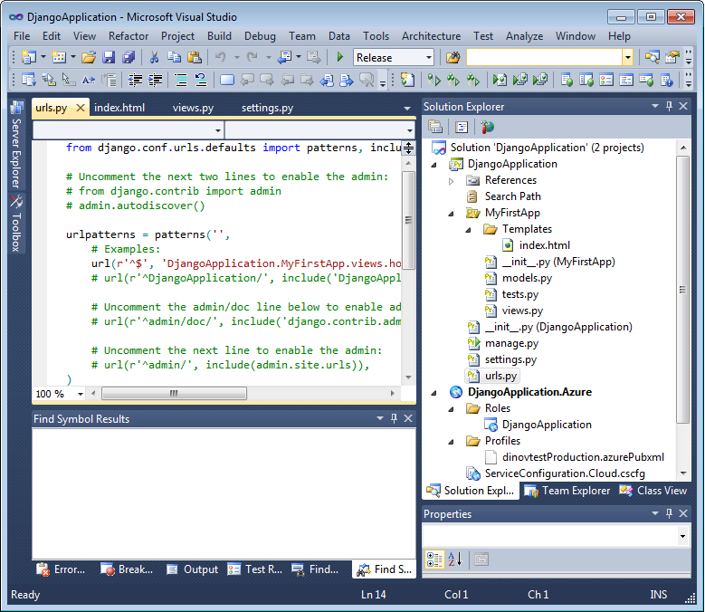

This new project is now also marked as the startup project in the solution.  At this point you'll need to **restart Visual Studio as an Administrator** to be able to run in the compute emulator, but after doing so we can simply **hit F5** and the app will run and deploy in the compute emulator:

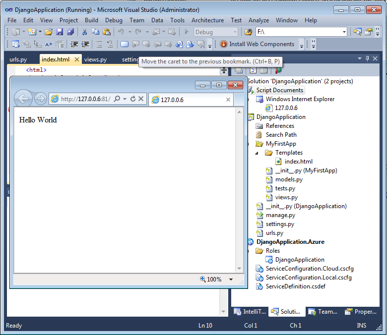

Now you can see that we are now looking at the same web page but at a slightly different URL.  You can also see that there's no python.exe running the Django test server.  Instead we are running Django through IIS using a FastCGI gateway which is automatically included and setup when working from within Visual Studio.  

When running in the compute emulator you can rapidly iterate on your application - just switch back to Visual Studio, update your files, and refresh the web browser.  You'll see the results immediately!

## Deploying the Application to Windows Azure

Now you're ready to deploy the project to Windows Azure. To do this all you need to do is right click the Windows Azure deployment project in Solution Explorer and **selecting Publish**:

After selecting Publish you will be prompted to sign in to Windows Azure.  You can either import your existing credentials here or setup new credentials:

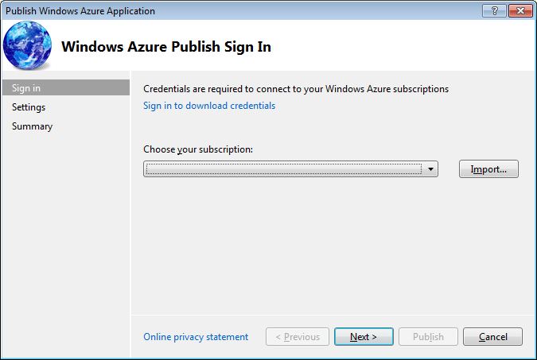

After selecting the credentials you'll see the Windows Azure Publish Settings screen.  You can select the various options on how your deployment will proceed, or you can just **press Publish**:

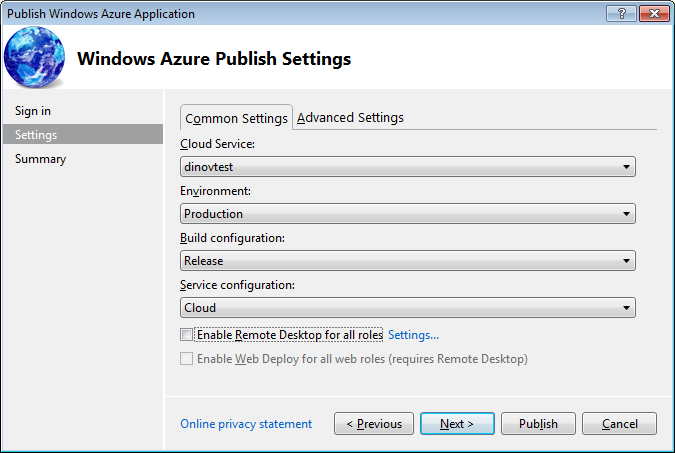

You'll now need to wait for the application be setup and deployed. Once it's all setup
you can click on the link below DNS Name to view your web site running in the cloud:

[How to Install Python]: ../commontasks/how-to-install-python.md

