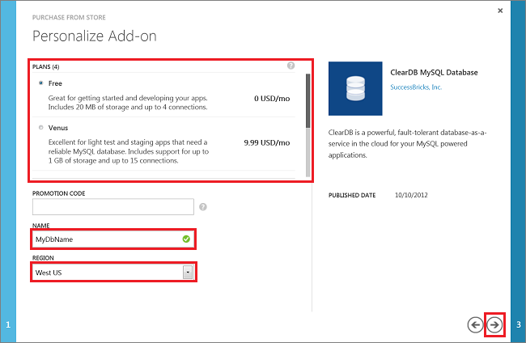
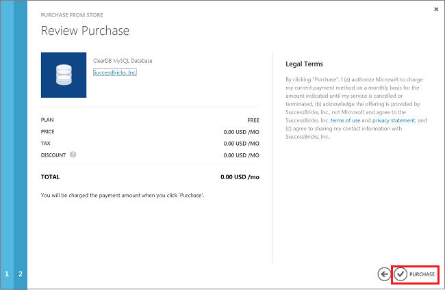
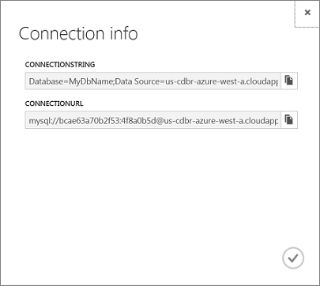
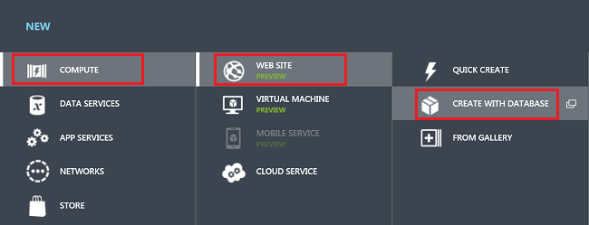
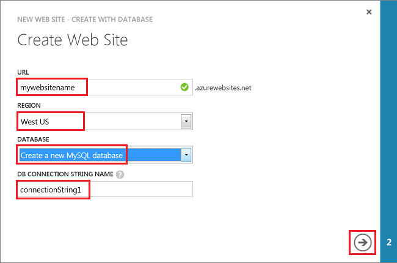
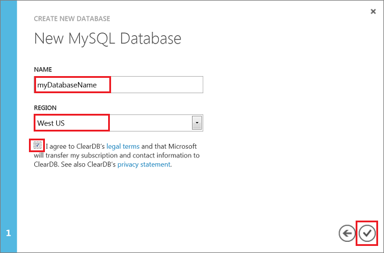
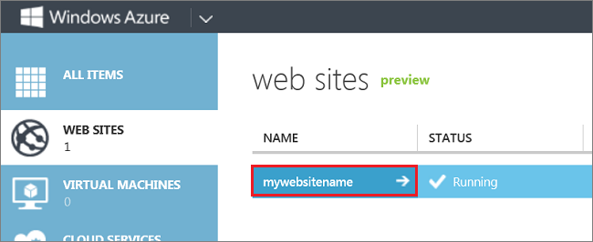

#How to Create a MySQL Database in Windows Azure

This guide will show you how to use [ClearDB] to create a MySQL database from the [Windows Azure Store] and  how to create a MySQL database as a linked resource when you create a [Windows Azure Web Site][waws] . [ClearDB] is a fault-tolerant database-as-a-service provider that allows you to run and manage MySQL databases in Windows Azure datacenters and connect to them from any application.  

##Table of Contents
* [How to: Create a MySQL database from the Windows Azure Store](#CreateFromStore)
* [How to: Create a MySQL database as a linked resource for Windows Azure Web Site](#CreateForWebSite)

 
<b>Note</b> 

When you create a MySQL database as part of the Web Site creation process, you can only create a free database. Creating a MySQL database from the Windows Azure Store allows you to create a free database or choose from paid options.
 

<h2 id="CreateFromStore">How to: Create a MySQL database from the Windows Azure Store</h2>

To create a MySQL database from the [Windows Azure Store], do the following:

1. Log in to the [Windows Azure Management Portal][portal].
2. Click **+NEW** at the bottom of the page, then select **STORE**.

	

3. Select **ClearDB MySQL Database**, then click the arrow at the bottom of the frame.

	

4. Select a plan, enter a database name, and select a region, then click the arrow at the bottom of the frame.

	

5. Click the checkmark to complete your purchase.

	

6. After your database has been created, you can manage it from the **ADD-ONS** tab in the management portal.

	

7. You can get the database connection information by clicking on **CONNECTION INFO** at the bottom of the page (shown above).

	 

<h2 id="CreateForWebSite">How to: Create a MySQL database as a linked resource for Windows Azure Web Site</h2>

To create a MySQL database as a linked resource when you create a [Windows Azure Web Site][waws], do the following:

1. Log in to the [Windows Azure Management Portal][portal].
2. Click **+NEW** at the bottom of the page, then select **COMPUTE**, **WEB SITE**, and **CREATE WITH DATABASE**.

	

3. Provide a **URL** for your web site, select the **REGION** for your site, and choose **Create a new MySQL database** from the **DATABASE** dropdown. Optionally, you can replace the default name for the connection string. Click the arrow at the bottom of the page.

	 

4. Provide a database **NAME**, select the **REGION** for your database (this should be same as the region for your web site), agree to ClearDB's legal terms, and click the checkmark at the bottom of the frame.

	

5. After your web site has been created, click on the name of your site to go to your site's dashboard.

	

6. Click on **CONFIGURE**.

	

7. Scroll down to the **connection strings** section and click **Show Connection Strings**. 

	

8. Copy the connection string for use in your application.

	

 
<b>Note</b> 

Connection strings are accessible to your web site application by connection string name. In .NET applications, connection strings are availble in the <b>connectionStrings</b> object. In other programming languages, connection strings are accessible as environment variables. For more information, see <a href="/en-us/manage/services/web-sites/how-to-configure-websites/">How to Configure Web Sites</a>.
 

[ClearDB]: http://www.cleardb.com/
[waws]: /en-us/manage/services/web-sites/
[Windows Azure Store]: /en-us/store/overview/
[portal]: http://windows.azure.com/