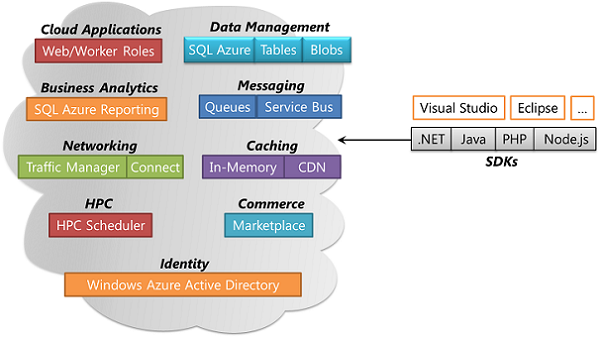
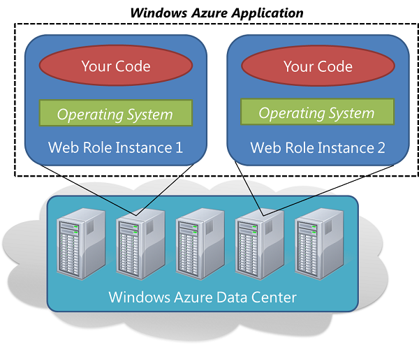
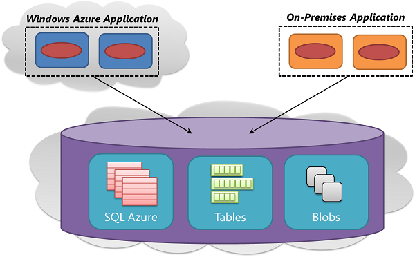
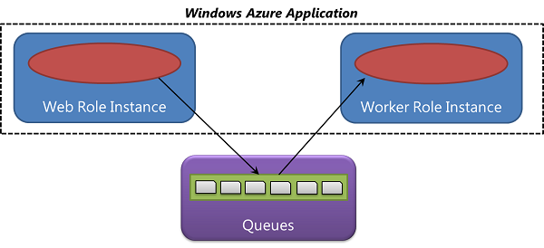
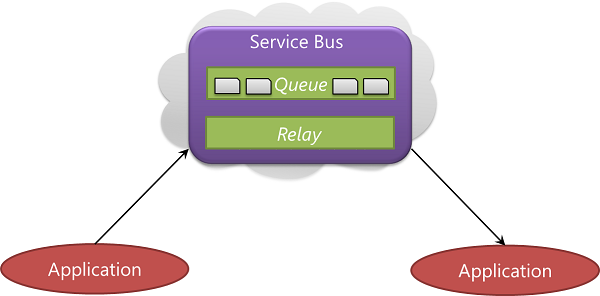
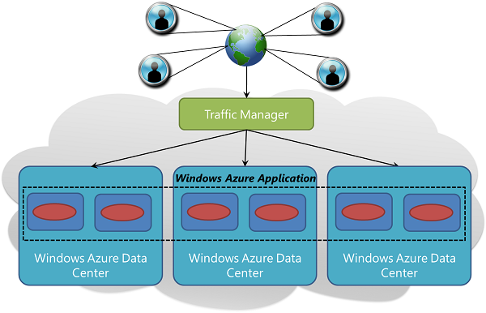
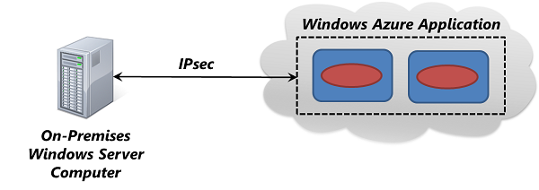
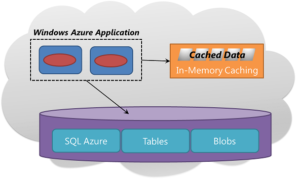
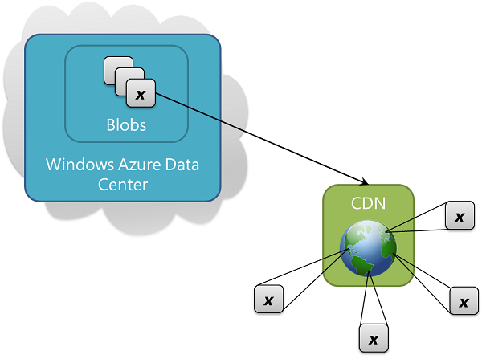
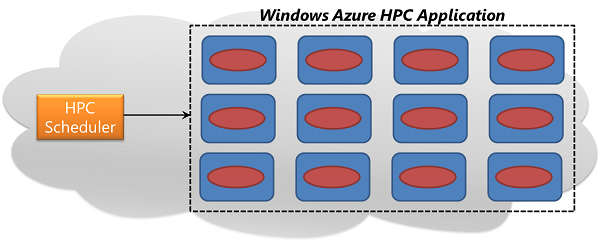

<?xml version="1.0" encoding="utf-8"?>
<body>
  <properties umbracoNaviHide="0" pageTitle="Intro to Windows Azure" metaKeywords="" metaDescription="" linkid="dev-net-fundamentals-intro-to-windows-azure" urlDisplayName="Intro to Windows Azure" headerExpose="" footerExpose="" disqusComments="1" />
  <h1>Understanding Windows Azure</h1>
  
Windows Azure is Microsoft's application platform for the public cloud. Your applications can use this platform in many different ways. For instance, you can use Windows Azure to build a web application that runs and stores its data in Microsoft datacenters. You can use Windows Azure only to store data, with the applications that use that data running on-premises (that is, outside the public cloud). You can use Windows Azure to help on-premises applications connect with each other or to map between different sets of identity information or in other ways. Because the platform offers a wide range of services, all of these things—and more—are possible.

  
To do any of them, though, you need to understand the basics. Even if you don't know anything about cloud computing, this article will walk you through the fundamentals of Windows Azure. The goal is to give you a foundation for understanding and using this cloud platform.

  <h2>Table of Contents</h2>
  <ul>
    <li>
      <a href="#components">The Components of Windows Azure</a>
    </li>
    <li>
      <a href="#cloud">Cloud Applications</a>
    </li>
    <li>
      <a href="#data">Data Management</a>
    </li>
    <li>
      <a href="#analytics">Business Analytics</a>
    </li>
    <li>
      <a href="#messaging">Messaging</a>
    </li>
    <li>
      <a href="#networking">Networking</a>
    </li>
    <li>
      <a href="#caching">Caching</a>
    </li>
    <li>
      <a href="#hpc">High-Performance Computing (HPC)</a>
    </li>
    <li>
      <a href="#commerce">Commerce</a>
    </li>
    <li>
      <a href="#identity">Identity</a>
    </li>
    <li>
      <a href="#sdks">SDKs</a>
    </li>
    <li>
      <a href="#gettingstarted">Getting Started</a>
    </li>
  </ul>
  <h2>
    The Components of Windows Azure</h2>
  
To understand what Windows Azure offers, it's useful to group its services into distinct categories. Figure 1 shows one way to do this.

  

    
     
    <strong>Figure 1: Windows Azure provides a set of cloud services running in Microsoft datacenters.</strong>
  

  
To understand Windows Azure, you need to know what its components do. The rest of this article walks through the technologies shown in the figure, describing what each one offers and when you might use it.

  <h2>
    Cloud Applications</h2>
  
A Windows Azure application is much like one that runs in your own datacenter. You write code in your preferred language, such as C#, Java, PHP, Node.js, or something else. You then execute that code in virtual machines running Windows Server. But because Windows Azure is designed to help you create applications that are more reliable, more scalable, and require less administration, creating a Windows Azure application isn't exactly the same as building an on-premises application. Even though most of what you already know about building software for Windows Server applies to Windows Azure, there are a few new things you need to understand.

  
In Windows Azure, every application is implemented as one or more <em>roles</em>. Each role contains the code and configuration information required to carry out some part of your application's function. Windows Azure today provides two main types of roles: web roles and worker roles. A web role is designed for code that interacts directly with web browsers or other HTTP clients—it depends on IIS, Microsoft's web server. A worker role is more general, designed to run a variety of code.

  
If you just want to create a simple ASP.NET or PHP application, for example, you might use only a web role. For a more demanding application, you might decide to use a web role to interact with users, then rely on a worker role to carry out the requests those users make. And in some cases, you'll use just a worker role, such as with an application that processes lots of data in parallel.

  
Whatever roles you break your application into, the code for each one will execute in a <em>role instance</em>. Each role instance is really just a virtual machine (VM) running a flavor of Windows Server, and each one executes in a Windows Azure datacenter. Figure 2 shows how this looks for a simple application that runs two instances of a web role.

  

    
     
    <strong>Figure 2: The code for every Windows Azure application runs in some number of role instances, each of which is really a virtual machine.</strong>
  

  
In this example, each web role instance runs an identical copy of the application's code, along with a version of Windows Server, and Windows Azure automatically load balances all user requests across these two instances. To deploy the application, a developer doesn't explicitly create VMs. Instead, he gives the application's executable to Windows Azure, indicating what kind of role instances (web or worker) he wants and how many of each he needs. Windows Azure will create the specified number of VMs for each role, then start a copy of the role's executable in each one. The developer need only indicate what he wants, and the platform does the rest.

  
Once an application is running, Windows Azure continues to monitor it. If your code fails or the role instance it's running in crashes or the physical machine the instance is executing on goes down, Windows Azure will start a new instance of this role. The platform also handles applying updates to the physical and virtual machines your application relies on, including things like deploying new patched versions of the operating system. Because of this, a Windows Azure application typically runs two or more instances of each role. This lets the platform take down and update one VM at a time while the application keeps on running. Since it includes built-in services like these, Windows Azure fits into the cloud computing category known as <em>Platform as a Service (PaaS)</em>.

  
If the load on a Windows Azure application increases—maybe you've acquired a large number of new users all at once, for instance—a developer or the application itself can just ask for more instances. If the load decreases, another request can shrink the number of instances. And because Windows Azure charges you by the hour for each instance, you pay only for the capacity you need. (See <a href="http://www.windowsazure.com/en-us/pricing/details/">here</a> for more on Windows Azure pricing.)

  <h2>
    Data Management</h2>
  
Every Windows Azure application runs in one or more role instances, i.e., in one or more VMs. Each VM has local storage, which an application is free to use. Remember, though, that Windows Azure will periodically shut down instances for maintenance. Because of this, data that an application wishes to store persistently—which is almost everything—must be stored outside of the VMs in which the application runs. To allow this, Windows Azure provides three data management options, as Figure 3 shows.

  

    
     
    <strong>Figure 3: For data management, Windows Azure provides relational storage, scalable tables, and unstructured blobs.</strong>
  

  
Each of the three options addresses a different need: relational storage, fast access to potentially large amounts of simple typed data, and unstructured blob storage. In all three cases, data is automatically replicated across three different computers in the Windows Azure datacenter to provide high availability. As the figure shows, all three options can be accessed either by Windows Azure applications or by applications running elsewhere, such as your datacenter, your laptop, or your phone. And however you apply them, you pay for all Windows Azure data management services based on usage, including a gigabyte-per-month charge for stored data. (Again, see <a href="http://www.windowsazure.com/en-us/pricing/details/">here</a> for pricing details.)

  <h3>SQL Azure</h3>
  
For relational storage, Windows Azure provides <em>SQL Azure</em>. Think of SQL Azure as a cloud-based analog of SQL Server. Like SQL Server, it can be accessed using Entity Framework, ADO.NET, and other familiar data access technologies. It also behaves very much like SQL Server, supporting most of the T-SQL language. For anybody familiar with SQL Server (or even another relational database), using SQL Azure is simple.

  
But SQL Azure isn't just a DBMS in the cloud—it's a PaaS service. You still control your data and who can access it, but SQL Azure takes care of things like managing the physical aspects of the system, such as adding more disk space when needed. In other words, it handles much of the administrative grunt work.

  
If you're creating a Windows Azure application that needs relational storage, SQL Azure is your best option today. Applications running outside the cloud can also use this service, though, so there are plenty of other scenarios. For instance, data stored in SQL Azure is easy to access from different client systems, including desktops, laptops, tablets, and phones, wherever they might be. And because it provides built-in high availability through replication, using a SQL Azure database minimizes downtime.

  <h3>Tables</h3>
  
Suppose you want to create a Windows Azure application that needs fast access to hundreds of gigabytes of typed data, but doesn't need to perform complex SQL queries on this data. For example, imagine you're creating a consumer application that needs to store customer profile information for each user. Your app is going to be very popular, so you need to allow for lots of data, but you won't need to do much with this data beyond storing it, then retrieving it in simple ways. This is exactly the kind of scenario where <em>Tables</em> make sense.

  
Don't be confused by the name: Tables don't provide relational storage. Instead, they let an application store properties of various types, such as strings, integers, and dates. An application can then retrieve a group of properties by providing a unique key for that group. While complex operations like joins aren't supported, Tables offer fast access to typed data. They're also very scalable, with a single table containing as much as a terabyte of data. And matching their simplicity, Tables are usually less expensive to use than SQL Azure's relational storage.

  <h3>Blobs</h3>
  
The third Windows Azure option for data management, <em>Blobs</em>, is designed to store unstructured binary data. Like Tables, Blobs are cheap, and a single blob can be as large as one terabyte. An application that stores video, for example, or backup data or other binary information is likely to use blobs for simple, cheap storage. Windows Azure applications can also use <em>Windows Azure drives,</em> which let blobs provide persistent storage for a Windows file system mounted in a Windows Azure instance.

  <h2>
    Business Analytics</h2>
  
One of the most common ways to use stored data is to create reports based on that data. To let you do this with relational data in SQL Azure, Windows Azure provides <em>SQL Azure Reporting</em>. A subset of the reporting services provided with SQL Server, SQL Azure Reporting lets you build reporting into Windows Azure applications. The reports it creates can be in many formats, including HTML, XML, PDF, Excel, and others, and they can be embedded in applications or viewed via a web browser.

  
Another option for doing analytics with SQL Azure data is to use on-premises business intelligence tools. To a client, SQL Azure looks just like SQL Server, and so the same technologies can work with both. You're free to use the on-premises version of SQL Server Reporting Services to create reports from SQL Azure data, for example, or to use SQL Server Analysis Services to perform analysis on that data.

  <h2>
    Messaging</h2>
  
No matter what it's doing, code frequently needs to communicate with other code. One common way to do this is through queued messaging, although other approaches can also make sense. Because different applications have different requirements, Windows Azure provides two different technologies for this kind of communication: Queues and Service Bus.

  <h3>Queues</h3>
  
The service provided by Windows Azure <em>Queues</em> is easy to understand: One application places a message in a queue, which is eventually read by another application. One common use of Queues today is to let a web role instance communicate with a worker role instance, as Figure 4 illustrates.

  

    
     
    <strong>Figure 4: Queues are commonly used to let web role instances communicate with worker role instances.</strong>
  

  
For example, suppose you create a Windows Azure application for video sharing. The application consists of PHP code running in a web role that lets users upload and watch videos, together with a worker role implemented in C# that translates uploaded video into various formats. When a web role instance gets a new video from a user, it can store the video in a blob, then send a message to a worker role via a queue telling it where to find this new video. A worker role instance—it doesn't matter which one—will then read the message from the queue and carry out the required video translations in the background. Structuring an application in this way allows asynchronous processing, and it also makes the application easier to scale, since the number of web role instances and worker role instances can be varied independently.

  <h3>Service Bus</h3>
  
Along with Queues, Windows Azure provides Service Bus, a somewhat more general approach to connecting software through the cloud. Service Bus also provides a queuing service, but it's not identical to the Queues just described. (For a more detailed comparison of the two, see <a href="http://msdn.microsoft.com/en-us/library/hh767287(v=vs.103).aspx">here</a>.) One common use of Service bus is to connect different applications, as Figure 5 shows.

  

    
     
    <strong>Figure 5: Service Bus lets applications communicate either through queues or directly.</strong>
  

  
Applications that communicate through Service Bus might be Windows Azure applications, for example, or software running on some other cloud platform. They can also be applications running outside the cloud, however. For example, think of an airline that implements reservation services in computers inside its own datacenter. The airline needs to expose these services to many clients, including check-in kiosks in airports, reservation agent terminals, and maybe even customers' phones. It might use Service Bus to do this, creating loosely coupled interactions among the various applications.

  
Unlike Windows Azure Queues, Service Bus queues provide a publish-and-subscribe mechanism. An application can send messages to one or more topics, while other applications elect to receive only messages sent to specific topics. This allows flexible one-to-many communication among a set of applications. And queues aren't the only option: Service Bus also allows direct communication through its relay service, providing a secure way to interact through firewalls.

  <h2>
    Networking</h2>
  
Windows Azure runs today in six datacenters: two in the United States, two in Europe, and two in Asia. When you use Windows Azure, you select one or more of these datacenters to run your application and/or store your data. To route requests among these datacenters, Windows Azure provides Traffic Manager. To connect on-premises servers to applications in a particular datacenter, it offers the Connect service. This section looks at both of these technologies.

  <h3>Traffic Manager</h3>
  
An application with users in just a single part of the world might run its role instances in just one datacenter. An application with many users scattered around the world might run role instances in multiple datacenters, maybe even all six of them. In this second situation, you face a problem: How do you intelligently assign users to application instances? Most of the time, you probably want each user to access the datacenter closest to her, since it will likely give her the best response time. But what if that copy of the application is overloaded or unavailable? It would be nice to route her request automatically to another datacenter. This is exactly what's done by Windows Azure <em>Traffic Manager</em>, as Figure 6 shows.

  

    
     
    <strong>Figure 6: If your application runs in multiple datacenters, Windows Azure Traffic Manager can route user requests intelligently across them.</strong>
  

  
The owner of an application defines rules that specify how requests from users should be routed to datacenters, then relies on Traffic Manager to carry out these rules. For example, users might normally be routed to the closest Windows Azure datacenter, but get sent to another one when the response time from their default datacenter exceeds a certain threshold. For globally distributed applications with many users, having a built-in service to handle problems like these automatically is useful.

  <h3>Connect</h3>
  
Another concern for the creator of a Windows Azure application is connecting back to on-premises systems. For example, suppose you want to write an application that runs on Windows Azure but accesses data stored in a database on Windows Server inside your organization. To address this problem, Windows Azure provides the <em>Connect</em> service, shown in Figure 7.

  

    
     
    <strong>Figure 7: Windows Azure Connect makes it easy to establish a secure link between an on-premises server and a Windows Azure application.</strong>
  

  
Connect provides a simple way to establish a secure IPsec connection between a Windows Azure application and a computer running Windows Server. A developer just installs the Connect software on the on-premises server—there's no need to involve a network administrator—and configures the Windows Azure application. Once this is done, the application can communicate with the computer directly. It can access a database on that machine, for instance, just as if it were on the same local network.

  <h2>
    Caching</h2>
  
Applications tend to access the same data over and over. One way to improve performance is to cache that data closer to the application, minimizing the time needed to retrieve it. Windows Azure provides two different caching services: one for in-memory caching of data used by Windows Azure applications and a second that caches blob data on disk closer to its users.

  <h3>In-Memory Caching</h3>
  
Accessing data stored in any of Windows Azure's data management services—SQL Azure, Tables, or Blobs—is quite fast. Yet accessing data stored in memory is even faster. Because of this, keeping an in-memory copy of frequently accessed data can improve application performance. To allow this, Windows Azure includes <em>In-Memory Caching</em>, illustrated in Figure 8.

  

    
     
    <strong>Figure 8: In-Memory Caching speeds up a Windows Azure application's access to frequently used data.</strong>
  

  
An application can store data in this cache, then retrieve it directly without needing to access persistent storage. For better performance and reliability, the cache is implemented as a distributed service, with the data it contains spread across multiple computers in a Windows Azure datacenter.

  
An application that repeatedly reads a product catalog might benefit from using In-Memory Caching, for example, since the data it needs will be available more quickly. The technology also supports locking, letting it be used with read/write as well as read-only data. And ASP.NET applications can use the service to store session data with just a configuration change.

  <h3>Content Delivery Network (CDN)</h3>
  
Suppose you need to store blob data that will be accessed by users around the world. Maybe it's a video of the latest World Cup match, for instance, or driver updates, or a popular e-book. Storing a copy of the data in all six Windows Azure datacenters will help, but if there are lots of users, it's probably not enough. For even better performance, you can use the Windows Azure <em>CDN</em>, illustrated in Figure 9.

  

    
     
    <strong>Figure 9: The Windows Azure CDN stores a copy of a blob at dozens of locations around the world, letting users in different countries access that blob more quickly.</strong>
  

  
The CDN has dozens of sites around the world, each capable of storing copies of Windows Azure blobs. The first time a user in some part of the world accesses a particular blob, the information it contains is copied from a Windows Azure datacenter into the local CDN storage in that geography. After this, accesses from this part of the world will use the copy cached in the CDN—they won't need to go all the way to the nearest Windows Azure datacenter. The cached data has a configurable timeout, after which a request will cause a new copy to be transferred into local CDN storage. The result is faster access to frequently accessed data by users anywhere in the world.

  <h2>
    High-Performance Computing (HPC)</h2>
  
One of the most attractive ways to use a cloud platform is for parallel processing. Commonly known as <em>high-performance computing (HPC)</em>, this approach relies on executing code on many machines at the same time. On Windows Azure, this means running many role instances simultaneously, all working in parallel to solve some problem. Doing this requires some way to schedule applications, which means distributing their work across these instances. To allow this, Windows Azure provides the <em>HPC Scheduler</em>. Figure 10 shows a simple picture of this technology.

  

    
     
    <strong>Figure 10: The HPC Scheduler schedules parallel applications that run simultaneously in multiple role instances.</strong>
  

  
This service can work with HPC applications built to use the industry-standard Message Passing Interface (MPI). Software that does finite element analysis, such as car crash simulations, is one example of this type of application, and there are many others. The HPC Scheduler can also be used with so-called embarrassingly parallel applications, such as Monte Carlo simulations. Whatever problem is addressed, the value this component provides is the same: It handles the complex problem of scheduling parallel computing work across many Windows Azure role instances.

  <h2>
    Commerce</h2>
  
The rise of Software as a Service (SaaS) is transforming how we create applications. It's also transforming how we sell applications. Since a SaaS application lives in the cloud, it makes sense that its potential customers should also look for solutions online. This change applies to data as well as to applications. Why shouldn't people look to the cloud for commercially available datasets?

  
Microsoft addresses both of these concerns with Windows Azure <em>Marketplace</em>. Potential customers can search the Marketplace to find Windows Azure-based applications that meet their needs, then sign up to use them either through the application's creator or directly through the Marketplace. Customers can also search the Marketplace for commercial datasets, including demographic data, financial data, and other offerings. When they find something they like, they can access it either from the vendor or directly through the Marketplace. Dataset vendors have the choice of storing their information themselves or on Windows Azure.

  <h2>
    Identity</h2>
  
Working with identity is part of most applications. Knowing who a user is lets an application decide how it should interact with that user. To help do this, Microsoft provides <em>Windows Azure Active Directory</em>.

  
Over time, this directory service will expand to include a broad range of traditional identity services. The first thing it provides, however, called the <em>Access Control Service</em><em>(ACS)</em>, addresses a specific set of identity problems, including these:

  <ul>
    <li>
      
ACS makes it easy for an application to accept identity information from Facebook, Google, Windows Live ID, and other popular identity providers. Rather than requiring the application to understand the diverse data formats and protocols used by each of these providers, ACS translates all of them into a single common token format.

    </li>
    <li>
      
ACS lets an application accept logins from one or more Active Directory domains. Just as ACS rationalizes the identity information provided by various Internet identity providers, it can also provide this service for enterprise Active Directory identities. For example, a vendor providing a SaaS application might use ACS to give users in each of its customers single sign-on to the application.

    </li>
    <li>
      
ACS lets the owner of an application define rules for working with and transforming a user's identity information outside of the application itself. ACS can indicate that access should be denied, for instance, or convert identity information into a particular format required by an application.

    </li>
  </ul>
  <h2>
    SDKs</h2>
  
Windows Azure is a Windows Server-based environment, but it's not restricted to .NET—you can create Windows Azure applications in pretty much any language. Microsoft provides language-specific SDKs today for .NET, Java, PHP, and Node.js, and there's also a general Windows Azure SDK that provides basic support for any language, such as C++ or Python. These SDKs can be used with Visual Studio and Eclipse, and they're available either from Microsoft's Windows Azure site or on <a href="https://github.com/WindowsAzure/azure-sdk-tools">github</a>. Windows Azure also offers command line tools that developers can use with any editor or development environment. Whatever language and tool you choose, Windows Azure provides your application with a reliable, scalable platform with low administration requirements.

  
Along with helping you build Windows Azure applications, these SDKs also support creating applications running outside the cloud that use Windows Azure services. For example, you might build an application running at a hoster that relies on Windows Azure blobs, or create a tool that automatically deploys Windows Azure applications through the platform's management interface.

  <h2>
    Getting Started</h2>
  
Now that you have a big-picture understanding, the next step is to write your first Windows Azure application. Choose your language, <a href="http://www.windowsazure.com/en-us/develop/overview/">get the appropriate SDK</a>, and go for it. Cloud computing is the new default—get started now.

</body>