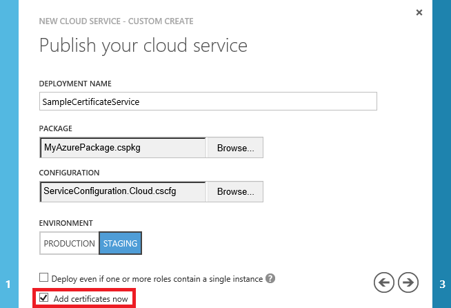
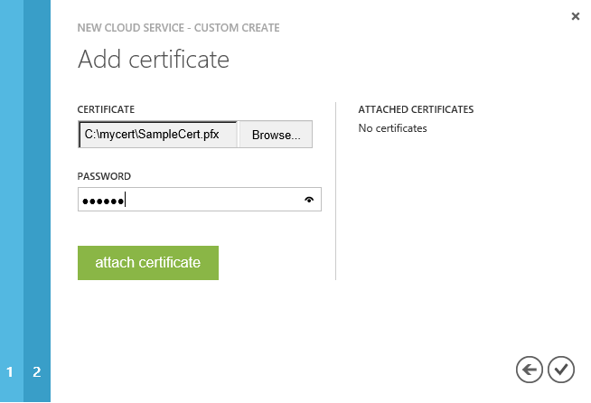
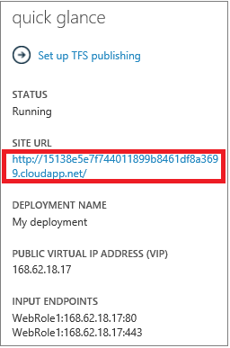
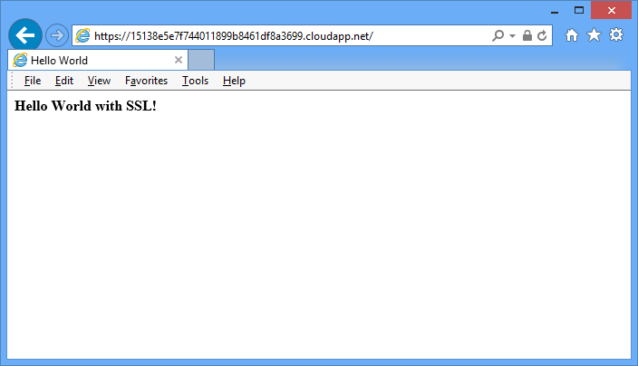

  <properties linkid="dev-net-commons-tasks-enable-ssl" urlDisplayName="Enable SSL" headerExpose="" pageTitle="Enable SSL - .NET - Develop" metaKeywords="Azure SSL, Azure HTTPS, Windows Azure SSL, Windows Azure HTTPS, .NET Azure SSL, .NET Azure HTTPS, C# Azure SSL, C# Azure HTTPS, VB Azure SSL, VB Azure HTTPS" footerExpose="" metaDescription="Learn how to specify an HTTPS endpoint for a web role and how to upload an SSL certificate to secure your application." umbracoNaviHide="0" disqusComments="1" />
  <h1>Configuring SSL for an Application in Windows Azure</h1>
  
Secure Socket Layer (SSL) encryption is the most commonly used method of securing data sent across the internet. This common task discusses how to specify an HTTPS endpoint for a web role and how to upload an SSL certificate to secure your application.

  
This task includes the following steps:

  <ul>
    <li>
      <a href="#step1">Step 1: Get an SSL Certificate</a>
    </li>
    <li>
      <a href="#step2">Step 2: Modify the Service Definition and Configuration Files</a>
    </li>
    <li>
      <a href="#step3">Step 3: Upload the Deployment Package and Certificate</a>
    </li>
    <li>
      <a href="#step4">Step 4: Connect to the Role Instance by Using HTTPS</a>
    </li>
  </ul>
  
  <h2>Step 1: Get an SSL Certificate</h2>
  
To configure SSL for an application, you first need to get an SSL certificate that has been signed by a Certificate Authority (CA), a trusted third-party who issues certificates for this purpose. If you do not already have one, you will need to obtain one from a company that sells SSL certificates.

  
The certificate must meet the following requirements for SSL certificates in Windows Azure:

  <ul>
    <li>The certificate must contain a private key.</li>
    <li>The certificate must be created for key exchange (.pfx file).</li>
    <li>The certificate's subject name must match the domain used to access the hosted service. You cannot acquire an SSL certificate for the cloudapp.net domain, so the certificate's subject name must match the custom domain name used to access your application.</li>
    <li>The certificate must use a minimum of 2048-bit encryption.</li>
  </ul>
  
For test purposes, you can create and use a self-signed certificate. For details about how to create a self-signed certificate using IIS Manager, See <a href="http://msdn.microsoft.com/en-us/library/windowsazure/gg432987.aspx">How to Create a Certificate for a Role</a>.

  
Next, you must include information about the certificate in your service definition and service configuration files.

  
  <h2>Step 2: Modify the Service Definition and Configuration Files</h2>
  
Your application must be configured to use the certificate, and an HTTPS endpoint must be added. As a result, the service definition and service configuration files need to be updated.

  <ol>
    <li>
      
In your development environment, open the service definition file (CSDEF), add a <strong>Certificates</strong> section within the <strong>WebRole</strong> section, and include the following information about the certificate:

      <pre class="prettyprint">&lt;WebRole name="CertificateTesting" vmsize="Small"&gt;
...
    &lt;Certificates&gt;
        &lt;Certificate name="SampleCertificate" storeLocation="LocalMachine" 
            storeName="CA" /&gt;
    &lt;/Certificates&gt;
...
&lt;/WebRole&gt;
</pre>
      
The <strong>Certificates</strong> section defines the name of our certificate, its location, and the name of the store where it is located. We have chosen to store the certificate in the CA (Certificate Authority) store, but you can choose other options as well. See <a href="http://msdn.microsoft.com/en-us/library/windowsazure/gg465718.aspx">How to Associate a Certificate with a Service</a> for more information.

    </li>
    <li>
      
In your service definition file, add an <strong>InputEndpoint</strong> element within the <strong>Endpoints</strong> section to enable HTTPS:

      <pre class="prettyprint">&lt;WebRole name="CertificateTesting" vmsize="Small"&gt;
...
    &lt;Endpoints&gt;
        &lt;InputEndpoint name="HttpsIn" protocol="https" port="443" 
            certificate="SampleCertificate" /&gt;
    &lt;/Endpoints&gt;
...
&lt;/WebRole&gt;
</pre>
    </li>
    <li>
      
In your service definition file, add a <strong>Binding</strong> element within the <strong>Sites</strong> section. This adds an HTTPS binding to map the endpoint to your site:

      <pre class="prettyprint">&lt;WebRole name="CertificateTesting" vmsize="Small"&gt;
...
    &lt;Sites&gt;
        &lt;Site name="Web"&gt;
            &lt;Bindings&gt;
                &lt;Binding name="HttpsIn" endpointName="HttpsIn" /&gt;
            &lt;/Bindings&gt;
        &lt;/Site&gt;
    &lt;/Sites&gt;
...
&lt;/WebRole&gt;
</pre>
      
All of the required changes to the service definition file have been completed, but you still need to add the certificate information to the service configuration file.

    </li>
    <li>
      
In your service configuration file (CSCFG), add a <strong>Certificates</strong> section within the <strong>Role</strong> section, replacing the sample thumbprint value below with that of your certificate:

      <pre class="prettyprint">&lt;Role name="Deployment"&gt;
...
    &lt;Certificates&gt;
        &lt;Certificate name="SampleCertificate" 
            thumbprint="9427befa18ec6865a9ebdc79d4c38de50e6316ff" 
            thumbprintAlgorithm="sha1" /&gt;
    &lt;/Certificates&gt;
...
&lt;/Role&gt;
</pre>
    </li>
  </ol>
  
Now that the service definition and service configuration files have been updated, package your deployment for uploading to Windows Azure. If you are using <strong>cspack</strong>, ensure that you don't use the <strong>/generateConfigurationFile</strong> flag, as that will overwrite the certificate information you just inserted.

  
  <h2>Step 3: Upload the Deployment Package and Certificate</h2>
  
Your deployment package has been updated to use the certificate, and an HTTPS endpoint has been added. Now you can upload the package and certificate to Windows Azure with the Management Portal.

  <ol>
    <li>
      
Log into the <a href="http://windows.azure.com">Windows Azure Management Portal</a>, and go to the Hosted Services section. Click <strong>New Hosted Service</strong>, add the required information about your hosted service, and then click <strong>Add Certificate</strong>.  

    </li>
    <li>
      
In <strong>Upload Certificates</strong>, enter the location for the SSL certificate .pfx file, the password for the certificate, and click <strong>OK</strong>. 

    </li>
    <li>
      
Click <strong>OK</strong> to create your hosted service. When the deployment has reached the <strong>Ready</strong> status, you can proceed to the next steps.

    </li>
  </ol>
  
  <h2>Step 4: Connect to the Role Instance by Using HTTPS</h2>
  
Now that your deployment is up and running in Windows Azure, you can connect to it using HTTPS.

  <ol>
    <li>
      
In the Management Portal, select your deployment, then right-click on the DNS name link in the <strong>Properties</strong> pane and choose <strong>Copy</strong>. 

    </li>
    <li>
      
Paste the address in a web browser, but make sure that it starts with <strong>https</strong> instead of <strong>http</strong>, and then visit the page.

      
Your browser displays the address in green to indicate that it's using an HTTPS connection. This also indicates that your application has been configured correctly for SSL.

      

        <strong>Note:</strong> If you are using a self-signed certificate, when you browse to an HTTPS endpoint that's associated with the self-signed certificate you will see a certificate error in the browser. Using a certificate signed by a certification authority will eliminate this problem; in the meantime, you can ignore the error.

      
    </li>
  </ol>
  <h2>Additional Resources</h2>
  

    <a href="http://msdn.microsoft.com/en-us/library/windowsazure/gg465718.aspx">How to Associate a Certificate with a Service</a>
  

  

    <a href="http://msdn.microsoft.com/en-us/library/windowsazure/ff795779.aspx">How to Configure an SSL Certificate on an HTTPS Endpoint</a>
  
