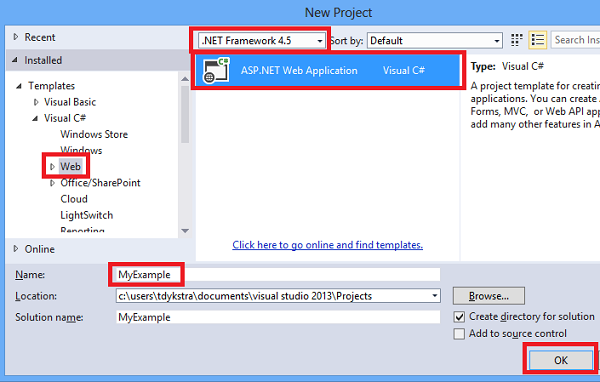

<properties linkid="dev-net-tutorials-web-app-with-sql-azure-vs2013" urlDisplayName="Web Site with SQL Database" pageTitle="Deploy a Secure ASP.NET MVC app with Membership, OAuth, and SQL Database to a Windows Azure Web Site" metaKeywords="Azure hello world tutorial, Azure getting started tutorial, SQL Database tutorial, Azure .NET hello world tutorial, Azure C# hello world tutorial, SQL Azure C# tutorial" description="Learn how to develop an ASP.NET MVC 5 web site with a SQL Database back-end deploy it to Windows Azure." metaCanonical="" services="," documentationCenter=".NET" title=" OAuth" authors=""  solutions="" writer="riande" manager="wpickett" editor="mollybos"  />

# Deploy a Secure ASP.NET MVC 5 app with Membership, OAuth, and SQL Database to a Windows Azure Web Site

***By [Rick Anderson](https://twitter.com/RickAndMSFT) and Tom Dykstra. Updated 18 October 2013.***
  

<a href="/en-us/develop/net/tutorials/web-site-with-sql-database/" title="Visual Studio 2013 class="current">Visual Studio 2013</a><a href="/en-us/develop/net/tutorials/web-site-with-sql-database-vs2012/" title="Visual Studio 2012">Visual Studio 2012</a>

This tutorial shows you how to build a secure ASP.NET MVC 5 web app that enables users to log in with credentials from Facebook or Google. You will also deploy the application to Windows Azure.

You can open a Windows Azure account for free, and if you don't already have Visual Studio 2013, the SDK automatically installs Visual Studio 2013 for Web Express. You can start developing for Windows Azure for free. If you want to use Visual Studio 2012, see the [previous tutorial](/en-us/develop/net/tutorials/web-site-with-sql-database-vs2012/). This version of the tutorial is far simpler than the previous version.

This tutorial assumes that you have no prior experience using Windows Azure. On completing this tutorial, you'll have a secure data-driven web application up and running in the cloud and using a cloud database.

You'll learn:

* How to create a secure ASP.NET MVC 5 project and publish it to a Windows Azure Web Site.
* How to use [OAuth](http://oauth.net/ "http://oauth.net/"), [OpenID](http://openid.net/) and the ASP.NET membership database to secure your application.
* How to use the new membership API to add users and roles.
* How to use a SQL database to store data in Windows Azure.

You'll build a simple contact list web application that is built on ASP.NET MVC 5 and uses the ADO.NET Entity Framework for database access. The following illustration shows the login page for the completed application:
  
![login page][rxb] 

<strong>Note</strong> To complete this tutorial, you need a Windows Azure account. If you don't have an account, you can create a free trial account in just a couple of minutes. For details, see <a href="http://www.windowsazure.com/en-us/pricing/free-trial/?WT.mc_id=A261C142F" target="_blank">Windows Azure Free Trial</a>.

In this tutorial:

- [Set up the development environment](#setupdevenv)
- [Set up the Windows Azure environment][setupwindowsazureenv]
- [Create an ASP.NET MVC 5 application][createapplication]
- [Deploy the application to Windows Azure][deployapp1]
- [Add a database to the application][adddb]
- [Add an OAuth Provider][]
- [Using the Membership API][]
- [Deploy the app to Windows Azure][deployapp11]
- [Next steps][]

<h2>Set up the Windows Azure environment</h2>

Next, set up the Windows Azure environment by creating a Windows Azure Web Site and a SQL database.

### Create a web site and a SQL database in Windows Azure

Your Windows Azure Web Site will run in a shared hosting environment, which means it runs on virtual machines (VMs) that are shared with other Windows Azure clients. A shared hosting environment is a low-cost way to get started in the cloud. Later, if your web traffic increases, the application can scale to meet the need by running on dedicated VMs. If you need a more complex architecture, you can migrate to a Windows Azure Cloud Service. Cloud services run on dedicated VMs that you can configure according to your needs.

Windows Azure SQL Database is a cloud-based relational database service that is built on SQL Server technologies. The tools and applications that work with SQL Server also work with SQL Database.

1. In the [Windows Azure Management Portal](https://manage.windowsazure.com), click **Web Sites** in the left tab, and then click  **New**.
  
![New button in Management Portal][rxWSnew] 

1. Click **Web Site**, and then click **Custom Create**. 
![Create with Database link in Management Portal][rxCreateWSwithDB]   
The **New Web Site - Custom Create** wizard opens.  

1. In the **Create Web Site** step of the wizard, enter a string in the **URL** box to use as the unique URL for your application. The complete URL will consist of what you enter here plus the suffix that you see next to the text box. The illustration shows a URL is that probably taken so you will have to choose a different one.  
![Create with Database link in Management Portal][rr1]  
1. In the **Database** drop-down list, choose **Create a free 20 MB SQL database**.
1. In the **Region** drop-down list, choose the same region you selected for the Web site.
This setting specifies which data center your VM will run in. 
1. In the **DB Connection String Name** box, leave the default value of *DefaultConnection*.
1. Click the arrow that points to the right at the bottom of the box.
The wizard advances to the **Specify database settings** step.
1. In the **Name** box, enter *ContactDB*. (see the image below). 
1. In the **Server** box, select **New SQL Database server**. (see the image below). Alternatively, if you previously created a SQL Server database, you can select that SQL Server from the dropdown control. 
1. Set the **Region** to the same area you created the Web Site.
1. Enter an administrator **Login Name** and **Password**. If you selected **New SQL Database server** you aren't entering an existing name and password here, you're entering a new name and password that you're defining now to use later when you access the database. If you selected a SQL Server you’ve created previously, you’ll be prompted for the password to the previous SQL Server account name you created. For this tutorial, we won't check the **Advanced** box.  For a free DB, you can only set the collation.
1. Click the check mark at the bottom right of the box to indicate you're finished.
![Database Settings step of New Web Site - Create with Database wizard][setup007] 
  The following image shows using an existing SQL Server and Login.
![Database Settings step of New Web Site - Create with Database wizard][rxPrevDB] 
The Management Portal returns to the Web Sites page, and the **Status** column shows that the site is being created. After a while (typically less than a minute), the **Status** column shows that the site was successfully created. In the navigation bar at the left, the number of sites you have in your account appears next to the **Web Sites** icon, and the number of databases appears next to the **SQL Databases** icon. 

<h2>Create an ASP.NET MVC 5 application</h2>

You have created a Windows Azure Web Site, but there is no content in it yet. Your next step is to create the Visual Studio web app that you'll publish to Windows Azure.

### Create the project

2. From the **File** menu, click **New Project**.

   

3. In the **New Project** dialog box, expand **C#** and select **Web** under **Installed Templates**, and then select **ASP.NET Web Application**.

4. Name the application **ContactManager** and click **OK**.

   
 
   **Note:** The image shows "MyExample" as the name, but make sure you enter "ContactManager". Code blocks that you'll be copying later assume that the project name is ContactManager. 

5. In the **New ASP.NET Project** dialog box, select the **MVC** template, and then click **Change Authentication**.

   

6. Keep the default **Individual User Accounts** in the **Change Authentication** dialog box. 

   The dialog explains that **Individual User Accounts** is for apps that store user profiles in a SQL database where users can register using their existing Facebook, Twitter and Google accounts. For information about the other authentication options, see [Creating ASP.NET Web Projects in Visual Studio 2013 - Authentication methods](http://www.asp.net/visual-studio/overview/2013/creating-web-projects-in-visual-studio#auth).

7. Click **OK**.

5. In the **New ASP.NET Project** dialog box, click **OK**.

     

### Set the page header and footer

1. In **Solution Explorer** open the *Layout.cshtml* file in the *Views\Shared* folder. 
	![_Layout.cshtml in Solution Explorer][newapp004]
1. Replace the two occurrences of "My ASP.NET MVC Application" with "Contact Manager".
1. Replace "Application name" with "CM Demo". 
2. Update the first Action link and replace *Home* with *Cm* to use the *Cm* Controller.
  

### Run the application locally

1. Press CTRL+F5 to run the application.
The application home page appears in the default browser. 

This is all you need to do for now to create the application that you'll deploy to Windows Azure. Later you'll add database functionality.

<h2>Deploy the application to Windows Azure</h2>

5. In Visual Studio, right-click the project in **Solution Explorer** and select **Publish** from the context menu. 

   
	
   The **Publish Web** wizard opens.

6. In the **Profile** tab of the **Publish Web** wizard, click **Import**. 

   ![Import publish settings][ImportPublishSettings]

   The **Import Publish Profile** dialog box appears.

5. Use one of the following methods to enable Visual Studio to connect to your Windows Azure account.

   
   

7. In the **Import Publish Profile** dialog box, select your web site from the drop-down list, and then click **OK**. 

1. In the **Publish Web** dialog box, click **Publish**.

	

	The application you created is now running in the cloud. The next time you deploy the application, only the changed (or new) files will be deployed.

<h2>Add a database to the application</h2>

Next, you'll update the MVC application to add the ability to display and update contacts and store the data in a database. The application will use the Entity Framework to create the database and to read and update data in the database.

### Add data model classes for the contacts

You begin by creating a simple data model in code.

1. In **Solution Explorer**, right-click the Models folder, click **Add**, and then **Class**. 

2. In the **Add New Item** dialog box, name the new class file *Contact.cs*, and then click **Add**. 
![Add New Item dialog box][adddb002]
3. Replace the contents of the Contacts.cs file with the following code.

        using System.ComponentModel.DataAnnotations;
        using System.Globalization;
        namespace ContactManager.Models
        {
            public class Contact
            {
                public int ContactId { get; set; }
                public string Name { get; set; }
                public string Address { get; set; }
                public string City { get; set; }
                public string State { get; set; }
                public string Zip { get; set; }
                [DataType(DataType.EmailAddress)]
                public string Email { get; set; }
            }
        }
The **Contacts** class defines the data that you will store for each contact, plus a primary key, *ContactID*, that is needed by the database.

### Create web pages that enable app users to work with the contacts

The ASP.NET MVC scaffolding feature can automatically generate code that performs create, read, update, and delete (CRUD) actions.

<h2>Add a Controller and a view for the data</h2>

1. Build the project **(Ctrl+Shift+B)**. (You must build the project before using the scaffolding mechanism.)  
1. In **Solution Explorer**, right-click the Controllers folder and click **Add**, and then click **Controller**. 
![Add Controller in Controllers folder context menu][addcode001] 
5. In the **Add Scaffold** dialog box, select **MVC 5 Controller with views, using EF** and then click **Add**.

5. In the **Add Controller** dialog box, enter "CmController" for the controller name. (See the image below.)
1. In the **Model class** dropdown box, select **Contact (ContactManager.Models)**.
1. In the **Data context class**, select **ApplicationDbContext (ContactManager.Models)**. The **ApplicationDbContext** will be used for both the membership DB and our contact data.  

1. Click **Add**.

   Visual Studio creates a controller methods and views for CRUD database operations for **Contact** objects.

## Enable Migrations, create the database, add sample data and a data initializer ##

The next task is to enable the [Code First Migrations](http://msdn.microsoft.com/library/hh770484.aspx) feature in order to create the database based on the data model you created.

1. In the **Tools** menu, select **Library Package Manager** and then **Package Manager Console**.
	 ![Package Manager Console in Tools menu][addcode008]
2. In the **Package Manager Console** window, enter the following command: 

		enable-migrations
  The **enable-migrations** command creates a *Migrations* folder, and it puts in that folder a *Configuration.cs* file that you can edit to seed the database and configure Migrations.  

2. In the **Package Manager Console** window, enter the following command: 

		add-migration Initial

	The **add-migration Initial** command generates a file named **&lt;date_stamp&gt;Initial** in the *Migrations* folder that creates the database. The first parameter ( **Initial** ) is arbitrary and is used to create the name of the file. You can see the new class files in **Solution Explorer**. 
	In the **Initial** class, the **Up** method creates the Contacts table, and the **Down** method (used when you want to return to the previous state) drops it. 
3. Open the *Migrations\Configuration.cs* file. 
4. Add the following namespace. 

    	 using ContactManager.Models;

5. Replace the *Seed* method with the following code:

        protected override void Seed(ContactManager.Models.ApplicationDbContext context)
        {
            context.Contacts.AddOrUpdate(p => p.Name,
               new Contact
               {
                   Name = "Debra Garcia",
                   Address = "1234 Main St",
                   City = "Redmond",
                   State = "WA",
                   Zip = "10999",
                   Email = "debra@example.com",
               },
                new Contact
                {
                    Name = "Thorsten Weinrich",
                    Address = "5678 1st Ave W",
                    City = "Redmond",
                    State = "WA",
                    Zip = "10999",
                    Email = "thorsten@example.com",
                },
                new Contact
                {
                    Name = "Yuhong Li",
                    Address = "9012 State st",
                    City = "Redmond",
                    State = "WA",
                    Zip = "10999",
                    Email = "yuhong@example.com",
                },
                new Contact
                {
                    Name = "Jon Orton",
                    Address = "3456 Maple St",
                    City = "Redmond",
                    State = "WA",
                    Zip = "10999",
                    Email = "jon@example.com",
                },
                new Contact
                {
                    Name = "Diliana Alexieva-Bosseva",
                    Address = "7890 2nd Ave E",
                    City = "Redmond",
                    State = "WA",
                    Zip = "10999",
                    Email = "diliana@example.com",
                }
                );
        }

	This code initializes (seeds) the database with the contact information. For more information on seeding the database, see [Seeding and Debugging Entity Framework (EF) DBs](http://blogs.msdn.com/b/rickandy/archive/2013/02/12/seeding-and-debugging-entity-framework-ef-dbs.aspx).

6. In the **Package Manager Console** enter the command:

		update-database

	![Package Manager Console commands][addcode009]

	The **update-database** runs the first migration which creates the database. By default, the database is created as a SQL Server Express LocalDB database. 

7. Press CTRL+F5 to run the application, and then click the **CM Demo** link; or navigate to http://localhost:(port#)/Cm. 

The application shows the seed data and provides edit, details and delete links. You can create, edit, delete and view data.

 ![MVC view of data][rx2]

<h2>OAuthAdd an OAuth2 And OpenID Provider</h2>

[OAuth](http://oauth.net/ "http://oauth.net/") is an open protocol that allows secure authorization in a simple and standard method from web, mobile, and desktop applications. The ASP.NET MVC internet template uses OAuth and [OpenID](http://openid.net/) to expose Facebook, Twitter, Google and Microsoft as authentication providers. Although this tutorial uses only Google as the authentication provider, you can easily modify the code to use any of the providers. The steps to implement other providers are very similar to the steps you will see in this tutorial. To use Facebook as an authentication provider, see my tutorial [Create an ASP.NET MVC 5 App with Facebook and Google OAuth2 and OpenID Sign-on](http://www.asp.net/mvc/tutorials/mvc-5/create-an-aspnet-mvc-5-app-with-facebook-and-google-oauth2-and-openid-sign-on).

In addition to authentication, the tutorial will also use roles to implement authorization. Only those users you add to the *canEdit* role will be able to change data (that is, create, edit, or delete contacts).

1. Open the *App_Start\Startup.Auth.cs* file. Remove the comment characters from the *app.UseGoogleAuthentication()* method.

1. Run the application and click  the **Log In** link. 
1. Under **Use another service to log in**, click the **Google** button. 
1. Enter your  credentials.
1. Click **Accept** to allow the application to access your email and basic information.
1. You are redirected to the Register page. You can change the **User name** if you like. Click **Register**.

<h2>Membership DBUsing the Membership API</h2>
In this section you will add a local user and the *canEdit* role to the membership database. Only those users in the *canEdit* role will be able to edit data. A best practice is to name roles by the actions they can perform, so *canEdit* is preferred over a role called *admin*. When your application evolves you can add new roles such as *canDeleteMembers* rather than the less descriptive *superAdmin*.

1. Open the *migrations\configuration.cs* file and add the following `using` statements:

        using Microsoft.AspNet.Identity;
        using Microsoft.AspNet.Identity.EntityFramework;

1. Add the following **AddUserAndRole** method to the class:

    
         bool AddUserAndRole(ContactManager.Models.ApplicationDbContext context)
         {
            IdentityResult ir;
            var rm = new RoleManager<IdentityRole>
                (new RoleStore<IdentityRole>(context));
            ir = rm.Create(new IdentityRole("canEdit"));
            var um = new UserManager<ApplicationUser>(
                new UserStore<ApplicationUser>(context));
            var user = new ApplicationUser()
            {
               UserName = "user1",
            };
            ir = um.Create(user, "Passw0rd1");
            if (ir.Succeeded == false)
               return ir.Succeeded;
            ir = um.AddToRole(user.Id, "canEdit");
            return ir.Succeeded;
         }

2. Call the new method from the **Seed** method:

        protected override void Seed(ContactManager.Models.ApplicationDbContext context)
        {
            AddUserAndRole(context);
            context.Contacts.AddOrUpdate(p => p.Name,
                // Code removed for brevity
        }

   This code creates a new role called *canEdit*, creates a new local user *user1*, and adds *user1* to the *canEdit* role. 

## Use Temporary Code to Add New Social Login Users to the canEdit Role  ##
In this section you will temporarily modify the **ExternalLoginConfirmation** method in the Account controller to add new users registering with an OAuth or OpenID provider to the *canEdit* role. We will temporarily modify the **ExternalLoginConfirmation** method to automatically add new users to an administrative role. Until we provide a tool to add and manage roles, we'll use the temporary automatic registration code below. We hope to provide a tool similar to [WSAT](http://msdn.microsoft.com/en-us/library/ms228053(v=vs.90).aspx) in the future which allow you to create and edit user accounts and roles. Later in the tutorial I'll show how you can use **Server Explorer** to add users to roles.  

1. Open the **Controllers\AccountController.cs** file and navigate to the **ExternalLoginConfirmation** method.
1. Add the following call to **AddToRoleAsync** just before the **SignInAsync** call.

                await UserManager.AddToRoleAsync(user.Id, "CanEdit");

   The code above adds the newly registered user to the "CanEdit" role, which gives them access to action methods that change (edit) data. An image of the code change is shown below:

   

Later in the tutorial you will deploy the application to Windows Azure, where you will log-on with Google or another third party authentication provider. This will add your newly registered account to the *canEdit* role. Anyone who finds your site's URL and has a Google ID can then register and update your database. To prevent other people from doing that, you can stop the site. You'll be able to verify who is in the *canEdit* role by examining the database.

In the **Package Manager Console** hit the up arrow key to bring up the following command:

		Update-Database

Run the  **Update-Database** command which will run the **Seed** method, and that will run the **AddUserAndRole** you just added. The **AddUserAndRole** will create the user *user1* and add her to the *canEdit* role.

## Protect the Application with SSL and the Authorize Attribute ##

In this section you will apply the [Authorize](http://msdn.microsoft.com/en-us/library/system.web.mvc.authorizeattribute(v=vs.100).aspx) attribute to restrict access to the action methods. Anonymous users will be able to view the **Index** action method of the home controller only. Registered users will be able to see contact data (The **Index** and **Details** pages of the Cm controller), the About, and the Contact pages. Only users in the *canEdit* role will be able to access action methods that change data.

1. Add the [Authorize](http://msdn.microsoft.com/en-us/library/system.web.mvc.authorizeattribute(v=vs.100).aspx) filter and the [RequireHttps](http://msdn.microsoft.com/en-us/library/system.web.mvc.requirehttpsattribute(v=vs.108).aspx) filter to the application. An alternative approach is to add the [Authorize](http://msdn.microsoft.com/en-us/library/system.web.mvc.authorizeattribute(v=vs.100).aspx) attribute and the [RequireHttps](http://msdn.microsoft.com/en-us/library/system.web.mvc.requirehttpsattribute(v=vs.108).aspx) attribute to each controller, but it's considered a security best practice to apply them to the entire application. By adding them globally, every new controller and action method you add will automatically be protected, you won't need to remember to apply them. For more information see [Securing your ASP.NET MVC  App and the new AllowAnonymous Attribute](http://blogs.msdn.com/b/rickandy/archive/2012/03/23/securing-your-asp-net-mvc-4-app-and-the-new-allowanonymous-attribute.aspx). Open the *App_Start\FilterConfig.cs* file and replace the *RegisterGlobalFilters* method with the following (which adds the two filters):

        public static void
        RegisterGlobalFilters(GlobalFilterCollection filters)
        {
            filters.Add(new HandleErrorAttribute());
            filters.Add(new System.Web.Mvc.AuthorizeAttribute());
            filters.Add(new RequireHttpsAttribute());
        }

   The [Authorize](http://msdn.microsoft.com/en-us/library/system.web.mvc.authorizeattribute(v=vs.100).aspx) filter applied in the code above will prevent anonymous users from accessing any methods in the application. You will use the [AllowAnonymous](http://blogs.msdn.com/b/rickandy/archive/2012/03/23/securing-your-asp-net-mvc-4-app-and-the-new-allowanonymous-attribute.aspx) attribute to opt out of the authorization requirement in a couple methods, so anonymous users can log in and can view the home page. The  [RequireHttps](http://msdn.microsoft.com/en-us/library/system.web.mvc.requirehttpsattribute(v=vs.108).aspx) will require all access to the web app be through HTTPS.

1. Add the [AllowAnonymous](http://blogs.msdn.com/b/rickandy/archive/2012/03/23/securing-your-asp-net-mvc-4-app-and-the-new-allowanonymous-attribute.aspx) attribute to the **Index** method of the Home controller. The [AllowAnonymous](http://blogs.msdn.com/b/rickandy/archive/2012/03/23/securing-your-asp-net-mvc-4-app-and-the-new-allowanonymous-attribute.aspx) attribute enables you to white-list the methods you want to opt out of authorization. A portion of the HomeController is shown below:	

         namespace ContactManager.Controllers
         {
            public class HomeController : Controller
            {
               [AllowAnonymous]
               public ActionResult Index()
               {
                  return View();
               }

2. Do a global search for *AllowAnonymous*, you can see it is used in the log in and registration methods of the Account controller.
1. In *CmController.cs*, add `[Authorize(Roles = "canEdit")]` to the HttpGet and HttpPost methods that change data (Create, Edit, Delete, every action method except Index and Details) in the *Cm* controller. A portion of the completed code is shown below: 

   

## Enable SSL for the Project ##

1. Enable SSL. In Solution Explorer, click the **ContactManager** project, then click F4 to bring up the properties dialog. Change **SSL Enabled** to true. Copy the **SSL URL**. The SSL URL will be https://localhost:44300/ unless you've previously created SSL Web Sites.
   ![enable SSL][rxSSL]
   
1. In Solution Explorer, right click the **Contact Manager** project and click **Properties**.
1. In the left tab, click **Web**.
1. Change the **Project Url** to use the **SSL URL** and save the page (Control S).
   
   
1. Press CTRL+F5 to run the application. The browser will display a certificate warning. For our application you can safely click on the link **Continue to this website**. 
   ![cert Warn][rxNOT]
 
   ![cert Warn][rxNOT2]
   
   The default browser shows the **Index** page of the home controller. 
1. If you are still logged in from a previous session, hit the **Log out** link.
1. Click on the **About** or **Contact** links. You will be redirected to the log in page because anonymous users cannot view those pages. 
1. Click the **Register** link and add a local user named *Joe*. Verify *Joe* can view the Home, About and Contact pages. 
1. Click the *CM Demo* link and verify you see the data. 
1. Click an edit link on the page, you will be redirected to the log in page (because a new local user is not added to the *canEdit* role).
1. Log in as *user1* with password of "Passw0rd1" (the "0" in "word" is a zero). You will be redirected to the edit page you previously selected. 

   If you can't log in with that account and password, try copying the password from the source code and pasting it. If you still can't log in, check the **AspNetUsers** table to verify *user1* was added. Later on in the tutorial I show how to check the **AspNetUsers** table.
1. Verify you can make data changes.

<h2>Deploy the app to Windows Azure</h2>

1. Build the application.
1. In Visual Studio, right-click the project in **Solution Explorer** and select **Publish** from the context menu. 
![Publish in project context menu][firsdeploy003] 
The **Publish Web** wizard opens.
1. Click the **Settings** tab. Click the **v** icon to select the **Remote connection string** for **ApplicationDbContext** and select **ContactDB**.

   (If you closed and re-opened Visual Studio after you created the publish profile, you might not see the connection string in the drop-down list. In that case, instead of editing the publish profile that you created earlier, create a new one the same way you did earlier, and then follow these steps on the **Settings** tab.)
  
1. Under **ContactManagerContext**, select **Execute Code First Migrations**.
  

1. Click **Publish**.
1. Log in as *user1* and verify you can edit data.
1. Log out.
2. Log in using Google or Facebook. That will add the Google or Facebook account to the **canEdit** role.

### Stop the web site to prevent other people from registering  

1. In **Server Explorer**, navigate to **Web Sites**.
4. Right click on each Web Site instance and select **Stop Web Site**. 
  
   
Alternatively, from the Windows Azure management portal, you can select the web site, then click the **stop** icon at the bottom of the page.
  

### Remove AddToRoleAsync, Publish, and Test

1. Remove the following code from the **ExternalLoginConfirmation** method in the Account controller:  
                `await UserManager.AddToRoleAsync(user.Id, "CanEdit");`
1. Build the project (which saves the file changes and verify you don't have any compile errors).
5. Right-click the project in **Solution Explorer** and select **Publish**. 

	   
	
4. Click the **Start Preview** button. Only the files that need to be updated are deployed.
5. Start the Web Site. The easiest way to do this is from the Portal. **You won't be able to publish while the web site is stopped**.
5. Go back to Visual Studio and click **Publish**.
3. Your Windows Azure App opens up in your default browser. You are viewing the home page as an anonymous user.  
4. Click the **About** link. You'll be redirected to the Log in page.
5. Click the **Register** link on the Log in page and create local account. We will use this local account to verify you can access the read only pages but you cannot access pages that change data (which are protected by the *canEdit* role). Later on in the tutorial we will remove local account access. 
<!--
1. Log out of the local user account and log in with the Google account you previously registered with. Verify you can edit data. 
-->
  

  
1. Verify you can navigate to the *About* and *Contact* pages.
  

  
1. Click the **CM Demo** link to navigate to the **Cm** controller. Alternatively, you can append *Cm* to the URL. 
  

   
1. Click an Edit link. You will be redirected to the log in page. Under **Use another service to log in**, Click Google or Facebook and log in with the account you previously registered.
2. Verify you can edit data while logged into that account.
  **Note:** You cannot log out of Google from this app and log into a different google account with the same browser. If you are using one browser, you will have to navigate to Google and log out. You can log on with another account from the same third party authenticator (such as Google) by using a different browser.

## Examine the SQL Azure DB ##

1. In **Server Explorer**, navigate to the **ContactDB**
2. Right click on **ContactDB** and select **Open in SQL Server Object Explorer**.
   

   
**Note:** If you can't expand **SQL Databases** and *can't* see the **ContactDB** from Visual Studio, you will have to follow the instructions below to open a firewall port or a range of ports. Follow the instructions under **Adding a Range of Allowed IP Addresses** and **Connecting to a SQL Azure Database from SSOX**. You may have to wait for a few minutes to access the database after adding the firewall rule.
  
1. Right click on the **AspNetUsers** table and select **View Data**.
  

   
1. Note the Id from the Google account you registered with to be in the **canEdit** role, and the Id of *user1*. These should be the only users in the **canEdit** role. (You'll verify that in the next step.)
  

   
2. In **SQL Server Object Explorer**, right click on **AspNetUserRoles** and select **View Data**.
  

   
Verify the **UserId**s are from *user1* and the Google account you registered. 

## Cannot open server login error ##

Follow the steps in this section only if you get an error dialog stating "Cannot open server".
  ![firewall error][rx5]  

You will need to add your IP address to the allowed IPs.

1. In the Windows Azure Portal, Select **SQL Databases** in the left tab.
   ![Select SQL][rx6]  
1. Select the database you wish to open.
1. Click the **Set up Windows Azure firewall rules for this IP address** link.
   ![firewall rules][rx7]  
1. When you are prompted with "The current IP address xxx.xxx.xxx.xxx is not included in existing firewall rules. Do you want to update the firewall rules?", click **Yes**. Adding this address is often not enough behind some corporate firewalls, you will need to add a range of IP addresses.

The next step is to add a range of allowed IP addresses.

1. In the Windows Azure Portal, Click **SQL Databases**.
1. Click the **Server** hosting your Database.
  ![db server][rx8]  
1. Click the **Configure** link on the top of the page.
1. Add a rule name, starting and ending IP addresses.
 ![ip range][rx9]  
1. At the bottom of the page, click **Save**.
1. Please leave feedback and let me know if you needed to add a range of IP address to connect.

Finally, you can connect to the SQL Database instance from SSOX

1. From the View menu, click **SQL Server Object Explorer**.
1. Right click **SQL Server** and select **Add SQL Server**.
1. In the **Connect to Server** dialog box, set the **Authentication** to **SQL Server Authentication**. You will get the **Server name** and **Login** from the Windows Azure Portal.
1. In your browser, navigate to the portal and select **SQL Databases**.
1. Select the **ContactDB**, and then click **View SQL Database connection strings**.
1. From the **Connection Strings** page, copy the **Server**  and **User ID**. 
1. Past the **Server** and **User ID** values into the **Connect to Server** dialog in Visual Studio. The **User ID** value goes into the **Login** entry. Enter the password you used to create the SQL DB.

You can now navigate to the Contact DB using the instructions given earlier.

## To Add a User to the canEdit Role by editing database tables

Earlier in the tutorial you used code to add users to the canEdit role. An alternative method is to directly manipulate the data in the membership tables. The following steps show how to use this alternate method to add a user to a role.

2. In **SQL Server Object Explorer**, right click on **AspNetUserRoles** and select **View Data**.
  

  
1. Copy the *RoleId* and paste it into the empty (new) row.

  
2. In the **AspNetUsers** table find the user you want to put in the role, and copy the  user's *Id*, and then paste it into the **UserId** column of the **AspNetUserRoles** table.

We are working on a tool that will make managing users and roles much easier.

## Local Registration Considerations ##

The current  ASP.NET membership registration in the project does not provide support for password resets and it does not verify that a human is registering (for example with a [CAPTCHA](http://www.asp.net/web-pages/tutorials/security/16-adding-security-and-membership)). Once a user is authenticated using one of the third party providers, they can register. If you choose to disable local registration, follow these steps:
 

1. In the AccountController, remove the *[AllowAnonymous]* attribute from the GET and POST *Register* methods. This will prevent bots and anonymous users from registering.
1. In the *Views\Shared* folder, *_LoginPartial.cshtml* file, remove the Register action link.
2. In the *Views\Account\Login.cshtml* file, remove the Register action link.
2. Deploy the app.

<h2>Next stepsNext steps</h2>

Follow my tutorial [Create an ASP.NET MVC 5 App with Facebook and Google OAuth2 and OpenID Sign-on](http://www.asp.net/mvc/tutorials/mvc-5/create-an-aspnet-mvc-5-app-with-facebook-and-google-oauth2-and-openid-sign-on ) for instructions on how to add profile data to the user registration DB and for detailed instructions on using Facebook as an authentication provider.

 
A good place to learn more about ASP.NET MVC is my [Getting Started with ASP.NET MVC 5](http://www.asp.net/mvc/tutorials/mvc-5/introduction/getting-started) tutorial. Tom Dykstra's excellent [Getting Started with EF and MVC](http://www.asp.net/mvc/tutorials/getting-started-with-ef-using-mvc/creating-an-entity-framework-data-model-for-an-asp-net-mvc-application) will show you more advanced EF programming.

This tutorial and the sample application was written by [Rick Anderson](http://blogs.msdn.com/b/rickandy/) (Twitter [@RickAndMSFT](https://twitter.com/RickAndMSFT)) with assistance from Tom Dykstra and Barry Dorrans (Twitter [@blowdart](https://twitter.com/blowdart)). 

Please leave feedback on what you liked or what you would like to see improved, not only about the tutorial itself but also about the products that it demonstrates. Your feedback will help us prioritize improvements. 

<!--
To get the colorful Facebook, Google and Yahoo log on buttons, see the blog post [Customizing External Login Buttons in ASP.NET MVC 5](http://www.beabigrockstar.com/customizing-external-login-buttons-in-asp-net-mvc-4/). 
 -->
<!-- bookmarks -->
[Add an OAuth Provider]: #addOauth
[Using the Membership API]:#mbrDB
[Create a Data Deployment Script]:#ppd
[Update the Membership Database]:#ppd2
[setupdbenv]: #bkmk_setupdevenv
[setupwindowsazureenv]: #bkmk_setupwindowsazure
[createapplication]: #bkmk_createmvc4app
[deployapp1]: #bkmk_deploytowindowsazure1
[deployapp11]: #bkmk_deploytowindowsazure11
[adddb]: #bkmk_addadatabase
[addcontroller]: #bkmk_addcontroller
[addwebapi]: #bkmk_addwebapi
[deploy2]: #bkmk_deploydatabaseupdate

<!-- links -->
[WTEInstall]: http://go.microsoft.com/fwlink/?LinkID=208120
[MVC4Install_20012]: http://go.microsoft.com/fwlink/?LinkID=275131
[VS2012ExpressForWebInstall]: http://www.microsoft.com/web/gallery/install.aspx?appid=VWD11_BETA&prerelease=true
[windowsazure.com]: http://www.windowsazure.com
[WindowsAzureDataStorageOfferings]: http://social.technet.microsoft.com/wiki/contents/articles/data-storage-offerings-on-the-windows-azure-platform.aspx
[GoodFitForAzure]: http://msdn.microsoft.com/en-us/library/windowsazure/hh694036(v=vs.103).aspx
[NetAppWithSQLAzure]: http://www.windowsazure.com/en-us/develop/net/net-app-with-sql-azure
[MultiTierApp]: http://www.windowsazure.com/en-us/develop/net/tutorials/multi-tier-application/
[HybridApp]: http://www.windowsazure.com/en-us/develop/net/tutorials/hybrid-solution/
[SQLAzureHowTo]: https://www.windowsazure.com/en-us/develop/net/how-to-guides/sql-azure/
[SQLAzureDataMigration]: http://msdn.microsoft.com/en-us/library/windowsazure/hh694043(v=vs.103).aspx
[ASP.NETFormsAuth]: http://msdn.microsoft.com/en-us/library/windowsazure/hh508993.aspx
[CommonTasks]: http://windowsazure.com/develop/net/common-tasks/
[TSQLReference]: http://msdn.microsoft.com/en-us/library/windowsazure/ee336281.aspx
[SQLAzureGuidelines]: http://msdn.microsoft.com/en-us/library/windowsazure/ee336245.aspx
[SQLAzureDataMigrationBlog]: http://blogs.msdn.com/b/ssdt/archive/2012/04/19/migrating-a-database-to-sql-azure-using-ssdt.aspx
[SQLAzureConnPoolErrors]: http://blogs.msdn.com/b/adonet/archive/2011/11/05/minimizing-connection-pool-errors-in-sql-azure.aspx
[UniversalProviders]: http://nuget.org/packages/System.Web.Providers
[EFCodeFirstMVCTutorial]: http://www.asp.net/mvc/tutorials/getting-started-with-ef-using-mvc/creating-an-entity-framework-data-model-for-an-asp-net-mvc-application
[EFCFMigrations]: http://msdn.microsoft.com/en-us/library/hh770484

<!-- links from Tom's hopefully no collisions -->
[windowsazure.com]: http://www.windowsazure.com
[WindowsAzureDataStorageOfferings]: http://social.technet.microsoft.com/wiki/contents/articles/data-storage-offerings-on-the-windows-azure-platform.aspx
[GoodFitForAzure]: http://msdn.microsoft.com/en-us/library/windowsazure/hh694036(v=vs.103).aspx
[NetAppWithSQLAzure]: http://www.windowsazure.com/en-us/develop/net/tutorials/cloud-service-with-sql-database/
[MultiTierApp]: http://www.windowsazure.com/en-us/develop/net/tutorials/multi-tier-application/
[HybridApp]: http://www.windowsazure.com/en-us/develop/net/tutorials/hybrid-solution/
[SQLAzureHowTo]: https://www.windowsazure.com/en-us/develop/net/how-to-guides/sql-azure/
[SQLAzureDataMigration]: http://msdn.microsoft.com/en-us/library/windowsazure/hh694043(v=vs.103).aspx
[ASP.NETFormsAuth]: http://msdn.microsoft.com/en-us/library/windowsazure/hh508993.aspx
[CommonTasks]: http://www.windowsazure.com/en-us/develop/net/common-tasks/
[TSQLReference]: http://msdn.microsoft.com/en-us/library/windowsazure/ee336281.aspx
[SQLAzureGuidelines]: http://msdn.microsoft.com/en-us/library/windowsazure/ee336245.aspx
[MigratingDataCentricApps]: http://msdn.microsoft.com/en-us/library/jj156154.aspx
[SQLAzureDataMigrationBlog]: http://blogs.msdn.com/b/ssdt/archive/2012/04/19/migrating-a-database-to-sql-azure-using-ssdt.aspx
[SQLAzureConnPoolErrors]: http://blogs.msdn.com/b/adonet/archive/2011/11/05/minimizing-connection-pool-errors-in-sql-azure.aspx
[UniversalProviders]: http://nuget.org/packages/Microsoft.AspNet.Providers
[UniversalProvidersLocalDB]: http://nuget.org/packages/Microsoft.AspNet.Providers.LocalDB
[EFCodeFirstMVCTutorial]: http://www.asp.net/mvc/tutorials/getting-started-with-ef-using-mvc/creating-an-entity-framework-data-model-for-an-asp-net-mvc-application
[EFCFMigrations]: http://msdn.microsoft.com/en-us/library/hh770484
[DevelopingWebAppsWithWindowsAzure]: http://msdn.microsoft.com/en-us/library/Hh674484

<!-- images-->
[rxE]: ../Media/rxE.png
[rx2]: ../Media/rx2.png
[rxP]: ../Media/rxP.png
[rx22]: ../Media/rx22.png
[rxFBapp]: ../Media/rxFBapp.png
[rxFB]: ../Media/rxFB.png
[rxFBt]: ../Media/rxFBt.png
[rxSTD]: ../Media/rxSTD.png
[rxUid]: ../Media/rxUid.png
[rxRoleID]: ../Media/rxRoleID.png
[rxUR]: ../Media/rxUR.png
[rxC2S]: ../Media/rxC2S.png
[rxGenScripts]: ../Media/rxGenScripts.png
[rx11]: ../Media/rx11.png
[rxAdv]: ../Media/rxAdv.png
[rx1]: ../Media/rx1.png
[rxd]: ../Media/rxd.png
[rxSettings]: ../Media/rxSettings.png
[rxD2]: ../Media/rxD2.png
[rxAddSQL2]: ../Media/rxAddSQL2.png
[rxc]: ../Media/rxc.png
[rx3]: ../Media/rx3.png
[rx4]: ../Media/rx4.png
[rx5]: ../Media/rx5.png
[rx6]: ../Media/rx6.png
[rx7]: ../Media/rx7.png
[rx8]: ../Media/rx8.png
[rx9]: ../Media/rx9.png
[rxa]: ../Media/rxa.png
[rxb]: ../Media/rxb.png
[rxSS]: ../Media/rxSS.png
[rxp2]: ../Media/rxp2.png
[rxp3]: ../Media/rxp3.png
[rxSSL]: ../Media/rxSSL.png
[rxS2]: ../Media/rxS2.png
[rxNOT]: ../Media/rxNOT.png
[rxNOT2]: ../Media/rxNOT2.png
[rxb2]: ../Media/rxb2.png
[rxNOT]: ../Media/rxNOT.png
[rxNOT]: ../Media/rxNOT.png
[rxNOT]: ../Media/rxNOT.png
[rr1]: ../Media/rr1.png
[rxNewCtx]: ../Media/rxNewCtx.png
[rxCreateWSwithDB_2]: ../Media/rxCreateWSwithDB_2.png 
[rxPrevDB]: ../Media/rxPrevDB.png
[rxOverwrite]: ../Media/rxOverwrite.png
[rxWebConfig]: ../Media/rxWebConfig.png
[rxPWS]: ../Media/rxPWS.png
[rxNewCtx]: ../Media/rxNewCtx.png
[rxAddApiController]: ../Media/rxAddApiController.png
[rxFFchrome]: ../Media/rxFFchrome.png
[rxSettings]: ../Media/rxSettings.png
[intro001]: ../Media/dntutmobil-intro-finished-web-app.png
[setup001]: ../Media/dntutmobile-setup-run-sdk-setup-exe.png
[setup002]: ../Media/dntutmobile-setup-web-pi.png
[setup003]: ../Media/dntutmobile-setup-azure-account-1.png
[rxWSnew]: ../Media/rxWSnew2.png
[rxCreateWSwithDB]: ../Media/rxCreateWSwithDB.png
[setup006]: ../Media/dntutmobile-setup-azure-site-003.png
[setup007]: ../Media/dntutmobile-setup-azure-site-004.png
[setup008]: ../Media/dntutmobile-setup-azure-site-005.png
[setup009]: ../Media/dntutmobile-setup-azure-site-006.png
[newapp001]: ../Media/dntutmobile-createapp-001.png
[newapp002]: ../Media/dntutmobile-createapp-002.png
[newapp003]: ../Media/dntutmobile-createapp-003.png
[newapp004]: ../Media/dntutmobile-createapp-004.png
[newapp004.1]: ../Media/dntutmobile-createapp-004.1.png
[newapp004.2]: ../Media/dntutmobile-createapp-004.2.png
[newapp005]: ../Media/newapp005.png
[firsdeploy001]: ../Media/dntutmobile-deploy1-download-profile.png
[firsdeploy002]: ../Media/dntutmobile-deploy1-save-profile.png
[firsdeploy003]: ../Media/dntutmobile-deploy1-publish-001.png
[firsdeploy004]: ../Media/dntutmobile-deploy1-publish-002.png
[firsdeploy005]: ../Media/dntutmobile-deploy1-publish-003.png
[firsdeploy006]: ../Media/dntutmobile-deploy1-publish-004.png
[firsdeploy007]: ../Media/dntutmobile-deploy1-publish-005.png
[firsdeploy008]: ../Media/dntutmobile-deploy1-publish-006.png
[firsdeploy009]: ../Media/dntutmobile-deploy1-publish-007.png
[adddb001]: ../Media/dntutmobile-adddatabase-001.png
[adddb002]: ../Media/dntutmobile-adddatabase-002.png
[addcode001]: ../Media/dntutmobile-controller-add-context-menu.png
[addcode002]: ../Media/dntutmobile-controller-add-controller-dialog.png
[addcode002.1]: ../Media/dntutmobile-controller-002.1.png
[addcode003]: ../Media/dntutmobile-controller-add-controller-override-dialog.png
[addcode003.1]: ../Media/dntutmobile-controller-explorer-globalasas-file.png
[addcode004]: ../Media/dntutmobile-controller-modify-index-context.png
[addcode005]: ../Media/dntutmobile-controller-add-contents-context-menu.png
[addcode006]: ../Media/dntutmobile-controller-add-new-item-style-sheet.png
[addcode007]: ../Media/dntutmobile-controller-modify-bundleconfig-context.png
[addcode008]: ../Media/dntutmobile-migrations-package-manager-menu.png
[addcode009]: ../Media/dntutmobile-migrations-package-manager-console.png
[addwebapi001]: ../Media/dntutmobile-webapi-add-folder-context-menu.png
[addwebapi002]: ../Media/dntutmobile-webapi-add-controller-context-menu.png
[addwebapi003]: ../Media/dntutmobile-webapi-add-controller-dialog.png
[addwebapi004]: ../Media/dntutmobile-webapi-added-contact.png
[addwebapi005]: ../Media/dntutmobile-webapi-new-browser.png
[addwebapi006]: ../Media/dntutmobile-webapi-save-returned-contacts.png
[addwebapi007]: ../Media/dntutmobile-webapi-contacts-in-notepad.png
[lastdeploy001]: ../Media/dntutmobile-web-publish-settings.png
[rxf]: ../Media/rxf.png
[Important information about ASP.NET in Windows Azure Web Sites]: #aspnetwindowsazureinfo
[Next steps]: #nextsteps

[DeployedWebSite]: ../Media/DeployedWebSite.png
[DownloadPublishProfile]: ../Media/DownloadPublishProfile.png
[ImportPublishSettings]: ../Media/ImportPublishSettings.png
[ImportPublishProfile]: ../Media/ImportPublishProfile.png
[InternetAppTemplate]: ../Media/InternetAppTemplate.png
[NewMVC4WebApp]: ../Media/NewMVC4WebApp.png
[NewVSProject]: ../Media/NewVSProject.png
[PublishOutput]: ../Media/PublishOutput.png
[PublishVSSolution]: ../Media/PublishVSSolution.png
[PublishWebSettingsTab]: ../Media/PublishWebSettingsTab.png
[PublishWebStartPreview]: ../Media/PublishWebStartPreview.png
[PublishWebStartPreviewOutput]: ../Media/PublishWebStartPreviewOutput.png
[SavePublishSettings]: ../Media/SavePublishSettings.png
[ValidateConnection]: ../Media/ValidateConnection.png
[ValidateConnectionSuccess]: ../Media/ValidateConnectionSuccess.png
[WebPIAzureSdk20NetVS12]: ../Media/WebPIAzureSdk20NetVS12.png
[WebSiteNew]: ../Media/WebSiteNew.png
[WebSiteStatusRunning]: ../Media/WebSiteStatusRunning.png

[WebPIAzureSdk20NetVS12]: ../Media/WebPIAzureSdk20NetVS12.png
[rzAddWAsub]: ../Media/rzAddWAsub.png
[rzDownLoad]: ../Media/rzDownLoad.png
[rzDown2]: ../Media/rzDown2.png
[rzImp]: ../Media/rzImp.png

