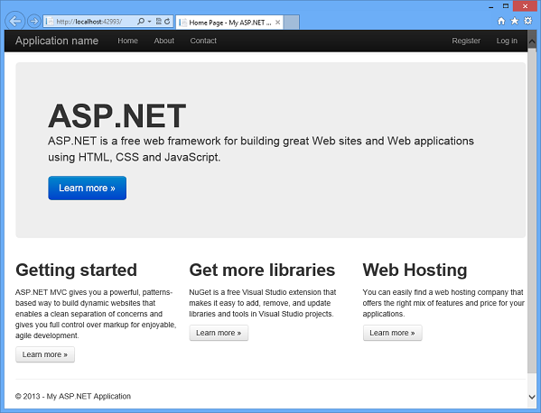
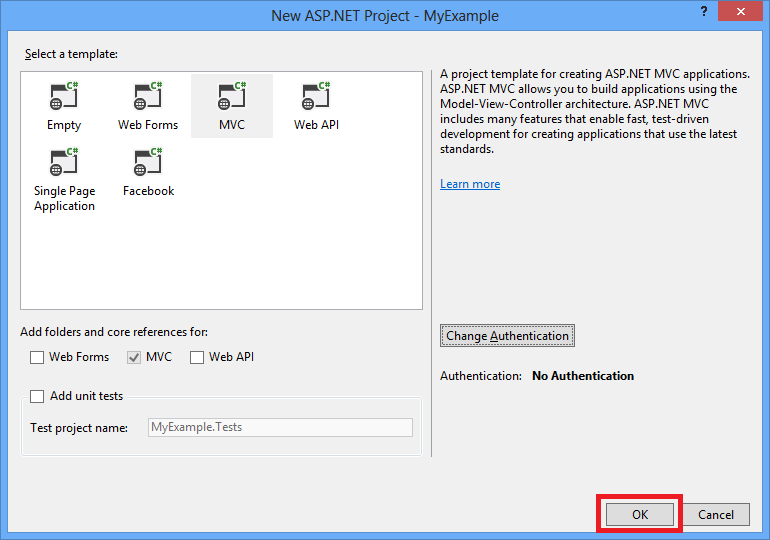
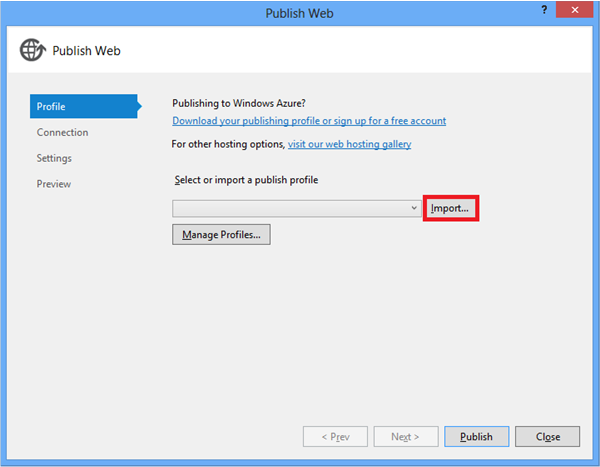
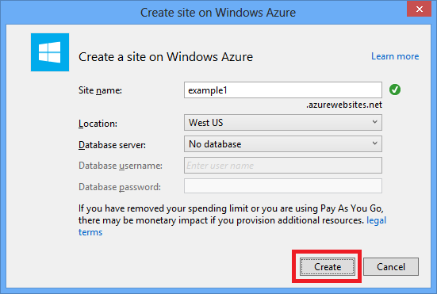
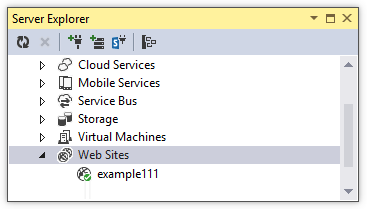
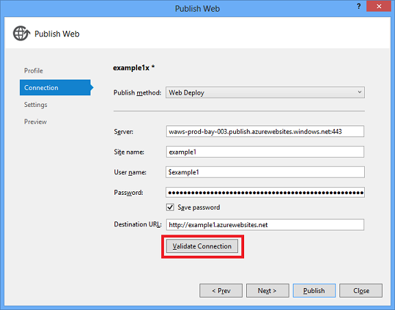
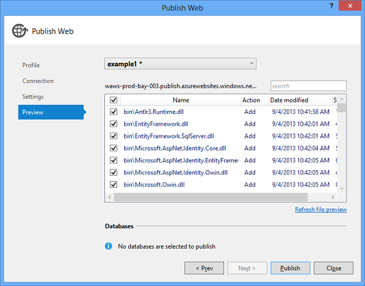
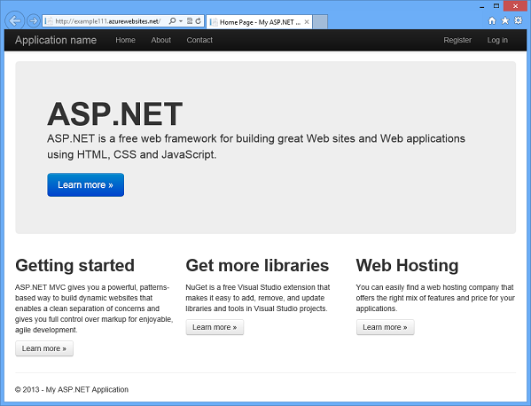
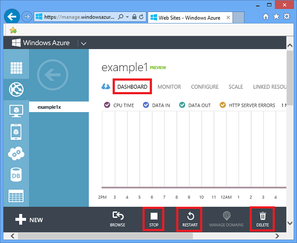

<properties linkid="develop-net-tutorials-get-started" urlDisplayName="Get started with Windows Azure and ASP.NET" pageTitle="Get started with Windows Azure and ASP.NET" metaKeywords="" metaDescription="This tutorial shows you how to deploy an ASP.NET web site to Windows Azure. In less than 15 minutes you'll have an app up-and-running in the cloud." metaCanonical="" disqusComments="1" umbracoNaviHide="1" writer="tdykstra" editor="mollybos" manager="wpickett" />

# Get started with Windows Azure and ASP.NET

This tutorial shows how to deploy an ASP.NET web application to a Windows Azure Web Site by using the Publish Web wizard in Visual Studio 2013 or Visual Studio 2013 for Web Express. (If you prefer to use Visual Studio 2012, see [the previous version of this tutorial](/en-us/develop/net/tutorials/get-started-vs2012/).)

You can open a Windows Azure account for free, and if you don't already have Visual Studio 2013, the SDK automatically installs Visual Studio 2013 for Web Express. So you can start developing for Windows Azure entirely for free.

This tutorial assumes that you have no prior experience using Windows Azure. On completing this tutorial, you'll have a simple web application up and running in the cloud.
 
You'll learn:

* How to enable your machine for Windows Azure development by installing the Windows Azure SDK.
* How to create a Visual Studio ASP.NET MVC 5 project and publish it to a Windows Azure Web Site.

The following illustration shows the completed application:

<strong>Note</strong> To complete this tutorial, you need a Windows Azure account. If you don't have an account, you can <a href="/en-us/pricing/member-offers/msdn-benefits-details/?WT.mc_id=A261C142F" target="_blank">activate your MSDN subscriber benefits</a> or <a href="/en-us/pricing/free-trial/?WT.mc_id=A261C142F" target="_blank">sign up for a free trial</a>.

 
### Tutorial segments

1. [Set up the development environment](#setupdevenv)
3. [Create an ASP.NET MVC 5 application](#createapp)
4. [Deploy the application to Windows Azure](#deploytowindowsazure)
5. [Next steps](#nextsteps)

<h2>Create the appCreate an ASP.NET MVC 5 application</h2>

Your first step is to create a Visual Studio web application project that you'll publish to Windows Azure.

### Create the project

1. Open Visual Studio 2013 or Visual Studio 2013 Express for Web.

2. From the **File** menu, click **New Project**.

   

3. In the **New Project** dialog box, expand **C#** and select **Web** under **Installed Templates**, and then select **ASP.NET Web Application**.

3. Make sure that **.NET Framework 4.5** is selected as the target framework.

4. Name the application **MyExample** and click **OK**.

   

5. In the **New ASP.NET Project** dialog box, select the **MVC** template, and then click **Change Authentication**.

   

6. In the **Change Authentication** dialog box, click **No Authentication**, and then click **OK**.

   

   The sample application you're creating won't have features that require users to log in. For information about how to implement authentication and authorization features, see the [Next Steps](#nextsteps) section at the end of this tutorial. 

5. In the **New ASP.NET Project** dialog box, click **OK**.

   

### Run the application locally

1. Press CTRL+F5 to run the application.

   The application home page appears in the default browser.

   

   The `http://localhost` URL shows that it's running on your local computer. By default it's running in IIS Express, which is a lightweight version of IIS designed for use during web application development.

This is all you need to do to create a simple application that you can deploy to Windows Azure.

<h2>Deploy the appDeploy the application to Windows Azure</h2>

1. Close the browser.

5. In Visual Studio **Solution Explorer**, right-click the project, and then select **Publish** from the context menu.

   

   The **Publish Web** wizard opens.

6. In the **Profile** tab of the **Publish Web** wizard, click **Import**.

   

   The **Import Publish Profile** dialog box appears.

5. Use one of the following methods to enable Visual Studio to connect to your Windows Azure account.

   

2. In the **Import Publish Settings** dialog box, select the **Import from a Windows Azure Web Site** radio button, and then click **New**.

   

3. In the **Create a site on Windows Azure** dialog box, enter a string in the **Site name** box to use as the unique URL for your application.

   The complete URL will consist of what you enter here plus the suffix that you see next to the text box. If someone else has already used the URL you entered, you'll see a red exclamation mark to the right instead of a green check mark, and you'll need to enter a different value.

4. In the **Location** drop-down list, choose the location that is closest to you.

   This setting specifies which data center your web site will run in. 

5. Leave the database fields unchanged.

   For this tutorial you aren't using a database. The [Next Steps](#nextsteps) section at the end of the tutorial links to a tutorial that shows you how to use a database.

6. Click **Create**. 

   

   In a few seconds the web site is created. When you return to the **Import Publish Settings** dialog box, the new site is selected in the drop-down list.

6. Click **OK**.

   

8. In the **Connection** tab of the **Publish Web** wizard, click **Validate Connection** to make sure that the settings are correct.

   

   When the connection has been validated, a green check mark is shown next to the **Validate Connection** button. 

9. Click **Next**.

   

10. In the **Settings** tab, click **Next**.

   

   You can accept the default settings on this tab.  You're deploying a Release build configuration and you don't need to delete files at the destination server, precompile the application, or exclude files in the App_Data folder.

11. In the **Preview** tab, click **Start Preview**.

   

   The tab displays a list of the files that will be copied to the server. Displaying the preview isn't required to publish the application but is a useful function to be aware of.

12. Click **Publish**.

   

   Visual Studio begins the process of copying the files to the Windows Azure server.

13. The **Output** window shows what deployment actions were taken and reports successful completion of the deployment.

   

14. Upon successful deployment, the default browser automatically opens to the URL of the deployed web site.

   The application you created is now running in the cloud.

   

<h2>Next stepsNext steps</h2>

In this tutorial, you've seen how to deploy a simple web application to a Windows Azure Web Site. Other resources are available to show you how to manage, scale, and troubleshoot the site, how to add database, authentication, and authorization functionality, and  how to decide if your application should run in a Windows Azure Cloud Service instead of a Windows Azure Web Site.

<h3>How to manage a web site</h3>
The [Windows Azure Management Portal][Portal] is a web interface that you can use to manage and monitor all of your Windows Azure services. For example, the following screen shot shows **Stop**, **Restart**, and **Delete** buttons in the **Dashboard** tab of the management portal.

You can change site settings on the **Configure** tab. For more information, see [How to Manage Web Sites](/en-us/manage/services/web-sites/how-to-manage-websites/).

You can also do some web site management functions right from **Server Explorer** in Visual Studio. For information about what you can do in **Server Explorer**, see [Troubleshooting Windows Azure Web Sites in Visual Studio](/en-us/develop/net/tutorials/troubleshoot-web-sites-in-visual-studio/).

<h3>How to scale a web site</h3>
When your site is public and it starts to get more traffic, response times might slow down. To remedy that, you can easily add server resources in the **Scale** tab of the management portal. For more information, see [How to Scale a Web Site](/en-us/manage/services/web-sites/how-to-scale-websites/). (Adding server resources to scale a web site is not free.)

<h3>How to troubleshoot a web site</h3>
You might want to look at trace or log output for help with troubleshooting. Visual Studio provides built-in tooling to make it easy to view Windows Azure logs as they are generated in real time. For more information, see [Troubleshooting Windows Azure Web Sites in Visual Studio](/en-us/develop/net/tutorials/troubleshoot-web-sites-in-visual-studio/).

<h3>How to add database and authorization functionality</h3>
Most production web sites use a database and restrict some site functions to certain authorized users. For a tutorial that shows how to get started with database access, authentication, and authorization, see [Deploy a Secure ASP.NET MVC app with Membership, OAuth, and SQL Database to a Windows Azure Web Site](/en-us/develop/net/tutorials/web-site-with-sql-database/).

<h3>How to decide if your application should run in a Cloud Service</h3>
In some scenarios you might want to run your application in a Windows Azure Cloud Service instead of a Windows Azure Web Site. For more information, see [Windows Azure Execution Models](/en-us/develop/net/fundamentals/compute/) and [Windows Azure Web Sites, Cloud Services, and VMs: When to use which?](http://msdn.microsoft.com/en-us/library/windowsazure/jj218759.aspx). For a tutorial series that shows how to create a multi-tier ASP.NET web application and deploy it to a Cloud Service, see [.NET Multi-Tier Application Using Storage Tables, Queues, and Blobs](/en-us/develop/net/tutorials/multi-tier-web-site/1-overview/).

[Portal]: http://manage.windowsazure.com
