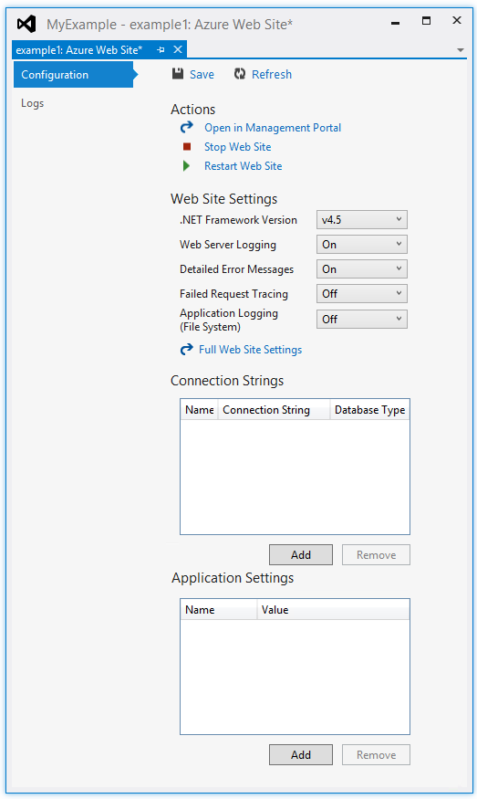
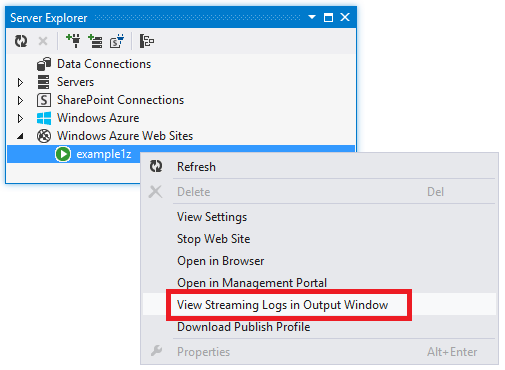
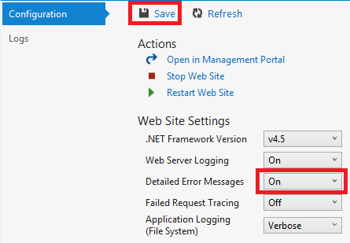
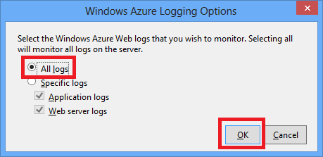
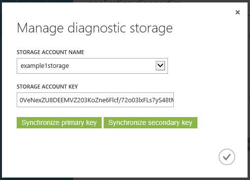
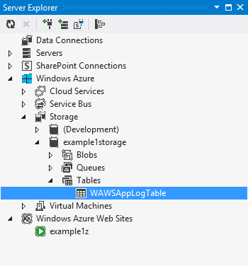
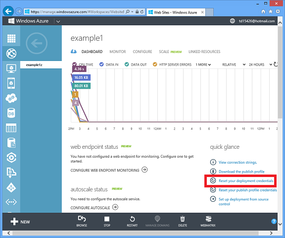

<properties linkid="develop-net-tutorials-troubleshooting-web-sites-in-visual-studio" urlDisplayName="Troubleshooting Windows Azure Web Sites in Visual Studio" pageTitle="Troubleshooting Windows Azure Web Sites in Visual Studio" metaKeywords="" metaDescription="This tutorial shows how to use Visual Studio tools for managing and debugging Windows Azure Web Sites." metaCanonical="" disqusComments="1" umbracoNaviHide="1" writer="tdykstra" editor="mollybos" manager="wpickett" />

# Troubleshooting Windows Azure Web Sites in Visual Studio

When you run a Visual Studio web project locally in IIS Express, you can troubleshoot by [running in debug mode](http://msdn.microsoft.com/library/vstudio/sc65sadd.aspx) or by using [IntelliTrace](http://msdn.microsoft.com/library/vstudio/dd264915.aspx).
But for errors that occur only in production, the best way to debug might be by reviewing logs that application code or the web server creates. This tutorial shows how to use Visual Studio tools that help debug an application while it runs in a Windows Azure Web Site, by viewing application and web server logs.

You'll learn:

* Which Windows Azure site management functions are available in Visual Studio.
* How to create application trace logs and view them while the application is creating them.
* How to view web server logs, including detailed error messages and failed request tracing.
* How to send diagnostic logs to a Windows Azure Storage account and view them there.

This tutorial's purpose is to show how to view tracing information by using Visual Studio; it does not require prior knowledge about tracing, but it is not an introduction to the broader topic of how to use tracing effectively in ASP.NET applications. For links to other resources that provide more information about tracing, see the [Next Steps](#nextsteps) section.

### Tutorial segments

1. [Prerequisites](#prerequisites)
2. [Site configuration and management](#sitemanagement)
3. [Diagnostic logs overview](#logsoverview)
4. [Create and view application trace logs](#apptracelogs)
5. [View web server logs](#webserverlogs)
5. [View detailed error message logs](#detailederrorlogs)
5. [Download file system logs](#downloadlogs)
5. [View storage logs](#storagelogs)
5. [View failed request logs](#failedrequestlogs)
5. [Next steps](#nextsteps)

<h2>Prerequisites</h2>

This tutorial works with the development environment, web project, and Windows Azure Web Site that you set up in [Deploying an ASP.NET Web Application to a Windows Azure Web Site][GetStarted]. In that tutorial, you imported credentials for your Windows Azure subscription into Visual Studio. When you did that, Visual Studio added Windows Azure nodes to **Server Explorer**, and you'll be using those nodes in this tutorial.

<h2>Site managementSite configuration and management</h2>

Visual Studio provides access to a subset of the site management functions and configuration settings available in the management portal. In this section you'll see what's available.

1. In **Server Explorer**, expand **Windows Azure Web Sites**.

2. Right-click the node for your web site, and then click **View Settings**.

   

   The **Azure Web Site** tab appears, and you can see there the site management and configuration tasks that are available in Visual Studio.

   

   In this tutorial you'll be using the logging and tracing drop-downs. 

   If you want to perform a site management task that can't be done this window, you can click **Full Web Site Settings** to open a browser window to the management portal. For more information, see [How to Configure Web Sites](/en-us/manage/services/web-sites/how-to-configure-websites/#howtochangeconfig).

<h2>Logs overviewDiagnostic logs overview</h2>

An ASP.NET application that runs in a Windows Azure Web Site can create the following kinds of logs:

* **Application tracing logs** 
  The application creates these logs by calling methods of the [System.Diagnostics.Trace](http://msdn.microsoft.com/en-us/library/system.diagnostics.trace.aspx) class.
* **Web server logs** 
  The web server creates a log entry for every HTTP request to the site.
* **Detailed error message logs** 
  The web server creates an HTML page with some additional information for failed HTTP requests (those that result in status code 400 or greater). 
* **Failed request tracing logs** 
  The web server creates an XML file with detailed tracing information for failed HTTP requests. The web server also provides an XSL file to format the XML in a browser.
  
Logging affects site performance, so Windows Azure gives you the ability to enable or disable each type of log as needed. For application logs, you can specify that only logs above a certain severity level should be written. When you create a new web site, by default all logging is disabled.

Logs are written to files in a *LogFiles* folder in the file system of your web site. Application logs can also be written to a Windows Azure Storage account.

<h2>Application logsCreate and view application trace logs</h2>

In this section you'll do the following tasks:

* Add tracing statements to the web project that you created in [the earlier tutorial][GetStarted].
* View the logs when you run the project locally.
* View the logs as they are generated by the application running in Windows Azure. 

### Add tracing statements to the application

1. Open *Controllers\HomeController.cs*, and replace the file contents with the following code in order to add `Trace` statements and a `using` statement for `System.Diagnostics`:

		using System;
		using System.Collections.Generic;
		using System.Configuration;
		using System.Diagnostics;
		using System.Linq;
		using System.Web;
		using System.Web.Configuration;
		using System.Web.Mvc;
		
		namespace MyExample.Controllers
		{
		    public class HomeController : Controller
		    {
		        public ActionResult Index()
		        {
		            Trace.WriteLine("Entering Index method");
		
		            ViewBag.Message = "Modify this template to jump-start your ASP.NET MVC application.";
		
		            Trace.TraceInformation("Displaying the Index page at " + DateTime.Now.ToLongTimeString());
		
		            Trace.WriteLine("Leaving Index method");
		            return View();
		        }
		
		        public ActionResult About()
		        {
		            Trace.WriteLine("Entering About method");
		
		            ViewBag.Message = "Your app description page.";
		
		            Trace.TraceWarning("Transient error on the About page at " + DateTime.Now.ToShortTimeString());
		
		            Trace.WriteLine("Leaving About method");
		            return View();
		        }
		
		        public ActionResult Contact()
		        {
		            Trace.WriteLine("Entering Contact method");
		
		            ViewBag.Message = "Your contact page.";
		
		            Trace.TraceError("Fatal error on the Contact page at " + DateTime.Now.ToLongTimeString());
		
		            Trace.WriteLine("Leaving Contact method");
		            return View();
		        }
		    }
		}
		
				
### View the tracing output locally

3. Press F5 to run the application in debug mode.

   The default trace listener writes all trace output to the **Output** window, along with other Debug output. The following illustration shows the output from the trace statements that you added to the `Index` method.

   

   The following steps show to view trace output in a web page, without compiling in debug mode.

2. Open the application Web.config file (the one located in the project folder) and add a `<system.diagnostics>` element at the end of the file just before the closing `</configuration>` element:

  		<system.diagnostics>
		    <trace>
		      <listeners>
		        <add name="WebPageTraceListener"
                    type="System.Web.WebPageTraceListener, 
                    System.Web, 
                    Version=4.0.0.0, 
                    Culture=neutral,
                    PublicKeyToken=b03f5f7f11d50a3a" />
		      </listeners>
		    </trace>
		  </system.diagnostics>

   The `WebPageTraceListener` lets you view trace output by browsing to `/trace.axd`.

3. Add a [trace element](http://msdn.microsoft.com/en-us/library/vstudio/6915t83k(v=vs.100).aspx) under `<system.web>` in the Web.config file, such as the following example:

		<trace enabled="true" writeToDiagnosticsTrace="true" mostRecent="true" pageOutput="false" />

  

3. Press CTRL+F5 to run the application.

4. In the address bar of the browser window, add *trace.axd* to the URL, and then press Enter (the URL will be similar to http://localhost:53370/trace.axd).

5. On the **Application Trace** page, click **View Details**.

   

   The **Request Details** page appears, and in the **Trace Information** section you see the output from the trace statements that you added to the `Index` method.

   

By default, `trace.axd` is only available locally. If you wanted to make it available from a remote site, you could add `localOnly="false"` to the `trace` element in the *Web.config* file, as shown in the following example:

		<trace enabled="true" writeToDiagnosticsTrace="true" localOnly="false" mostRecent="true" pageOutput="false" />

However, enabling `trace.axd` in a production site is generally not recommended for security reasons, and in the following sections you'll see an easier way to read tracing logs in a Windows Azure Web Site.

### View the tracing output in Windows Azure

1. In **Solution Explorer**, right-click the web project and click **Publish**.

2. In the **Publish Web** dialog box, click **Publish**.

   After Visual Studio publishes your update, it opens a browser window to your home page (assuming you didn't clear **Destination URL** on the **Connection** tab).

3. In **Server Explorer**, right-click your web site and select **View Streaming Logs in Output Window**. 

   

   The **Output** window shows that you are connected to the log-streaming service, and adds a notification line each minute that goes by without a log to display.

   

4. In the browser window that shows your application home page, click **Contact**.

   Within a few seconds the output from the error-level trace you added to the `Contact` method appears in the **Output** window.

   

Visual Studio is only showing error-level traces because that is the default setting when you enable the log monitoring service. When you create a new Windows Azure Web Site, all logging is disabled by default, as you saw when you opened the site settings page earlier:

However, when you selected **View Streaming Logs in Output Window**, Visual Studio automatically changed **Application Logging(File System)** to **Error**, which means error-level logs get reported. In order to see all of your tracing logs, you can change this setting to **Verbose**.

4. In **Server Explorer**, right-click the web site, and then click **View Settings** as you did earlier.

5. Change **Application Logging (File System)** to **Verbose**, and then click **Save**.
 
   

6. In the browser window that is now showing your **Contact** page, click **Home**, then click **About**, and then click **Contact**.

   Within a few seconds, the **Output** window shows all of your tracing output.

   

### Output window features

The **Windows Azure Logs** tab of the **Output** Window has several buttons and a text box:

   

These perform the following functions:

* Clear the **Output** window.
* Enable or disable word wrap.
* Start or stop monitoring logs.
* Specify which logs to monitor.
* Download logs.
* Enter a search string to filter logs.
* Use a regular expression for the search string.
* Close the **Output** window.

<h2>Web server logsView web server logs</h2>

Web server logs record all HTTP activity on the site. In order to see them in the **Output** window you have to enable them on the site and tell Visual Studio that you want to monitor them. 

1. In the **Azure Web Site Configuration** tab that you opened from **Server Explorer**, change Web Server Logging to **On**, and then click **Save**.

   

2. In the **Output** Window, click the **Specify which Windows Azure logs to monitor** button.

   

3. In the **Windows Azure Logging Options** dialog box, select **Web server logs**, and then click **OK**.

   

4. In the browser window that shows the web site, click **Home**, then click **About**, and then click **Contact**.

   The application logs generally appear first, followed after a while by the web server logs.

   

<h2>Error logsView detailed error message logs</h2>

Detailed error logs provide some additional information about HTTP requests that result in error response codes (400 or above). In order to see them in the **Output** window, you have to enable them on the site and tell Visual Studio that you want to monitor them.

1. In the **Azure Web Site Configuration** tab that you opened from **Server Explorer**, change **Detailed Error Messages** to **On**, and then click **Save**.

   

2. In the **Output** Window, click the **Specify which Windows Azure logs to monitor** button.

3. In the **Windows Azure Logging Options** dialog box, click **All logs**, and then click **OK**.

   

4. In the address bar of the browser window, add an extra character to the URL to cause a 404 error (for example, `http://localhost:53370/Home/Contactx`), and press Enter.

   After several seconds the detailed error log appears in the Visual Studio **Output** window. The log output is long, and the following image only shows part of it.

   

   If you copy the HTML of the log output and open it in a browser, you see the following page:

   

<h2>Download logsDownload file system logs</h2>

Any logs that you can monitor in the **Output** window can also be downloaded as a *.zip* file. 

1. In the **Output** window, click **Download Streaming Logs**.

   

   File Explorer opens to your *Downloads* folder with the downloaded file selected.

   

2. Extract the *.zip* file, and you see the following folder structure:

   

   * Application tracing logs are in *.txt* files in the *LogFiles\Application* folder.
   * Web server logs are in *.log* files in the *LogFiles\http\RawLogs* folder. You can use a tool such as [Log Parser](http://www.microsoft.com/en-us/download/details.aspx?displaylang=en&id=24659) to view and manipulate these files.
   * Detailed error message logs are in *.html* files in the *LogFiles\DetailedErrors* folder.

   (The *deployments* folder is for files created by source control publishing; it doesn't have anything related to Visual Studio publishing. The *Git* folder is for traces related to source control publishing and the log file streaming service.)  

<h2>Storage logsView storage logs</h2>

Application tracing logs can also be sent to a Windows Azure storage account, and you can view them in Visual Studio. To do that you'll create a storage account, enable storage logs in the management portal, and view them in the **Logs** tab of the **Azure Web Site** window.

You can send logs to both the file system and a storage account, and you can specify a different severity level for each. You currently have file system logs set to verbose level; you'll set storage logs to information level. Information level means all logs created by calling `Trace.TraceInformation`, `Trace.TraceWarning`, and `Trace.TraceError` will be displayed, but not logs created by calling `Trace.WriteLine`.

One advantage of sending application tracing logs to storage is that you get some additional information with each log that you don't get from file system logs.

1. In **Server Explorer**, right-click the web site, and then click **Open in Management Portal**.

2. In the management portal, click the **Storage** tab, and then click **Create a Storage Account**.

  

2. Enter a unique URL to use for the storage account, and then click **Create Storage Account**.

  

  If you get an error message indicating that "The storage account name is already in use", change the URL until you see a green check mark on the right indicating that the URL you've entered is unique.

1. In the Visual Studio **Azure Web Site** window, click the **Logs** tab, and then click **Configure Logging**.

  

  This opens the **Configure** tab in the management portal for your web site. Another way to get here is to click the **Web Sites** tab, click your web site, and then click the **Configure** tab.

2. In the management portal **Configure** tab, scroll down to the application diagnostics section, and then change **Application Logging (Storage)** to **On**.

3. Change **Logging Level** to **Information**.

4. Click **Manage Connection**.

  

  In the **Manage diagnostic storage** box, you can choose your storage account if you have more than one. The **Storage Account Key** field defaults to the primary key value of the selected storage account.

  

6. In the **Manage diagnostic storage** box click the check mark to close the box.

6. In the management portal **Configure** tab, click **Save**.

7. In the browser window that displays the application web site, click **Home**, then click **About**, and then click **Contact**.

  This causes some logs to be written to the storage account.

8. In the **Logs** tab of the **Azure Web Site** window in Visual Studio, click **Refresh** under **Diagnostic Summary**.

  

  The **Diagnostic Summary** section shows logs for the last 15 minutes by default. You can change the period to see more logs. (If you don't see any logs, a possible cause is failing to click **Save** after making changes on the management portal Configure tab.)

  

  Notice that in this view you see **Process ID** and **Thread ID** for each log, which you don't get in the file system logs. You can see additional fields by viewing the Windows Azure storage table directly.

8. Click **View all application logs**.

   The trace log table appears in the Windows Azure storage table viewer.

  

  

  This view shows additional fields you don't see in any other views.

7. To look at the details for a single row, right-click one of the rows, and then click **Edit**.

  

<h2>Failed request logsView failed request tracing logs</h2>

Failed request tracing logs are useful when you need to understand the details of how IIS is handling an HTTP request, in scenarios such as URL rewriting or authentication problems. 

Windows Azure Web Sites use the same failed request tracing functionality that has been available with IIS 7.0 and later. You don't have access to the IIS settings that configure which errors get logged, however. When you enable failed request tracing, all errors are captured. 

You can enable failed request tracing by using Visual Studio, but you can't view them in Visual Studio. These logs are XML files. The streaming log service only monitors files that are deemed readable in plain text mode:  *.txt*, *.html*, and *.log* files.

You can view failed request tracing logs in a browser directly via FTP or locally after using an FTP tool to download them to your local computer. In this section you'll view them in a browser directly.

1. In the **Configuration** tab of the **Azure Web Site** window that you opened from **Server Explorer**, change **Failed Request Tracing** to **On**, and then click **Save**.

   

4. In the address bar of the browser window that shows the web site, add an extra character to the URL and click Enter to cause a 404 error.

   This causes a failed request tracing log to be created, and the following steps show how to view or download the log.

2. In the **Configuration** tab of the **Azure Web Site** window, click **Open in Management Portal**.

3. In the management portal, click **Dashboard**, and then click **Reset your deployment credentials** in the **Quick Glance** section.

   

4. Enter a new user name and password.

   

5. In a new browser window, go to the URL that is shown under **FTP Host Name** in the **Dashboard** tab of the management portal page for your web site. **FTP Host Name** is located farther down the page in the **Quick Glance** section.

6. Log in using the FTP credentials that you created earlier.

   **Note:** When you log in, you have to use the full user name as displayed in the **Dashboard** under **Deployment / FTP User**, which will have the site name prefixed to it.

   The browser shows the root folder of the site.

6. Open the *LogFiles* folder.

   

7. Open the folder that is named W3SVC plus a numeric value.

   

   The folder contains XML files for any errors that have been logged after you enabled failed request tracing, and an XSL file that a browser can use to format the XML.

   

8. Click the XML file for the failed request that you want to see tracing information for.

   The following illustration shows part of the tracing information for a sample error.

   

<h2>Next StepsNext Steps</h2>

You've seen how Visual Studio makes it easy to view logs created by a Windows Azure Web Site. You might want to learn more about troubleshooting Windows Azure Web Sites, tracing in ASP.NET applications, and analyzing web server logs.

### Windows Azure Web Site troubleshooting

For more information about troubleshooting Windows Azure Web Sites (WAWS), see the following resources:

* [Troubleshooting in Windows Azure](/en-us/develop/net/best-practices/troubleshooting/) 
  A basic introductory white paper that includes a short section on WAWS.
* [Troubleshooting a Web Site](/en-us/develop/net/best-practices/troubleshooting-web-sites/) 
  An introduction that focuses on WAWS.
* [Enable diagnostic logging for Windows Azure Web Sites](/en-us/develop/net/common-tasks/diagnostics-logging-and-instrumentation/) 
  Covers much of the same information provided by this tutorial but focuses on how to get diagnostic logs without using Visual Studio. 
* [How to Monitor Web Sites](/en-us/manage/services/web-sites/how-to-monitor-websites/) 
  The [configure diagnostics and download logs](/en-us/manage/services/web-sites/how-to-monitor-websites/#howtoconfigdiagnostics) section has valuable information not included in the troubleshooting documents.

### Tracing in ASP.NET applications

There are no thorough and up-to-date introductions to ASP.NET tracing available on the Internet. The best you can do is get started with old introductory materials written for Web Forms because MVC didn't exist yet, and supplement that with newer blog posts that focus on specific issues. Some good places to start are the following resources:

* [ASP.NET Tracing](http://msdn.microsoft.com/en-us/library/ms972204.aspx) 
  Old but still a good resource for a basic introduction to the subject.
* [Trace Listeners](http://msdn.microsoft.com/en-us/library/4y5y10s7.aspx) 
  Information about trace listeners but doesn't mention the [WebPageTraceListener](http://msdn.microsoft.com/en-us/library/system.web.webpagetracelistener.aspx).
* [Walkthrough: Integrating ASP.NET Tracing with System.Diagnostics Tracing](http://msdn.microsoft.com/en-us/library/b0ectfxd.aspx) 
  This too is old, but includes some additional information that the introductory article doesn't cover.
* [ELMAH](http://nuget.org/packages/elmah/) 
  A popular error logging utility for ASP.NET. [Scott Hanselman's blog posts about ELMAH](http://www.hanselman.com/blog/NuGetPackageOfTheWeek7ELMAHErrorLoggingModulesAndHandlersWithSQLServerCompact.aspx) are a good place to get started.
* [Streaming Diagnostics Trace Logging from the Azure Command Line (plus Glimpse!)](http://www.hanselman.com/blog/StreamingDiagnosticsTraceLoggingFromTheAzureCommandLinePlusGlimpse.aspx) 
  How to use the command line to do what this tutorial shows how to do in Visual Studio. [Glimpse](http://www.hanselman.com/blog/NuGetPackageOfTheWeek5DebuggingASPNETMVCApplicationsWithGlimpse.aspx) is a tool for debugging ASP.NET applications. 
* [Scott Guthrie: Building Real World Cloud Apps with Windows Azure - Part 2](http://vimeo.com/68215602) 
  See 47:00-55:36 in this video for up-to-date recommendations for tracing in Windows Azure cloud applications.

Also, note that you don't have to use ASP.NET or System.Diagnostics tracing. The Windows Azure Web Site streaming log service will stream any *.txt*, *.html*, or *.log* file that it finds in the *LogFiles* folder. Therefore, you could create your own logging system that writes to the file system of the web site, and your file will be automatically streamed and downloaded. All you have to do is write application code that creates files in the *d:\home\logfiles* folder. 

### Analyzing web server logs

For more information about analyzing web server logs, see the following resources:

* [LogParser](http://www.microsoft.com/en-us/download/details.aspx?id=24659) 
  A tool for viewing data in web server logs (*.log* files).
* [Troubleshooting IIS Performance Issues or Application Errors using LogParser ](http://www.iis.net/learn/troubleshoot/performance-issues/troubleshooting-iis-performance-issues-or-application-errors-using-logparser) 
  An introduction to the Log Parser tool that you can use to analyze web server logs.
* [Blog posts by Robert McMurray on using LogParser](http://blogs.msdn.com/b/robert_mcmurray/archive/tags/logparser/) 
* [The HTTP status code in IIS 7.0, IIS 7.5, and IIS 8.0](http://support.microsoft.com/kb/943891)

### Analyzing failed request tracing logs

The Microsoft TechNet web site includes a [Using Failed Request Tracing](http://www.iis.net/learn/troubleshoot/using-failed-request-tracing) section which may be helpful for understanding how to use these logs. However, this documentation focuses mainly on configuring failed request tracing in IIS, which you can't do in Windows Azure Web Sites.

[windowsazure.com]: http://www.windowsazure.com
[WebSitesManagement]: /en-us/manage/services/web-sites/
[WebWithSQL]: /en-us/develop/net/tutorials/web-site-with-sql-database/
[GetStarted]: /en-us/develop/net/tutorials/get-started/

