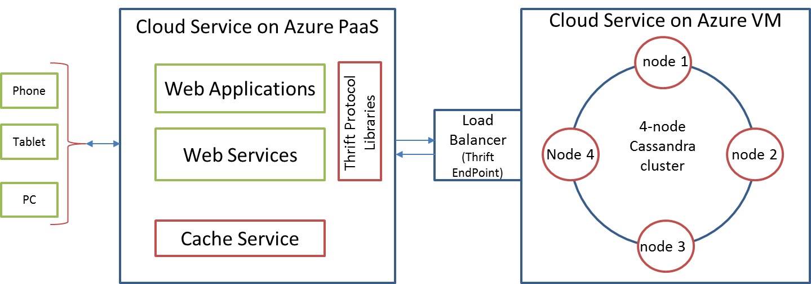

<h1 id = "" > Running Cassandra with Linux on Windows Azure and Accessing it from Node.js </h1>
-Hanu Kommalapati

## Table of Contents##

- [Overview] []
- [Cassandra Deployment Schematic] []
- [Composite Deployment] []
- [Windows Azure Virtual Machine Deployment] []
- [Task 1: Deploy Linux Cluster] []
- [Task 2: Set Up Cassandra on Each Virtual Machine] []
- [Task 3: Access Cassandra Cluster from Node.js] []
- [Conclusion] []

##Overview ##

Windows Azure provides a NoSQL database service through Azure Table storage which allows schema-less storage of business objects. This service can be used from Node.JS, .NET, Java and any other languages that can speak HTTP and REST.  However, there are other popular NoSQL databases like Cassandra and Couchbase which could not be run on Windows Azure PaaS due to its state-less cloud service model.  Windows Azure Virtual Machines now allows the running of these NoSQL databases on Windows Azure with no changes to the codebase. The intention of this writing is to show how to run a Cassandra cluster on Virtual Machines and access it from Node.js. This does not cover the Cassandra deployment for real world production operations where one needs to look at multi-data center Cassandra cluster with the associated backup and recovery strategies. In this exercise, we will use Ubuntu 12.04 version of Linux and Cassandra 1.0.10; however the process can be tweaked for any Linux distribution. 

## Cassandra Deployment Schematic ##

The Windows Azure Virtual Machines capability enables running of NoSQL databases like [Cassandra](http://wiki.apache.org/cassandra/) on Microsoft public cloud as easy as running them in a private cloud environment excepting one difference of virtual network configuration specific to the Windows Azure Virtual Machines infrastructure. As of this writing, Cassandra is not available as a managed service on Windows Azure and hence in this article we will look at setting up of a Cassandra cluster on Virtual Machines and access it from another Linux instance hosted inside Virtual Machines as well. The node.js code snippets shown can also be used from PaaS hosted web application or web service. One of the core strengths of Windows Azure is allowing the composite application model that can take advantage of the best of PaaS and IaaS worlds. 

There are two deployment models that are feasible for Cassandra application environment: self-contained Virtual Machines deployment and a composite deployment.  In a composite deployment, a Virtual Machines-hosted Cassandra cluster will be consumed from a PaaS hosted Azure web application (or web service) using Thrift interface through the load balancer.  Even though each Cassandra node proxies the request to other peer nodes in the event of a key space fault,  the load balancer helps with the entry level load balancing of the requests.  Also the load balancer creates a firewall protected sandbox for a better control of the data. 

##  Composite Deployment ##

The goal of a composite deployment is to maximize the usage of PaaS while keeping the virtual machine footprint to an absolute minimum in an effort to save on the overhead imposed by the infrastructure management of the virtual machines. Due to the server management overhead, only deploy those components that require stateful behavior that can’t be modified easily due to various reasons including the time-to-market, lack of visibility into source code, and low level access to the OS. 

##Windows Azure Virtual Machine Deployment##

In the above diagrams a 4-node Cassandra cluster is deployed inside Virtual Machines behind a load balancer that is configured to allow Thrift traffic. Azure hosted PaaS application accesses the cluster using language specific Thrift libraries. There are libraries for languages including Java, C#, Node.js, Python and C++. The self-contained Virtual Machines deployment shown in the second diagram consumes data by applications running inside another cloud service hosted on Virtual Machines. 

##Task 1: Deploy Linux Cluster##

During the Virtual Machines preview release, in order for the Linux VMs to be part of the same virtual network, all the machines need to be deployed to the same cloud service. Typical sequence for creating a cluster is: 

**Step 1: Generate SSH Key pair**

Windows Azure needs an X509 public key that is either PEM or DER encoded at the provisioning time. Generate a public/private key pair using the instructions located at [How to Use SSH with Linux on Windows Azure](http://www.windowsazure.com/en-us/manage/linux/how-to-guides/ssh-into-linux/).  If you plan to use putty.exe as an SSH client either on Windows or Linux, you have to convert the PEM encoded RSA private key to PPK format using puttygen.exe.  Instructions for this can be found at [Generating SSH Key Pair for Linux VM Deployment on Windows Azure](http://blogs.msdn.com/b/hanuk/archive/2012/06/07/generating-ssh-key-pair-for-linux-vm-deployment-on-windows-azure.aspx).

**Step 2:  Create a Ubuntu VM**

To create the first Ubuntu VM, log into the Windows Azure preview portal, click **New**, click **Virtual Machine**, click **From Gallery**, click **Unbuntu Server 12.xx**, and then click the right arrow. For a tutorial that describes how to create a Linux VM, see [Create a Virtual Machine Running Linux](http://www.windowsazure.com/en-us/manage/linux/tutorials/virtual-machine-from-gallery/).

Then, enter the following information on the VM Configuration screen:

<table>
	<tr>
		<th>Field Name</th>
		<th>Field Value</th>
		<th>Remarks</th>
	</tr>
	<tr>
		<td>Virtual Machine Name</td>
		<td>hk-cas1</td>
		<td>This is the hostname of the VM</td>
	</tr>
	<tr>
		<td>New User Name</td>
		<td>localadmin</td>
		<td>“admin” is a reserved user name in Ubuntu 12.xx</td>
	</tr>
	<tr>
		<td>New Password</td>
		<td><i>strong password</i></td>
		<td></td>
	</tr>
	<tr>
		<td>Confirm Password</td>
		<td><i>strong password</i></td>
		<td></td>
	</tr>
	<tr>
		<td>Size</td>
		<td>Small</td>
		<td>Select the VM based on the IO needs. </td>
	</tr>
	<tr>
		<td>Secure using SSH Key for Authentication</td>
		<td>Click check box</td>
		<td>Check if you want to secure with an SSH key</td>
	</tr>
	<tr>
		<td>Certificate</td>
		<td><i>file name of the public key certificate</i></td>
		<td>DER or PEM encoded SSH public key generated with OpenSSL or other tools</td>
	</tr>
</table>

Enter the following information on the VM Mode screen:

<table>
	<tr>
		<th>Field Name</th>
		<th>Field Value</th>
		<th>Remarks</th>
	</tr>
	<tr>
		<td>Standalone Virtual VM</td>
		<td>“check” the radio box</td>
		<td>This is for the first VM for subsequent VMs, we will use “Connect to Existing VM” option</td>
	</tr>
	<tr>
		<td>DNS Name</td>
		<td><i>unique name</i>.cloudapp.net</td>
		<td>Give a machine agnostic load balancer name</td>
	</tr>
	<tr>
		<td>Storage Account</td>
		<td><i>default storage account</i></td>
		<td>Use the default storage account you created</td>
	</tr>
	<tr>
		<td>Region/Affinity Group/Virtual Network</td>
		<td>West US</td>
		<td>Select a region from which your web applications access the Cassandra cluster</td>
	</tr>
</table>

Repeat the above process for all the virtual machines that will be part of the Cassandra cluster.  At this point all the machines will be part of the same network and can ping each other.  If the ping doesn’t work, check the VM’s firewall (e.g. iptables) configuration to make sure that ICMP is allowed. Be sure to disable ICMP once network connectivity is successfully tested to reduce the attack vector. 

**Step 3:  Add  a Load Balanced Thrift Endpont** 

After step 1 and step 2, each VM should have SSH endpoint already defined. Now let us add the load balanced Thrift endpoint with a public port of 9160. Here is sequence:

a.	From the details view of the first VM, click “Add Endpoint”

b.	On the “Add endpoint to virtual machine” screen, select “Add endpoint” radio button

c.	Click right arrow 

d.	On the “Specify endpoint details”  screen enter the following
<table>
	<tr>
		<th >Field Name</th>
		<th>Field Value</th>
		<th>Remarks</th>
	</tr>
	<tr>
		<td>Name</td>
		<td>cassandra</td>
		<td>Any unique endpoint name will be fine</td>
	</tr>
	<tr>
		<td>Protocol</td>
		<td>TCP</td>
		<td></td>
	</tr>
	<tr>
		<td>Public Port</td>
		<td>9160</td>
		<td>Default Thrift port. </td>
	</tr>
	<tr>
		<td>Private Port</td>
		<td>9160</td>
		<td>Unless you changed this in cassandra.yaml</td>
	</tr>
</table>
After the above work, the first VM will display  cassandra endpoint with LOAD BALANCED field as “NO”. Ignore this for the moment as this will change to “YES” once we add this endpoint to the subsequent VMs

e.	Now select the second VM and add endpoint by repeating the above process with only minor difference that you will select “Load-balance traffic on an existing endpoint” and use “cassandra-960” from the drop down box.  At this stage, the endpoint mapping to both the VMs will change the status from LOAD BALANCED status “NO” to “YES”. 

Repeat “e” for the subsequent nodes in the cluster. 

Now that we have the VMs ready, it is time to set up Cassandra on each of the VMs. Since Cassandra is not a standard part of many Linux distributions, let’s resort to a manual deployment process.  

[Please note that we are using a manual approach for the software installation on each VM. However, the process can be expedited by setting up a fully functioning Cassandra VM, capture it as the base image and create additional instances from this base image. The instructions for capturing the Linux image are located at [How to Capture an Image of a Virtual Machine Running Linux](https://www.windowsazure.com/en-us/manage/linux/how-to-guides/capture-an-image/).] 

##Task 2: Set Up Cassandra on Each Virtual Machine##

**Step 1: Install Pre-Requisites**

Cassandra requires Java Virtual Machine and hence install the latest JRE using the following command for Debian derivatives including Ubuntu:

	sudo apt-get install openjdk-6-jre

**Step 2: Cassandra Installation**

1.	Login using SSH to the Linux (Ubuntu) VM instance

2.	Download Cassandra bits from the mirror suggested here to “~/downloads” directory:  [http://www.apache.org/dyn/closer.cgi?path=/cassandra/1.1.0/apache-cassandra-1.1.0-bin.tar.gz](http://www.apache.org/dyn/closer.cgi?path=/cassandra/1.1.0/apache-cassandra-1.1.0-bin.tar.gz).  
Execute the following command at the shell prompt(this uses LSU mirror):  
wget [http://www.eng.lsu.edu/mirrors/apache/cassandra/1.0.10/apache-cassandra-1.0.10-bin.tar.gz](http://www.eng.lsu.edu/mirrors/apache/cassandra/1.0.10/apache-cassandra-1.0.10-bin.tar.gz) 

3.	Unzip the tar ball into the default login directory by executing the following command: 
	
		tar -zxvf downloads/apache-cassandra-1.0.10-bin.tar.gz
The above will expand Cassandra into apache-cassandra-1.0.10 directory.   

4. Create the following two default directories for holding logs and data:

		$ sudo mkdir /var/lib/cassandra
		$ sudo mkdir /var/log/cassandra
5.	Grant write permissions to the user identity under which  Cassandra will run	

		a.	sudo chown -R <user>:<group> /var/lib/cassandra
		b.	sudo chown -R <user>:<group> /var/log/cassandra
		To use current user context, replace the <user> and <group> with $USER and $GROUP
6.	Start Cassandra from the apache-cassandra-1.0.10/bin directory using the following command: 

		$ ./cassandra

The above will start the Cassandra node as a background process. Use “cassandra –f” to start the process in the foreground mode.

The log should may show mx4j error. Cassandra will function fine without mx4j but it is necessary for managing the Cassandra installation.  Kill Cassandra process before the next step.

**Step 3: Install mx4j**

	a)	Download mx4j: wget [http://sourceforge.net/projects/mx4j/files/MX4J%20Binary/3.0.2/mx4j-3.0.2.tar.gz/download](http://sourceforge.net/projects/mx4j/files/MX4J%20Binary/3.0.2/mx4j-3.0.2.tar.gz/download) -O mx4j.tar.gz
	b)	tar –zxvf mx4j.tar.gz
	c)	cp mx4j-23.0.2/lib/*.jar ~/apache-cassandra-1.0.10/lib
	d)	rm –rf mx4j-23.0.2
	e)	rm mx4j.tar.gz
Restart Cassandra process at this stage

**Step 4: Test Cassandra Installation**

Execute the following command from Cassandra’s bin directory for connecting using thrift client:

	cassandra-cli –h localhost –p 9160

**Step 5: Enable Cassandra for External Connections**

By default Cassandra is only set up to listen on the loop back address and hence for external connections this change is mandatory. 

Edit  “conf/cassandra.yaml” to change the **listen\_address** and **rpc\_address** to the IP address or hostname of the server so that the current node will be visible to the other nodes as well as to the external load balancers.

Repeat Step 1 through 5 for all the nodes in the cluster.

Now that all the individual VMs are ready with the necessary software, it is time to establish communication between the nodes through seed configuration. Review the information located at [http://wiki.apache.org/cassandra/MultinodeCluster](http://wiki.apache.org/cassandra/MultinodeCluster)  for details on the multi-node cluster configuration. 

**Step 6: Set up Multi-Node Cluster**

Edit cassandra.yaml to change the following properties in all the VMs:

**a)	cluster_name**

Default cluster name is set to ‘Test Cluster’; change it to something that reflects your application.  Example:  ‘AppStore’ .   if you had already started the cluster with “Test Cluster” for testing during the installation, you will get a cluster name mismatch error.  To fix this error, delete all the files under /var/lib/cassandra/data/system directory.

**b)	seeds**

The IP addresses specified here will be used by new nodes to learn about the ring topology. Set the most reliable nodes as your seeds in a comma separated format:  "*host1*,*host2*" . Example setting:  "hk-ub1,hk-ub2".

We will accept the default tokens provided by the seed servers as this is not our focus in this exercise. For optimal token generation, see the python script located at: 
[http://wiki.apache.org/cassandra/GettingStarted](http://wiki.apache.org/cassandra/GettingStarted).

Restart Cassandra on all the nodes to apply the above changes. 

**Step 7: Test the multi-node Cluster**

Nodetool installed into the Cassandra’s bin directory will help with cluster operations. We will use nodetool to verify the cluster setup through the following command format: 

	$ bin/nodetool -h <hostname> -p 7199 ring

If the configuration is correct, it should display the information as shown below for a 3-node cluster:

<table>
	<tr>
		<td>Address</td>
		<td>DC</td>
		<td>Rack</td>
		<td>Status</td>
		<td>State</td>
		<td>Load</td>
		<td>Owns</td>
		<td>Token</td>
	</tr>
	<tr>
		<td></td>
		<td></td>	
		<td></td>	
		<td></td>	
		<td></td>	
		<td></td>	
		<td></td>	
		<td>149463697837832744402916220269706844972</td>	
	</tr>
	<tr>
		<td>10.26.196.68</td>
		<td>datacenter1</td>	
		<td>rack1</td>	
		<td>Up</td>	
		<td>Normal</td>	
		<td>15.69 KB</td>	
		<td>25.98%</td>	
		<td>114445918355431753244435008039926455424</td>	
	</tr>
	<tr>
		<td>10.26.198.81</td>
		<td>datacenter1</td>	
		<td>rack1</td>	
		<td>Up</td>	
		<td>Normal</td>	
		<td>15.69 KB</td>	
		<td>53.44%</td>	
		<td>70239176883275351288292106998553981501</td>	
	</tr>
	<tr>
		<td>10.26.198.84</td>
		<td>datacenter1</td>	
		<td>rack1</td>	
		<td>Up</td>	
		<td>Normal</td>	
		<td>18.35 KB</td>	
		<td>25.98%</td>	
		<td>149463697837832744402916220269706844972</td>	
	</tr>
</table>

At this stage, the cluster is ready for Thrift clients through the cloud service URL (DNS name given during creation of the first VM) created during the “Deploy Linux Cluster” task. 

##Task 3: Access Cassandra Cluster from Node.js##

Create a Linux VM on Windows Azure using the process described in the previous tasks.  Make sure that this VM is standalone VM as we will be using this as a client for accessing the Cassandra cluster. We will install Node.js, NPM and [cassandra-client](https://github.com/racker/node-cassandra-client)  from github before connecting to Cassandra cluster from this VM: 

**Step 1: Install Node.js and NPM**

a)	install the pre-requisites 

	sudo apt-get install g++ libssl-dev apache2-utils make
b)	we will use source from GitHub to compile and install; before we can clone the repo, we need to install the git core runtime:

	sudo apt-get install git-core
c)	Clone Node repo

	git clone git://github.com/joyent/node.git
d)	The above will create the directory with name “node”. Execute the following command sequence to compile install node.js:

	cd node
	./configure
	make
	sudo make install

e)	Install NPM from stable binaries by executing the following command

	curl http://npmjs.org/install.sh | sh

**Step 2: Install cassandra-client package**

	npm cassandra-client 

**Step 3: Prepare Cassandra Storage**

Cassandra storage uses the concepts of KEYSPACE and COLUMNFAMILY which can be approximately compared to DATABASE and TABLE structures in the RDBMS parlance. The KEYSAPCE will contain a set of COLUMNFAMILY definitions. Each COLUMNFAMILY will contain a set of rows and in turn each row contains several columns as shown in the composite view below:

We will use the previously deployed Cassandra cluster to demonstrate node.js access by creating and querying the above data structures.  We will create a simple node.js script that performs the basic preparation of the cluster for storing customer data. The techniques shown in the script can easily be used in a node.js web application or web services. Please keep in mind that the snippets are only meant to show how the stuff works and for real world solutions, the code shown has a lot of room (e.g. security, logging, scalability, etc.) for improvement. 

Let us define the required variables at the script scope to include PooledConnection from the cassandra-client module and frequently used keyspace name and the keyspace connection parameters:

	casdemo.js: 
	var pooledCon = require('cassandra-client').PooledConnection;
	var ksName = "custsupport_ks";
	var ksConOptions = { hosts: ['<azure_svc_name>.cloudapp.net:9160'], 
	                     keyspace: ksName, use_bigints: false };

In preparation for storing the customer data, we need to first create a KEYSPACE using the following script example: 

	casdemo.js: 
	function createKeyspace(callback){
	   var cql = 'CREATE KEYSPACE ' + ksName + ' WITH 
	   strategy_class=SimpleStrategy AND strategy_options:replication_factor=1';
	   var sysConOptions = { hosts: ['<azure_svc_name>.cloudapp.net:9160'],  
	                         keyspace: 'system', use_bigints: false };
	   var con = new pooledCon(sysConOptions);
	   con.execute(cql,[],function(err) {
	   if (err) {
	     console.log("Failed to create Keyspace: " + ksName);
	     console.log(err);
	   }
	   else {
	     console.log("Created Keyspace: " + ksName);
	     callback(ksConOptions, populateCustomerData);
	   }
	   });
	   con.shutdown();
	} 
	
createKeysapce function takes a callback function as the argument which is meant to execute the COLUMNFAMILY creation function as KEYSPACE is a prerequisite for column family creation.  Note that we need to connect to “system” KEYSPACE for application KEYSPACE definition.  [Cassandra Query Language (CQL)](http://cassandra.apache.org/doc/cql/CQL.html) is consistently used in interacting with the cluster throughout these snippets. Since the CQL composed in the above script didn’t have any parameter markers we are using a blank parameter collection (“[]”) when PooledConnection.execute() method. 

Upon successful key space creation, the function createColumnFamily(),  shown in the following snippet, will be executed to create the necessary COLUMNFAMILY definitions:

	casdemo.js: 
	//Creates COLUMNFAMILY
	function createColumnFamily(ksConOptions, callback){
	  var params = ['customers_cf','custid','varint','custname',
	                'text','custaddress','text'];
	  var cql = 'CREATE COLUMNFAMILY ? (? ? PRIMARY KEY,? ?, ? ?)';
	var con =  new pooledCon(ksConOptions);
	  con.execute(cql,params,function(err) {
	      if (err) {
	         console.log("Failed to create column family: " + params[0]);
	         console.log(err);
	      }
	      else {
	         console.log("Created column family: " + params[0]);
	         callback();
	      }
	  });
	  con.shutdown();
	} 

Parameterized CQL template will be combined with params object to generate valid CQL for COLUMNFAMILY creation. After successful creation of  the COLUMNFAMILY, the callback supplied, in this case populateCustomerData() will be called as a part of the asynchronous call chain.

	casdemo.js: 
	//populate Data
	function populateCustomerData() {
	   var params = ['John','Infinity Dr, TX', 1];
	   updateCustomer(ksConOptions,params);
	
	   params = ['Tom','Fermat Ln, WA', 2];
	   updateCustomer(ksConOptions,params);
	}
	
	//update will also insert the record if none exists
	function updateCustomer(ksConOptions,params)
	{
	  var cql = 'UPDATE customers_cf SET custname=?,custaddress=? where 
	             custid=?';
	  var con = new pooledCon(ksConOptions);
	  con.execute(cql,params,function(err) {
	      if (err) console.log(err);
	      else console.log("Inserted customer : " + params[0]);
	  });
	  con.shutdown();
	}

populateCustomerData() inserts couple of rows into the COLUMNFAMILY namely customers_cf. In Cassandra Query Language, UPDATE will insert the record if the record is not already present in the process making INSERT CQL statement redundant. 

So far we wired the callback chain: createKeyspace() to createColumnFamily() to populateCustomerData(). Now it is time for us to execute the code through the following code snippet:

	casdemo.js:
	var pooledCon = require('cassandra-client').PooledConnection;
	var ksName = "custsupport_ks";
	var ksConOptions = { hosts: ['<azure_svc_name>.cloudapp.net:9160'], 
	                     keyspace: ksName, use_bigints: false };
	
	createKeyspace(createColumnFamily);
	//rest of the not shown

Execute the following command from the shell prompt to execute the script:

	//the following command will create the KEYSPACE, COLUMNFAMILY and //inserts two customer records
	$ node casdemo.js

readCustomer() method will access the Azure hosted cluster and displays  JSON snippet retrieved after executing the CQL query:

	casdemo.js: 
	//read the two rows inserted above
	function readCustomer(ksConOptions)
	{
	  var cql = 'SELECT * FROM customers_cf WHERE custid IN (1,2)';
	  var con = new pooledCon(ksConOptions);
	  con.execute(cql,[],function(err,rows) {
	      if (err) 
	         console.log(err);
	      else 
	         for (var i=0; i<rows.length; i++)
	            console.log(JSON.stringify(rows[i]));
	    });
	   con.shutdown();
	} 

Modify  casdemo.js to add the above function and call it after commenting the previously called createKeyspace() method as shown below:

	casdemo.js: 
	var pooledCon = require('cassandra-client').PooledConnection;
	var ksName = "custsupport_ks";
	var ksConOptions = { hosts: ['<azure_svc_name>.cloudapp.net:9160'], 
	                     keyspace: ksName, use_bigints: false };
	
	//createKeyspace(createColumnFamily);
	readCustomer(ksConOptions)
	//rest of the code below not shown
		
##Conclusion##

Windows Azure Virtual Machines capability allows the creation of Linux  (images provided by Microsoft partners) and Windows virtual machines which allow the migration of existing server products and applications with zero changes. Cassandra NoSQL database server discussed in this article is one such example. The Cassandra cluster set up in this write up can be accessed by Azure hosted cloud services, 3rd party public clouds and private clouds from both Windows and Linux OS environments. In this article we covered node.js as the client; however, Cassandra can be accessed from .NET, Java and other language environments. 

[Overview]: #overview
[Cassandra Deployment Schematic]: #schematic
[Composite Deployment]: #composite
[Windows Azure Virtual Machine Deployment]: #deployment
[Task 1: Deploy Linux Cluster]: #task1
[Task 2: Set Up Cassandra on Each Virtual Machine]: #task2
[Task 3: Access Cassandra Cluster from Node.js]: #task3
[Conclusion]: #conclusion

