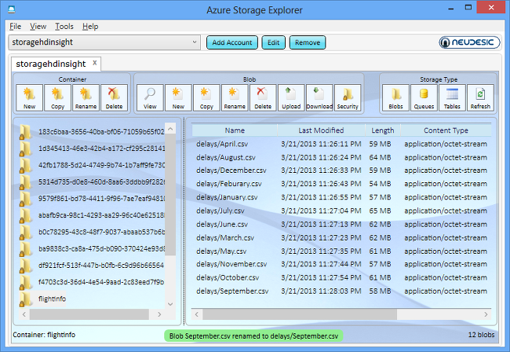

<properties linkid="manage-services-hdinsight-process-blob-data-and-write-to-sql" urlDisplayName="Hadoop with SQL Database" pageTitle="Using HDInsight to process data and store to SQL Database - Windows Azure" metaKeywords="Azure blob hdinsight, hdinsight blob, hdinsight sql database" metaDescription="How to use HDInsight to retrieve data from Windows Azure Blob Storage, process it, and store the results into a SQL Database." disqusComments="1" umbracoNaviHide="1" writer="bswan"/>

#Using HDInsight to Process Blob Storage Data and Write the Results to a SQL Database

Hive provides a means of running MapReduce job through an SQL-like scripting language, called HiveQL, which can be applied towards summarization, querying, and analysis of large volumes of data. This tutorial will show you how to use HiveQL to process data stored in Windows Azure Blob Storage and move the results to a Windows Azure SQL Database. 

**Estimated time to complete:** 30 minutes

##In this article:

* [Download the test data](#downloaddata)
* [Upload data to Windows Azure Blob Storage](#uploaddata)
* [Connect to the Hive console](#connect)
* [Create a Hive table and populate data](#createtable)
* [Execute a HiveQL Query](#executequery)
* [Export data from HDFS to Windows Azure SQL Database](#exportdata)
* [Next Steps](#nextsteps)

##Download the Test Data
In this tutorial, you will use the on-time performance of airline flights data from [Research and Innovative Technology Administration, Bureau of Transportation Statistics][rita-website] (RITA). 

1. Browse to [Research and Innovative Technology Administration, Bureau of Transportation Statistics][rita-website] (RITA).
2. On the page, select the following values:

	<table border="1">
	<tr><th>Name</th><th>Value</th></tr>
	<tr><td>Filter Year</td><td>2012</td></tr>
	<tr><td>Filter Period</td><td>January</td></tr>
	<tr><td>Fields:</td><td>*Year*, *FlightDate*, *UniqueCarrier*, *Carrier*, *FlightNum*, *OriginAirportID*, *Origin*, *OriginCityName*, *OriginState*, *DestAirportID*, *Dest*, *DestCityName*, *DestState*, *DepDelayMinutes*, *ArrDelay*, *ArrDelayMinutes*, *CarrierDelay*, *WeatherDelay*, *NASDelay*, *SecurityDelay*, *LateAircraftDelay* (clear all other fields)</td></tr>
	</table>

3. Click **Download**. Each file could take up to 15 minutes to download.
4. Unzip the file to the **C:\Tutorials** folder.  Each file is a CSV file and is approximately 60 GB in size.
5.	Rename the file to the name of the month that it contains data for. For example, the file containing the January data would be named *January.csv*.
6. Repeat step 2 and 5 to download a file for each of the 12 months in 2012.

##Upload Data to Windows Azure Blob Storage
HDInsight provides two options for storing data, Windows Azure Blob Storage and Hadoop Distributed File system (HDFS). For more information on choosing file storage, see [Using Windows Azure Blob Storage with HDInsight](/en-us/manage/services/hdinsight/howto-blob-store). When you provision an HDInsight cluster, the provision process creates a Windows Azure Blob storage container as the default HDInsight file system. To simplify the tutorial procedures, you will use this container for storing the log4j file.

*Azure Storage Explorer* is a useful tool for inspecting and altering the data in your Windows Azure Storage. It is a free tool that can be downloaded from [http://azurestorageexplorer.codeplex.com/](http://azurestorageexplorer.codeplex.com/ "Azure Storage Explorer").

Before using the tool, you must know your Windows Azure storage account name and account key. For the instructions on creating a Windows Azure Storage account, see [How To Create a Storage Account](/en-us/manage/services/storage/how-to-create-a-storage-account/). For the instructions for get the information, see the *How to: View, copy and regenerate storage access keys* section of [How to Manage Storage Accounts](/en-us/manage/services/storage/how-to-manage-a-storage-account/).

1. Run **Azure Storage Explorer**.

	

2. Click **Add Account** if the Windows Azure storage account has not been added to the tool. 

	

3. Enter **Storage account name** and **Storage account key**, and then click **Add Storage Account**. 
4. From **Storage Type**, click **Blobs** to display the Windows Azure Blob storage of the account.
5. From **Container**, click **New** to create a new container for the flight on-time data.
6. Enter **flightinfo** as the container name, and then click **Create Container**.
7. Click the **flightinfo** container to select it.  
8. From **Blob**, click **Upload**.
9. Select the 12 files and then click **Open**.
10. Select **January.csv**, and then click **Rename**.
11. Prefix the name with **delays/**. When you are finished, you should have file names that look like this:

	

## Connect to the Hive Console
You must have an HDInsight cluster previsioned before you can work on this tutorial. To enable the Windows Azure HDInsight Service preview, click [here](https://account.windowsazure.com/PreviewFeatures). For information on prevision an HDInsight cluster see [How to Administer HDInsight Service](/en-us/manage/services/hdinsight/howto-administer-hdinsight/) or [Getting Started with Windows Azure HDInsight Service](/en-us/manage/services/hdinsight/get-started-hdinsight/).

In this tutorial, you will use the Hive console to run the Hive queries.  The other options is Hadoop Command Line from remote desktop.  

1. Sign in to the [Management Portal](https://manage.windowsazure.com).
2. Click **HDINSIGHT**. You will see a list of deployed Hadoop clusters.
3. Click the name of the HDInsight cluster where you want to connect to.
4. From HDInsight Dashboard, click **Manage**.
5. Enter your credential, and then click **Log On**.
6. From the HDInsight portal, click **Interactive Console**.

 	

7. Click **JavaScript** on the upper right corner.
8. Replace **StorageAccountName** in the following command with your storage account name, and then run the command:

		#ls asv://flightinfo@StorageAccountName.blob.core.windows.net/delays

	You will get the list of files you uploaded using Azure Storage Explorer.

##Create a Hive Table and Populate Data
The next step is to create a Hive table from the data in Azure Storage Vault (ASV)/Blog storage. 

1. From the Interactive console, click **Hive** on the upper right corner.
2. Replace **storageaccountname** in the following query with your Windows Azure Storage account name, and then copy and paste the following code to the query pane:

		create external table delays_raw (
			YEAR string, 
			FL_DATE string, 
			UNIQUE_CARRIER string, 
			CARRIER string, 
			FL_NUM string, 
			ORIGIN_AIRPORT_ID string, 
			ORIGIN string, 
			ORIGIN_CITY_NAME string,
			ORIGIN_CITY_NAME_TEMP string,
			ORIGIN_STATE_ABR string, 
			DEST_AIRPORT_ID string, 
			DEST string, 
			DEST_CITY_NAME string,
			DEST_CITY_NAME_TEMP string, 
			DEST_STATE_ABR string, 
			DEP_DELAY_NEW float, 
			ARR_DELAY_NEW float, 
			CARRIER_DELAY float, 
			WEATHER_DELAY float, 
			NAS_DELAY float, 
			SECURITY_DELAY float, 
			LATE_AIRCRAFT_DELAY float
		)
		row format delimited 
		fields terminated by ',' 
		lines terminated by '\n' 
		stored as textfile 
		location 'asv://flightinfo@storageaccountname.blob.core.windows.net/delays';
	
	This query specifies that fields are delimited by commas and that lines are terminated by "\n". This poses a problem when field values *contain* commas because Hive cannot differentiate between a comma that is a field delimiter and a one that is part of a field value (which is the case in field values for ORIGIN\_CITY\_NAME and DEST\_CITY\_NAME). To address this, the query below creates TEMP columns to hold data that is incorrectly split into columns. 

	The ASV location is specified in the last line. 

3. Click **Evaluate**. After executing the query above, you should see output similar to the following:

		Hive history file=c:\apps\dist\hive-0.9.0\logs/hive_job_log_RD00155D47138A$_201303220043_1470884017.txt
		Logging initialized using configuration in file:/C:/apps/dist/hive-0.9.0/conf/hive-log4j.properties
		OK
		Time taken: 19.924 seconds

4. It is helpful to clean up the data before further processing. The following query creates a new table, *delays*, from the *delays_raw* table. Note that the TEMP columns (as mentioned previously) are not copied, and that the *substring* function is used to remove quotation marks from the data. Copy and paste the following query to the query pane.

		create table delays as 
			select 
			YEAR as year, 
			FL_DATE as flight_date, 
			substring(UNIQUE_CARRIER, 2, length(UNIQUE_CARRIER) -1) as unique_carrier, 
			substring(CARRIER, 2, length(CARRIER) -1) as carrier, 
			substring(FL_NUM, 2, length(FL_NUM) -1) as flight_num, 
			ORIGIN_AIRPORT_ID as origin_airport_id, 
			substring(ORIGIN, 2, length(ORIGIN) -1) as origin_airport_code, 
			substring(ORIGIN_CITY_NAME, 2) as origin_city_name,
			substring(ORIGIN_STATE_ABR, 2, length(ORIGIN_STATE_ABR) -1)  as origin_state_abr, 
			DEST_AIRPORT_ID as dest_airport_id, 
			substring(DEST, 2, length(DEST) -1) as dest_airport_code,
			substring(DEST_CITY_NAME,2) as dest_city_name,
			substring(DEST_STATE_ABR, 2, length(DEST_STATE_ABR) -1) as dest_state_abr, 
			DEP_DELAY_NEW as dep_delay_new, 
			ARR_DELAY_NEW as arr_delay_new, 
			CARRIER_DELAY as carrier_delay, 
			WEATHER_DELAY as weather_delay, 
			NAS_DELAY as nas_delay, 
			SECURITY_DELAY as security_delay, 
			LATE_AIRCRAFT_DELAY as late_aircraft_delay
		from delays_raw;
	
5. Click **Evaluation**. After executing the query above, you should see output similar to the following:

		Hive history file=c:\apps\dist\hive-0.9.0\logs/hive_job_log_RD00155D47138A$_201303220044_1441304939.txt
		Logging initialized using configuration in file:/C:/apps/dist/hive-0.9.0/conf/hive-log4j.properties
		Total MapReduce jobs = 2
		Launching Job 1 out of 2
		Number of reduce tasks is set to 0 since there's no reduce operator
		Starting Job = job_201303211209_0001, Tracking URL = http://jobtrackerhost:50030/jobdetails.jsp?jobid=job_201303211209_0001
		Kill Command = c:\apps\dist\hadoop-1.1.0-SNAPSHOT\bin\hadoop.cmd job -Dmapred.job.tracker=jobtrackerhost:9010 -kill job_201303211209_0001
		Hadoop job information for Stage-1: number of mappers: 3; number of reducers: 0
		2013-03-22 00:45:24,721 Stage-1 map = 0%, reduce = 0%
		2013-03-22 00:45:53,911 Stage-1 map = 11%, reduce = 0%, Cumulative CPU 10.155 sec
		2013-03-22 00:45:55,933 Stage-1 map = 26%, reduce = 0%, Cumulative CPU 10.155 sec
		2013-03-22 00:46:14,087 Stage-1 map = 34%, reduce = 0%, Cumulative CPU 10.155 sec
		2013-03-22 00:46:16,102 Stage-1 map = 45%, reduce = 0%, Cumulative CPU 10.155 sec
		2013-03-22 00:46:17,108 Stage-1 map = 53%, reduce = 0%, Cumulative CPU 10.155 sec
		2013-03-22 00:46:32,253 Stage-1 map = 60%, reduce = 0%, Cumulative CPU 109.905 sec
		2013-03-22 00:46:34,287 Stage-1 map = 71%, reduce = 0%, Cumulative CPU 122.481 sec
		2013-03-22 00:46:35,299 Stage-1 map = 79%, reduce = 0%, Cumulative CPU 122.481 sec
		2013-03-22 00:46:51,454 Stage-1 map = 85%, reduce = 0%, Cumulative CPU 178.753 sec
		2013-03-22 00:46:54,483 Stage-1 map = 94%, reduce = 0%, Cumulative CPU 207.06 sec
		2013-03-22 00:47:09,617 Stage-1 map = 100%, reduce = 0%, Cumulative CPU 236.243 sec
		2013-03-22 00:47:12,644 Stage-1 map = 100%, reduce = 100%, Cumulative CPU 236.243 sec
		MapReduce Total cumulative CPU time: 3 minutes 56 seconds 243 msec
		Ended Job = job_201303211209_0001
		Ended Job = -1956163205, job is filtered out (removed at runtime).
		Moving data to: asv://hdiisme@storagehdinsight.blob.core.windows.net/hive/scratch/hive_2013-03-22_00-44-58_019_4133627448632003034/-ext-10001
		Moving data to: asv://hdiisme@storagehdinsight.blob.core.windows.net/hive/warehouse/delays
		Table default.delays stats: [num_partitions: 0, num_files: 3, num_rows: 0, total_size: 647693543, raw_data_size: 0]
		6096774 Rows loaded to asv://hdiisme@storagehdinsight.blob.core.windows.net/hive/scratch/hive_2013-03-22_00-44-58_019_4133627448632003034/-ext-10000
		MapReduce Jobs Launched: 
		Job 0: Map: 3 Cumulative CPU: 236.243 sec HDFS Read: 1493 HDFS Write: 0 SUCCESS
		Total MapReduce CPU Time Spent: 3 minutes 56 seconds 243 msec
		OK
		Time taken: 139.283 seconds

##Execute a HiveQL Query
After the *delays* table has been created, you are now ready to run queries against it.

1. Replace **username** in the following query with the username you used to log into the cluster, and then copy and paste the following query into the query pane

		INSERT OVERWRITE DIRECTORY '/user/username/queryoutput' select regexp_replace(origin_city_name, '''', ''), avg(weather_delay) from delays where weather_delay is not null group by origin_city_name;

	This query computes the average weather delay and groups the results by city name. It will also output the results to HDFS. Note that the query will remove apostrophes from the data and will exclude rows where the value for *weather_deal*y is *null*, which is necessary because Sqoop, used in the next step, doesn't handle those values gracefully by default.

2. Click **Evaluate**. The output from the query above should look similar to the following:

		Hive history file=c:\apps\dist\hive-0.9.0\logs/hive_job_log_RD00155D47138A$_201303220108_1260638792.txt
		Logging initialized using configuration in file:/C:/apps/dist/hive-0.9.0/conf/hive-log4j.properties
		Total MapReduce jobs = 1
		Launching Job 1 out of 1
		Number of reduce tasks not specified. Estimated from input data size: 1
		In order to change the average load for a reducer (in bytes):
		 set hive.exec.reducers.bytes.per.reducer=
		In order to limit the maximum number of reducers:
		 set hive.exec.reducers.max=
		In order to set a constant number of reducers:
		 set mapred.reduce.tasks=
		Starting Job = job_201303211209_0002, Tracking URL = http://jobtrackerhost:50030/jobdetails.jsp?jobid=job_201303211209_0002
		Kill Command = c:\apps\dist\hadoop-1.1.0-SNAPSHOT\bin\hadoop.cmd job -Dmapred.job.tracker=jobtrackerhost:9010 -kill job_201303211209_0002
		Hadoop job information for Stage-1: number of mappers: 2; number of reducers: 1
		2013-03-22 01:08:45,637 Stage-1 map = 0%, reduce = 0%
		2013-03-22 01:09:04,684 Stage-1 map = 79%, reduce = 0%, Cumulative CPU 10.248 sec
		2013-03-22 01:09:07,700 Stage-1 map = 100%, reduce = 0%, Cumulative CPU 22.809 sec
		2013-03-22 01:09:13,700 Stage-1 map = 100%, reduce = 33%, Cumulative CPU 22.809 sec
		2013-03-22 01:09:19,715 Stage-1 map = 100%, reduce = 100%, Cumulative CPU 24.574 sec
		MapReduce Total cumulative CPU time: 24 seconds 574 msec
		Ended Job = job_201303211209_0002
		Moving data to: /user/admin/queryoutput
		298 Rows loaded to /user/admin/queryoutput
		MapReduce Jobs Launched: 
		Job 0: Map: 2 Reduce: 1 Cumulative CPU: 24.574 sec HDFS Read: 574 HDFS Write: 0 SUCCESS
		Total MapReduce CPU Time Spent: 24 seconds 574 msec
		OK
		Time taken: 73.156 seconds

3. Click **JavaScript** on the upper right corner to switch to the JavaScript console.
4. Run the following command to check the result, with **username** replaced with the username of the user you are currently logged in as.

		js> #cat asv:///user/username/queryoutput/000000_0		
		
	
##Export Data from HDFS to Windows Azure SQL Database

Before copying data from HDFS to a Windows Azure SQL Database, the SQL Database must exist. To create a database, follow the instructions here: [Getting started with Windows Azure SQL Database](http://www.windowsazure.com/en-us/manage/services/sql-databases/getting-started-w-sql-databases/). Note that your table schema must match that of the data in HDFS and it must have a clustered index. To use the command below, create a database called **MyDatabase** and a table called **AvgDelays** with the following schema:

![Table schema][table-schema]

1. Sign in to the [Management Portal](https://manage.windowsazure.com).
2. Click **HDINSIGHT**. You will see a list of deployed Hadoop clusters.
3. Click the Hadoop cluster where you want to upload data to.
4. Click **Manage** on the bottom of the page
5. Enter **User name** and **Password** for the cluster, and then click **Log On**.
6. Click **Remote Desktop**.
	
	

7. Click **Open**.
9. Enter your credentials, and then click **OK**.
10. Click **Yes**.
11. From the desktop, click **Hadoop Command Line**.
12. Run the following command to change directory:

		cd ..\sqoop-1.4.2\bin

13. Replacing **SERVER**, **USER**, **PASSWORD**, **DATABASE**, and **username** with the appropriate values, and the Execute the command:

		sqoop-export.cmd --connect "jdbc:sqlserver://SERVER.database.windows.net;username=USER@SERVER;password=PASSWORD;database=DATABASE" --table AvgDelays --export-dir /user/username/queryoutput --fields-terminated-by \001 --lines-terminated-by '\r\n'
	
		The output of the query above should look similar to this:
	
		13/03/03 22:30:11 WARN sqoop.SqoopOptions: Character argument '\r\n' has multiple characters; only the first will be used.
		13/03/03 22:30:11 WARN sqoop.SqoopOptions: Character argument '\r\n' has multiple characters; only the first will be used.
		13/03/03 22:30:11 INFO SqlServer.MSSQLServerManagerFactory: Using Microsoft's SQL Server - Hadoop Connector
		13/03/03 22:30:12 INFO manager.SqlManager: Using default fetchSize of 1000
		13/03/03 22:30:12 INFO tool.CodeGenTool: Beginning code generation
		13/03/03 22:30:12 INFO manager.SqlManager: Executing SQL statement: SELECT TOP 1 * FROM [AvgDelays]
		13/03/03 22:30:12 INFO manager.SqlManager: Executing SQL statement: SELECT TOP 1 * FROM [AvgDelays]
		13/03/03 22:30:12 INFO orm.CompilationManager: HADOOP_HOME is c:\apps\dist\hadoop-1.1.0-SNAPSHOT
		Note: \tmp\sqoop-bswan\compile\9bbc0bc0c3446b2c3e8b55c1f91e113b\AvgDelays.java uses or overrides a deprecated API.
		Note: Recompile with -Xlint:deprecation for details.
		13/03/03 22:30:14 INFO orm.CompilationManager: Writing jar file: \tmp\sqoop-username\compile\9bbc0bc0c3446b2c3e8b55c1f91e113b\AvgDelays.jar
		13/03/03 22:30:14 INFO mapreduce.ExportJobBase: Beginning export of AvgDelays
		13/03/03 22:30:14 INFO manager.SqlManager: Executing SQL statement: SELECT TOP 1 * FROM [AvgDelays]
		13/03/03 22:30:16 INFO input.FileInputFormat: Total input paths to process : 1
		13/03/03 22:30:16 INFO input.FileInputFormat: Total input paths to process : 1
		13/03/03 22:30:16 INFO mapred.JobClient: Running job: job_201303032126_0004
		13/03/03 22:30:17 INFO mapred.JobClient:  map 0% reduce 0%
		13/03/03 22:30:37 INFO mapred.JobClient:  map 100% reduce 0%
		13/03/03 22:30:45 INFO mapred.JobClient: Job complete: job_201303032126_0004
		13/03/03 22:30:45 INFO mapred.JobClient: Counters: 18
		13/03/03 22:30:45 INFO mapred.JobClient:   Job Counters
		13/03/03 22:30:45 INFO mapred.JobClient:     SLOTS_MILLIS_MAPS=22235
		13/03/03 22:30:45 INFO mapred.JobClient:     Total time spent by all reduces waiting after reserving slots (ms)=0
		13/03/03 22:30:45 INFO mapred.JobClient:     Total time spent by all maps waiting after reserving slots (ms)=0
		13/03/03 22:30:45 INFO mapred.JobClient:     Launched map tasks=1
		13/03/03 22:30:45 INFO mapred.JobClient:     SLOTS_MILLIS_REDUCES=0
		13/03/03 22:30:45 INFO mapred.JobClient:   File Output Format Counters
		13/03/03 22:30:45 INFO mapred.JobClient:     Bytes Written=0
		13/03/03 22:30:45 INFO mapred.JobClient:   FileSystemCounters
		13/03/03 22:30:45 INFO mapred.JobClient:     FILE_BYTES_READ=152
		13/03/03 22:30:45 INFO mapred.JobClient:     HDFS_BYTES_READ=8460
		13/03/03 22:30:45 INFO mapred.JobClient:     FILE_BYTES_WRITTEN=31494
		13/03/03 22:30:45 INFO mapred.JobClient:   File Input Format Counters
		13/03/03 22:30:45 INFO mapred.JobClient:     Bytes Read=0
		13/03/03 22:30:45 INFO mapred.JobClient:   Map-Reduce Framework
		13/03/03 22:30:45 INFO mapred.JobClient:     Map input records=296
		13/03/03 22:30:45 INFO mapred.JobClient:     Physical memory (bytes) snapshot=96903168
		13/03/03 22:30:45 INFO mapred.JobClient:     Spilled Records=0
		13/03/03 22:30:45 INFO mapred.JobClient:     CPU time spent (ms)=1937
		13/03/03 22:30:45 INFO mapred.JobClient:     Total committed heap usage (bytes)=70975488
		13/03/03 22:30:45 INFO mapred.JobClient:     Virtual memory (bytes) snapshot=129306624
		13/03/03 22:30:45 INFO mapred.JobClient:     Map output records=296
		13/03/03 22:30:45 INFO mapred.JobClient:     SPLIT_RAW_BYTES=138
		13/03/03 22:30:45 INFO mapreduce.ExportJobBase: Transferred 8.2617 KB in 30.8208 seconds (274.4897 bytes/sec)
		13/03/03 22:30:45 INFO mapreduce.ExportJobBase: Exported 296 records.
	
14. Connect to your SQL Database and see average weather delays by city in the "AvgDelays" table:

	![SQL results][sql-results]

## Next Steps
Now that you understand how to upload file to Blob storage, how to populate a Hive table using the data from Blob storage, how to run Hive queries, and how to use Sqoop to export data from HDFS to Windows Azure SQL Database. To learn more, see the following articles:

* [Getting Started with Windows Azure HDInsight Service](/en-us/manage/services/hdinsight/get-started-hdinsight/)
* [Tutorial: Using MapReduce with HDInsight](/en-us/manage/services/hdinsight/using-mapreduce-with-hdinsight/)
* [Tutorial: Using Hive with HDInsight](/en-us/manage/services/hdinsight/using-hive-with-hdinsight/)
* [Tutorial: Using Pig with HDInsight](/en-us/manage/services/hdinsight/using-pig-with-hdinsight/)

[free-trial]: http://www.windowsazure.com/en-us/pricing/free-trial/
[create-storage-account]: http://www.windowsazure.com/en-us/manage/services/storage/how-to-create-a-storage-account/
[rita-website]: http://www.transtats.bts.gov/DL_SelectFields.asp?Table_ID=236&DB_Short_Name=On-Time
[create-cluster-1]: ../media/create-cluster-1.png
[create-cluster-2]: ../media/create-cluster-2.png
[create-cluster-3]: ../media/create-cluster-3.png
[start-dashboard]: ../media/start-dashboard.png
[remote-desktop]: ../media/remote-desktop.png
[asv-files]: ../media/ASV-files.png
[table-schema]: ../media/table-schema.png
[sql-results]: ../media/sql-results.png

