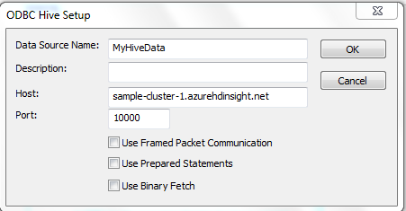
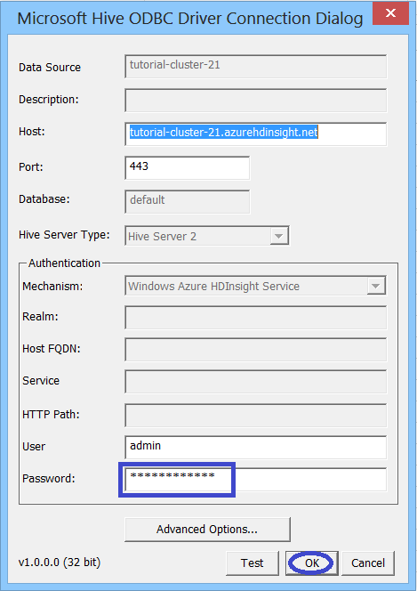
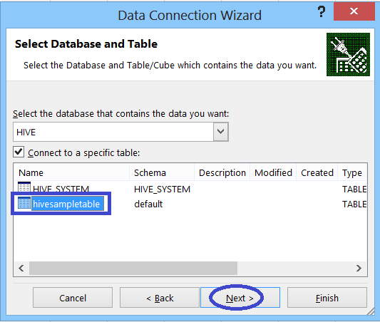
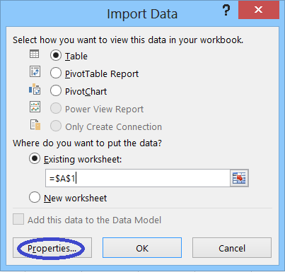
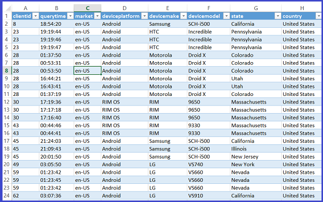

<properties linkid="manage-services-hdinsight-excel-hiveodbc" urlDisplayName="HDInsight and Excel" pageTitle="Connect Excel to HDInsight with the Microsoft Hive ODBC Driver for HDinsight" metaKeywords="hdinsight, excel, hiveodbc, hive excel, hdinsight excel" metaDescription="How to use Excel to access data stored in Windows Azure HDInsight using HiveODBC" umbracoNaviHide="0" disqusComments="1" writer="bradsev" editor="mollybos" manager="paulettm" />

#Connect Excel to HDInsight with the Microsoft Hive ODBC Driver

One key feature of Microsoft’s Big Data Solution is the integration of  Microsoft Business Intelligence (BI) components with Apache Hadoop clusters that have been deployed by the Windows Azure HDInsight Service. An example of this integration is the ability to connect Excel to the Hive data warehouse of an HDInsight Hadoop cluster using the Microsoft Hive Open Database Connectivity (ODBC) Driver. 

It is also possible to connect the data associated with an HDInsight cluster and other data sources, including other (non-HDInsight) Hadoop clusters, from Excel using the Microsoft Power Query add-in for Excel. For information on installing and using Power Query, see [Connect Excel to Windows Azure HDInsight with Power Query][connect-excel-power-query].

This topic walks you through how to set up and use the Microsoft Hive ODBC driver from Excel to query data in an HDInsight cluster. There are three parts to this procedure:

1. [Install the Microsoft Hive ODBC Driver](#InstallHiveODBCDriver)
2. [Create a Hive ODBC Data Source](#CreateHiveODBCDataSource)
3. [Import data into Excel from an HDInsight cluster](#ImportData)

**Prerequisites**:

* You have installed Excel 2010 or Excel 2013.
* You have established a Windows Azure Account and have enabled the HDInsight Service for your subscription. You have created an HDInsight cluster using the HDInsight Service. For instructions on how to do this, see [Getting Started with Windows Azure HDInsight Service][getting-started] 

<h2>Install the Microsoft Hive ODBC Driver</h2>

Follow the steps below to install the Microsoft Hive ODBC Driver.
 
1. The Microsoft Hive ODBC Driver can be downloaded from the [Download Center][hive-odbc-driver-download]. 

2. There are two versions of this installation package (32-bit **HiveODBC32.msi** and 64-bit **HiveODBC64.msi**). You should install the version that matches the version of the application from which you will be using the ODBC driver. Both packages can be installed on the same machine if you need both versions of the driver. 

	
 
4. Click **Next**, accept the terms of the License Agreement and then **Next**, and then accept or change the default destination folder. Click **Next** once more, then **Install**, and then **Yes** on the **User Account Control** to allow installation.

	

5. Once the installation has completed, click **Finish** to exit the Setup Wizard. 

<h2>Create a Hive ODBC Data Source</h2>

The following steps show you how to create a Hive ODBC Data Source.

1. Click **Start** -> **Control Panel** to launch the **Control Panel** for Microsoft Windows. 

2. In the Control Panel, click **System and Security**->**Administrative Tools**. Then click **Data Sources (ODBC)** if you are using Windows 7 or **ODBC Data Sources (32 bit)** or **ODBC Data Sources (64 bit)**, as appropriate, if you are using Windows 8. This will launch the **ODBC Data Source Administrator** dialog. 
 
	 

3. In the **ODBC Data Source Administrator** dialog, click the **User DSN** tab. 

4. Click **Add** to bring up the **Create New Data Source** wizard. 

5. Scroll down and select the ** Hive ODBC Driver** driver in the ODBC driver list.  

	

6. Click the **Finish** button. This will launch the **Microsoft Hive ODBC Driver DNS Setup** dialog. 

7. Enter a data source a name in the **Data Source** box. In this example, *tutorial-cluster-21*. Select **Hive Server 2** from the **Hive Server Type** dropdown menu and **Windows Azure HDInsight Service** from the **Mechanism** dropdown menu in the **Authentication** box. The port should set to *443* and this value should not be changed.

	

8. In the **Host** box, enter the  name of your cluster followed by *.azurehdinsight.net*. For example, if your cluster name is "tutorialcluster" as in the example shown, then the final value for host should be *tutorialcluster.azurehdinsight.net*.

9. Click **Test** to make sure the connection works, then **OK** to close the **Microsoft Hive ODBC Hive Driver Setup** dialog. The new data source should now be listed on the **ODBC Data Source Administrator**. Confirm this and click **OK** to exit the wizard.
	
	

<h2>Import data into Excel from an HDInsight cluster</h2>

The steps below describe the way to import data from a hive table into an Excel workbook using the ODBC data source that you created in the steps above.

1. Open a new or existing workbook in Excel.

2. In Excel, click the **Data** tab. 

3. From the **Get External Data** tile on the left (you may need to **Click** on it for the dropdown menu), select **From Other Data Sources -> From Data Connection Wizard** to launch the **Data Connection Wizard**.

	

4. In **Data Connection Wizard**, select **ODBC DSN** as the data source and click **Next**.

	

5. In the **Connect to ODBC Data Source** dialog, select the Data Source name that you created in the previous step (in our example, *tutorialcluster*) and click **Next**.

	 

6. Re-enter the password for the cluster in the wizard and click **Test** to confirm the connection works and then click **OK**.

	 

7. When the **Select Database and Table** dialog in the **Data Connection Wizard** opens, select the table that you want to import (here, for example, we want the default "hivesamepletable") and click **Next**.

	 

8. When the **Save Data Connection File and Finish** dialog in the **Data Connection Wizard** opens, click the **Finish** button.

	 

9. In the **Import Data** dialog, you can change or specify the query. To do so, click **Properties** to launch the **Connection Properties** dialog. 

	 

10. Click on the **Definition** tab and add "Limit 200" at the end of the query in the **Command text** text box. (You can also replace this query text with another query as needed.) Then click **OK** to return to the **Import Data** dialog. 

	

11. Click **OK** to close the **Import Data** dialog.  In the **DNS Configuration** dialog that opens, re-enter the password and click **OK**.

12. The data from the hive table will open in the Excel workbook, where is can be inspected and analyzed using BI tools.

	  

##Summary

The Microsoft Hive ODBC Driver makes it easy to import data from your HDInsight Service cluster into Excel where Business Intelligence tools may be used to inspect and analyze the data.

## Next steps

In this article you learned how to use the Microsoft Hive ODBC driver to retrieve data from the HDInsight Service into Excel. Similarly, you can retrieve data from the HDInsight Service into SQL Azure. It is also possible to upload data into an HDInsight Service.

* For information on using Sqoop to copy data from an HDInsight Service to SQL Azure, see [Using HDInsight to process Blob Storage data and write the results to a SQL Database][blob-hdi-sql]. 

* For information on using Sqoop or Windows Azure Blob Storage to load data into an HDInsight Service, see [Upload Data to the HDInsight][upload-data].

[connect-excel-power-query]: /en-us/manage/services/hdinsight/connect-excel-with-power-query/
[getting-started]: /en-us/manage/services/hdinsight/get-started-hdinsight/
[hive-odbc-driver-download]: http://go.microsoft.com/fwlink/?LinkID=286698
[blob-hdi-sql]: /en-us/manage/services/hdinsight/process-blob-data-and-write-to-sql/
[upload-data]: /en-us/manage/services/hdinsight/howto-upload-data-to-hdinsight/
