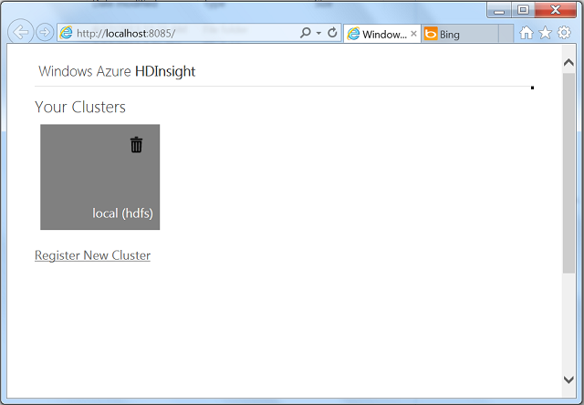
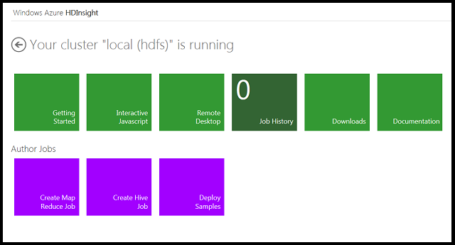
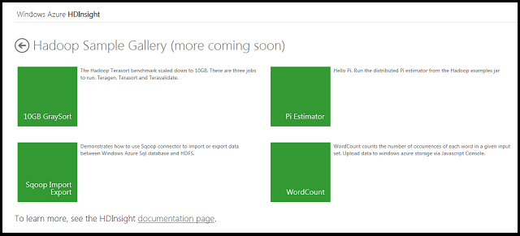
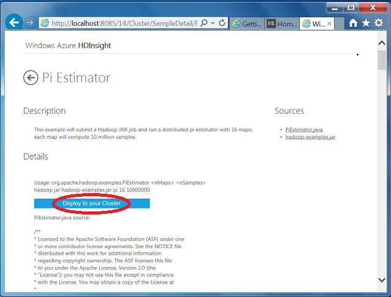
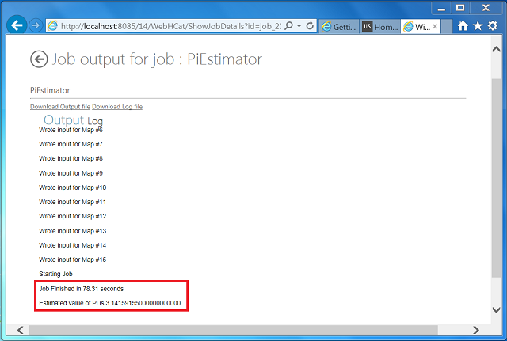

<properties linkid="manage-services-hdinsight-get-started-hdinsight" urlDisplayName="Getting Started" pageTitle="Getting Started with HDInsight - Windows Azure tutorial" metaKeywords="hdinsight, hdinsight service, hdinsight azure, getting started hdinsight" metaDescription="Learn how to use the Windows Azure HDInsight service." umbracoNaviHide="0" disqusComments="1" writer="bradsev" editor="mollybos" manager="paulettm" />

# Getting Started with HDInsight Server Developer Preview 

This tutorial gets you started using HDInsight Server Developer Preview, an implementation of HDInsight on Windows. This Developer Preview of Apache™ Hadoop™-based services on Windows uses only a single node deployment. HDInsight Server provides a local development environment for the Windows Azure HDInsight Service. 

Like the Windows Azure HDInsight Service, this local development environment for HDInsight simplifies the configuring, running, and post-processing of Hadoop jobs by providing JavaScript and Hive interactive consoles. The JavaScript console is unique to HDInsight and handles Pig Latin as well as JavaScript and Hadoop file system commands. 

The HDInsight Server Developer Preview provides the same components from the Hadoop ecosystem as Windows Azure HDInsight Service. For details, including information on the versions deployed, see [What version of Hadoop is in Windows Azure HDInsight?](http://www.windowsazure.com/en-us/manage/services/hdinsight/howto-hadoop-version/ "HDInsight components and versions").

It is now possible to configure a local cluster in the HDInsight Server Developer Preview to use Azure Storage instead of local storage. This procedure is not covered in this getting started topic. But, for instructions on how to configure this more advanced scenario, see the [Release Notes](http://gettingstarted.hadooponazure.com/releaseNotes.html#asv "use azure storage").

**Minimum OS requirements for installing HDInsight**	
HDInsight requires a 64-bit version of Windows. One of the following requirements must be satisfied:

- Windows 7 Service Pack 1
- Windows Server 2008 R2 Service Pack1
- Windows 8 
- Windows Server 2012.

In this tutorial you will learn how to:

* [Launch the Microsoft Web Installer 4.5](#launch)
* [Install the HDInsight Server Developer Preview](#install)
* [Use the HDInsight Server dashboard and sample gallery](#dashboard)
* [Run a sample](#sample)

##Launch the Microsoft Web Installer 4.5

1. Go to the Microsoft Web Platform Installer 4.5 [download page](http://www.microsoft.com/web/downloads/platform.aspx).

	

2. Click the **Free Download** button on this page. Click the **Run** button when prompted for the installation of wpilauncher.exe at the bottom of the page. 

3. Click the **Yes** button in the **User Account Control** window that pops up to complete the installation. This installation will update any earlier version you might have used previously with the latest version of the installer, if that is necessary, automatically. The Web Platform Installer 4.5 will also open automatically.

##Install the HDInsight Server Developer Preview

1. Type *HDInsight* in the upper right hand search box and hit enter to find the Microsoft HDInsight for Developer Preview item to install.

	

2. Click the **Add** button to select the *Microsoft HDInsight Developer Preview* to install and then click the **Install** button.

3. Click the **I Accept** button to agree to the licensing terms for Microsoft and Hortonworks and the installation will begin. Note that the Web Platform Installer will also install any dependencies that are required by HDInsight. 

	

4. The installation should have installed four icons on your desktop. Look on the desktop to confirm that they are there. The four icons are linked as follows: 

- **Hadoop Name Node Status**: The NameNode maintains a tree-based directory for all the files in HDFS. It also keep tracks of where the data for all the files are kept in a Hadoop cluster. Clients communicate with the NameNode in order to figure out where the data nodes for all the files are stored.

- **Hadoop MapReduce Status**: The job tracker that allocates MapReduce tasks to nodes in a cluster.

- **Microsoft HDInsight Dashboard**: The local dashboard that serves as the starting point for using the Developer Preview of Apache™ Hadoop™-based services on Windows.

- **Hadoop Command Line**: The Hadoop command prompt from which MapReduce, Pig and Hive jobs are run in the Developer Preview.

	

5. Double-click on the **Hadoop Command Line** icon on the desktop. It should open to the *C:\Hadoop\hadoop-1.1.0-SNAPSHOT>* prompt. Type *cd ..* to navigate to the Hadoop directory and type *dir* to see what it contains. It should have the items shown below.

	

6. For known issues with installing and running HDInsight Server, see the [Release Notes](https://gettingstarted.hadooponazure.com/releaseNotes.html).

##The HDInsight Server dashboard and sample gallery

This section explains how to get to the HDInsight Server dashboard and sample gallery.

1. Click on the **Microsoft HDInsight Dashboard** icon on the desktop to open the local dashboard that provides the starting point for using the Developer Preview. This takes you to the **Your Clusters** dashboard. 

	

2. Click on the **local (hdfs)** tile to open the main HDInsight dashboard.

	

3. There are six green tiles on the HDInsight Dashboard:

- **Getting Started**: Links to hello world tutorial, training, support forums, feature voting channels, release notes, .NET SDK for Hadoop, and related links for HDInsight and Hadoop.

- **Interactive Console**: The interactive console provided by Microsoft to simplify configuring and running Hadoop jobs and interacting with the deployed clusters. This simplified approach using JavaScript and Hive consoles enables IT professionals and a wider group of developers to deal with big data management and analysis by providing an accessible path into the Hadoop framework.

- **Remote Desktop**: Remote into your HDFS cluster.

- **Job History**: Records the jobs that have been run on your cluster.

- **Downloads**: Downloads for Hive ODBC driver and Hive Add-in for Excel that enable Hadoop integration with Microsoft BI Solutions. Connect Excel to the Hive data warehouse framework in the Hadoop cluster via the Hive ODBC driver to access and view data in the cluster. 

 - **Documentation**: Links to the Windows Azure HDInsight Service documentation, most of which is also valid for the HDInsight Server Developer Preview.

4. There are also three purple tiles that link to tools for authoring and submitting jobs from the dashboard, which are discussed in the next section.

- **Create Map Reduce Jobs**: Takes you to a UI for specifying Map Reduce jobs and the cluster on which you are submitting them to run.

- **Create Hive Jobs**: Takes you to the interactive **Hive Console** from which HiveQL, a dialect of SQL, can be used to query data stored in you HDFS cluster. Hive is for analysts with strong SQL skills providing an SQL-like interface and a relational data model. Hive uses a language called HiveQL; a dialect of SQL.

- **Deploy Samples**: Takes you to the gallery of samples that ship with the HDInsight DInsight Server Developer Preview. This is a set of sample jobs that you can run to quickly and easily get started with HDInsight.

##Run a sample
There are several options available to run a job in HDInsight. You can RDP into the cluster and run them directly from the head node. You can submit them remotely using the REST API's on the cluster. But the easiest way to run a job is to leverage the authoring tools provided by the HDInsight dashboard. You can use the Interactive JavaScript console to execute Pig or Hive or JavaScript Map Reduce programs, or you can create a Map Reduce or Hive job from one of the Author Jobs tools. For getting started, the simplest way to run a sample job is to use the UI provided by the Sample Gallery that ships with HDInsight Server. That is the procedure described in this section.

1. After you have created your cluster, click on the **Deploy Samples** tile in the main dashboard to see the four samples that ship in the Hadoop Sample Gallery.

	

2. To run one of these samples, simply click on the tile, follow any instructions provided on the particular sample page, and click on the **Deploy to your Cluster** button. The simplest example is provided by the Pi Estimator sample. Note that the relevant java and jar files are provided for each sample and can be downloaded and opened for inspection.

	

3. Once the job has started, the page provides status on the progress of both the map and reduce components of the job.

	

## Summary

You have seen how to get the HDInsight Server Developer Preview installed, had a brief tour of the dashboard, and seen how to run a sample job using the tools provided by the dashboard.

## Additional Resources:

- Additional installation issues for the HDInsight Developer Preview may be found in the [Release Notes](https://gettingstarted.hadooponazure.com/releaseNotes.html).

- Microsoft HDInsight feature suggestions may be made on the [Feature Voting](http://hdinsight.uservoice.com/forums/174476-microsoft-hdinsight-feature-suggestions) page.

- There is a forum for asking questions and discussing issues at the  [MSDN forum for discussing HDInsight for Windows and Windows Azure](http://social.msdn.microsoft.com/Forums/en-US/hdinsight).

##Next Steps

For more information on how to run MapReduce, Hive, and Pig jobs, see [Getting Started with the HDInsight Server Developer Preview](http://social.technet.microsoft.com/wiki/contents/articles/14143.getting-started-with-the-hdinsight-server-developer-preview.aspx).

Much of the information available on the Windows Azure site for the HDInsight Service is relevant to this development environment. See the documentation provided at [HDInsight](http://www.windowsazure.com/en-us/manage/services/hdinsight/) landing page.

