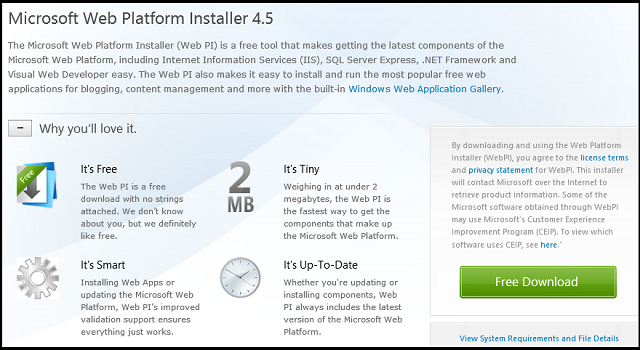
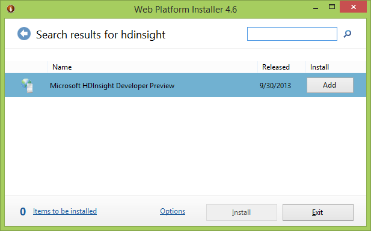
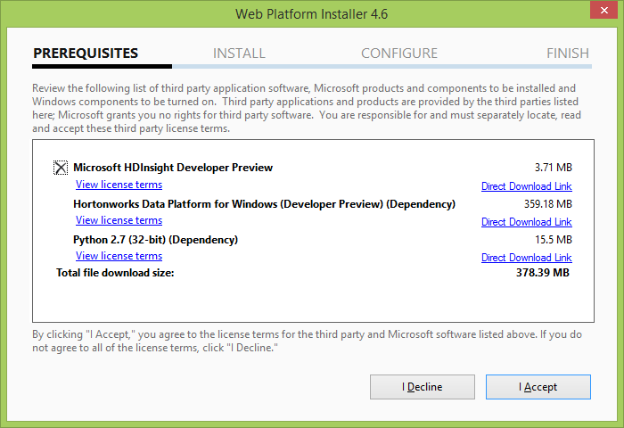
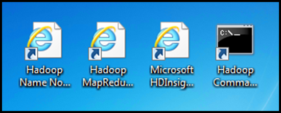
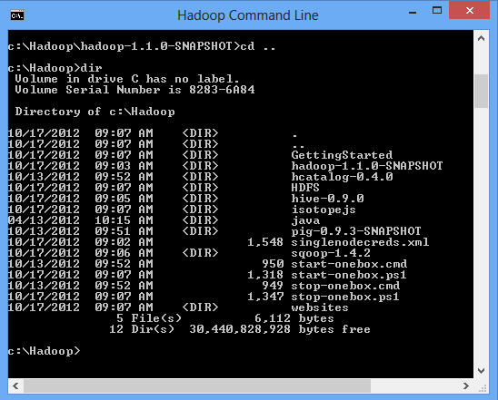

<properties linkid="manage-services-hdinsight-get-started-hdinsight" urlDisplayName="Getting Started" pageTitle="Getting Started with HDInsight - Windows Azure tutorial" metaKeywords="hdinsight, hdinsight service, hdinsight azure, getting started hdinsight" metaDescription="Learn how to use the Windows Azure HDInsight service." umbracoNaviHide="0" disqusComments="1" writer="bradsev" editor="mollybos" manager="paulettm" />

# Getting Started with HDInsight Server Developer Preview 

This tutorial gets you started using HDInsight Server Developer Preview, an implementation of HDInsight on Windows. This Developer Preview of Apache™ Hadoop™-based services on Windows uses only a single node deployment. HDInsight Server provides a local development environment for the Windows Azure HDInsight Service. 

Windows Azure HDInsight Service makes Apache Hadoop available as a service in the cloud. The cloud service makes the HDFS/MapReduce software framework available in a simpler, more scalable, and cost efficient environment. In particular, it simplifies the configuring, running, and post-processing of Hadoop jobs by providing JavaScript and Hive interactive consoles. The JavaScript console is unique to HDInsight and handles Pig Latin as well as JavaScript and Hadoop file system commands. These consoles and other dashboard features used to configure and run MapReduce jobs are also available for developers to use in this preview.

In this tutorial you will learn how to:

* [Launch the Microsoft Web Installer 4.5](#launch)
* [Install the HDInsight Server Developer Preview](#install)
* [Use the HDInsight Server dashboard and sample gallery](#dashboard)

##Launch the Microsoft Web Installer 4.5

1. Go to the Microsoft Web Platform Installer 4.5 [download page](http://www.microsoft.com/web/downloads/platform.aspx).

	

2. Click the **Free Download** button on this page. Click the **Run** button when prompted for the installation of wpilauncher.exe at the bottom of the page. 

3. Click the **Yes** button in the **User Account Control** window that pops up to complete the installation. This installation will update any earlier version you might have used previously with the latest version of the installer, if that is necessary, automatically. The Web Platform Installer 4.5 will also open automatically.

##Install the HDInsight Server Developer Preview

1. Type *HDInsight* in the upper right hand search box and hit enter to find the Microsoft HDInsight for Developer Preview item to install.

	

2. Click the **Add** button to select the *Microsoft HDInsight Developer Preview* to install and then click the **Install** button.

3. Click the **I Accept** button to agree to the licensing terms for Microsoft and Hortonworks and the installation will begin.

	

4. The installation should have installed four icons on your desktop. Look on the desktop to confirm that they are there. The four icons are linked as follows: 

- **Hadoop Name Node Status**: The NameNode maintains a tree-based directory for all the files in HDFS. It also keep tracks of where the data for all the files are kept in a Hadoop cluster. Clients communicate with the NameNode in order to figure out where the data nodes for all the files are stored.

- **Hadoop MapReduce Status**: The job tracker that allocates MapReduce tasks to nodes in a cluster.

- **Microsoft HDInsight Dashboard**: The local dashboard that serves as the starting point for using the Developer Preview of Apache™ Hadoop™-based services on Windows.

- **Hadoop Command Line**: The Hadoop command prompt from which MapReduce, Pig and Hive jobs are run in the Developer Preview.

	

5. Double-click on the **Hadoop Command Line** icon on the desktop. It should open to the *C:\Hadoop\hadoop-1.1.0-SNAPSHOT>* prompt. Type *cd ..* to navigate to the Hadoop directory and type *dir* to see what it contains. It should have the items shown below.

	

##The HDInsight Service dashboard and sample gallery

This section explains how to get to the HDInsight Service dashboard and sample gallery.

1. Click on the **Microsoft HDInsight Dashboard** icon on the desktop to open the local dashboard that provides the starting point for using the Developer Preview.

2. There are five tiles on the HDInsight Dashboard:

- **Getting Started**: Links to hello world tutorials, training, support forums, feature voting channels, and release notes.

- **Interactive Console**: The interactive console provided by Microsoft to simplify configuring and running Hadoop jobs and interacting with the deployed clusters. This simplified approach using JavaScript and Hive consoles enables IT professionals and a wider group of developers to deal with big data management and analysis by providing an accessible path into the Hadoop framework.

- **Job History**: Records the jobs that have been run on your cluster.

- **Downloads**: Downloads for Hive ODBC driver and Hive Add-in for Excel that enable Hadoop integration with Microsoft BI Solutions. Connect Excel to the Hive data warehouse framework in the Hadoop cluster via the Hive ODBC driver to access and view data in the cluster.

- **Create Job**: Create Job UI for running MapReduce programs using Hadoop jar files. 

 
## Summary

You have seen how to get HDInsight Server Developer Preview installed and had a brief tour of the dashboard.

## Additional Resources:

- Additional installation issues for the HDInsight Developer Preview may be found in the [Release Notes](https://gswhowmaterials.azurewebsites.net/releaseNotes.html).

- Microsoft HDInsight feature suggestions may be made on the [Feature Voting](http://hdinsight.uservoice.com/forums/174476-microsoft-hdinsight-feature-suggestions) page.

- There is a forum for asking questions and discussing issues at the  [MSDN forum for discusssing HDInsight for Windows and Windows Azure](http://social.msdn.microsoft.com/Forums/en-US/hdinsight).

##Next Steps

For more information on how to run MapReduce, Hive, and Pig jobs, see [Getting Started with the HDInsight Server Developer Preview](http://social.technet.microsoft.com/wiki/contents/articles/14143.getting-started-with-the-hdinsight-server-developer-preview.aspx).

