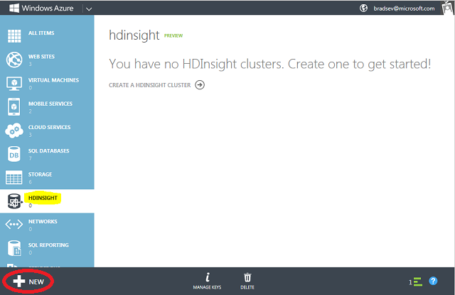
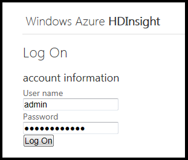
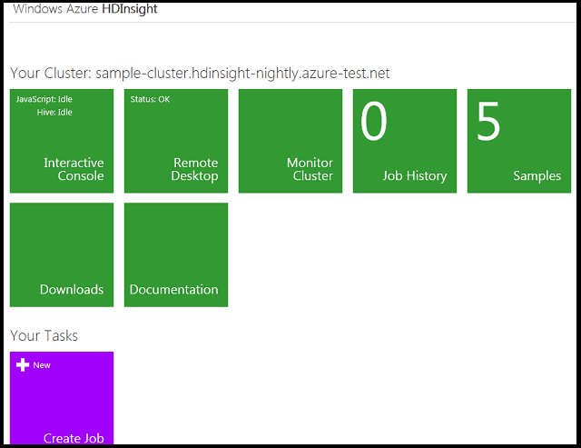
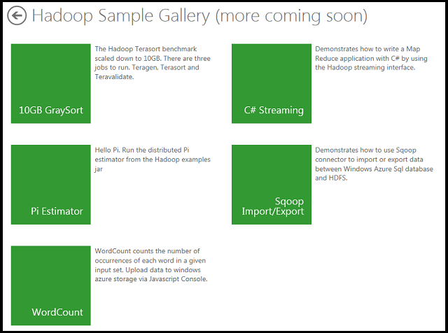
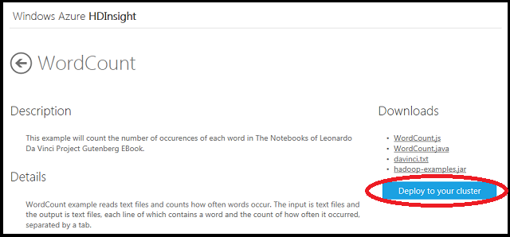
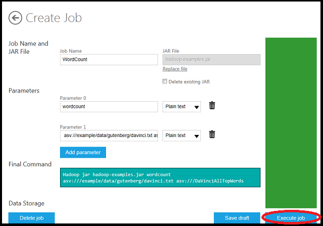
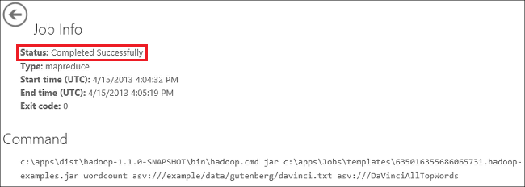
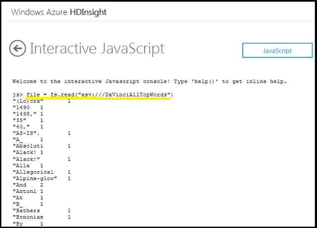

<properties linkid="manage-services-hdinsight-get-started-hdinsight" urlDisplayName="Getting Started" pageTitle="Getting Started with HDInsight - Windows Azure tutorial" metaKeywords="hdinsight, hdinsight service, hdinsight azure, getting started hdinsight" metaDescription="Learn how to use the Windows Azure HDInsight service." umbracoNaviHide="0" disqusComments="1" writer="bradsev" editor="mollybos" manager="paulettm" />

# Getting Started with Windows Azure HDInsight Service

This tutorial gets you started using Windows Azure HDInsight Service. HDInsight Service makes [Apache Hadoop](http://hadoop.apache.org/) available as a service in the cloud. It makes the HDFS/MapReduce software framework available in a simpler, more scalable, and cost efficient Windows Azure environment. In particular, HDInsight simplifies the configuring, running, and post-processing of Hadoop jobs by providing JavaScript and Hive interactive consoles. The JavaScript console is unique to HDInsight and handles Pig Latin as well as JavaScript and Hadoop file system commands. HDInsight also provides a cost efficient approach to the managing and storing of data. HDInsight Service uses Windows Azure Blob Storage as the default file system. 

##In this Article

* [Enable the HDInsight Service](#subscribe)
* [Create a Windows Azure Storage account](#create)
* [Provision an HDInsight Service cluster](#provision)
* [Use the HDInsight Service dashboard and sample gallery](#dashboard)
* [Run a sample MapReduce program from the sample gallery](#sample)
* [Examine the sample MapReduce program output using the Interactive Console](#console)
* [Next Steps](#nextsteps)

##Enable the HDInsight Service

To complete this tutorial, you need a Windows Azure account that has the Windows Azure HDInsight feature enabled. 

- To create a free Windows Azure trial account in just a couple of minutes, see [Windows Azure Free Trial](/en-us/pricing/free-trial/ "Windows Azure Free Trial"). 

- To enable the Windows Azure HDInsight preview, see <a href="/en-us/develop/net/tutorials/create-a-windows-azure-account/#enable" target="_blank">Enable Windows Azure preview features</a>

 
<b>Note</b> 

While the HDInsight Service is available as part of a Windows Azure Trial subscription, a trial subscription places limits on the amount of compute and storage resources available to you. For more information, see the [Windows Azure Free Trial](/en-us/pricing/free-trial/ "Windows Azure Free Trial") page.
 

##Create a Windows Azure Storage Account
The HDInsight provision process requires a Windows Azure Storage account to be used as the default file system. For instructions, see
[How to Create a Storage Account](http://www.windowsazure.com/en-us/manage/services/storage/how-to-create-a-storage-account/ "CreateAnAsvAccount") and [Using Windows Azure Blob Storage with HDInsight](/en-us/manage/services/hdinsight/howto-blob-store/).

 
<b>Note</b> 

Your storage account should be created in the US East data center as storage accounts must be collocated with the HDInsight Service compute resources which are in US East.
 

##Provision an HDInsight Service Cluster
You can use the Windows Azure Management portal to create and configure a new Hadoop Cluster. 

1. Sign in to the [Management Portal](https://manage.windowsazure.com/). 

2. Click **HDInsight** on the left to list the status of the clusters in your account. In the following screenshot, there is one existing HDInsight cluster. The list will be empty if this is the first time you have used the HDInsight Service.

	

3. Click **NEW** on the lower left side, click **Data Services**, click **HDInsight**, and then click **Quick Create**.

	

4. Enter or select the following values:

	<table border="1">
	<tr><th>Name</th><th>Value</th></tr>
	<tr><td>Cluster Name</td><td>Name of the cluster</td></tr>
	<tr><td>Cluster Size</td><td>Number of data nodes you want to deploy. The default value is 4. But 8, 16 and 32 data node clusters are also available on the dropdown menu. Any number of data nodes may be specified when using the <b>Custom Create</b> option. Pricing details on the billing rates for various cluster sizes are available. Click the <b>?</b> symbol just above the dropdown box and follow the link on the pop up.</td></tr>
	<tr><td>Password (cluster admin)</td><td>The password for the account <i>admin</i>. The cluster user name is specified to be "admin" by default when using the Quick Create option. This can only be changed by using the **Custom Create** wizard. The password field must be at least 10 characters and must contain an uppercase letter, a lowercase letter, a number, and a special character.</td></tr>
	<tr><td>Storage Account</td><td>Select a key from the Windows Azure Storage account that you want to associate with this cluster from the dropdown box.  

	
 
	<b>Note</b> 
	
Once as Storage account is chosen, it cannot be changed. If the storage account is removed, the cluster will no longer be available for use.
 
	

	</td></tr>
	</table>

5. Click **Create HDInsight Cluster** on the lower right. The cluster is now provisioned and when it will be available when its status is listed as **Running**. 

	
 
	<b>Note</b> 
	
Notice your cluster is automatically located in the East US data center, which is why you co-located your Azure storage account there when creating it
 
	

##Use the HDInsight Service Dashboard and Sample Gallery
This section explains how to get to the HDInsight Service dashboard and sample gallery.

1. From the Windows Azure portal, click the name of the HDInsight cluster. 

2. Click **Dashboard** from the top of the page. The dashboard provides quick glance of the metadata for the cluster.  

	

3. Click **Manage Cluster** on the bottom of the page.

4. Enter your credentials. The **User name** needed is the cluster user name, which was provided on the bottom of the previous dashboard (see the previous screenshot), which is "admin" by default when using the **Quick Create** process. The **Password** it expects is the one that you created for this the cluster (not the Windows Azure password).

	

6. Click **Log On**.  

	

7. Click the **Samples** tile to go to the **Hadoop Sample Gallery**. This page has a tile for each of the samples that ship with the HDInsight Service. Click on a tile to go the the sample. (See the next section for an example.) This page also has links to HDInsight documentation and, from the **Help** text on the lower right, to to the HDInsight forum. 

	

##Run a Sample MapReduce Job from the Sample Gallery

The WordCount sample is one of the samples in the gallery. The sample contains MapReduce programs written in Java that together count word occurrences in a text. The following diagram illustrates how MapReduce works on the word counting.

The output is a set of key-value pairs. The key is a string that specifies a word and the value is an integer that specifies the total number of occurrences of that word in the text. This is done in two stages. The mapper (the cat.exe in this sample) takes each line from the input text as an input and breaks it into words. It emits a key/value pair each time a work occurs of the word followed by a 1. The reducer (the wc.exe in this sample) then sums these individual counts for each word and emits a single key/value pair containing the word followed by the sum of its occurrences.

To run the WordCount sample:

1. Click the **WordCount** tile in the Hadoop Sample Gallery. The page provides the description and downloads for running the sample. 

	

	The downlods include the following files:

		* **davinci.txt**: the input text file
		* **hadoop-examples.jar**: the jar files that contains the files needed by Hadoop on Azure to deploy the application. 
		* **WordCount.java**: the WordCount Java program file.
		* **WordCount.js**

2. Click **Deploy to your cluster** on the right-hand side of the page to begin the deployment. This brings up the **Create Job** page with the fields populated with the Wordcount sample data. 

	

	The *job name* and *parameters* have been assigned default values that will run the WordCount job. 

	**Parameter 1** specifies, respectively, the path/name of the input file (asv:///example/data/gutenberg/davinci.txt) and the output directory where the results will be saved (asv:///DaVinciAllTopWords). The input text file analyzed is the Project Gutenberg eBook edition of "The Notebooks of Leonardo Da Vinci". It comes with the HDInsight deployment.

	The use of the asv:// prefix in the paths of these files. This is needed to indicate Azure Blob Storage is being used for input and output files. The output directory assumes a default path relative to the asv:///user/&lt;username&gt; folder. 

	<!--is the following paragraph correct? -->

	For the purpose of this introduction, the default prefix is being retained. But it is a best practice to use the secure SSL version, asvs://, for transferring your data when you are in production. For information on how to use the secure transport, see [Using HDInsight to process Blob Storage data](/en-us/manage/services/hdinsight/process-blob-data-and-write-to-sql/).

	The **Final Command** contains the Hadoop jar command that executes the MapReduce program with the parameter values provided above. 

3. Click **Execute job** to run the MapReduce job.

7. The status of the deployment is provided on the **Job Info** page and it will indicate when the program has completed, as shown here. 

	

##Examining the Sample MapReduce Program Output Using the Interactive Console

You can use the JavaScript Interactive Console to view the output from the WordCount job. 

1. Click **Winodws Azure HDInsight** on the top of the page to go to the cluster homepage. 
2. Click **Interactive Console** to bring up the Interactive JavaScript console.
3. Run the following commands:

		#ls asv:///DaVinciAllTopWords
	    #cat asv:///DaVinciAllTopWords/part-r-00000

	The #ls command lists the content in the output folder *DavinciAllTopWords*. The output file is part-r-00000. The #cat command show the content in the part-r-00000 file.

	
	
 

##Next steps
You have gotten set up with a Windows Azure and Azure Storage accounts that are needed to access the HDInsight Service. You have learned how to provision a cluster with the HDInsight Service, run a MapReduce job on it, and use the Interactive Console to view the output from the job.

- For information about running more samples, see [How to Run Samples](/en-us/manage/services/hdinsight/howto-run-samples/).
- For other uses of HDInsight Service interactive JavaScript and Hive consoles, see the [HDInsight Interactive JavaScript and Hive Consoles](/en-us/manage/services/hdinsight/interactive-javascript-and-hive-consoles/).
- For more information of MapReduce, see [Using MapReduce with HDInsight](/en-us/manage/services/hdinsight/using-mapreduce-with-hdinsight/).
- For more information of Hive, see [Using Hive with HDInsight](/en-us/manage/services/hdinsight/using-hive-with-hdinsight/).
- For more information of Pig, see [Using Pig with HDInsight](/en-us/manage/services/hdinsight/using-pig-with-hdinsight/).

[jar-syntax]: http://hadoop.apache.org/docs/current/hadoop-project-dist/hadoop-common/CommandsManual.html#jar
