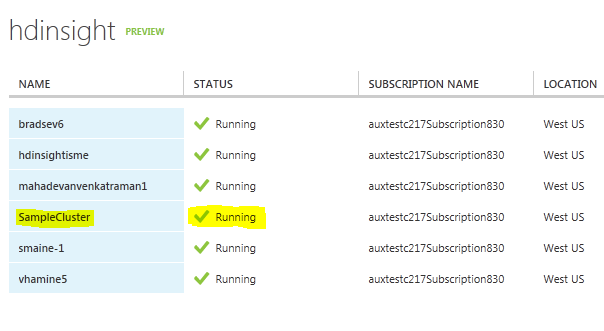
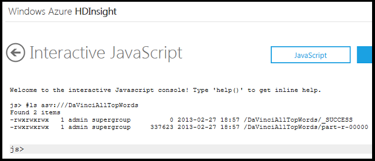

<properties linkid="manage-services-hdinsight-get-started-hdinsight" urlDisplayName="Getting Started" pageTitle="Getting Started with HDInsight - Windows Azure tutorial" metaKeywords="hdinsight, hdinsight service, hdinsight azure, getting started hdinsight" metaDescription="Learn how to use the Windows Azure HDInsight service." umbracoNaviHide="0" disqusComments="1" writer="bradsev" editor="mollybos" manager="paulettm" />

# Getting Started with Windows Azure HDInsight Service

This tutorial gets you started using Windows Azure HDInsight Service. HDInsight Service makes Apache Hadoop available as a service in the cloud. It makes the HDFS/MapReduce software framework available in a simpler, more scalable, and cost efficient environment. 

In particular, it simplifies the configuring, running, and post-processing of Hadoop jobs by providing JavaScript and Hive interactive consoles. The JavaScript console is unique to HDInsight and handles Pig Latin as well as JavaScript and Hadoop file system commands. It also provides a cost efficient approach to the managing and storing of data. HDInsight Service uses Azure Storage by default from which data can be easily accessed for compute and where it can be stored at relatively low cost using Azure Blob Storage. 

In this tutorial you will learn how to:

* [Subscribe to Windows Azure and enable the HDInsight Service](#subscribe)
* [Create and configure a Windows Azure Storage account, which will be used by the HDInsight Service](#create)
* [Provision an HDInsight Service cluster from the Windows Azure portal](#provision)
* [Use the HDInsight Service dashboard and sample gallery](#dashboard)
* [Run a sample MapReduce program](#sample)
* [Use the Interactive Console to examine the output from a MapReduce program](#console)

##Subscribe to a Windows Azure Account and Enable HDInsight Service

To complete this tutorial, you need a Windows Azure account that has the Windows Azure HDInsight feature enabled. 

- If you don't have an account, you can create a free trial account in just a couple of minutes. For details, see [Windows Azure Free Trial](/en-us/pricing/free-trial/ "Windows Azure Free Trial"). 

- If you have an existing account but need to enable the Windows Azure HDInsight preview, see <a href="/en-us/develop/net/tutorials/create-a-windows-azure-account/#enable" target="_blank">Enable Windows Azure preview features</a>

While the HDInsight Service is available as part of a Windows Azure Trial subscription, a trial subscription places limits on the amount of compute and storage resources available to you. For more information, see the [Windows Azure Free Trial](/en-us/pricing/free-trial/ "Windows Azure Free Trial") page.

##Create a Windows Azure Storage account
To complete this tutorial, you need an Azure Storage account. For instructions on how to create one, see
[How to Create a Storage Account](http://www.windowsazure.com/en-us/manage/services/storage/how-to-create-a-storage-account/ "CreateAnAsvAccount"). Note that your storage account should be created in the US East data center as storage accounts must be collocated with the HDInsight Service compute resources which are in US East.

##Provision an HDInsight Service Cluster
This section walks you through the steps to create and configure a new Hadoop Cluster. 

1. Log into your Windows Azure account and go to the Windows Azure portal. 

2. Click the **HDInsight** icon on the left side scroll bar of the portal (highlighted in yellow below) to list the status of the clusters in your account. (The list will be empty if this is the first time you have used the HDInsight Service.)

	

3. To add a new cluster, click the **+NEW** icon on the lower left side (circled in red above). This launches the **NEW HDINSIGHT CLUSTER** wizard. Click the **Quick Create** option on the right side.

	

4. Enter a name for the cluster ("Sample-Cluster" in the example below) and the number of data nodes you want to deploy. The default value is 4. But 8, 16 and 32 data node clusters are also available on the dropdown menu. Any number of data nodes may be specified when using the **Custom Create** option. Pricing details on the billing rates for various cluster sizes are available. Click the **?** symbol just above the dropdown box and follow the link on the pop up.  

	-  Note that the cluster user name is specified to be "admin" by default when using the Quick Create option. This can only be changed by using the **Custom Create** wizard.

	- Enter a password for the cluster user. The password field must be at least 10 characters and must contain an uppercase letter, a lowercase letter, a number, and a special character.

	- Select a key from the Azure storage account that you want to associate with this cluster from the dropdown box. Note that once this choice is made, it cannot be changed. If the storage account is removed, the cluster will no longer be available for use.

	- Click the **CREATE HDINSIGHT CLUSTER** check mark on the lower left. The cluster is now provisioned and when it will be available when its status is listed as **Running** in the Windows Azure portal. Note that your cluster is automatically located in the East US data center, which is why we co-located your Azure storage account there when creating it.

	

##The HDInsight Service dashboard and sample gallery
This section explains how to get to the HDInsight Service dashboard and sample gallery.

1. To get to the dashboard, click the name of the HDInsight Service cluster in the first column of the table on the Windows Azure portal. 

2. The dashboard provides quick glance of the metadata for the cluster. Note that it provides a live URL for the cluster at the top and the cluster user name ("admin" here, which you will need to log on) at the bottom. 

3. To go to the cluster, either click its URL at the top of the page or the **Manage** icon on the lower right.

	

4. When prompted for credentials on the **Log On** page, the **User name** needed is the cluster user name, which was provided (if you have forgot what it is) on the bottom of the previous dashboard, which is "admin" by default when using the **Quick Create** process.

5. The **Password** it expects is the one that you created for this the cluster (not the Windows Azure password).

	

6. Click the **Log On** button to get to the **Windows Azure HDInsight** page.  

	

7. Click the **Samples** tile to go to the **Hadoop Sample Gallery**. this page has a tile for each of the samples that ship with the HDInsight Service. Click on a tile to go the the sample. (See the next section for an example.) This page also has links to HDInsight documentation and, from the **Help** text on the lower right, to to the HDInsight forum. 

	

##Run a MapReduce Job with the HDInsight Service: WordCount

This section briefly describes what the Workcount MapReduce programs do and shows how to run the Wordcount sample using the **Create Job** UI provided by the HDInsight Service. 

###The Wordcount MapReduce programs	
The sample contains MapReduce programs written in Java that together count word occurrences in a text: 

- The input text file analyzed is the Project Gutenberg eBook edition of "The Notebooks of Leonardo Da Vinci". 

- The output is a set of key-value pairs. The key is a string that specifies a word and the value is an integer that specifies the total number of occurrences of that word in the text. This is done in two stages. The mapper (the cat.exe in this sample) takes each line from the input text as an input and breaks it into words. It emits a key/value pair each time a work occurs of the word followed by a 1. The reducer (the wc.exe in this sample) then sums these individual counts for each word and emits a single key/value pair containing the word followed by the sum of its occurrences. These programs can be downloaded and their code inspected from the deployment page as explained below.

###Run the Wordcount sample

1.  Click the **WordCount** sample icon in the Hadoop Sample Gallery to bring up the deployment page for the sample.

	

2. On the Wordcount deployment page, information is provided about the application and downloads are available for Java MapReduce programs, the input text, and the jar files that contains the files needed by Hadoop on Azure to deploy the application. The java code can be inspected on this page by scrolling down into the **Details** section. Click the **Deploy to your cluster** button on the right-hand side of the page to begin the deployment.

3. This brings up the **Create Job** page for the Wordcount sample. 

	

4. The job name and parameters have been assigned default values that will run the WordCount job.The **Job Name** is "WordCount". **Parameter 0** is just the name of the program, "wordcount". **Parameter 1** specifies, respectively, the path/name of the input file (asv:///example/data/gutenberg/davinci.txt) and the output directory where the results will be saved (asv:///DaVinciAllTopWords). Note that the output directory assumes a default path relative to the asv:///user/&lt;username&gt; folder. 

	Note the use of the asv:// prefix in the paths of these files. This is needed to indicate Azure Blob Storage is being used for input and output files. For the purpose of this introduction, the default prefix is being retained. But it is a best practice to use the secure SSL version, asvs://, for transferring your data when you are in production. For information on how to use the secure transport, see [Using HDInsight to process Blob Storage data](/en-us/manage/services/hdinsight/process-blob-data-and-write-to-sql/).

5. The **Final Command** contains the Hadoop jar command that executes the MapReduce program with the parameter values provided above. See the documentation on [jar syntax ](http://hadoop.apache.org/common/docs/current/commands_manual.html#jar) for details. 

6. To run the program with these default values on your Hadoop cluster, simply click the blue **Execute job** button on the lower right side.

7. The status of the deployment is provided on the **Job Info** page and it will indicate when the program has completed, as shown here. 

	

##Examining Output in the Interactive Console

We can use the JavaScript Interactive Console to view the output from the WordCount job. 

1. To get to the Interactive JavaScript console, return to your tiled Windows Azure HDInsight page. In the **Your Cluster** section and click the **Interactive Console** tile to bring up the Interactive JavaScript console.

2. To confirm that you have the part-r-00000 output file in the DavinciAllTopWords folder that contains the results, enter the command `#ls asv:///DaVinciAllTopWords` in the console check that this file is there.

	

3. To view the word counts, enter the command: "file = fs.read("asv:///DaVinciAllTopWords")" in the console prompt. It is a large file. Scroll back up to see the long list of words and their summmary counts.

	
 
## Summary

You have gotten set up with a Windows Azure and Azure Storage accounts that are needed to access the HDInsight Service. You have learned how to provision a cluster with the HDInsight Service, run a MapReduce job on it, and use the Interactive Console to view the output from the job.

## Next steps

- For information about running more samples, see [How to Run Samples](/en-us/manage/services/hdinsight/howto-run-samples/).
- For other uses of HDInsight Service interactive JavaScript and Hive consoles, see the [HDInsight Interactive JavaScript and Hive Consoles](/en-us/manage/services/hdinsight/interactive-javascript-and-hive-consoles/).
- For more information of Pig, see [Using Pig with HDInsight](/en-us/manage/services/hdinsight/using-pig-with-hdinsight/).
- For more information of Hive, see [Using Hive with HDInsight](/en-us/manage/services/hdinsight/using-hive-with-hdinsight/).
- For more information of MapReduce, see [Using MapReduce with HDInsight](/en-us/manage/services/hdinsight/using-mapreduce-with-hdinsight/).

