<properties linkid="manage-services-hadoop-hadoop-social-web-data" urlDisplayName="Hadoop Social Web Data" pageTitle="Analyzing Twitter Movie Data with Hive - Windows Azure Services" metaKeywords="Azure Twitter Hadoop, Azure Hive query, Azure data Excel, Azure data analysis" metaDescription="A tutorial that teaches you to query and analyze data from Twitter using Apache Hadoop-based Services for Windows Azure and a Hive query in Excel." metaCanonical="" disqusComments="1" umbracoNaviHide="1" writer="wenming"/>

# Analyzing Twitter Movie Data with Hive 
In this tutorial you will query, explore, and analyze data from twitter using Apache Hadoop-based Services for Windows Azure and a Hive query in Excel. Social web sites are one of the major driving forces for Big Data adoption. Public APIs provided by sites like Twitter are a useful source of data for analyzing and understanding popular trends.  

This tutorial is composed of the following segments:

1. [Search for, download, install, and use Microsoft Analytics for Twitter](#segment1).
1. [Get Twitter Feed using cURL and Twitter Streaming API](#segment2).
1. [Request and configure a new Hadoop on a Windows Azure cluster](#segment3).
1. [Process Twitter data using Hive on the Hadoop on a Windows cluster](#segment4).
1. [Set up Hive ODBC and the Hive panel in Excel to retrieve the Hive data](#segment5).

### Search for, download, install, and use Microsoft Analytics for Twitter  

Microsoft Analytics for Twitter can be downloaded at <http://www.microsoft.com/download/en/details.aspx?id=26213>.

This requires Excel 2010 and PowerPivot (the latter of which can be downloaded at <http://www.microsoft.com/download/en/details.aspx?id=29074>).

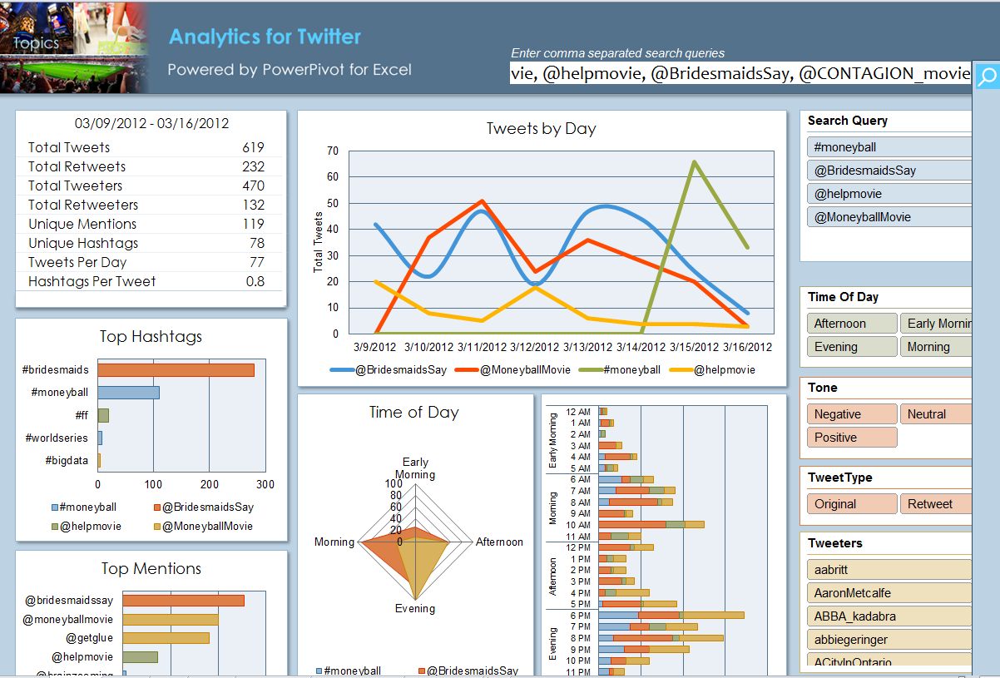

Open Microsoft Analytics for Twitter and paste the following movie tags and accounts into the query window:

\#moneyball, @MoneyballMovie, @helpmovie, @BridesmaidsSay, @CONTAGION_movie

Click on the  button and follow the directions.

> **NOTE**: This part has nothing to do with Hadoop but is an example of using the Twitter Search API and self-service Business Intelligence (BI) in Excel and PowerPivot.

### Get Twitter Feed using cURL and Twitter Streaming API 

This step requires curl.exe. Download the appropriate curl file for your OS (such as the Win64 binary SSL) from <http://curl.haxx.se/download.html>
  

and unzip  **curl.exe** to the appropriate location (such as **C:\twitterdata**)

Copy the two files **get_twitter_stream.cmd** and **twitter_params.txt** from the **Step2GetTwitterFeedUsingCURLAndTwitterStreamingAPI** folder and paste them into the same folder as **curl.exe**, as follows:
  

 
Edit the **twitter_params.txt** file to track your tweets as follows:
	
	track=moneyball,MoneyballMovie,helpmovie,BridesmaidsSay,CONTAGION_movie

Edit the **get_twitter_stream.cmd** window command script, adding your twitter username in place of **USER** and password in place of **PASSWORD** on the following line:

	curl -d @twitter_params.txt -k https://stream.twitter.com/1/statuses/filter.json -uUSER:PASSWORD >>twitter_stream_seq.txt

Execute the get_twitter_stream.cmd script from a command prompt as follows:
 

  
You should see something like this:
  

  
You can stop the job by pressing **Ctrl+C**. You can then rename the file and then restart the script.

### Request and configure a new Hadoop on a Windows Azure Cluster 

This step requires access to the CTP for Apache Hadoop-based Service for Windows Azure. Go to <https://www.hadooponazure.com/> and click on the **invitation** link.  If you already have access, click the **Sign in** button.

  

Request a new cluster.  Below is an example of a 3 node cluster called “mailboxpeak.” Enter a username and password and click the **Request cluster** button.  If you have questions, refer to the “Apache Hadoop-based Service for Windows Azure How-To and FAQ.”

Open the FTPS and ODBC Ports so you can access the server.
  

  
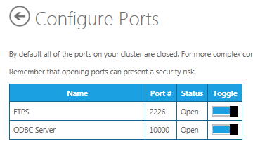

Click on the **Interactive Console** icon.
  

Create a directory for the Twitter text file on HDFS using the following Javascript command:

	js> #mkdir /example/data

To upload small sample text files, run the following:

	js> #put
	Source:   C:\hadoop\example\data\Sample.txt
	Destination:  /examples/data

To upload larger text files (other than compressed files) directly to HDFS, you will need curl.exe. If you do not already have it, download it as described at the beginning of Step 2, and unzip it to your file's location (such as C:\hadoop\example\data).   Then open PowerShell (navigate to **C:\hadoop\example\data**) and cut and paste the following PowerShell Script to FTPS the SampleData text file (**SampleData.txt**):

	C:\hadoop\example\data>
	#----- begin curl ftps to hadoop on azure powershell example ----
	#------ Replace XXXXXXX with the appropriate servername / username / password
	$serverName = "XXX.cloudapp.net"; $userName = "XXXX";
	$password = "XXXXXXXX";
	$fileToUpload = "SampleData.txt"; $destination = "/example/data/";
	$Md5Hasher = [System.Security.Cryptography.MD5]::Create();
	$hashBytes = $Md5Hasher.ComputeHash($([Char[]]$password))
	foreach ($byte in $hashBytes) { $passwordHash += "{0:x2}" -f $byte }
	$curlCmd = ".\curl -k --ftp-create-dirs -T $fileToUpload -u $userName"
	$curlCmd += ":$passwordHash ftps://$serverName" + ":2226$destination"
	invoke-expression $curlCmd
	#----- end curl ftps to hadoop on azure powershell example ----

To upload even larger files, you may need to compress them.  A compressed file, with extensions such as .gz, can be uploaded to your Windows Azure storage account.  Programs like CloudXplorer (<http://clumsyleaf.com/products/cloudxplorer>) can be used to upload the file as follows:

After setting up your Windows Azure storage account and installing CloudXplorer, go to the Windows Azure portal and find and copy your storage account's primary access key by clicking the **View** button in the right-hand column.
  
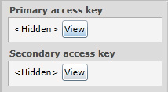

Then open CloudXplorer and click **File -> Manage Accounts**. This brings up a new dialog box. From here click **New** and select **Windows Azure account**.
  

In the next dialog box, insert the storage account name (the one you defined when setting up the storage account, such as hadoopdemo) and that storage account's primary access key.
 

When you are inside the new storage account, create a new container (in Windows Azure directories are called _containers_).
  
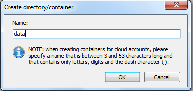
 
Upload (copy) the zip file into the container (in this case, the container is called **data**).
  
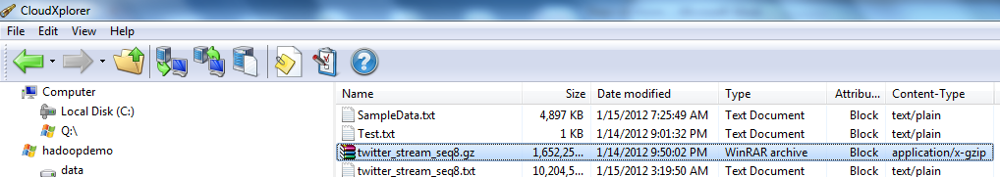

Configure your Window Azure Blob Storage Account by clicking on the **Manage Data** icon,

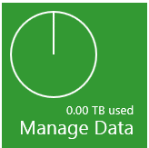

followed by **Set up ASV**.

You are going to need your value for the Windows Azure **Storage Account Name** (in this case **hadoopdemo**) and its primary access key.

  

Enter your Windows Azure storage account name and primary access key and click **Save settings**. 
 
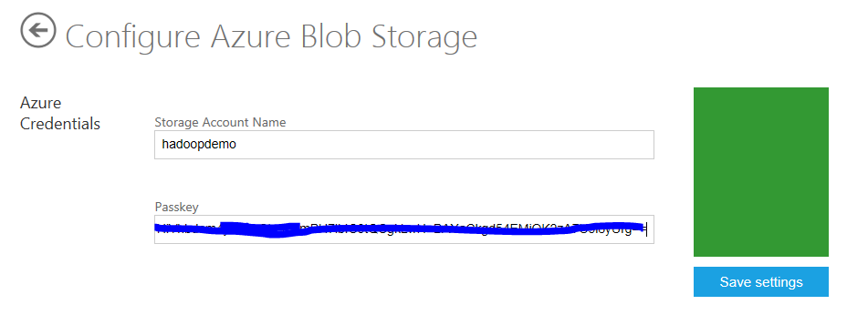

<a name="segment4" />
### Process Twitter data using Hive on the Hadoop on a Windows Azure head node 
 
Go to <https://www.hadooponazure.com/>. Connect to the Hadoop head node by clicking on **Remote Desktop**.
    

Click the **Open** button.
  

  
Log on to the remote server with the name and password you used to create the cluster in Step 3.

Create a directory (for instance, **c:\Apps\dist\example\data**) on the Remote Hadoop head node server (on the NTFS side) using Windows Explorer or a command line and change to that directory.

Copy the entire contents of the CopyToHeadnode folder into that new directory. This includes **HiveUDFs.jar** (User Defined Functions use by Hive queries), **gzip**, and the Hive query txt files.  You may also want to copy the **All steps to run from the Hadoop Command Shell.txt** file over to make the last half of this step easier.
 

RDP supports copying and pasting between the host desktop and the remote desktop. There is a chance that Hadoop may unzip the **gzip** file as you copy it to HDFS.

Open the Hadoop Command Shell on the Remote Desktop.  

Navigate to the **c:\Apps\dist\example\data** directory.
  
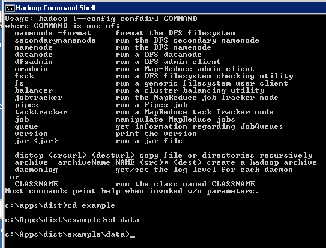

Copy the **twitter_stream_seq8.gz** file from Windows Azure storage to **c:\Apps\dist\example\data** (on the NTFS side).  The location of the file in your storage account depends on the Windows Azure storage mapping you conducted back in Step 3.  In our case, the container is called **data**, and appears in the line below after **asv://**:

	c:\Apps\dist\example\data>hadoop fs -copyToLocal asv://data/twitter_stream_seq8.txt.gz twitter_stream_seq8.txt.gz

Unzip the contents of **twitter_stream_seq8.gz** to **c:\Apps\dist\example\data** as follows (you will need **gzip.exe**, which you can download from <http://www.gzip.org/>, present in the directory from which you run the command):

	c:\Apps\dist\example\data> gzip -d -N twitter_stream_seq8.txt.gz
  
**Note:** You may be able to combine these last two actions if Hadoop unzips the file as it copies to HDFS.  This may however only work with a .bz2 (bzip2) compressed file <http://bzip.org/>:  

	hadoop fs -copyFromLocal twitter_stream_seq8.txt.gz /example/data/twitter_stream_seq8.txt

Copy **twitter_stream_seq8.txt** from **c:\Apps\dist\example\data** to HDFS as follows:  

	c:\Apps\dist\example\data>
	hadoop fs -copyFromLocal twitter_stream_seq8.txt /example/data/twitter_stream_seq8.txt

8. Check to see that the file has been updated to HDFS by opening  and navigating to 
/example/data.
  

**The next few actions can also be found in the “All steps to run from the Hadoop Command Shell.txt” file that you copied to the headnode.**

Create and load twitter_raw by running the following command:
  
	c:\apps\dist\example\data>hive -v -f load_twitter_raw.txt
  

The table should be created in the /hive/warehouse directory on the HTFS side:
  

You can also check it from Hive by typing in **c:\Apps\dist\example\data>hive** and then
**Hive>show tables;** as follows:
  
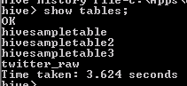

You can then type **hive>quit;** to get out of Hive.

Create and load **twitter_temp** using:
 
	c:\apps\dist\example\data>hive -v -f create_twitter_temp.txt

This should take over 20 minutes with 4 nodes, and 8 minutes and 55 seconds with 8 nodes.

Check the job on the following screen:
  
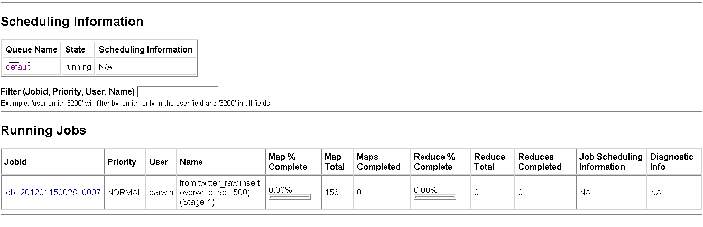

Click on the job to get its details and monitor its progress.  It may take over 20 minutes to complete.
  
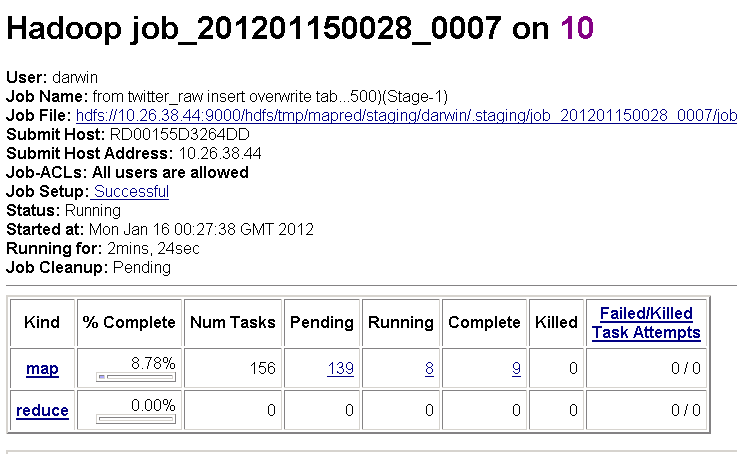

You can also monitor the job in the Hadoop Command Shell:
  
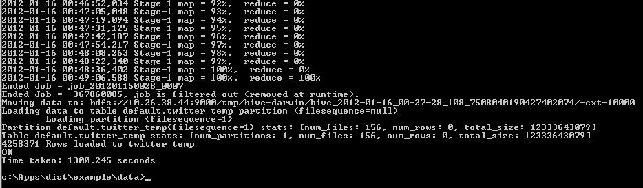

You can also check its progress from Hive by typing in **c:\Apps\dist\example\data>hive** and then **Hive>show tables**:
  

Create and load **twitter_stream** using:
 
	c:\apps\dist\example\data>hive -v -f create_twitter_stream.txt

It may take over 60 minutes to complete with 4 nodes, and 31 minutes and 54 seconds with 8 nodes.  

Monitor the job's progress as above.

Create and load **twitter_stream_sample** using:
  
	c:\apps\dist\example\data>hive -v -f create_twitter_stream_sample.txt

Monitor the job's progress as above.

Create and load **twitter_movies** using:
  
	c:\apps\dist\example\data>hive -v -f create_twitter_movies.txt

Monitor the job's progress as above.

Create and load **twitter_movies_vw** using:
  
	c:\apps\dist\example\data>hive -v -f create_twitter_movies_vw.txt

Monitor the job's progress as above.

### Set Up Hive ODBC and the Hive Panel in Excel to Retrieve the Hive Data 

This section is copied from the **Apache Hadoop-based Service for Windows Azure How-To and FAQ**, which can be found by clicking the **Downloads** tile 

at the Hadoop on Windows Azure portal.
  
  

This is also where you can download **HiveODBCSetup** for 64-bit or 32-bit Excel.

**How to connect the Excel Hive Add-In to Hadoop on Windows Azure via HiveODBC**

One key feature of the Microsoft Big Data Solution is the solid integration of Apache Hadoop with the Microsoft Business Intelligence (BI) components. A good example of Apache Hadoop integration with Microsoft BI components is the ability of Excel to connect to the Hive data warehouse framework in the Hadoop cluster. This section walks you through using Excel via the Hive ODBC driver.

**Installing the Hive ODBC Driver**

In order to run the installation, you must download the 64-bit Hive ODBC driver MSI file from the Hadoop on Windows Azure portal.  

Double-click **HiveODBCSetupx64.msi** to start the installation.

Read the license agreement. If you agree to the license agreement, click **I accept** followed by **Install**.
  

Once the installation has completed, click **Finish** to exit the **ODBC Driver for Hive Setup** wizard.

**Installing the Excel Hive Add-In**

To install this add-in, you must have previously installed the 64-bit Hive ODBC driver, as well as a copy of Excel 2010 64-bit.

Start Excel 2010 64-bit. You will be asked to install the **HiveExcel** add-in. Click **Install**.

Once the add-in has been installed, click the **Data** tab in Microsoft Excel 2010. You should see the Hive Panel, as shown in the following screenshot:
  
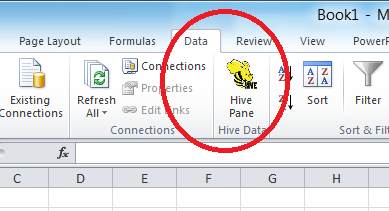

**Creating a Hive ODBC Data Source to Use with Excel**

Click **Start**->**Control Panel** to launch the Control Panel for Microsoft Windows.

In the Control Panel, Click **System and Security**->**Administrative Tools**->**Data Sources (ODBC)**. This will launch the **ODBC Data Source Administrator** dialog.
  
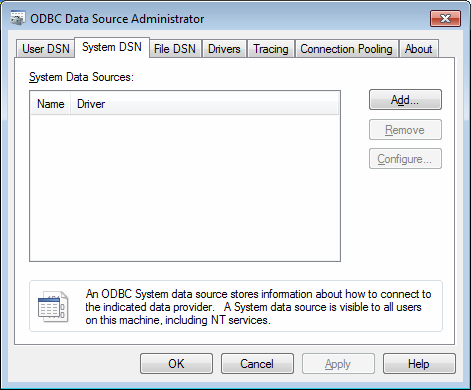
 
In the **ODBC Data Source Administrator** dialog, click the **System DSN** tab.

Click **Add** to add a new data source.

Click the **HIVE** driver in the ODBC driver list.
  
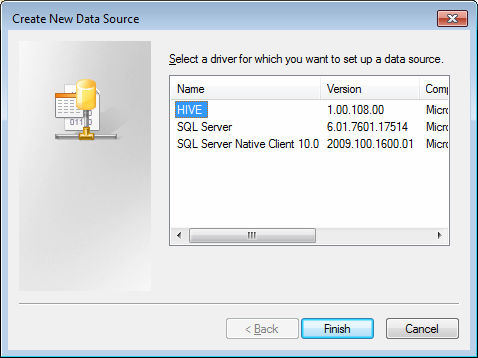

Click **Finish**. This will launch the **ODBC Hive Setup** dialog, as shown in the following screenshot:
  
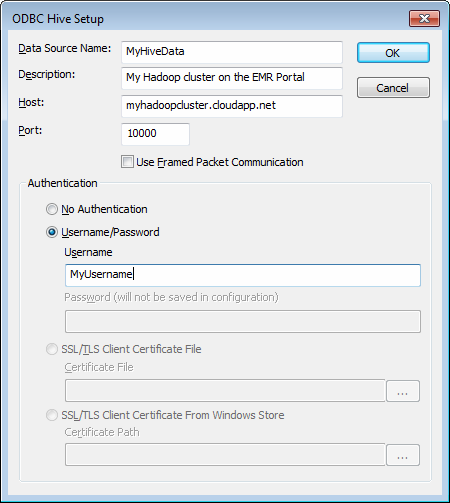
 
Enter a name in the **Data Source Name** box. For example, **MyHiveData**.

In the **Host** box, enter the host name of the cluster you created on the portal. For example, **myhadoopcluster.cloudapp.net**.

Enter the username you used to authenticate on the portal.

Click **OK** to save the new Hive data source.

Click **OK** to close the **ODBC Data Source Administrator** dialog.

**Retrieving Hive Data in Excel**

Open Excel 2010 64-bit. Once it is open, click the **Data** tab.

Click on **Hive Panel** to open the Hive panel in Excel.

In the drop-down list labeled **Select or Enter Hive Connection**, select the data source name you previously created.

You will be asked to enter the password to authenticate with the cluster on the portal. Enter the password for the username.

In the drop-down list labeled **Select the Hive Object to Query**, select **hivesampletable [Table]**.

Select the checkbox for each of the columns in the table. The **Hive Query** panel should look similar to the following image:
  
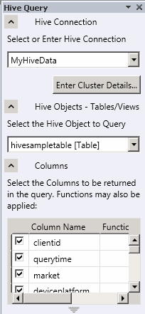
 
Click **Execute Query**.
  
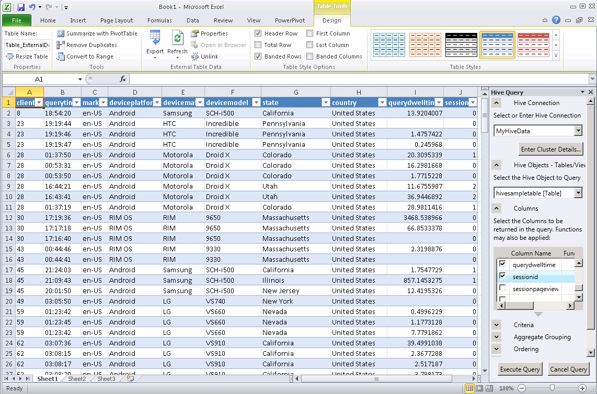
 
For the data processed in this tutorial, you would execute a query like:  
	Select * from twitter_movies_vw limit 20

## Summary 

In this tutorial we have seen how to query, explore, and analyze data from Twitter using Hadoop on Windows Azure and a Hive query in Excel.