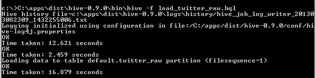
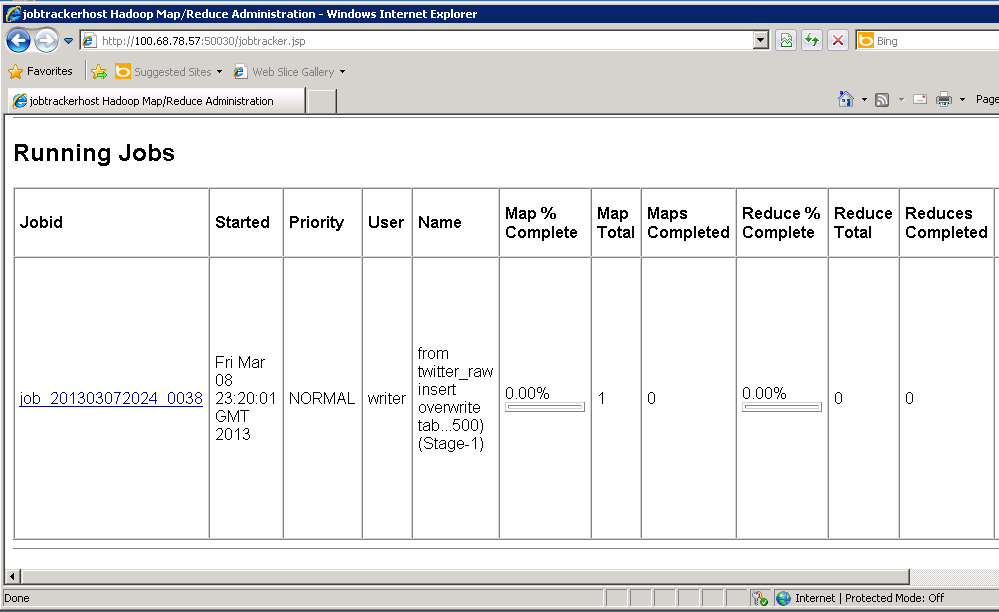

<properties linkid="manage-services-hdinsight-social-web-data" urlDisplayName="Hadoop Social Web Data" pageTitle="Analyzing Twitter Data with Hive - Windows Azure" metaKeywords="Azure Twitter Hadoop, Azure Hive query, Azure data analysis" metaDescription="A tutorial that teaches you to query and analyze data from Twitter using Apache Hadoop-based Services for Windows Azure and a Hive query in Excel." metaCanonical="" disqusComments="1" umbracoNaviHide="1" />

# Analyzing Twitter Data with Hive 

In this tutorial you will query, explore, and analyze data from twitter using the Apache Hadoop-based HDInsight Service for Windows Azure and a complex Hive example. Social web sites are one of the major driving forces for Big Data adoption. Public APIs provided by sites like Twitter are a useful source of data for analyzing and understanding popular trends. This tutorial assumed that an HDInsight cluster has already been created through the [Windows Azure Portal](http://www.windowsazure.com).  

This tutorial is composed of the following segments:

1. [Get Twitter Feed using cURL and Twitter Streaming API](#segment1)
2. [Process Twitter data interactively using Hive](#segment2)

## Get Twitter Feed using cURL and Twitter Streaming API 

1. This step requires curl.exe. Download the appropriate curl file for your OS (such as the Win64 binary SSL) from <a href="http://curl.haxx.se/download.html">http://curl.haxx.se/download.html</a>.
  
	

2. Unzip  **curl.exe** to the appropriate location (such as **C:\twitterdata**)

3. Create these two files using notepad, **get_twitter_stream.cmd** and **twitter_params.txt**  in the same folder as **curl.exe**, as follows:
  
	
 
4. Edit the **twitter_params.txt** file to track your tweets as follows:
	
		track=weather,Azure,WindowsAzure,cloud

	You can use any topics or hash tags of your choosing.

5. Edit the **get_twitter_stream.cmd** window command script, adding your twitter username in place of **USER** and password in place of **PASSWORD** on the following line:

		curl -d @twitter_parameters.txt -k https://stream.twitter.com/1/statuses/filter.json -u user:{password} >>twitter_stream_seq2.txt

6. Execute the get_twitter_stream.cmd script from a command prompt as follows:
 
	
  
	You should see something like this:
  
	
  
7. You can stop the job by pressing **Ctrl+C**. You can then rename the file and then restart the script. You may leave the process running for 10 minutes to hours. For the purpose of this tutorial please limit the data size to a few hundred megabytes.

	Twitter data is stored in JSon format that contains a complex nested structure. In the next step, instead of writing many lines of code using a conventional programming language, we will transform this nested structure into a Hive table, so that it can be queried interactively by a SQL-like language called HQL.

## Process Twitter data interactively using Hive

1. While the tweets are being collected, create an RDP session the the HDInsight cluster you have created through the Windows Azure Portal. 

	**Navigate** to HDInsight, **Select** the Cluster you have created. Click on **Connect RDP** icon at the bottom of the screen. Log into the RDP session by typing in your password. Once you have logged in, **open** an Explorer window and navigate to c:\.

	

2. Press **Ctrl+C** to terminate the Curl tweet collection process, use Windows Explorer to navigate to where the twitter file resides.  **Right click** to send to Compressed (Zipped folder). This saves upload time.

3. Now, **Ctrl-C** on the zip file on your local machine and then navigate to c:\ on the remote desktop session's C:\.  **Ctrl-V** after you clicked on the explorer Window (C:\) to upload the zip file through the RDP session.

	![Uploading tweets through RDP Session] (../media/twitter-uploadingzip.PNG)

4. After the file has been uploaded, **right click**, **select** Extract All to c:\ to get the original text file back.  **Open** a Hadoop Command Line Window to start working with HIVE and Hadoop commands.

	

5. The first step is, **type** C:\ and **Press Enter**.  This will take you to the c:\ folder where the twitter data resides.

6. Next, create a folder in the HDFS or the Hadoop Distributed File System, then copy the twitter data into the folder we have just created by using the -copyFromLocal switch:
	
		hadoop fs -mkdir /example/data
		hadoop fs -copyFromLocal c:\twitter_stream_seq2.txt /example/data/

7. Now the raw twitter data has been copied into HDFS on your HDInsight Cluster.  The next step is to create a simple table structure for the data that we loaded.  This temporary Hive structured table that allows us to hold the data and do further ETL processing. type notepad and paste the following code into notepad and save it as: "c:\load_twitter_raw.hql"

		drop table twitter_raw;

		create table twitter_raw (
			json_response string
		) 
		partitioned by (filesequence int);
	
		load data inpath '/example/data/twitter_stream_seq2.txt'
		into table twitter_raw
		partition (filesequence = 1);

8. Once the file has been saved, run Hive in the command window:
	
		C:\apps\dist\hive-0.9.0\bin\hive -f load_twitter_raw.hql

9. The process taking a few seconds to complete:

	

10. The large twitter dataset in nested JSon format has now been transformed into a temporary Hive Table structure.

11. Before we can query against the twitter dataset using Hive, we need to run another ETL process. We will define a more detailed table schema for the data we have stored in the "twitter_raw" table.  This more complex ETL process takes longer. At the command prompt launch notepad again to paste the following Hive query code, then save it as "c:\twitter_etl.hql.txt".

		set hive.exec.dynamic.partition = true;
		set hive.exec.dynamic.partition.mode=nonstrict;

		drop table twitter_temp;

		create table twitter_temp
		(
			id bigint,
			created_at string,
			created_at_date string,
			created_at_year string,
			created_at_month string,
			created_at_day string,
			created_at_time string,
			in_reply_to_user_id_str string,
			text string,
			contributors string,
			retweeted string,
			truncated string,
			coordinates string,
			source string,
			retweet_count int,
			url string,
			hashtags array<string>,
			user_mentions array<string>,
			first_hashtag string,
			first_user_mention string,
			screen_name string,
			name string,
			followers_count int,
			listed_count int,
			friends_count int,
			lang string,
			user_location string,
			time_zone string,
			profile_image_url string,
			json_response string
		)
		partitioned by (filesequence int);

		from twitter_raw
		insert overwrite table twitter_temp
		partition (filesequence)
		select
			cast(get_json_object(json_response, '$.id_str') as bigint),

			get_json_object(json_response, '$.created_at'),
			concat(substr (get_json_object(json_response, '$.created_at'),1,10),' ',
				substr (get_json_object(json_response, '$.created_at'),27,4)),

			substr (get_json_object(json_response, '$.created_at'),27,4),

			case substr (get_json_object(json_response, 	'$.created_at'),5,3)
				when "Jan" then "01"
				when "Feb" then "02"
				when "Mar" then "03"
				when "Apr" then "04"
				when "May" then "05"
				when "Jun" then "06"
				when "Jul" then "07"
				when "Aug" then "08"
				when "Sep" then "09"
				when "Oct" then "10"
				when "Nov" then "11"
				when "Dec" then "12" end,

			substr (get_json_object(json_response, '$.created_at'),9,2),

			substr (get_json_object(json_response, '$.created_at'),12,8),

			get_json_object(json_response, '$.in_reply_to_user_id_str'),
			get_json_object(json_response, '$.text'),
			get_json_object(json_response, '$.contributors'),
			get_json_object(json_response, '$.retweeted'),
			get_json_object(json_response, '$.truncated'),
			get_json_object(json_response, '$.coordinates'),
			get_json_object(json_response, '$.source'),
			cast (get_json_object(json_response, '$.retweet_count') as int),
			get_json_object(json_response, '$.entities.display_url'),
			array(	
				trim(lower(get_json_object(json_response, '$.entities.hashtags[0].text'))),
				trim(lower(get_json_object(json_response, '$.entities.hashtags[1].text'))),
				trim(lower(get_json_object(json_response, '$.entities.hashtags[2].text'))),
				trim(lower(get_json_object(json_response, '$.entities.hashtags[3].text'))),
				trim(lower(get_json_object(json_response, '$.entities.hashtags[4].text')))),
			array(
				trim(lower(get_json_object(json_response, '$.entities.user_mentions[0].screen_name'))),
				trim(lower(get_json_object(json_response, '$.entities.user_mentions[1].screen_name'))),
				trim(lower(get_json_object(json_response, '$.entities.user_mentions[2].screen_name'))),
				trim(lower(get_json_object(json_response, '$.entities.user_mentions[3].screen_name'))),
				trim(lower(get_json_object(json_response, '$.entities.user_mentions[4].screen_name')))),
			trim(lower(get_json_object(json_response, '$.entities.hashtags[0].text'))),
			trim(lower(get_json_object(json_response, '$.entities.user_mentions[0].screen_name'))),
			get_json_object(json_response, '$.user.screen_name'),
			get_json_object(json_response, '$.user.name'),
			cast (get_json_object(json_response, '$.user.followers_count') as int),
			cast (get_json_object(json_response, '$.user.listed_count') as int),
			cast (get_json_object(json_response, '$.user.friends_count') as int),
			get_json_object(json_response, '$.user.lang'),
			get_json_object(json_response, '$.user.location'),
			get_json_object(json_response, '$.user.time_zone'),
			get_json_object(json_response, '$.user.profile_image_url'),
			json_response,
			filesequence
		where (length(json_response) > 500);

12. Now type in:

		C:\apps\dist\hive-0.9.0\bin\hive -f twitter_etl.hql.txt

13. This complex Hive script will kick off a set of long Map Reduce jobs by the Hadoop cluster.  Depending on your dataset and the size of your cluster, this could take about 10 minutes.

	

14. You may also monitor the progress of your job through the Job tracking page on the headnode by double clicking on the short cut, "Hadoop MapReduce Status" on the desktop.

	

15. Once the ETL process completes, launch the Hive:

		C:\apps\dist\hive-0.9.0\bin\hive

16. You may experiment with simple Hive queries like:

 		select name, screen_name, count(1) as cc from twitter_temp where text like "%Azure%" group by name,screen_name order by cc desc limit 10;

17. This query will return find a list of twitter users that sent most tweets that contained the word "Azure".

	![Final Result] (../media/twitter_final_query_result.PNG)

## Summary 

In this tutorial we have seen how to transform unstructured Json dataset into structured Hive table to query, explore, and analyze data from Twitter using HDInsight on Windows Azure. For updates and support files, you may find them in the GitHub repository [here](https://github.com/wenming/BigDataSamples/tree/master/twittersample). 