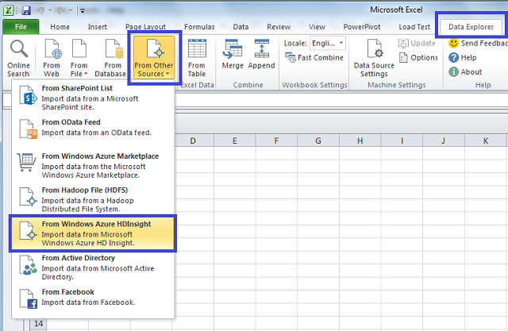
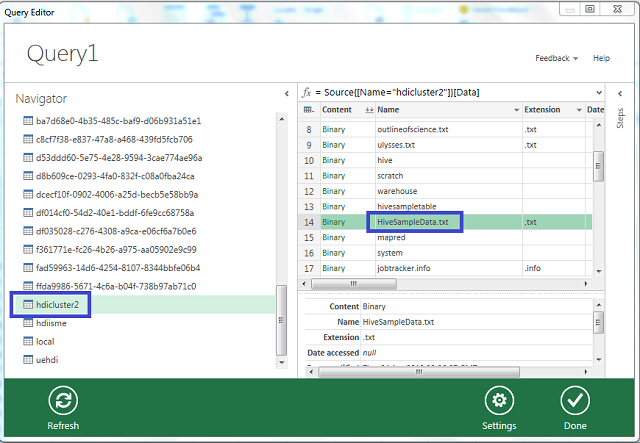

<properties linkid="manage-services-hdinsight-excel-dataexplorer" urlDisplayName="HDInsight and Excel" pageTitle="How to Connect Excel to Windows Azure HDInsight with Data Explorer" metaKeywords="hdinsight, excel, data explorer, hive excel, hdinsight excel" metaDescription="How to use Excel to access data stored in Windows Azure HDInsight using Data Explorer" umbracoNaviHide="0" disqusComments="1" writer="bradsev" editor="mollybos" manager="paulettm" />

#How to Connect Excel to Windows Azure HDInsight with Data Explorer

One key feature of Microsoft’s Big Data Solution is the integration of  Microsoft Business Intelligence (BI) components with Apache Hadoop clusters that have been deployed by the Windows Azure HDInsight Service. A primary example of this integration is the ability to connect Excel to the Azure Storage assocoiated with your HDInsight Hadoop cluster using the Data Explorer. This topic walks you through how to set up and use the Data Explorer from Excel to query data in an HDInsight cluster. There are three parts to this procedure:

1. [Install the Data Explorer](#InstallDataExplorer)
2. [Create a data source](#CreateDataSource)
3. [Import data into Excel](#ImportData)

**Prerequisites**:

* You have installed Excel 2010 or Excel 2013.
* You have a Windows Azure Account and have enabled the HDInsight Service for your subscription. For instructions on how to do this, see [Getting Started with Windows Azure HDInsight Service][getting-started] 

<h2>Install the Data Explorer</h2>

The Data Explorer can be used to export results from HDInsight into Microsoft Business Intelligence (BI) tools such as Excel.

1. Download the Data Explorer from from the [Microsoft Download Center](http://www.microsoft.com/en-us/download/details.aspx?id=36803) and install it.

2. Open up Excel, select the **Data Explorer** tab, select the **From Other Sources** option, and then From Windows Azure item.

	

3. Enter the name of the Azure Blob Storage Account associated with your cluster and click **OK**.

	

4. Enter the account key for the Azure Blob Storage Account in the Access Windows Azure HDInsight wizard and click **Save**. If you need to retrieve your key, return to the Windows Azure Portal, select your storage account, and click on the Manage Access Key icon on the bottom of the page. Click on the copy icon  to the right of the primary key and paste the value into the wizard.

	

<h2>Create a Data Source</h2>

1. TBD
2. TBD
3. TBD

<h2>Import Data</h2>

1. In the **Query Editor**, select your cluster in the Navigator and then find and select the default HiveSampleData.txt file and click **Done**.

	

2. The query then imports the Hive Table into Excel.

	 

##Summary

The Data Explorer makes it easy to import data from your HDInsight Service cluster into Excel where Business Intelligence tools may be used to inspect and analyze the data.

## Next steps

In this article you learned how to use Data Explorer to retrieve data from the HDInsight Service into Excel. Similarly, you can retrieve data from the HDInsight Service into SQL Azure. It is also possible to upload data into an HDInsight Service.

* For information on using Sqoop to copy data from an HDInsight Service to SQL Azure, see [Using HDInsight to process Blob Storage data and write the results to a SQL Database][blob-hdi-sql]. 

* For information on using Sqoop or Windows Azure Blob Storage to load data into an HDInsight Service, see [How to Upload Data to the HDInsight Service][upload-data].

[getting-started]: /en-us/manage/services/hdinsight/get-started-hdinsight/
[blob-hdi-sql]: /en-us/manage/services/hdinsight/process-blob-data-and-write-to-sql/
[upload-data]: /en-us/manage/services/hdinsight/howto-upload-data-to-hdinsight/