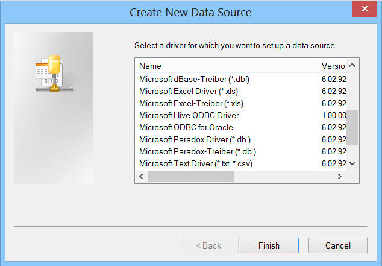
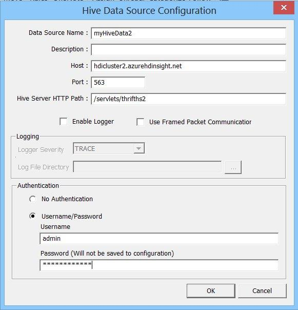
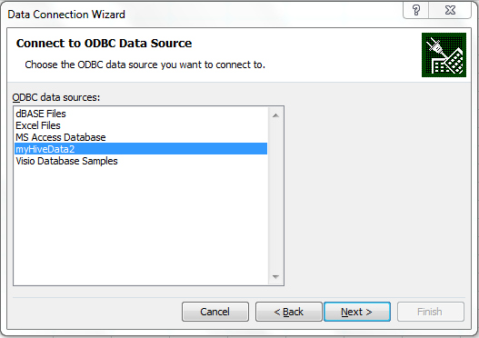
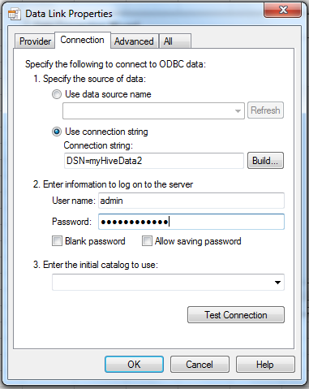
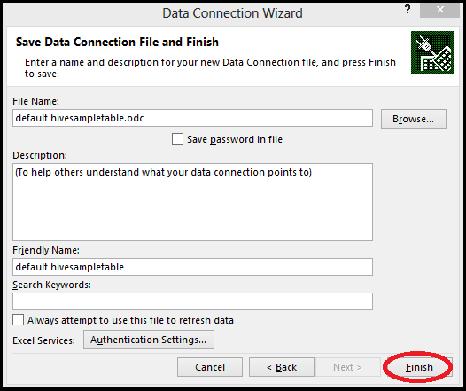

<properties linkid="manage-services-hdinsight-excel-hiveodbc" urlDisplayName="HDInsight and Excel" pageTitle="How to Connect Excel to Windows Azure HDInsight with HiveODBC" metaKeywords="hdinsight, excel, hiveodbc, hive excel, hdinsight excel" metaDescription="How to use Excel to access data stored in Windows Azure HDInsight using HiveODBC" umbracoNaviHide="0" disqusComments="1" writer="bradsev" editor="mollybos" manager="paulettm" />

#How to Connect Excel to Windows Azure HDInsight via HiveODBC

One key feature of Microsoft’s Big Data Solution is the integration of  Microsoft Business Intelligence (BI) components with Apache Hadoop clusters that have been deployed by the Windows Azure HDInsight Service. An example of this integration is the ability to connect Excel to the Hive data warehouse framework of an HDInsight Hadoop cluster via the Hive Open Database Connectivity (ODBC) driver. 

It is also possible to connect the data associcated with an HDInsight cluster and other data sources, including other (non-HDInsight) Hadoop clusters, from Excel using the Microsoft Power Query add-in for Excel. For infomation on installing and using Power Query, see [How to Connect Excel to Windows Azure HDInsight with Power Query](/en-us/manage/services/hdinsight/connect-excel-to-data-explorer/).

This topic walks you through how to set up and use the Hive ODBC driver from Excel to query data in an HDInsight cluster. There are three parts to this procedure:

1. [Install the Hive ODBC Driver](#InstallHiveODBCDriver)
2. [Create a Hive ODBC Data Source](#CreateHiveODBCDataSource)
3. [Import data into Excel](#ImportData)

**Prerequisites**:

* You have installed Excel 2010 or Excel 2013.
* You have a Windows Azure Account and have enabled the HDInsight Service for your subscription. For instructions on how to do this, see [Getting Started with Windows Azure HDInsight Service][getting-started] 

<h2>Install the Hive ODBC Driver</h2>

Follow the steps below to install the Hive ODBC Driver.
 
1. The Hive ODBC driver can be downloaded from the [Microsoft Download Center](http://www.microsoft.com/en-us/download/confirmation.aspx?id=37134 "Hive ODBC download"). From your cluster, click the **Download** tile from the cluster dashboard on the HDInsight portal to bring up the links for downloading the Hive ODBC driver MSIs.

	

2. Click on either the **HiveODBCSetupx86.msi** link or the **HiveODBCSetupx64.msi** link - they both just take you to the   [Microsoft Download Center](http://www.microsoft.com/en-us/download/confirmation.aspx?id=37134 "Hive ODBC download").

	

3. Click the **Download** button and choose the download you want.
 - If you have the 32-bit version of Windows installed, select the **HiveODBCSetupx86.msi** link. 
- If you have the 64-bit version of Windows installed, select the **HiveODBCSetupx64.msi**.
 
4. Click **Next** and then **Run** to bring up the **Microsoft ODBC Driver Hive Setup** wizard.

	

5. Click **Next** and then **Run**. If you agree to the license agreement, check the **I accept ...** box and then click the **Install** button. 
   
	

6. Once the installation has completed, click **Finish** to exit the Setup Wizard. 

**Note**
The Hive ODBC driver released is in Preview only and should not be used for production workloads. It is supported only on Windows and only to work with HDInsight Hive installations. If you have issues with the installation, see [Troubleshooting ODBC connectivity to HDInsight](http://social.msdn.microsoft.com/Forums/en-US/hdinsight/thread/b4ca52ea-f7cf-420c-959d-53e09f801f7d).

<h2>Create a Hive ODBC Data Source</h2>

The following steps show you how to create a Hive ODBC Data Source.

1. Click **Start** -> **Control Panel** to launch the **Control Panel** for Microsoft Windows. 

2. In the Control Panel, click **System and Security**->**Administrative Tools**. Then click **Data Sources (ODBC)** if you are using Windows 7 or **ODBC Data Sources** if you are using Windows 8. This will launch the **ODBC Data Source Administrator** dialog. 
 
	 

3. In the **ODBC Data Source Administrator** dialog, click the **User DSN** tab. 

4. Click **Add** to add a new data source. 

5. Click the **HIVE** driver in the ODBC driver list.  

	

6. Click the **Finish** button. This will launch the **Hive Data Source Configuration** dialog. 
 

	  

7. Enter a data source a name in the **Data Source Name** box. In this example, *myHiveData2*. 

8. In the **Host** box, replace the *clustername* placeholder variable with the actual name of the cluster that you created. For example, if your cluster name is "hdicluster2" then the final value for host should be "hdicluster2.azurehdinsight.net". Do not change the default port number of *563* or the default value of the Hive Server HTTP Path, */servlets/thrifths2*.

9. Click **OK** to close the **ODBC Hive Setup** dialog. 
	
 
<h2>Import Data into Excel</h2>

The steps below describe the way to import data from a hive table into excel workbook using the ODBC data source that you created in the steps above.

1. Open a new or existing workbook in Excel.

2. In Excel, click the **Data** tab. 

3. From the **Get External Data** tile on the left (you may need to **Click** on it for the dropdown menu), select **From Other Data Sources -> From Data Connection Wizard** to launch the **Data Connection Wizard**.

4. In **Data Connection Wizard**, select **ODBC DSN** as the data source and click **Next**.

	 

5. In the **Connect to ODBC Data Source** dialog, select the Data Source name that you created in the previous step (in our example, *myHiveData2*) and click **Next**.

	 

6. In the **Data Link Properties** wizard, re-enter the password for the cluster and click **OK**.

	 

7. When the **Select Database and Table** dialog in the **Data Connection Wizard** opens, select the table that you want to import (here, for example, the default "hivesamepletable") and click **Next**.

	 

8. When the **Save Data Connection File and Finish** dialog in the **Data Connection Wizard** opens, click the **Finish** button.

	 

9. In the **Import Data** dialog, you can change or specify the query. To do so, click **Properties** to launch the **Connection Properties** dialog. 

	 

10. Click on the **Definition** tab and add "Limit 200" at the end of the query in the **Command text** text box. (You can also replace this query text with another query as needed.) Then click **OK** to return to the **Import Data** dialog. 

	

11. Click **OK** to close the **Import Data** dialog.  In the **Hive Data source Configuration** dialog that opens, re-enter the password and click **OK**.

12. The data from the hive table will open in the Excel workbook, where is can be inspected and analyzed using BI tools.

	  

##Summary

The Hive ODBC driver makes it easy to import data from your HDInsight Service cluster into Excel where Business Intelligence tools may be used to inspect and analyze the data.

## Next steps

In this article you learned how to use the Hive ODBC adapter to retrieve data from the HDInsight Service into Excel. Similarly, you can retrieve data from the HDInsight Service into SQL Azure. It is also possible to upload data into an HDInsight Service.

* For information on using Sqoop to copy data from an HDInsight Service to SQL Azure, see [Using HDInsight to process Blob Storage data and write the results to a SQL Database][blob-hdi-sql]. 

* For information on using Sqoop or Windows Azure Blob Storage to load data into an HDInsight Service, see [How to Upload Data to the HDInsight Service][upload-data].

[getting-started]: /en-us/manage/services/hdinsight/get-started-hdinsight/
[blob-hdi-sql]: /en-us/manage/services/hdinsight/process-blob-data-and-write-to-sql/
[upload-data]: /en-us/manage/services/hdinsight/howto-upload-data-to-hdinsight/