<properties linkid="manage-services-hdinsight-excel-hiveodbc" urlDisplayName="HDInsight and Excel" pageTitle="How to Connect Excel to Windows Azure HDInsight with HiveODBC" metaKeywords="hdinsight, excel, hiveodbc, hive excel, hdinsight excel" metaDescription="How to use Excel to access data stored in Windows Azure HDInsight using HiveODBC" umbracoNaviHide="0" disqusComments="1" writer="sburgess" editor="mollybos" manager="paulettm" />

#How to Connect Excel to Windows Azure HDInsight via HiveODBC

One key feature of Microsoft’s Big Data Solution is the integration of  Microsoft Business Intelligence (BI) components with Apache Hadoop clusters that have been deployed by the Windows Azure HDInsight Service. A primary example of this integration is the ability to connect Excel to the Hive data warehouse framework of an HDInsight Hadoop cluster via the Hive Open Database Connectivity (ODBC) driver. This topic walks you through how to set up and use the Hive ODBC driver from Excel to query data in an HDInsight cluster. There are three parts to this procedure:

1. [Install the Hive ODBC Driver](#InstallHiveODBCDriver)
2. [Create a Hive ODBC Data Source](#CreateHiveODBCDataSource)
3. [Import data into Excel](#ImportData)

**Prerequisites**:

* You have installed Excel 2010 or Excel 2013.
* You have a Windows Azure Account and have enabled the HDInsight Service for your subscription. For instructions on how to do this, see [Getting Started with Windows Azure HDInsight Service][getting-started] 

<h2>Install the Hive ODBC Driver</h2>

Follow the steps below to install the Hive ODBC Driver.
 
1. Click the **Download** tile from the cluster dashboard on the HDInsight portal to bring up the links for downloading the Hive ODBC driver MSIs.

	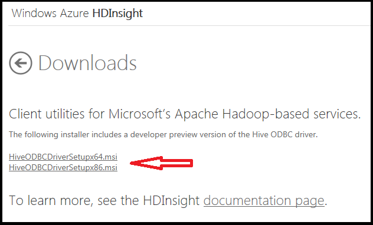

2. If you have the 32-bit version of Excel installed, double click the **HiveODBCSetupx86.msi** link. If you have the 64-bit version of Excel installed, double click the **HiveODBCSetupx64.msi** link. If you are not sure which version of Excel you have installed, open Excel, go to **File** -> **Help** and inspect the version information provided in the **About Microsoft Excel** section. Here is what you would expect to see in Excel 2010.

	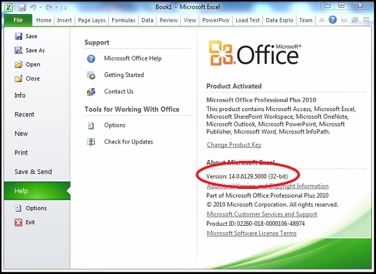

3. Click Run when prompted and read the license agreement. 

4. If you agree to the license agreement, check the **I accept ...** box and then click the **Install** button. 
   
	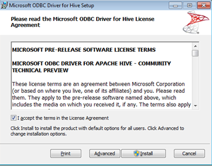

5. Once the installation has completed, click **Finish** to exit the Setup Wizard. 

<b>Note</b>
	
The Hive ODBC driver released is in Preview only and should not be used for production workloads. It is supported only on Windows and only to work with HDInsight Hive installations. Due to current limitations with Hive Server 1, the Hive ODBC driver is supported in single user mode only and should not be used to run concurrent queries from concurrent connections. Attempting to run multiple queries at the same time may result in unexpected behavior. Microsoft is working to provide support for the ODBC driver with Hive Server 2. Hive Server 2 provides support for concurrency for both ODBC and Java Database Connectivity (JDBC). When this driver is released, the existing ODBC driver will be deprecated. For more information about current Hive Server 1 limitations, see <a href="https://cwiki.apache.org/confluence/display/Hive/HiveServer2+Thrift+API">https://cwiki.apache.org/confluence/display/Hive/HiveServer2+Thrift+API</a> 
 

<h2>Create a Hive ODBC Data Source</h2>

The following steps show you how to create a Hive ODBC Data Source.

1. Click **Start** -> **Control Panel** to launch the **Control Panel** for Microsoft Windows. 

2. In the Control Panel, click **System and Security**->**Administrative Tools**. Then click **Data Sources (ODBC)** if you are using Windows 7 or **ODBC Data Sources** if you are using Windows 8. This will launch the **ODBC Data Source Administrator** dialog. 
 
	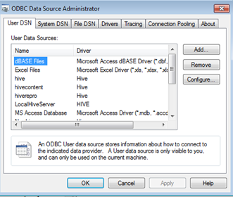 

3. In the **ODBC Data Source Administrator** dialog, click the **User DSN** tab. 

4. Click **Add** to add a new data source. 

5. Click the **HIVE** driver in the ODBC driver list.  

	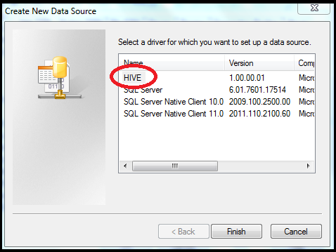

6. Click the **Finish** button. This will launch the **Hive Data Source Configuration** dialog. 
 

	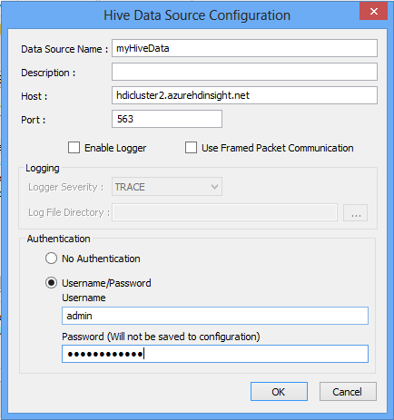  

7. Enter a data source a name in the **Data Source Name** box. For Example, *myHiveData*. 

8. In the **Host** box, replace the clustername placeholder variable with the actual name of the cluster that you created. For example, if your cluster name is "hdicluster2" then the final value for host should be "hdicluster2.azurehdinsight.net". Do not change the default port number of 563.

9. Enter the username you used to authenticate on the portal.

10. Click **OK** to save the configuration for the new Hive data source. 

11. Click **OK** to close the ODBC Data Source Administrator dialog. 
	
 
<h2>Import Data into Excel</h2>

The steps below describe the way to import data from a hive table into excel workbook using the ODBC data source that you created in the steps above.

1. Open a new or existing workbook in Excel 2010 or 2013.

2. In Excel, click the **Data** tab. 

3. Click the **Get External Data** tile on the left and select **From Other Data Sources -> From Data Connection Wizard** to launch the **Data Connection Wizard**.

4. In **Data Connection Wizard**, select **ODBC DSN** as the data source and click **Next**.

	 

5. In the **Connect to ODBC Data Source** dialog, select the Data Source name that you created in the previous step (in our example, *myHiveData*) and click **Next**.

	 

6. In the **Hive Data Source Configuration** dialog, enter the password for the cluster and click **OK**.

	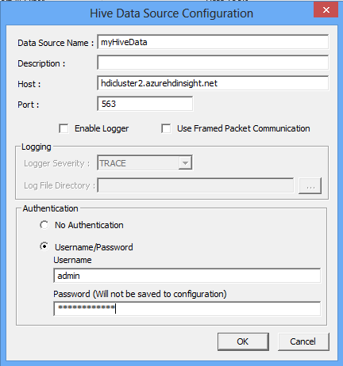 

7. In the **Data Link Properties** window that is launched (this may take a minute), make sure that **Use connection string** dial is selected. The correct value for the connection string should already be entered (in this example, *DSN=myHiveData*). Enter the username and password for the cluster. 

	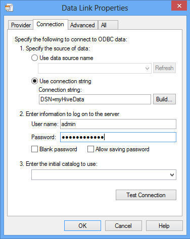 

8. Click **OK**. The connection will be tested automatically and a "Test conection succeded" message with open if the connection is valid. Click **OK** to close this window. (If you do not get this message, check the credentials and name for your HDInsight cluster and enter them again.)

	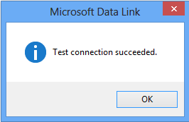 

9. There is a known issue when using the current Hive ODBC driver with Excel 2013. There is a workaround for this, but this workaround is not needed for Excel 2010. 

- If you are using Excel 2010, complete steps 10 through step 15 to import the data. 

- If you are using Excel 2013, skip down to steps 16 and 17 for the workaround (these steps replace steps 10 and 11 used with Excel 2010), and then continue from step 12 to complete the tutorial 

10. When the **Select Database and Table** dialog in the **Data Connection Wizard** opens, select the table that you want to import (here, for example, the default "hivesamepletable") and click **Next**.

	 

11. When the **Save Data Connection File and Finish** dialog in the **Data Connection Wizard** opens, click the **Finish** button.

12. In the **Import Data** dialog, you can change or specify the query. To do so, click **Properties** to launch the **Connection Properties** dialog. 

	 

13. Click on the **Definition** tab and add "Limit 200" at the end of the query in the **Command text** text box. (You can also replace this query text with another query as needed.) Then click **OK** to return to the **Import Data** dialog. 

	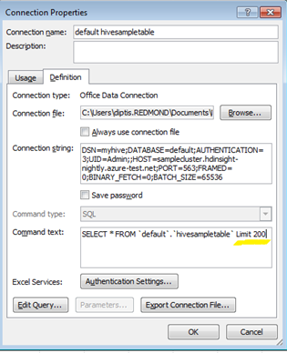

14. Click **OK** to close the **Import Data** dialog.  In the **Hive Data source Configuration** dialog that opens, re-enter the password and click **OK**.

15. The data from the hive table will open in the Excel workbook.

	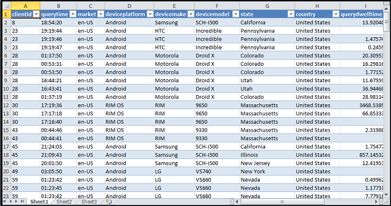  

16. If you are using Excel 2013, the current ODBC driver may result in the program hanging when using the **Import Table Data** dialog. So cancel out of the **Import Table Data** dialog at this point. Go back to the **Get External Data** menu and select **Existing Connections** to open the **Existing Connections** wizard. 

	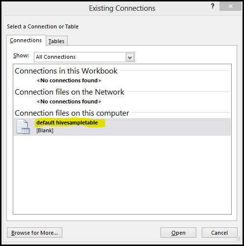  

17. Select the *default hivesampletable* connection file you just created on this computer and click the **Open** button. This opens up the **Import Data** wizard. Now return to step 12 above and continue through step 15 to import the data.

##Summary

By using components such as the Hive ODBC driver, it is easy to use Business Intelligence tools such as Excel to work with data from your HDInsight Service cluster.

## Next steps

In this article you learned how to use the Hive ODBC adapter to retrieve data from the HDInsight Service into Excel. You can also retrieve data from the HDINsight Service into SQL Azure. It is also possible to upload data into an HDinsight Service.

* For information on using Sqoop to copy data from an HDInsight Service to SQL Azure, see [Using HDInsight to process Blob Storage data and write the results to a SQL Database][blob-hdi-sql]. 
* For information on using Sqoop or Windows Azure Blob Storage to load data into an HDInsight Service, see [How to Upload Data to the HDInsight Service][upload-data].

[getting-started]: /en-us/manage/services/hdinsight/get-started-hdinsight/
[blob-hdi-sql]: /en-us/manage/services/hdinsight/process-blob-data-and-write-to-sql/
[upload-data]: /en-us/manage/services/hdinsight/howto-upload-data-to-hdinsight/