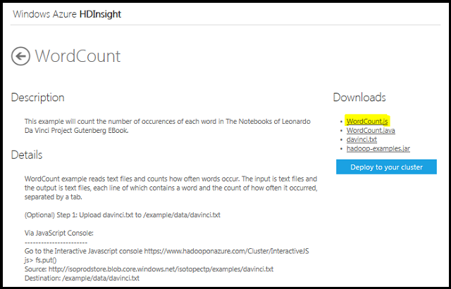
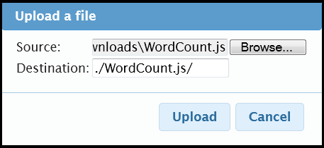
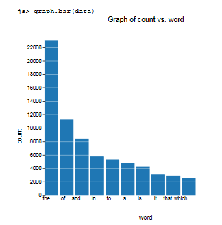
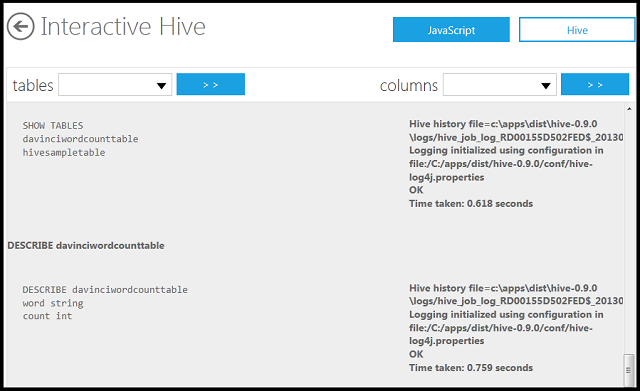

<properties linkid="manage-services-hdinsight-interactive-console" urlDisplayName="HDInsight interactive console" pageTitle="Using the HDInsight Interactive Console - Windows Azure tutorial" metaKeywords="hdinsight, hdinsight console, hdinsight javascript" metaDescription="Learn how to use the interactive JavaScript and Hive console with HDInsight" umbracoNaviHide="0" disqusComments="1" writer="bradsev" editor="mollybos" manager="paulettm" />

# HDInsight Interactive JavaScript and Hive Consoles

Microsoft Azure HDInsight Service comes with interactive consoles for both JavaScript and Hive. These consoles provide a simple, interactive read-evaluate-print loop (REPL) experience, where users can enter expressions, evaluated them, and then query and display the results of a MapReduce job immediately. The JavaScript console executes Pig Latin statements. The Hive console evaluates Hive Query Language (Hive QL) statements. Both types of statements get compiled into MapReduce programs. Managing Hadoop jobs on these consoles is much simpler than remote connecting into the head node of the Hadoop cluster and working with MapReduce programs directly.

**The JavaScript Console**: a command shell that provides a fluent interface to the Hadoop ecosystem. A fluent interface uses a method of chaining instructions that relays the context of one call in a sequence to the subsequent call in that sequence. The JavaScript console provides:
		
- Access to the Hadoop cluster, its resources, and the Hadoop Distributed File System (HDFS) commands.
- Management and manipulate of data coming into and out of the Hadoop cluster.
- A fluent interface that evaluates Pig Latin and JavaScript statements to define a series of MapReduce programs to create data processing workflows.

**The Hive Console**: Hive is a data warehouse framework, built on top of Hadoop, that provides data management, querying, and analysis. It uses HiveQL, an SQL dialect, to query data stored in a Hadoop cluster. The Hive console provides:
			
- Access to the Hadoop cluster, its resources, and the HDFS commands.		
- An implementation of the Hive framework that can execute HiveQL statements on a Hadoop cluster.	
- A relational database model for HDFS that enables you to interact with data stored in the distributed file system as if that data were stored in tables.		
The JavaScript console uses Pig Latin, a data flow language, and the Hive console uses HiveQL, a query language. 	

Pig (and the JavaScript console) will tend to be preferred by those who are more familiar with a scripting approach, where a sequence of chained (or fluent) transformations is used to define a data processing workflow. It is also a good choice if you have seriously unstructured data.	

Hive (and its console) will tend to be preferred by those who are more familiar with SQL and a relational database environment. The use of schema and a table abstraction in Hive means the experience is very close to that typically encountered in a RDBMS.

Pig and Hive provide higher level languages that are compiled into MapReduce programs that are written in Java and that run on the HDFS. If you need really precise control or high performance you will need to write the MapReduce programs directly.

##In this tutorial

* [Use the JavaScript console to run a MapReduce job](#runjob)
* [Use the JavaScript console to display the results graphically](#displayresults)
* [Use the Hive console to export the results to a Hive table](#createhivetable)
* [Use the Hive console to query the data in the Hive table](#queryhivetable)

##Use the JavaScript Console to Run a MapReduce Job

In this section, you use the JavaScript console to run the WordCount sample that ships with the HDInsight Service. The JavaScript query run here uses the fluent API layered on Pig that is provided by the Interactive Console.  The text file analyzed here is the Project Gutenberg eBook edition of *The Notebooks of Leonardo Da Vinci*. A filter is specified so that the results of the MapReduce job contains only the ten most frequently occurring words. 

1. Sign in to the [Management Portal](https://manage.windowsazure.com).
2. Click **HDINSIGHT**. You shall see a list of deployed Hadoop clusters.
3. Click the name of the HDInsight cluster where you want to connect to.
4. Click **Manage Cluster**.
5. Enter your credential, and then click **Log On**.
6. From the HDInsight portal, click **Samples**.

	

7. From the **Hadoop Sample Gallery** page , click on the **WordCount**  tile. 
8. Click **WordCount.js** from the upper right, and save the file  to a local directory, for example the ../downloads folder.

	

9. Click **Windows Azure HDInsight** on the upper left corner to go back to the cluster dashboard page.
10. Click **Interactive Cluster** to bring up the JavaScript console. 
	
	
11. Click **JavaScript** on the upper right.
12. Run the following command:

	fs.put()

13. Enter the following parameters into the **Upload a file** window:  

	- **Source:** _..\downloads\Wordcount.js
 	- **Destination:** ./WordCount.js/ 	

	

	Browse the location of the WordCount.js file. The full local path will be required. The single dot at the start of the destination path is needed as part of the relative address in HDFS.

14. Click the **Upload** button.

15. Run the following commands to list the file and display the content:

		#ls
		#cat WordCount.js

	

	Note that the JavaScript map function removes capital letters from the text using the "toLowerCase()" method before counting the number of occurences of a word in the reduce function. 
	
16. Run the following command to list the data file that will be processed by the WordCount MapReduce job: 

 		#ls /example/data/gutenberg
	
17. Run the following command to execute the MapReduce program: 

		pig.from("/example/data/gutenberg/davinci.txt").mapReduce("/user/admin/WordCount.js", "word, count:long").orderBy("count DESC").take(10).to("DaVinciTop10Words")
	
	Replace admin to the current login username.

	Note how the instructions are "chained" together using the dot operator, and the output file is called *DaVinciTop10Words*. In the next section, you will access the output file. 

	Once completed, you shall see the following:

		pig.from("/example/data/gutenberg/davinci.txt").mapReduce("/user/admin/WordCount.js", "word, count:long").orderBy("count DESC").take(10).to("DaVinciTop10Words")
		2013-04-25 18:54:28,116 [main] INFO  org.apache.pig.backend.hadoop.executionengine.mapReduceLayer.MapReduceLauncher - Success! (View Log)

18. Scroll to the right, and then click on **View Log** if you want to observe the job progress. This log will also provide diagnostics if the job fails to complete. When the job does complete, you will see the following message at the end of the log:

		[main] INFO org.apache.pig.backend.hadoop.executionengine.mapReduceLayer.MapReduceLauncher - Success! followed by a link to the log file.
	
19. Run the following command to list the output file:

		#ls

	Notice a DavinciTop10Words folder is created.

##Use the JavaScript Console to Display the Results Graphically
In the last section, you ran a MapReduce job to retrieve the top 10 words from a text file. The output file is ./DaVinciTop10Words.

1. Run the following command to display the results in the DaVinciTop10Words directory:

		file = fs.read("DaVinciTop10Words")

	The result looks like:

		js> file=fs.read("DaVinciTop10Words")
		the	22966
		of	11228
		and	8428
		in	5737
		to	5296
		a	4791
		is	4261
		it	3073
		that	2903
		which	2544
	
2. Run the following command to parse the contents of the file into a data file:

		data = parse(file.data, "word, count:long")
		
3. Run the following command to plot the data

		graph.bar(data)
		
	

##Use the Hive Console to Export the Results to a Hive Table

This section introduces you to the Hive interactive console. You will create a Hive table from the MapReduce job output. The next section shows how to query the data in this table. 

**Create the Hive table**
	
1. Click Hive on the upper right to open the Hive console.
	
2. Enter the following command to create a two column table named _DaVinciWordCountTable_ from the WordCount sample output that was saved in the "DaVinciTop10Words" folder:
		
		CREATE EXTERNAL TABLE DaVinciWordCountTable		
		(word STRING,
		count INT)	
		ROW FORMAT DELIMITED FIELDS TERMINATED BY '\t'	
		STORED AS TEXTFILE LOCATION '/user/admin/DaVinciTop10Words';	

	Replace admin with the login username. 

	Note that the table is created as an EXTERNAL table to keep the folder targeted independent of the table. Also, note that you need only specify the folder in which the output file is located, not the file name itself.

3. Click **EVALUATE** on the lower left. 		

4. Enter the following commands to confirm that the two column table has been created:

		SHOW TABLES;
		DESCRIBE DaVinciWordCountTable;

5. Click **EVALUATE**.
	
	

##Use the Hive Console to Query the Data in the Hive Table

1. Run the following command to query for the words with the top ten number of occurrences:

		SELECT word, count
		FROM DaVinciWordCountTable
		ORDER BY count DESC LIMIT 10

	The results of this query are:			

		SELECT word, count FROM DaVinciWordCountTable ORDER BY count DESC LIMIT 10
		the 22966
		of 11228
		and 8428
		in 5737
		to 5296
		a 4791
		is 4261
		it 3073
		that 2903
		which 2544

## Next Steps

You have seen how to run a Hadoop job from the Interactive JavaScript console and how to inspect the results from a job using this console. You have also seen how the Interactive Hive console can be used to inspect and process the results of a Hadoop job by creating and querying a table that contains the output from a MapReduce program. You have seen examples of Pig Latin and Hive QL statements being used in the consoles. Finally, you have seen how the REPL interactive nature of the JavaScript and Hive consoles simplifies using a Hadoop cluster. To learn more, see the following articles:

* [Using Pig with HDInsight][hdinsight-pig] 
* [Using Hive with HDInsight][hdinsight-hive]
* [Using MapReduce with HDInsight][hdinsight-mapreduce]

[hdinsight-pig]: /en-us/manage/services/hdinsight/using-pig-with-hdinsight/
[hdinsight-hive]: /en-us/manage/services/hdinsight/using-hive-with-hdinsight/
[hdinsight-mapreduce]: /en-us/manage/services/hdinsight/using-mapreduce-with-hdinsight/