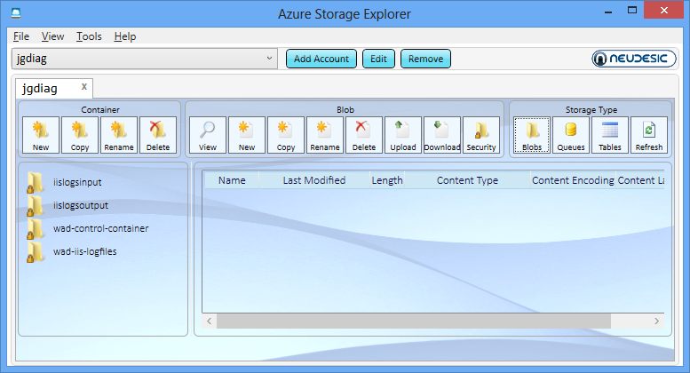

<properties linkid="manage-services-hdinsight-upload-data" urlDisplayName="Upload data to HDInsight" pageTitle="How to upload data to HDInsight - Windows Azure Services" metaKeywords="hdinsight, hdinsight upload, hdinsight upload data, upload data azure" metaDescription="Learn how to upload data to the the HDInsight service." umbracoNaviHide="0" disqusComments="1" writer="jgao" editor="mollybos" manager="paulettm" />

#How to Upload Data to HDInsight

Windows Azure HDInsight Service provides two options in how it manages its data, Azure Storage Vault (ASV) and Hadoop Distributed File System (HDFS). HDFS is designed to store data used by Hadoop applications. Data stored in Windows Azure Blob Storage can be accessed by Hadoop applications using Windows Azure Storage Vault (ASV), which provides a full featured HDFS file system over Windows Azure Blob storage. It has been designed as an HDFS extension to provide a seamless experience to customers by enabling the full set of components in the Hadoop ecosystem to operate directly on the data it manages. Both options are distinct file systems that are optimized for storage of data and computations on that data. For the benefits of using ASV, see [Using Windows Azure Blob Storage with HDInsight](/en-us/manage/services/hdinsight/howto-blob-store/). 

Windows Azure HDInsight clusters are typically deployed to execute MapReduce jobs and are dropped once these jobs have been completed. Keeping the data in the HDFS clusters after computations have been completed would be an expensive way to store this data. Windows Azure Blob storage is a highly available, highly scalable, high capacity, low cost, and shareable storage option for data that is to be processed using HDInsight. Storing data in a Blob enables the HDInsight clusters used for computation to be safely released without losing data. 

Windows Azure Blob storage can either be accessed through the [API](http://www.windowsazure.com/en-us/develop/net/how-to-guides/blob-storage/) programmatically or through explorer tools. Here are some of the tools available:

* [Azure Storage Explorer](http://azurestorageexplorer.codeplex.com/)
* [cloud Storage Studio 2](http://www.cerebrata.com/Products/CloudStorageStudio/)
* [CloudXplorer](http://clumsyleaf.com/products/cloudxplorer)
* [Windows Azure Explorer](http://www.cloudberrylab.com/free-microsoft-azure-explorer.aspx)
* [Windows Azure Explorer PRO](http://www.cloudberrylab.com/microsoft-azure-explorer-pro.aspx)

##Table of Contents

* [How to: Upload data to Windows Azure Storage using Azure Storage Explorer](#storageexplorer)
* [How to: Access data stored in ASV](#blob)
* [How to: Upload data to ASV using Interactive JavaScript Console](#console)
* [How to: Upload data to ASV using Hadoop command line](#commandline)
* [How to: Import data from Windows Azure SQL Database to ASV using Sqoop](#sqoop)

##How to: Upload Data to Windows Azure Storage Using Azure Storage Explorer

*Azure Storage Explorer* is a useful tool for inspecting and altering the data in your Windows Azure Storage. It is a free tool that can be downloaded from [http://azurestorageexplorer.codeplex.com/](http://azurestorageexplorer.codeplex.com/ "Azure Storage Explorer").

Before using the tool, you must know your Windows Azure storage account name and account key. For the instructions for get the information, see the *How to: View, copy and regenerate storage access keys* section of [How to Manage Storage Accounts](/en-us/manage/services/storage/how-to-manage-a-storage-account/).

1. Run Azure Storage Explorer.

	

2. Click **Add Account**. After an account is added to Azure Storage Explorer, you don't need to go through this step again. 

	

3. Enter **Storage account name** and **Storage account key**, and then click **Add Storage Account**. You can add multiple storage accounts, each account will be displayed on a tab. 
4. From **Storage Type**, click **Blobs** to display the Windows Azure Blob storage of the account.

	

5. From **Container**, click the container that is associated to your HDInsight cluster. When you create an HDInsight cluster, you must specify a container.  Otherwise, the cluster creation process creates one for you.
6. From **Blob**, click **Upload**.
7. Specify a file to upload, and then click **Open**.

Blob storage containers store data as key/value pairs, and there is no directory hierarchy. However the ‘/’ character can be used within the key name to make it appear as if a file is stored within a directory structure. For example, a blob’s key may be ‘input/log1.txt’. No actual ‘input’ directory exists, but due to the presence of the ‘/’ character in the key name, it has the appearance of a file path. You can click **Rename** from the tool to give a file a folder structure.

##How to: Access Data Stored in Azure Storage Vault

Data stored in Windows Azure Blob Storage can be accessed directly from the Interactive JavaScript Console by prefixing the protocol scheme of the URI for the assets you are accessing with asv://. To secure the connection, use asvs://. The scheme for accessing data in Windows Azure Blob Storage is:

	asv[s]://[<container>@]<accountname>.blob.core.windows.net/<path>

The following is an example of viewing data stored in Windows Azure Blob Storage using the Interactive JavaScript Console:

The following will run a Hadoop streaming job that uses Windows Azure Blob Storage for both input and output:

	Hadoop jar hadoop-streaming.jar 
		-files "hdfs:///example/apps/map.exe, hdfs:///example/apps/reduce.exe"
		-input "asvs://container@storageaccount.blob.core.windows.net/iislogsinput/iislogs.txt"
		-output "asvs://container@storageaccount.blob.core.windows.net/iislogsoutput/results.txt"
		-mapper "map.exe"
		-reducer "reduce.exe"

For more information on accessing the files stored in ASV, see [Using Windows Azure Blob Storage with HDInsight](/en-us/manage/services/hdinsight/howto-blob-store/).

## How to: Upload Data to ASV Using Interactive JavaScript Console
Windows Azure HDInsight Service comes with a web based interactive JavaScript console that can be used as an administration/deployment tool. 

1. Sign in to the [Management Portal](https://manage.windowsazure.com).
2. Click **HDINSIGHT**. You will see a list of deployed Hadoop clusters.
3. Click the Hadoop cluster where you want to upload data to.
4. From the HDInsight Dashboard, click the cluster URL.
5. Enter **User name** and **Password** for the cluster, and then click **Log On**.
6. Click **Interactive Console**.

	

7. From the Interactive JavaScript console, type the following command:
	
		fs.put()

8. Press **ENTER**.

	")

9. Enter **Source** and **Destination**, and then click **Upload**.	Here are some sample values for the the Destination field:

	<table border="1">
	<tr><th>Sample</th><th>Note</th></tr>
	<tr><td>.</td><td>refer to /user/&lt;currentloggedinuser&gt; on the default file system.</td></tr>
	<tr><td>/</td><td>refer to / on the default file system.</td></tr>
	<tr><td>asv:/// or asvs://container@accountname.blob.core.windows.net</td><td>refer to / on teh default file system.</td></tr>
	</table>

10. Use the following command to list the uploaded files.

		#ls <path>

## How to: Upload Data to ASV Using Hadoop Command Line

To use Hadoop command line, you must first connect to the cluster using remote desktop. 

1. Sign in to the [Management Portal](https://manage.windowsazure.com).
2. Click **HDINSIGHT**. You will see a list of deployed Hadoop clusters.
3. Click the Hadoop cluster where you want to upload data to.
4. Click **Manage** on the bottom of the page
5. Enter **User name** and **Password** for the cluster, and then click **Log On**.
6. Click **Remote Desktop**.
	
	

7. Click **Open**.
9. Enter your credentials, and then click **OK**.
10. Click **Yes**.
11. From the desktop, click **Hadoop Command Line**.
12. The following sample demonstrates how to copy the davinci.txt file from the C:\temp\ directory to the /example/data directory.

		hadoop dfs -copyFromLocal C:\temp\davinci.txt /example/data/davinci.txt

	Because the default file system is on ASV, /example/datadavinci.txt is actually on ASV.  You can also refer to the file as:

		asv:///example/data/davinci.txt 

	or

		asvs://container@accountname.blob.core.windows.net/example/data/davinci.txt

	The FQDN is required when you use asvs.

13. Use the following command to list the uploaded files:

		hadoop dfs -lsr /example/data

## How to: Import Data to HDFS from SQL Database/SQL Server Using Sqoop

Sqoop is a tool designed to transfer data between Hadoop and relational databases. You can use it to import data from a relational database management system (RDBMS) such as SQL or MySQL or Oracle into the Hadoop Distributed File System (HDFS), transform the data in Hadoop with MapReduce or Hive, and then export the data back into a RDBMS. For more information, see [Sqoop User Guide](http://sqoop.apache.org/docs/1.4.2/SqoopUserGuide.html).

Before importing data, you must know the Windows Azure SQL Database server name, database account name, account password and database name. You must also configure a firewall rule for the database server to allow connections from your HDInsight cluster head node. For instruction on creating SQL database and configuring firewall rules, see [How to use Windows Azure SQL Database in .NET applications](http://www.windowsazure.com/en-us/develop/net/how-to-guides/sql-database/). To obtain the outward facing IP Address for your HDInsight cluster head node, you can use Remote Desktop to connect to the head node, and then browse to [www.whatismyip.com](http://www.whatismyip.com).

1. Sign in to the [Management Portal](https://manage.windowsazure.com).
2. Click **HDINSIGHT**. You will see a list of deployed Hadoop clusters.
3. Click the Hadoop cluster where you want to upload data.
4. Click **Connect** on the bottom of the page.
7. Click **Open**.
8. Enter your credentials, and then click **OK**.
9. Click **Yes**.
10. From the desktop, click **Hadoop Command Line**.
11. Change directory to **c:\apps\dist\sqoop-1.4.2\bin**. Please note, the Sqoop version number could change in the future.
12. Run a command similar to the following:

		sqoop import 
			--connect "jdbc:sqlserver://s6ok0p9kft.database.windows.net;username=user1@s6ok0p9kft;password=Pass@word1;database=AdventureWorks2012" 
			--table Sales.SalesOrderDetail 
			--columns "SalesOrderID,SalesOrderDetailID,CarrierTrackingNumber,OrderQty,ProductID,SpecialOfferID,UnitPrice,UnitPriceDiscount,LineTotal" 
			--target-dir /data/lineitemData 
			-m 1

	In the command, the SQL database server is *s6ok0p9kft*, username is *user1*, password is *Pass@word1*, and the database is *AdventureWorks2012*.  

13. You can run the #tail command from the Interactive Console to see the result:

		#tail /data/lineitemData/part-m-00000

Note: When specifying an escape character as delimiter with the arguments *--input-fields-terminated-by* and *--input-fields-terminated-by*, do not put quotes around the escape character.  For example. 

		sqoop export 
			--connect "jdbc:sqlserver://localhost;username=sa;password=abc;database=AdventureWorks2012" 
			--table Result 
			--export-dir /hive/warehouse/result 
			--input-fields-terminated-by \t 
			--input-lines-terminated-by \n
		

## Next Steps
Now that you understand how to get data into HDInsight Service, use the following tutorials to learn how to perform analysis:

* [Getting Started with Windows Azure HDInsight Service](/en-us/manage/services/hdinsight/get-started-hdinsight/)
* [Tutorial: Using MapReduce with HDInsight](/en-us/manage/services/hdinsight/using-mapreduce-with-hdinsight/)
* [Tutorial: Using Hive with HDInsight](/en-us/manage/services/hdinsight/using-hive-with-hdinsight/)
* [Tutorial: Using Pig with HDInsight](/en-us/manage/services/hdinsight/using-pig-with-hdinsight/)
