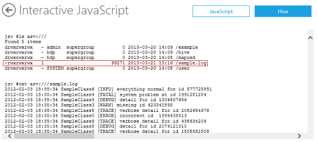
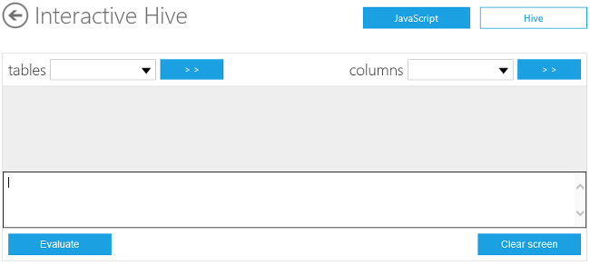

<properties linkid="manage-services-hdinsight-using-hive" urlDisplayName="Using Hive" pageTitle="Using Hive with HDInsight - Windows Azure tutorial" metaKeywords="using hive, hive hdinsight, hive azure" metaDescription="Learn how to use Hive with data stored in HDInsight." umbracoNaviHide="0" disqusComments="1" writer="sburgess" editor="mollybos" manager="paulettm" />

# Using Hive with HDInsight #

Hive provides a means of running MapReduce job through an SQL-like scripting language, called *HiveQL*, which can be applied towards summarization, querying, and analysis of large volumes of data. In this tutorial, you will use HiveQL to query the data in an Apache log4j log file and report basic statistics. 

[Apache Log4j](http://en.wikipedia.org/wiki/Log4j) is a logging utility. Each log inside a file contains a *log level* field to show the type and the severity. For example:

	2012-02-03 20:26:41 SampleClass3 [TRACE] verbose detail for id 1527353937

**Estimated time to complete:** 30 minutes

##In this Article

* [The Hive Usage case](#usage)
* [Upload a sample log4j file to Windows Azure Blob Storage](#uploaddata)
* [Connect to the interactive console](#connect)
* [Create a Hive table and upload data to the table](#createhivetable)
* [Run Hive queries](#runhivequeries)
* [Tutorial clean up](#cleanup)
* [Next Steps](#nextsteps)

##The Hive Usage Case

Databases are great for small sets of data and low latency queries. However, when it comes to Big Data and large data sets in terabytes, traditional SQL databases are not the ideal solution. Traditionally, database administrators have relied on scaling up by buying bigger hardware as database load increases and performance degrades. 

Hive solves these problems by allowing users to scale out when querying Big Data. Hive queries data in parallel across multiple nodes using MapReduce, distributing the database across multiple hosts as load increases.

Hive can also be used as an alternative to writing java MapReduce jobs, because it provides an SQL-like interface to run complex queries against Big Data. By providing a simple, SQL like wrapper, complex MapReduce code can be avoided with a few lines of SQL-like entries.
 
Hive also allows programmers who are familiar with the MapReduce framework to be able to plug in their custom mappers and reducers to perform more sophisticated analysis that may not be supported by the built-in capabilities of the language.  

Hive is best suited for batch processing of large amounts of immutable data (such as web logs). It is not appropriate for transaction applications that need very fast response times, such as database management systems. Hive is optimized for scalability (more machines can be added dynamically to the Hadoop cluster), extensibility (with MapReduce framework and other programming interfaces), and fault-tolerance. Latency is not a key design consideration.   

Generally, all applications save errors, exceptions and other coded issues in a log file, so administrators can review the problems, or generate certain metrics from the log file data. These log files usually get quite large in size, containing a wealth of data that must be processed and mined. 

Log files are therefore a good example of big data. Working with big data is difficult using relational databases and statistics/visualization packages. Due to the large amounts of data and the computation of this data, parallel software running on tens, hundreds, or even thousands of servers is often required to compute this data in a reasonable time. Hadoop provides a Hive data warehouse system that facilitates easy data summarization, ad-hoc queries, and the analysis of large datasets stored in Hadoop compatible file systems.

In this tutorial, you will complete the following tasks:

	1 Upload a sample log4j file to Windows Azure Blob Storage
	2 Connect to the interactive console
	3 Create a Hive table and upload data to the table
	4 Run Hive queries
	5 Tutorial clean up
	

##Upload a Sample Log4j File to Windows Azure Blob Storage

HDInsight provides two options for storing data, Windows Azure Blob Storage and Hadoop Distributed File system (HDFS). For more information on choosing file storage, see [Using Windows Azure Blob Storage with HDInsight](/en-us/manage/services/hdinsight/using-blob-store). When you provision an HDInsight cluster, the provision process creates a Windows Azure Blob storage container as the default HDInsight file system. To simplify the tutorial procedures, you will use this container for storing the log4j file.

*Azure Storage Explorer* is a useful tool for inspecting and altering the data in your Windows Azure Storage. It is a free tool that can be downloaded from [http://azurestorageexplorer.codeplex.com/](http://azurestorageexplorer.codeplex.com/ "Azure Storage Explorer").

Before using the tool, you must know your Windows Azure storage account name and account key. For the instructions on creating a Windows Azure Storage account, see [How To Create a Storage Account](/en-us/manage/services/storage/how-to-create-a-storage-account/). For the instructions for get the information, see the *How to: View, copy and regenerate storage access keys* section of [How to Manage Storage Accounts](/en-us/manage/services/storage/how-to-manage-a-storage-account/).

1. Download [sample.log](http://go.microsoft.com/fwlink/?LinkID=37003 "Sample.log") to your local computer.

2. Run **Azure Storage Explorer**.

	

3. Click **Add Account** if the Windows Azure storage account has not been added to the tool. 

	

4. Enter **Storage account name** and **Storage account key**, and then click **Add Storage Account**. 
5. From **Storage Type**, click **Blobs** to display the Windows Azure Blob storage of the account.

	

6. From **Container**, click the container that is designated as the default file system.  The default name is the HDInsight cluster name. You shall see the folder structure of the container.
7. From **Blob**, click **Upload**.
8. Browse to the sample.log file you just downloaded, and the click **Open**. You shall see the sample.log file listed there.
9. Double-click the sample.log file to open it.
11. Click **Text** to switch to the tab, so you can view the content of the file.  Notice that the following screen output shows a snippet of sample.log where the data follows a particular structure (except the row that starts with “java.lang.Exception…”). 

 

	Starting from left to right, the structured data rows have a *date* in column 1, *timestamp* in column 2, *class name* in column 3, *log level* in column 4, and so on. 

 The row starting with “java.lang.Exception” does not follow this “well-formed” data structure and is therefore, considered unstructured. The following table shows the key differences between the structured rows and unstructured rows. 

 
	<table border="1">
	<tr>
	<td> 
	Data Type
	</td>
	<td> 
	Date Column
	</td>
	<td> 
	Severity Column
	</td>
	</tr>
	<tr>
	<td> 
	Structured
	</td>
	<td> 
	1
	</td>
	<td> 
	4
	</td>
	</tr>
	<tr>
	<td> 
	Unstructured
	</td>
	<td> 
	2
	</td>
	<td> 
	5
	</td>
	</tr>
	</table>
12. Click **Close**. 
13. From the **File** menu, click **Exit** to close Azure Storage Explorer.

For accessing ASV, see [Using Windows Azure Blob Storage with HDInsight](/en-us/manage/services/hdinsight/using-blob-store/)

## Connect to the Interactive Console

You must have an HDInsight cluster previsioned before you can work on this tutorial. To enable the Windows Azure HDInsight Service preview, click [here](https://account.windowsazure.com/PreviewFeatures). For information on prevision an HDInsight cluster see [How to Administer HDInsight Service](/en-us/manage/services/hdinsight/howto-administer-hdinsight/) or [Getting Started with Windows Azure HDInsight Service](/en-us/manage/services/hdinsight/get-started-hdinsight/).

1. Sign in to the [Management Portal](https://manage.windowsazure.com).
2. Click **HDINSIGHT**. You shall see a list of deployed Hadoop clusters.
3. Click the name of the HDInsight cluster where you want to connect to.
4. Click the **Go to Cluster** URL link.
5. Enter your credential, and then click **Log On**.
6. From the HDInsight portal, click **Interactive Console**.

 	

1. Click **JavaScript** on the upper right corner to open the Interactive JavaScript console.
2. Run the following commands to list the files in the default file system and display the content of sample.log:

		#ls asv:///
		#cat asv:///sample.log
	
	

	The asv syntax is for listing the files in the default file system.  To access files in other containers, use the following syntax: 

		#ls asv[s]://[[<container>@]<storagename..blob.core.windows.net]/<path>

	For example, you can list the same file using the following command:

		#ls asv://container@storagename.blob.core.windows.net/sample.log

	replace *container* with the container name, and *storagename* with the Storage account name. 

	Because the file is located on the default file system, the same result can also be retrieved by using the following command:

		#ls /sample.log

	To use asvs, you must provide the FQDN. For example to access sample.log on the default file system: 

		#ls asvs://container@storagename.blob.core.microsoft.net/sample.log 

## Create a Hive Table and Upload Data to the Table
1. Click the **Hive** button on the upper right corner. The Hive console looks like:

 	

2. In the Hive Query pane, enter the following Hive query to create a table named log4jlogs, and then click **Evaluate**.

		CREATE TABLE log4jLogs(t1 string, t2 string, t3 string, t4 string, t5 string, t6 string, t7 string) ROW FORMAT DELIMITED FIELDS TERMINATED BY ' ';
 
	Note the command is terminated by two single quotes with a space in between.

3. Enter the following Hive query to load the sample.log data into the logs table you just created,  replace **container** and **storagename**, and then click **Evaluate**.

		LOAD DATA INPATH 'asv://container@storagename.blob.core.windows.net/sample.log' OVERWRITE INTO TABLE log4jLogs;

## Run Hive Queries
1. Enter the following query, and then click **Evaluate**.  The query returns the count of lines in the data:

		SELECT COUNT(*) FROM log4jLogs

2. Enter the following query, and then click **Evaluate**. The query returns the count of errors from the structured data:   

		SELECT t4 AS sev, COUNT(*) AS cnt FROM log4jLogs WHERE t4 = '[ERROR]' GROUP BY t4
 
## Tutorial Clean Up

The clean up task applies to this tutorial only; it is not necessarily performed in an actual deployment. In this task, you will delete the table and the data so that if you like, you can run the tutorial again.  

1. From the Hive console, delete the table log4jLogs:

		drop table log4jLogs;

2. Use Azure Storage Explorer to delete the sample.log file from the container.

Congratulations! You have successfully completed this tutorial. 

##Next Steps

While Hive makes it easy to query data using a SQL-like query language, other languages available with the HDInsight Service provide complementary functionality such as data movement and transformation. To learn more, see the following articles:

* [Getting Started with Windows Azure HDInsight Service](/en-us/manage/services/hdinsight/get-started-hdinsight/)
* [Using MapReduce with HDInsight](/en-us/manage/services/hdinsight/using-mapreduce-with-hdinsight/)
* [Using Pig with HDInsight](/en-us/manage/services/hdinsight/using-pig-with-hdinsight/) 
* [How to Run the HDInsight Samples](/en-us/manage/services/hdinsight/howto-run-samples/)
