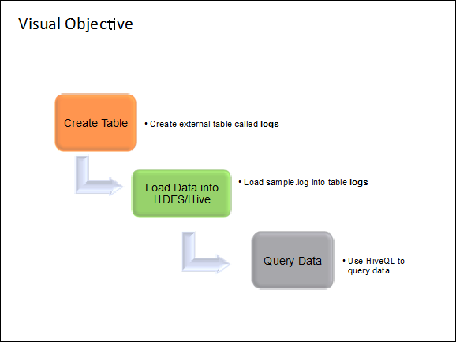

<properties linkid="manage-hdinsight-using-hive" urlDisplayName="Using Hive" pageTitle="Using Hive with HDInsight - Windows Azure tutorial" metaKeywords="using hive, hive hdinsight, hive azure" metaDescription="Learn how to use Hive with data stored in HDInsight." metaCanonical="http://www.windowsazure.com/en-us/manage/hdinsight/using-hive" umbracoNaviHide="0" disqusComments="1" writer="sburgess" editor="mollybos" manager="paulettm" />

# Using Hive with HDInsight #

## Introduction ##

Hive provides a means of running MapReduce job through an SQL-like scripting language, called HiveQL, that can be applied towards summarization, querying, and analysis of large volumes of data. HiveQL enables anyone already familiar with SQL to query the data. (While Pig is intuitive and easy-to-understand, it does require learning a new scripting language.)

In this tutorial, you will use a log file as input, and use HiveQL to query the data and report basic statistics. Our input file consists of a semi-structured log4j file in the following format

**FILE:**

	2012-02-03   20:26:41   SampleClass3   [TRACE]   verbose detail for id 1527353937

	2012-02-03   20:26:41   SampleClass2   [TRACE]   verbose detail for id 191364434

	2012-02-03   20:26:41   SampleClass1   [DEBUG]   detail for id 903114158

	2012-02-03   20:26:41   SampleClass8   [TRACE]   verbose detail for id 1331132178

	2012-02-03   20:26:41   SampleClass8   [INFO]   everything normal for id 1490351510

	2012-02-03   20:32:47   SampleClass8   [TRACE]   verbose detail for id 1700820764

	2012-02-03   20:32:47   SampleClass2   [DEBUG]   detail for id 364472047

	2012-02-03   21:05:21   SampleClass6   [FATAL]   system problem at id 1620503499

This tutorial takes about 30 minutes to complete and is divided into the following tasks:

- Task 1: Connect to Your Cluster

- Task 2: Prep for Hive Processing

- Task 3: Create Hive Table and Load Data

- Task 4: Run Hive Queries

- Task 5: Tutorial Clean Up

  

The visual representation of what you will accomplish in this tutorial is shown in the figure.

## The Use Case ##

Databases are great for small sets of data and low latency queries. However, when it comes to Big Data and large data sets in terabytes, traditional SQL databases are not the ideal solution. Traditionally, database administrators have relied on scaling up by buying bigger hardware as database load increases and performance degrades. 

 

Hive solves these problems by allowing users to scale out when querying Big Data. Hive queries data in parallel across multiple nodes using MapReduce, distributing the database across multiple hosts as load increases.

 

Hive can also be used as an alternative to writing java MapReduce jobs, because it provides an SQL-like interface to run complex queries against Big Data. By providing a simple, SQL like wrapper, complex MapReduce code can be avoided with a few lines of SQL-like entries.

 

Hive also allows programmers who are familiar with the MapReduce framework to be able to plug in their custom mappers and reducers to perform more sophisticated analysis that may not be supported by the built-in capabilities of the language.  

 

Hive is best suited for batch processing of large amounts of immutable data (such as web logs). It is not appropriate for transaction applications that need very fast response times, such as database management systems. Hive is optimized for scalability (more machines can be added dynamically to the Hadoop cluster), extensibility (with MapReduce framework and other programming interfaces), and fault-tolerance. Latency is not a key design consideration.   

 

Generally, all applications save errors, exceptions and other coded issues in a log file, so administrators can review the problems, or generate certain metrics from the log file data. These log files usually get quite large in size, containing a wealth of data that must be processed and mined. 

 

Log files are therefore a good example of big data. Working with big data is difficult using relational databases and statistics/visualization packages. Due to the large amounts of data and the computation of this data, parallel software running on tens, hundreds, or even thousands of servers is often required to compute this data in a reasonable time. Hadoop provides a Hive data warehouse system that facilitates easy data summarization, ad-hoc queries, and the analysis of large datasets stored in Hadoop compatible file systems.

 

## Task 1: Connect To Your Cluster ##

1. Sign in to the [Management Portal](https://manage.windowsazure.com).
2. Click **HDINSIGHT**. You shall see a list of deployed Hadoop clusters.
3. Click the name of the HDInsight cluster where you want to upload data to.
4. Click **Connect RDP** on the bottom of the screen
7. Click **Open**.
9. Enter your credential, and then click **OK**.
10. Click **Yes**.
11. From Desktop, double-click **Hadoop Command Line**.
 
## Task 2: Prep for Hive Processing ##

In the rest of the tutorial, you will create a table, load (sample.log) data into the table, and run various Hive queries on the data. 

Step 1: Create the tutorial directory:

> mkdir c:\tutorial 
 
Step 2:  Download the [sample.log](http://go.microsoft.com/fwlink/?LinkID=286223 "Sample.log") file and put it into the C:\tutorial directory.

Step 3: Review the data in sample.log file:

> notepad c:\tutorial\sample.log
 
Notice that the screen output below shows a snippet of sample.log where the data follows a particular structure (except for the row that starts with “java.lang.Exception…”). 

 

Starting from left to right, the structured data rows have a date in column 1, timestamp in column 2, class name in column 3, severity in column 4, and so on. 

 The row starting with “java.lang.Exception” does not follow this “well-formed” data structure and is therefore, considered unstructured. The following table shows the key differences between the structured rows and unstructured rows. 

 
<table border="1">
<tr>
<td> 
Data Type
</td>
<td> 
Date Column
</td>
<td> 
Severity Column
</td>
</tr>
<tr>
<td> 
Structured
</td>
<td> 
1
</td>
<td> 
4
</td>
</tr>
<tr>
<td> 
Unstructured
</td>
<td> 
2
</td>
<td> 
5
</td>
</tr>
</table>
 

## Task 3: Create Hive Table and Load Data ##

In this task, you will start hive, create an external table, and load sample.log data into the table.  

Step 1: Start The Hive Console:

1. Sign in to the [Management Portal](https://manage.windowsazure.com).
2. Click **HDINSIGHT**. You shall see a list of deployed Hadoop clusters.
3. Click the name of the HDInsight cluster where you want to upload data to.
4. Under **Go To Cluster** click the Url of the cluster.
5. Enter your credential, and then click **OK**.
6. Click **Yes**.
7. Click **Interactive Console**

 
8. Click the **Hive** button
 
Step 2: Create a table called “logs” in Hive to store sample data. Enter the following Hive query and click **Evaluate.**  

> CREATE TABLE logs(t1 string, t2 string, t3 string, t4 string, t5 string, t6 string, t7 string) ROW FORMAT DELIMITED FIELDS TERMINATED BY ' ';
 
Note: The command is terminated by two single quotes with a space in between.

Step 3: Load the sample.log data into the logs table you just created: 

> LOAD DATA LOCAL INPATH 'C:\tutorial\sample.log' OVERWRITE INTO TABLE logs;
 
## Task 4: Run Hive Queries ##
In this task, you will run a simple Hive query on the data.
 
Step 1: Run the following query to return the count of lines in the data:

> SELECT COUNT(*) FROM logs

Step 2: Run the following query to return the count of errors from the structured data:   

> SELECT t4 AS sev, COUNT(*) AS cnt FROM logs WHERE t4 = '[ERROR]' GROUP BY t4
 
## Task 5: Tutorial Clean Up ##

The clean up task applies to this tutorial only; it is not necessarily performed in an actual deployment. In this task, you will delete the table and the data so that if you like, you can run the tutorial again.  

Step 1: Delete the table logs:

> drop table logs;

Congratulations! You have successfully completed this tutorial. 

##Next Steps

* [Using Pig with HDInsight][hdinsight-pig] 

* [Using MapReduce with HDInsight][hdinsight-mapreduce]

* [Using the Interactive JavaScript and Hive Consoles][interactive-console]

[hdinsight-pig]: /en-us/manage/services/hdinsight/using-pig/
[hdinsight-mapreduce]: /en-us/manage/services/hdinsight/using-mapreduce/
[interactive-console]: /en-us/manage/services/hdinsight/interactiveconsole/