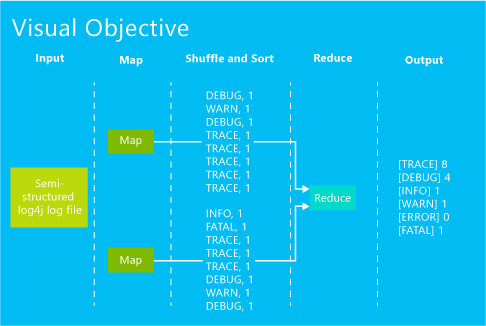
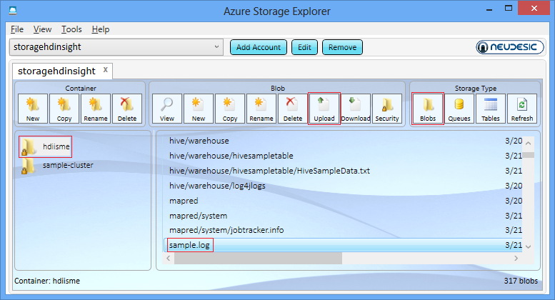
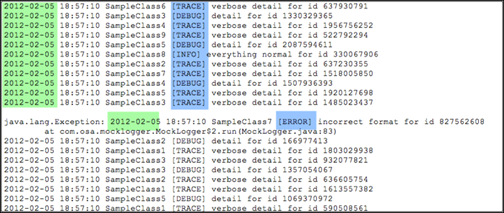
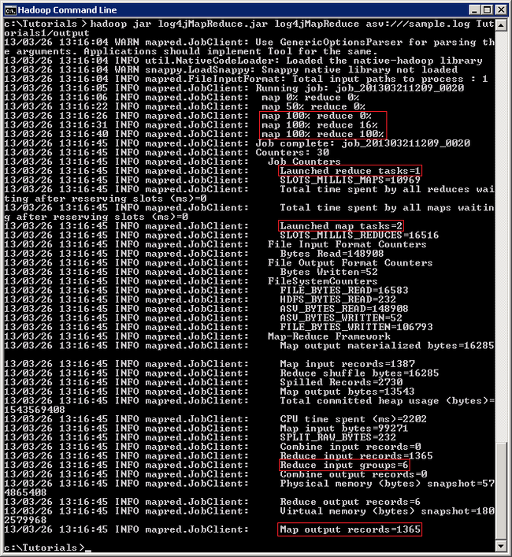

<properties linkid="manage-services-hdinsight-using-mapreduce" urlDisplayName="Using MapReduce" pageTitle="Using MapReduce with HDInsight - Windows Azure tutorial" metaKeywords="using mapreduce, mapreduce hdinsight, mapreduce azure" metaDescription="Learn how to use MapReduce with HDInsight" metaCanonical="" umbracoNaviHide="0" disqusComments="1" writer="sburgess" editor="mollybos" manager="paulettm" />

# Using MapReduce with HDInsight#

Hadoop MapReduce is a software framework for writing applications which process vast amounts of data. In this tutorial, you will create a Haddop MapReduce job in Java, and execute the job on a Windows Azure HDInsight cluster to process a semi-structured Apache *log4j* log file stored in Azure Storage Vault (Azure Storage Vault or ASV provides a full featured HDFS file system over Windows Azure Blob storage).  

[Apache Log4j](http://en.wikipedia.org/wiki/Log4j) is a logging utility. Each log inside a file contains a *log level* field to show the type and the severity. For example:

	2012-02-03 20:26:41 SampleClass3 [TRACE] verbose detail for id 1527353937

This MapReduce job takes a log4j log file as input, and generates an output file that contains the log level along with its frequency count.  The following is a sample output file:

	[TRACE] 8
	[DEBUG] 4
	[INFO]  1
	[WARN]  1
	[ERROR] 1
	[FATAL] 1

**Estimated time to complete:** 30 minutes

## In this Article
* [Big Data and Hadoop MapReduce](#mapreduce)
* [Upload a sample log4j file to the blob storage](#uploaddata)
* [Connect to an HDInsight Cluster](#connect)
* [Create a MapReduce job](#createjob)
* [Run the MapReduce job](#runjob)
* [Tutorial Clean Up](#cleanup)
* [Next Steps](#nextsteps)

##  Big Data and Hadoop MapReduce
Generally, all applications save errors, exceptions and other coded issues in a log file. These log files can get quite large in size, containing a wealth of data that must be processed and mined. Log files are a good example of big data. Working with big data is difficult using relational databases with statistics and visualization packages. Due to the large amounts of data and the computation of this data, parallel software running on tens, hundreds, or even thousands of servers is often required to compute this data in a reasonable time. Hadoop provides a MapReduce framework for writing applications that process large amounts of structured and semi-structured data in parallel across large clusters of machines in a very reliable and fault-tolerant manner.

The following figure is the visual representation of what you will accomplish in this tutorial:

You will complete the following tasks in this tutorial:

1. Upload a sample log4j file to the blob storage
2. Connect to an HDInsight Cluster
3. Create a MapReduce job
4. Run the MapReduce job
5. Tutorial Clean Up
 
###Upload a Sample Log4j File to the Blob Storage

HDInsight provides two options for storing data, Windows Azure Blob Storage and Hadoop Distributed File system (HDFS). For more information on choosing file storage, see [Using Windows Azure Blob Storage with HDInsight](/en-us/manage/services/hdinsight/using-blob-store). When you provision an HDInsight cluster, the provision process creates a Windows Azure Blob storage container as the default HDInsight file system. To simplify the tutorial procedures, you will use this container for storing the log4j file.

*Azure Storage Explorer* is a useful tool for inspecting and altering the data in your Windows Azure Storage. It is a free tool that can be downloaded from [http://azurestorageexplorer.codeplex.com/](http://azurestorageexplorer.codeplex.com/ "Azure Storage Explorer").

Before using the tool, you must know your Windows Azure storage account name and account key. For the instructions on creating a Windows Azure Storage account, see [How To Create a Storage Account](/en-us/manage/services/storage/how-to-create-a-storage-account/). For the instructions for get the information, see the *How to: View, copy and regenerate storage access keys* section of [How to Manage Storage Accounts](/en-us/manage/services/storage/how-to-manage-a-storage-account/).

1. Download [sample.log](http://go.microsoft.com/fwlink/?LinkID=37003 "Sample.log"), a sample log4j log file, to your local computer.

2. Run **Azure Storage Explorer**.

	

3. Click **Add Account** if the Windows Azure storage account has not been added to the tool. 

	

4. Enter **Storage account name** and **Storage account key**, and then click **Add Storage Account**. 
5. From **Storage Type**, click **Blobs** to display the Windows Azure Blob storage of the account.

	

6. From **Container**, click the container that is designated as the default file system.  The default name is the HDInsight cluster name. You shall see the folder structure of the container.

	
 
	<b>Note</b> 
	
To simplify the tutorial, you will use the default file system. You can also use other containers on the same storage account or other storage accouns.  For more information, see [Using Windows Azure Blob Storage with HDInsight](/en-us/manage/services/hdinsight/using-blob-store/).
 
	

7. From **Blob**, click **Upload**.
8. Browse to the sample.log file you just downloaded, and the click **Open**. You shall see the sample.log file listed there.
9. Double-click the sample.log file to open it.
11. Click **Text** to switch to the tab, so you can view the content of the file.  Notice that the following screen output shows a snippet of sample.log where the data follows a particular structure (except the row that starts with “java.lang.Exception…”). 

 

	Starting from left to right, the structured data rows have a *date* in column 1, *timestamp* in column 2, *class name* in column 3, *log level* in column 4, and so on. 

 The row starting with “java.lang.Exception” does not follow this “well-formed” data structure and is therefore, considered unstructured. The following table shows the key differences between the structured rows and unstructured rows. 

 
	<table border="1">
	<tr>
	<td> 
	Data Type
	</td>
	<td> 
	Date Column
	</td>
	<td> 
	Severity Column
	</td>
	</tr>
	<tr>
	<td> 
	Structured
	</td>
	<td> 
	1
	</td>
	<td> 
	4
	</td>
	</tr>
	<tr>
	<td> 
	Unstructured
	</td>
	<td> 
	2
	</td>
	<td> 
	5
	</td>
	</tr>
	</table>
12. Click **Close**. 
13. From the **File** menu, click **Exit** to close Azure Storage Explorer.

##Connect to an HDInsight Cluster
You must have an HDInsight cluster previsioned before you can work on this tutorial. To enable the Windows Azure HDInsight Service preview, click [here](https://account.windowsazure.com/PreviewFeatures). For information on prevision an HDInsight cluster see [How to Administer HDInsight Service](/en-us/manage/services/hdinsight/howto-administer-hdinsight/) or [Getting Started with Windows Azure HDInsight Service](/en-us/manage/services/hdinsight/get-started-hdinsight/).

1. Sign in to the [Management Portal](https://manage.windowsazure.com).
2. Click **HDINSIGHT** on the left. You shall see a list of deployed Hadoop clusters.
3. Click the Hadoop cluster where you want to upload data to and run the MapReduce job.
4. Click **Connect** on the bottom to connect to the remote desktop.
5. Click **Open**.
6. Click **Connect**.
7. Click **Yes**.
8. Enter your credentials, and then press **ENTER**.
9. From Desktop, click **Hadoop Command Line**. You will use Hadoop command prompt to execute all of the commands in this tutorial. Most of the commands can be run from the [Interactive JavaScript Console](/en-us/manage/services/hdinsight/interactive-javascript-and-hive-consoles/).
10. Run the following command to list and verify the sample.log file you uploaded to Azure Storage Vault (ASV): 

		hadoop fs -ls asv:///sample.log

	The asv syntax is for listing the files in the default file system.  To access files in other containers, use the following syntax: 

		hadoop fs -ls asv[s]://[[<container>@]<storagename>.blob.core.windows.net]/<path>

	For example, you can list the same file using the following command:

		hadoop fs -ls asv://container@storagename.blob.core.windows.net/sample.log

	replace *container* with the container name, and *storagename* with the Blob Storage account name. 

	Because the file is located on the default file system, the same result can also be retrieved by using the following command:

		hadoop fs -ls /sample.log
	 
	To use asvs, you must provide the FQDN. For example to access sample.log on the default file system: 

		#ls asvs://container@storagename.blob.core.microsoft.net/sample.log

	

## Create the MapReduce job ##
The Java programming language is used in this sample. Hadoop Streaming allows developers to use virtually any programming language to create MapReduces jobs.

1. From Hadoop command prompt, run the following commands to make a directory and change directory to the folder:

		mkdir c:\Tutorials
		cd \Tutorials

2. run the following command to create a java file in the C:\Tutorials folder:

		notepad log4jMapReduce.java

	
 
	<b>Note</b> 
	
The class name is hard-coded in the program. If you want to change the file name,  you must update the java program accordingly.
 
	

3. Click **Yes** to create a new file.

4. Copy and paste the following java program into the Notepad window.

		import java.io.IOException;
		import java.util.Iterator;
		import java.util.regex.Matcher;
		import java.util.regex.Pattern;
	
		import org.apache.hadoop.fs.Path;
		import org.apache.hadoop.io.IntWritable;
		import org.apache.hadoop.io.LongWritable;
		import org.apache.hadoop.io.Text;
		import org.apache.hadoop.mapred.FileInputFormat;
		import org.apache.hadoop.mapred.FileOutputFormat;
		import org.apache.hadoop.mapred.JobClient;
		import org.apache.hadoop.mapred.JobConf;
		import org.apache.hadoop.mapred.MapReduceBase;
		import org.apache.hadoop.mapred.Mapper;
		import org.apache.hadoop.mapred.OutputCollector;
		import org.apache.hadoop.mapred.Reducer;
		import org.apache.hadoop.mapred.Reporter;
		import org.apache.hadoop.mapred.TextInputFormat;
		import org.apache.hadoop.mapred.TextOutputFormat;
	
		public class log4jMapReduce
		{
	
			//The Mapper
	      	public static class Map extends MapReduceBase implements Mapper<LongWritable, Text, Text, IntWritable>
	      	{     
		        private static final Pattern pattern = Pattern.compile("(TRACE)|(DEBUG)|(INFO)|(WARN)|(ERROR)|(FATAL)"); 
	        	private static final IntWritable accumulator = new IntWritable(1); 
	        	private Text logLevel = new Text();
	
	        	public void map(LongWritable key, Text value, OutputCollector<Text, IntWritable> collector, Reporter reporter) throws IOException 
				{
		     		// split on space, '[', and ']'
		        	final String[] tokens = value.toString().split("[ \\[\\]]"); 
		
		        	if(tokens != null)
		        	{
			            //now find the log level token
		            	for(final String token : tokens) 
		            	{
			                final Matcher matcher = pattern.matcher(token);
		                	//log level found
		                	if(matcher.matches()) 
		                	{
			                    logLevel.set(token);
								//Create the key value pairs
								collector.collect(logLevel, accumulator);
		                	}                                                           
		            	}
		        	}                       
	        	}
	      	}
	 
	  		//The Reducer
	    	public static class Reduce extends MapReduceBase implements Reducer<Text, IntWritable, Text, IntWritable>
	    	{
			    public void reduce(Text key, Iterator<IntWritable> values, OutputCollector<Text, IntWritable> collector,Reporter reporter) throws IOException
		    	{
			        int count = 0;
					//code to aggregate the occurrence
		        	while(values.hasNext())
		        	{
		                    	count += values.next().get();
		        	}
			
		        	System.out.println(key +  "\t" + count);
		        	collector.collect(key, new IntWritable(count));
		    	}
	   		}
	
			//The java main method to execute the MapReduce job
			public static void main(String[] args) throws Exception
			{
				//Code to create a new Job specifying the MapReduce class
		    	final JobConf conf = new JobConf(log4jMapReduce.class);
		    	conf.setOutputKeyClass(Text.class);
		    	conf.setOutputValueClass(IntWritable.class);
		    	conf.setMapperClass(Map.class);
		
				// Combiner is commented out – to be used in bonus activity
		
			    //conf.setCombinerClass(Reduce.class);
		    	conf.setReducerClass(Reduce.class);
		    	conf.setInputFormat(TextInputFormat.class);
		    	conf.setOutputFormat(TextOutputFormat.class);
		
				//File Input argument passed as a command line argument
		    	FileInputFormat.setInputPaths(conf, new Path(args[0]));
		
				//File Output argument passed as a command line argument
			    FileOutputFormat.setOutputPath(conf, new Path(args[1]));
		
				//statement to execute the job 
			    JobClient.runJob(conf);
			}
		}

5. Press **CTRL+S** to save the file.
6. Close Notepad.

7. Compile the java file using the following command:

		C:\apps\dist\java\bin\javac -classpath C:\apps\dist\hadoop-1.1.0-SNAPSHOT\hadoop-core-*.jar log4jMapReduce.java
 
	Make sure there is no compilation errors.

6. Create a log4jMapReduce.jar file containing the Hadoop class files:

		C:\apps\dist\java\bin\jar -cvf log4jMapReduce.jar *.class
 
	After executing the jar command, you will have the following files in the C:\Tutorials directory:

		log4jMapReduce$Map.class
		log4jMapReduce$Reduce.class
		log4jMapReduce.class
		log4jMapReduce.jar
		log4jMapReduce.java

## Run the MapReduce job
Until now, you have uploaded a log4j log files to the Blob storage, and compiled the MapReduce job.  The next step is to run the job.

1. From Hadoop command prompt, execute the following command to run the Hadoop MapReduce job:

		hadoop jar log4jMapReduce.jar log4jMapReduce Tutorials/input/sample.log Tutorials/output

	This command does a number of things: 
	
	- Calling the Hadoop program
	- Specifying the jar file (log4jMapReduce.jar)
	- Indicating the class file (log4jMapReduce)
	- Specifying the input file (Tutorials/input/sample.log), and output directory (Tutorials/output) 
	- Running the MapReduce job 	

	
 
	The Reduce programs begin to process the data when the Map programs are 100% complete. Prior to that, the Reducer(s) queries the Mappers for intermediate data and gathers the data, but waits to process. 
	
	There are 6 Reduce input records (that correspond to the six log levels), and 135 Map output records (that contain key value pairs). The Reduce program condensed the set of intermediate values that share the same key (DEBUG, ERROR, FATAL, and so on) to a smaller set of values.    

2. View the output of the MapReduce job in HDFS:

		hadoop fs -cat Tutorials/output/part-00000

	By default, Hadoop creates files begin with the following naming convention: “part-00000”. Additional files created by the same job will have the number increased.The output look like:

		DEBUG   434
		ERROR   6
		FATAL   2
		INFO    96
		TRACE   816
		WARN    11
 
	Notice that after running MapReduce that the data types are now totaled and in a structured format.  

## Tutorial Clean Up ##

The clean up task applies to this tutorial only; it is not performed in the actual deployment. In this task, you will delete input and output directories so that if you like, you can run the tutorial again.  

1. Delete the sample.log file:

		hadoop fs -rm asv:///sample.log
 
2. Delete the output directory and recursively delete files within the directory:

		hadoop fs –rmr Tutorials/output/
 
Congratulations! You have successfully completed this tutorial.

##Next Steps

While MapReduce provides powerful diagnostic abilities, it can be a bit challenging to master. Other languages such as Pig and Hive provide an easier way to work with data stored in your HDInsight Service. To learn more, see the following articles:

* [Getting Started with Windows Azure HDInsight Service](/en-us/manage/services/hdinsight/get-started-hdinsight/)
* [Using Hive with HDInsight](/en-us/manage/services/hdinsight/using-hive-with-hdinsight/)
* [Using Pig with HDInsight](/en-us/manage/services/hdinsight/using-pig-with-hdinsight/) 
* [How to Run the HDInsight Samples](/en-us/manage/services/hdinsight/howto-run-samples/)
