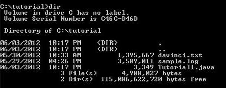
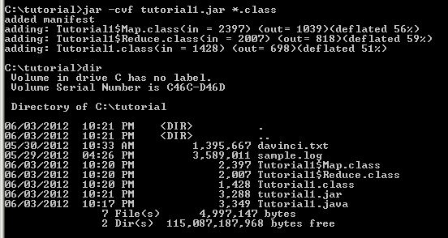
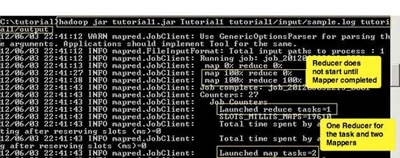
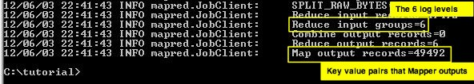
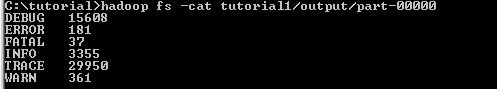

<properties linkid="manage-hdinsight-using-mapreduce" urlDisplayName="Using MapReduce" pageTitle="Using MapReduce with HDInsight - Windows Azure tutorial" metaKeywords="using mapreduce, mapreduce hdinsight, mapreduce azure" metaDescription="Learn how to use MapReduce with HDInsight" metaCanonical="http://www.windowsazure.com/en-us/manage/hdinsight/using-mapreduce" umbracoNaviHide="0" disqusComments="1" writer="sburgess" editor="mollybos" manager="paulettm" />

# Using MapReduce with HDInsight#

## Introduction ##

In this tutorial, you will execute a simple Hadoop MapReduce job. This MapReduce job takes a semi-structured log file as input, and generates an output file that contains the log level along with its frequency count. 

Our input data consists of a semi-structured log4j file in the following format:

**Data:**

	2012-02-03 20:26:41 SampleClass3 [TRACE] verbose detail for id 1527353937

	java.lang.Exception: 2012-02-03 20:26:41 SampleClass9 [ERROR] incorrect format for id 324411615
            at com.osa.mocklogger.MockLogger#2.run(MockLogger.java:83)

	2012-02-03 20:26:41 SampleClass2 [TRACE] verbose detail for id 191364434

	2012-02-03 20:26:41 SampleClass1 [DEBUG] detail for id 903114158

	2012-02-03 20:26:41 SampleClass8 [TRACE] verbose detail for id 1331132178

	2012-02-03 20:26:41 SampleClass8 [INFO] everything normal for id 1490351510

	2012-02-03 20:32:47 SampleClass8 [TRACE] verbose detail for id 1700820764

	2012-02-03 20:32:47 SampleClass2 [DEBUG] detail for id 364472047

	2012-02-03 20:32:47 SampleClass7 [TRACE] verbose detail for id 1006511432

	2012-02-03 20:32:47 SampleClass4 [TRACE] verbose detail for id 1252673849

	2012-02-03 20:32:47 SampleClass0 [DEBUG] detail for id 881008264

	2012-02-03 20:32:47 SampleClass0 [TRACE] verbose detail for id 1104034268

	2012-02-03 20:32:47 SampleClass6 [TRACE] verbose detail for id 1527612691

	java.lang.Exception: 2012-02-03 20:32:47 SampleClass7 [WARN] problem finding id 484546105
            at com.osa.mocklogger.MockLogger#2.run(MockLogger.java:83)

	2012-02-03 20:32:47 SampleClass0 [DEBUG] detail for id 2521054

	2012-02-03 21:05:21 SampleClass6 [FATAL] system problem at id 1620503499

 
The output data will be put into a file showing the various log4j log levels along with its frequency occurrence in our input file. A sample of these metrics is displayed below:

**OUTPUT:**
 
	[TRACE] 8
	[DEBUG] 4
	[INFO]  1
	[WARN]  1
	[ERROR] 1
	[FATAL] 1
 
This tutorial takes about 30 minutes to complete and is divided into the following five tasks:

- Task 1: Connect to your HDInsight Cluster

- Task 2: Create The MapReduce job

- Task 3: Import data into HDFS and Run MapReduce

- Task 4: Examine the MapReduce job’s output on HDFS

- Task 5: Tutorial Clean Up

 
The visual representation of what you will accomplish in this tutorial is shown in the figure.

## The Use Case ##
 
Generally, all applications save errors, exceptions and other coded issues in a log file so administrators can review the problems, or generate certain metrics from the log file data. These log files usually get quite large in size, containing a wealth of data that must be processed and mined. 

Log files are a good example of big data. Working with big data is difficult using relational databases with statistics and visualization packages. Due to the large amounts of data and the computation of this data, parallel software running on tens, hundreds, or even thousands of servers is often required to compute this data in a reasonable time. Hadoop provides a MapReduce framework for writing applications that process large amounts of structured and semi-structured data in parallel across large clusters of machines in a very reliable and fault-tolerant manner.

In this tutorial, you will use an semi-structured, application log4j log file as input, and generate a Hadoop MapReduce job that will report some basic statistics as output.

Task 1: Connect to your HDInsight Cluster

1. Sign in to the [Management Portal](https://manage.windowsazure.com).
2. Click **HDINSIGHT**. You shall see a list of deployed Hadoop clusters.
3. Click the Hadoop cluster where you want to upload data to.
4. Click the cluster URL, or **Start Dashboard** on the bottom of the page
5. Enter **User name** and **Password** for the cluster, and then click **Log On**.
6. Click **Remote Desktop**.
	
	

7. Click **Open**.
9. Enter your credential, and then click **OK**.
10. Click **Yes**.
11. From Desktop, click **Hadoop Command Line**.

## Task 2: Create the MapReduce job ##

Step 1: Create the tutorial directory:

> mkdir c:\tutorial 
 
Step 2:  Download the [sample.log](http://go.microsoft.com/fwlink/?LinkID=286223 "Sample.log") file and put it into the C:\tutorial directory.

Step 3: Review the data in sample.log file:

> notepad c:\tutorial\sample.log

Step 4: Load the Tutorial1.java class file into the C:\Tutorial directory. Create the MapReduce job java class file, Tutorial1.java, in notepad. Click ‘Yes’ on any warnings that pop up. Then copy the code shown below into the Tutorial1.java file.

> notepad Tutorial1.java
 
This program (shown below) defines a Mapper and a Reducer that will be called.

	import java.io.IOException;
	import java.util.Iterator;
	import java.util.regex.Matcher;
	import java.util.regex.Pattern;

	import org.apache.hadoop.fs.Path;
	import org.apache.hadoop.io.IntWritable;
	import org.apache.hadoop.io.LongWritable;
	import org.apache.hadoop.io.Text;
	import org.apache.hadoop.mapred.FileInputFormat;
	import org.apache.hadoop.mapred.FileOutputFormat;
	import org.apache.hadoop.mapred.JobClient;
	import org.apache.hadoop.mapred.JobConf;
	import org.apache.hadoop.mapred.MapReduceBase;
	import org.apache.hadoop.mapred.Mapper;
	import org.apache.hadoop.mapred.OutputCollector;
	import org.apache.hadoop.mapred.Reducer;
	import org.apache.hadoop.mapred.Reporter;
	import org.apache.hadoop.mapred.TextInputFormat;
	import org.apache.hadoop.mapred.TextOutputFormat;

	public class Tutorial1

	{

      //The Mapper
      public static class Map extends MapReduceBase implements Mapper<LongWritable, Text, Text, IntWritable>
      {     
        private static final Pattern pattern = Pattern.compile("(TRACE)|(DEBUG)|(INFO)|(WARN)|(ERROR)|(FATAL)"); 
        private static final IntWritable accumulator = new IntWritable(1); 
        private Text logLevel = new Text();

        public void map(LongWritable key, Text value, OutputCollector<Text, IntWritable> collector, Reporter reporter) throws IOException 
		{
	     	// split on space, '[', and ']'
	        final String[] tokens = value.toString().split("[ \\[\\]]"); 
	
	        if(tokens != null)
	        {
	            //now find the log level token
	            for(final String token : tokens) 
	            {
	                final Matcher matcher = pattern.matcher(token);
	                //log level found
	                if(matcher.matches()) 
	                {
	                    logLevel.set(token);
						//Create the key value pairs
						collector.collect(logLevel, accumulator);
	                }                                                           
	            }
	        }                       
        }
      }

 

  	//The Reducer
    public static class Reduce extends MapReduceBase implements Reducer<Text, IntWritable, Text, IntWritable>
    {
	    public void reduce(Text key, Iterator<IntWritable> values, OutputCollector<Text, IntWritable> collector,Reporter reporter) throws IOException
	    {
	        int count = 0;
			//code to aggregate the occurrence
	        while(values.hasNext())
	        {
	                    count += values.next().get();
	        }
	
	        System.out.println(key +  "\t" + count);
	        collector.collect(key, new IntWritable(count));
	    }
   	}

 

      //The java main method to execute the MapReduce job

	public static void main(String[] args) throws Exception
	{
	
		//Code to create a new Job specifying the MapReduce class
	    final JobConf conf = new JobConf(Tutorial1.class);
	    conf.setOutputKeyClass(Text.class);
	    conf.setOutputValueClass(IntWritable.class);
	    conf.setMapperClass(Map.class);
	
		// Combiner is commented out – to be used in bonus activity
	
	    //conf.setCombinerClass(Reduce.class);
	    conf.setReducerClass(Reduce.class);
	    conf.setInputFormat(TextInputFormat.class);
	    conf.setOutputFormat(TextOutputFormat.class);
	
		//File Input argument passed as a command line argument
	    FileInputFormat.setInputPaths(conf, new Path(args[0]));
	
		//File Output argument passed as a command line argument
	    FileOutputFormat.setOutputPath(conf, new Path(args[1]));
	
		//statement to execute the job 
	    JobClient.runJob(conf);
	}
    }

Step 3: Compile the java file.

> C:\apps\dist\java\bin\javac -classpath C:\apps\dist\hadoop-1.1.0-SNAPSHOT\hadoop-core-*.jar Tutorial1.java
 

Step 4: Create a tutorial1.jar file containing the Hadoop class files:

> C:\apps\dist\java\bin\jar -cvf tutorial1.jar *.class
 
Notice the results before and after executing the jar command, including verifying the existence of the sample.log file in the non-HDFS directory structure (used later).

 
## Task 3: Import data into HDFS and Run MapReduce ##

The MapReduce job reads data from HDFS. In this task, we will place the sample.log file data into HDFS where MapReduce will read it and run the job. 

Step 1: Create an input directory in HDFS:

> hadoop fs -mkdir tutorial1/input/
 
Step 2: Verify that the input directory has been created in the Hadoop file system:

> hadoop fs -ls tutorial1/

 
Step 3: Load the sample.log input file into HDFS, and create the input directory:

> hadoop fs -put sample.log tutorial1/input/

Step 4: Verify that the sample.log has been loaded into HDFS:

> hadoop fs -ls tutorial1/input/

 
Step 5: Run the Hadoop MapReduce job

In this step, we are doing a number of things, as follows: 

- Calling the Hadoop program

- Specifying the jar file (tutorial1.jar)

- Indicating the class file (Tutorial1)

- Specifying the input file (tutorial1/input/sample.log), and output directory (tutorial1/output) 

- Running the MapReduce job 

> hadoop jar tutorial1.jar Tutorial1 tutorial1/input/sample.log tutorial1/output
 
The Reduce programs begin to process the data when the Map programs are 100% complete. Prior to that, the Reducer(s) queries the Mappers for intermediate data and gathers the data, but waits to process. This is shown in the following screenshot. 

The next screen output shows Reduce input records (that correspond to the six log levels) and Map output records (that contain key value pairs). As you can see, the Reduce program condensed the set of intermediate values that share the same key (DEBUG, ERROR, FATAL, and so on) to a smaller set of values.    

## Task 4: Examine the MapReduce job’s output on HDFS ##

Step 1: View the output of the MapReduce job in HDFS:

> hadoop fs -cat tutorial1/output/part-00000
 
	Note: By default, Hadoop creates files begin with the following naming convention: “part-00000”. Additional files created by the same job will have the number increased.

After executing the command, you should see the following output:

Notice that after running MapReduce that the data types are now totaled and in a structured format.  

## Task 5: Tutorial Clean Up ##

The clean up task applies to this tutorial only; it is not performed in the actual deployment. In this task, you will delete input and output directories so that if you like, you can run the tutorial again.  

Step 1: Delete the input directory and recursively delete files within the directory:

> hadoop fs -rmr tutorial1/input/
 
Step 2: Delete the output directory and recursively delete files within the directory:

> hadoop fs –rmr tutorial1/output/
 
Congratulations! You have successfully completed this tutorial.

##Next Steps

* [Using Pig with HDInsight][hdinsight-pig] 

* [Using Hive with HDInsight][hdinsight-hive]

[hdinsight-pig]: /en-us/manage/services/hdinsight/using-pig/
[hdinsight-hive]: /en-us/manage/services/hdinsight/using-hive/
