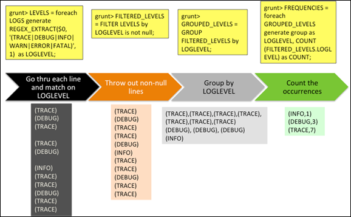
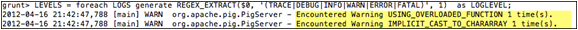

<properties linkid="manage-hdinsight-using-pig" urlDisplayName="Using Pig" pageTitle="Using Pig with HDInsight - Windows Azure tutorial" metaKeywords="using pig, pig hdinsight, pig azure" metaDescription="Learn how to use Pig with HDInsight." metaCanonical="http://www.windowsazure.com/en-us/manage/hdinsight/using-pig" umbracoNaviHide="0" disqusComments="1" writer="sburgess" editor="mollybos" manager="paulettm" />

# Using Pig with HDInsight #

## Introduction##

Pig provides a scripting language to execute MapReduce jobs as an alternative to writing Java code. Pig’s scripting language is called Pig Latin. 

Using Pig reduces the time needed to write mapper and reducer programs. This means that no Java is required, and there is no need for boilerplate code. You also have the flexibility to combine java code with Pig. Many complex algorithms can be written in less than five lines of human readable Pig code, as demonstrated in this tutorial.

 

Pig Latin statements follow this general flow:   

- LOAD—Read data to be manipulated from the file system

- TRANSFORM—Manipulate the data 

- DUMP or STORE—Output data to the screen or store for processing

In this tutorial, you will write Pig Latin statements to analyze an application log file, and run various queries on the data to generate output. First, you will use Pig Latin in interactive mode (Grunt shell) to analyze a single log file, and then you will use Pig in batch mode (script) to perform the same task. 

The input file consists of a semi-structured log4j file in the following format:

**DATA:**

	2012-02-03 20:26:41 SampleClass3 [TRACE] verbose detail for id 1527353937

	java.lang.Exception: 2012-02-03 20:26:41 SampleClass9 [ERROR] incorrect format for id 324411615

            at com.osa.mocklogger.MockLogger$2.run(MockLogger.java:83)

	2012-02-03 20:26:41 SampleClass2 [TRACE] verbose detail for id 191364434

	2012-02-03 20:26:41 SampleClass1 [DEBUG] detail for id 903114158

	2012-02-03 20:26:41 SampleClass8 [TRACE] verbose detail for id 1331132178

	2012-02-03 20:26:41 SampleClass8 [INFO] everything normal for id 1490351510

	2012-02-03 20:32:47 SampleClass8 [TRACE] verbose detail for id 1700820764

	2012-02-03 20:32:47 SampleClass2 [DEBUG] detail for id 364472047

	2012-02-03 20:32:47 SampleClass7 [TRACE] verbose detail for id 1006511432

	2012-02-03 20:32:47 SampleClass4 [TRACE] verbose detail for id 1252673849

	2012-02-03 20:32:47 SampleClass0 [DEBUG] detail for id 881008264

	2012-02-03 20:32:47 SampleClass0 [TRACE] verbose detail for id 1104034268

	2012-02-03 20:32:47 SampleClass6 [TRACE] verbose detail for id 1527612691

	java.lang.Exception: 2012-02-03 20:32:47 SampleClass7 [WARN] problem finding id 484546105

            at com.osa.mocklogger.MockLogger$2.run(MockLogger.java:83)

	2012-02-03 20:32:47 SampleClass0 [DEBUG] detail for id 2521054

	2012-02-03 21:05:21 SampleClass6 [FATAL] system problem at id 1620503499

The output data will be put into a file showing the various log4j log levels along with its frequency occurrence in the input file. A sample of these metrics is displayed below:

**OUTPUT:**

	[TRACE] 8

	[DEBUG] 4

	[INFO]  1

	[WARN]  1

	[ERROR] 1

	[FATAL] 1
 

This tutorial takes about 30 minutes to complete and is divided into the following tasks:

- Task 1: Connecting to your HDInsight Cluster

- Task 2: Use Pig in Interactive Mode

- Task 3: Use Pig in Batch Mode

- Task 4: Tutorial Clean Up

 
The visual representation of what you will accomplish in this tutorial is shown in the following two figures. These figures show a representative sample of the dataset to illustrate the flow and transformation of the data as you run through the lines of Pig code in the script. (The entire dataset is over 1000 lines.) The first figure shows a sample of the entire file, and the changes to the file a

 

Figure 1: Whole File Sample

Figure 2: Data Transformation

## The Use Case ##

Databases are great for small sets of data and low latency queries. However, when it comes to Big Data and large data sets in terabytes, traditional SQL databases are not the ideal solution. As database load increases and performance degrades, historically, database administrators have had to buy bigger hardware. 

 

Generally, all applications save errors, exceptions and other coded issues in a log file, so administrators can review the problems, or generate certain metrics from the log file data. These log files usually get quite large in size, containing a wealth of data that must be processed and mined. 

 

Log files are a good example of big data. Working with big data is difficult using relational databases and statistics/visualization packages. Due to the large amounts of data and the computation of this data, parallel software running on tens, hundreds, or even thousands of servers is often required to compute this data in a reasonable time. Hadoop provides a MapReduce framework for writing applications that processes large amounts of structured and unstructured data in parallel across large clusters of machines in a very reliable and fault-tolerant manner.

 

In this tutorial, we will use a semi-structured, application log4j log file as input, and report some basic statistics as output using a Pig job. This tutorial demonstrates the advantages of Pig, and how it can be used to simplify MapReduce jobs.

## Task 1: Connecting to your HDInsight Cluster ##

  
1. Sign in to the [Management Portal](https://manage.windowsazure.com).
2. Click **HDINSIGHT**. You shall see a list of deployed Hadoop clusters.
3. Click the name of the HDInsight cluster where you want to upload data to.
4. Click **Connect RDP** on the bottom of the screen
7. Click **Open**.
9. Enter your credential, and then click **OK**.
10. Click **Yes**.
11. From Desktop, double-click **Hadoop Command Line**.
	
## Task 2: Use Pig in Interactive Mode   ##

Step 1: Create the tutorial directory. 

> mkdir c:/tutorial 
 
Step 2: Download the [sample.log](http://go.microsoft.com/fwlink/?LinkID=286223 "Sample.log") file and put it into the C:\tutorial directory.
 
Step 3: Review the data in sample.log file:

> notepad c:/tutorial/sample.log

Step 4: Copy sample.log into HDFS:

> hadoop fs -copyFromLocal c:/tutorial/sample.log sample.log

Step 5: Enter Pig interactive command mode:

> c:\apps\dist\pig-0.9.3-SNAPSHOT\bin\pig
 
Notice that when Pig starts it creates a file in C:\tutorial\ for logging error messages, and connects to HDFS and the map-reduce job tracker. 

 

Step 6: Load the sample.log file that you want to manipulate and give it the alias “LOGS” with the following command:

> grunt> LOGS = LOAD 'sample.log';
 
After each command, you can display the resulting output to the screen to view changes in the data, as shown here. We only show part of the results here due to its large size of the dataset (over 50,000 records)

> grunt> dump LOGS;
 

**OUTPUT:**

	(2012-02-05 19:23:50 SampleClass5 [TRACE] verbose detail for id 313393809)

	(2012-02-05 19:23:50 SampleClass6 [DEBUG] detail for id 536603383)

	(2012-02-05 19:23:50 SampleClass9 [TRACE] verbose detail for id 564842645)

	(2012-02-05 19:23:50 SampleClass8 [TRACE] verbose detail for id 1929822199)

	(2012-02-05 19:23:50 SampleClass5 [DEBUG] detail for id 1599724386)

	(2012-02-05 19:23:50 SampleClass0 [INFO] everything normal for id 2047808796)

	(2012-02-05 19:23:50 SampleClass2 [TRACE] verbose detail for id 1774407365)

	(2012-02-05 19:23:50 SampleClass2 [TRACE] verbose detail for id 2099982986)

	(2012-02-05 19:23:50 SampleClass4 [DEBUG] detail for id 180683124)

	(2012-02-05 19:23:50 SampleClass2 [TRACE] verbose detail for id 1072988373)

	(2012-02-05 19:23:50 SampleClass9 [TRACE] verbose detail)

Step 7: Go through each line and find a match on the 6 log levels) and give this :

> grunt> LEVELS = foreach LOGS generate REGEX_EXTRACT($0, '(TRACE|DEBUG|INFO|WARN|ERROR|FATAL)', 1)  as LOGLEVEL;
 
You will receive two warnings for each of the next several steps, as show in the following screenshot. This is normal. 

 

Step 8: Dump LEVELS, which is an alias and holds only words from each record “TRACE”, “DEBUG”, “INFO”, “WARN”, “ERROR” and “FATAL”.

> grunt> dump LEVELS;
 
**OUTPUT:**

	(DEBUG)

	(TRACE)

	(TRACE)

	(DEBUG)

	(TRACE)

	(TRACE)

	(DEBUG)

	(TRACE)

	(TRACE)

	(DEBUG)

	(TRACE)

	(TRACE)

	(DEBUG)

	(INFO)

	(TRACE)

	(TRACE)

	(DEBUG)

	(TRACE)

	(TRACE)

Step 9: Filter out rows that do not have a match (for example, empty rows):

> grunt> FILTEREDLEVELS = FILTER LEVELS by LOGLEVEL is not null;

Now dump the FILTEREDLEVELS, which is an alias, that holds these words from each record – “TRACE”, “DEBUG”, “INFO”, “WARN”, “ERROR” & “FATAL” and removes any NULL or EMPTY words.

> grunt> dump FILTEREDLEVELS;

**OUTPUT:**

	(DEBUG)

	(TRACE)

	(TRACE)

	(DEBUG)

	(TRACE)

	(TRACE)

	(DEBUG)

	(TRACE)

	(TRACE)

	(DEBUG)

	(TRACE)

	(TRACE)

	(DEBUG)

	(INFO)

	(TRACE)

	(TRACE)

	(DEBUG)

	(TRACE)

	(TRACE)

Step 10: Group all of the log levels into their own row, (counting is not done yet; it occurs in next step):

> grunt> GROUPEDLEVELS = GROUP FILTEREDLEVELS by LOGLEVEL;
 
Now if you dump LOGLEVELS alias, all of the Log levels are grouped together.

> grunt> dump GROUPEDLEVELS;

**OUTPUT:**

	(TRACE),(TRACE),(TRACE),(TRACE),(TRACE),(TRACE),(TRACE),(TRACE),
	(TRACE),(TRACE),(TRACE),(TRACE),(TRACE),(TRACE),(TRACE),(TRACE),
	(TRACE),(TRACE),(TRACE),(TRACE),(TRACE),(TRACE),(TRACE),(TRACE),
	(TRACE),(TRACE),(TRACE),(TRACE),(TRACE),(TRACE),(TRACE),(TRACE),
	(TRACE),(TRACE),(TRACE),(TRACE),(TRACE),(TRACE),(TRACE),(TRACE),
	(TRACE),(TRACE),(TRACE),(TRACE),(TRACE),(TRACE),(TRACE),(TRACE),
	(TRACE),(TRACE),(TRACE),(TRACE),(TRACE),(TRACE),(TRACE),(TRACE),
	(TRACE),(TRACE),(TRACE),(TRACE),(TRACE),(TRACE),(TRACE),(TRACE),
	(TRACE),(TRACE),(TRACE),(TRACE),(TRACE),(TRACE),(TRACE),(TRACE),
	(TRACE),(TRACE),(TRACE),(TRACE),(TRACE),(TRACE),(TRACE),(TRACE),
	(TRACE)})

Step 11: For each group, count the occurrences of log levels (these will be the frequencies of each log level):

> grunt> FREQUENCIES = foreach GROUPED_LEVELS generate group as LOGLEVEL, COUNT(FILTERED_LEVELS.LOGLEVEL) as COUNT;
 
Dump FREQUENCIES alias to see the count of the occurrences of each word in a group. 
 
> grunt> dump FREQUENCIES;
 

**OUTPUT:**

	(INFO,3355)

	(WARN,361)

	(DEBUG,15608)

	(ERROR,181)

	(FATAL,37)

	(TRACE,29950)

Step 12: Sort the frequencies in descending order:

> grunt> RESULT = order FREQUENCIES by COUNT desc;

> grunt> dump RESULT;   

This step will take a few minutes.  

Step 13: Analyze the output. Scroll down to the Job Stats near the bottom of the output underneath the word “Success!”. Notice that Pig executed three MapReduce jobs with just a few lines of Pig Latin and no Java. 

At the very bottom of the output, notice the job results: 

**OUTPUT:**

	(TRACE,29950)

	(DEBUG,15608)

	(INFO,3355)

	(WARN,361)

 	(ERROR,181)

	(FATAL,37)

## Task 3: Use Pig in Batch Mode   ##

Next, you will use Pig in batch mode by creating a Pig script made up of the same Pig commands you used in the last task. 

Step 1: Exit Pig interactive mode.

> grunt> quit
 
Step 2: Verify that you are still in the tutorial directory that contains the sample.log input file exists:

> cd C:\tutorial\

Step 3: Create the Pig script by creating a file named ‘pigscript.pig’

> notepad pigscript.pig
 
Step 4: Copy and paste the following Pig commands in the pigscript.pig file, and save:

- load the log file 

> LOGS = LOAD 'sample.log';

-  iterate through each line and match on the 6 log levels

> LEVELS = foreach LOGS generate REGEX_EXTRACT($0, '(TRACE|DEBUG|INFO|WARN|ERROR|FATAL)', 1)  as LOGLEVEL;

- filter out non-match rows, i.e. empty rows

> FILTEREDLEVELS = FILTER LEVELS by LOGLEVEL is not null;

- now group/consolidate all of the log levels into their own row, counting is not done yet

> GROUPEDLEVELS = GROUP FILTEREDLEVELS by LOGLEVEL;

- for each group, now count the occurrences of log levels which will be the frequencies of each log level

> FREQUENCIES = foreach GROUPEDLEVELS generate group as LOGLEVEL, COUNT(FILTEREDLEVELS.LOGLEVEL) as COUNT;

- sort the frequencies in descending order

> RESULT = order FREQUENCIES by COUNT desc;

- write the result to a file

> store RESULT into 'sampleout';
 
Step 5: Run the newly-created Pig script:

> c:\apps\dist\pig-0.9.3-SNAPSHOT\bin\pig pigscript.pig
 
Step 6: Analyze the output. View the file by using the following command:

> hadoop fs -cat sampleout/part-r-00000

 
The results are the same as interactive mode. 
 
## Task 4: Tutorial Clean Up ##

The clean up task applies to this tutorial only; it is not performed in the actual deployment. In this task, you will delete input and output directories so that if you like, you can run the tutorial again. A way to gracefully shut down processes when exiting the VM is also shown below.

Step 1: Delete the Pig job directory and recursively delete files within the directory:

> hadoop fs –rmr sampleout
 
Congratulations! You have successfully completed this tutorial.

##Next Steps

* [Using Hive with HDInsight][hdinsight-hive] 

* [Using MapReduce with HDInsight][hdinsight-mapreduce]

* [Using the Interactive JavaScript and Hive consoles][interactive-console]

[hdinsight-mapreduce]: /en-us/manage/services/hdinsight/howto-mapreduce/
[hdinsight-hive]: /en-us/manage/services/hdinsight/howto-hive/
[interactive-console]: /en-us/manage/services/hdinsight/interactiveconsole/