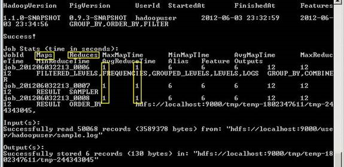

<properties linkid="manage-services-hdinsight-using-pig" urlDisplayName="Using Pig" pageTitle="Using Pig with HDInsight - Windows Azure tutorial" metaKeywords="using pig, pig hdinsight, pig azure" metaDescription="Learn how to use Pig with HDInsight." metaCanonical="" umbracoNaviHide="0" disqusComments="1" writer="sburgess" editor="mollybos" manager="paulettm" />

# Using Pig with HDInsight #

[*Pig*](http://pig.apache.org/) provides a scripting language to execute *MapReduce* jobs as an alternative to writing Java code. Pig’s scripting language is called *Pig Latin*. Pig Latin statements follow this general flow:   

- **Load**: Read data to be manipulated from the file system
- **Transform**: Manipulate the data 
- **Dump or store**: Output data to the screen or store for processing

In this tutorial, you will write Pig Latin statements to analyze an Apache log4j log file, and run various queries on the data to generate output. This tutorial demonstrates the advantages of Pig, and how it can be used to simplify MapReduce jobs. 

[Apache Log4j](http://en.wikipedia.org/wiki/Log4j) is a logging utility. Each log inside a file contains a *log level* field to show the type and the severity. For example:

	2012-02-03 20:26:41 SampleClass3 [TRACE] verbose detail for id 1527353937

**Estimated time to complete:** 30 minutes

##In this Article

* [The Pig usage case](#usage)
* [Upload a sample log4j file to Windows Azure Blob Storage](#uploaddata)
* [Connect to your HDInsight cluster](#connect)
* [Use Pig in the interactive mode](#interactivemode)
* [Use Pig in the batch mode](#batchmode)
* [Tutorial clean up](#cleanup)
* [Next steps](#nextsteps)
 
##The Pig Usage Case
Databases are great for small sets of data and low latency queries. However, when it comes to Big Data and large data sets in terabytes, traditional SQL databases are not the ideal solution. As database load increases and performance degrades, historically, database administrators have had to buy bigger hardware. 

Generally, all applications save errors, exceptions and other coded issues in a log file, so administrators can review the problems, or generate certain metrics from the log file data. These log files usually get quite large in size, containing a wealth of data that must be processed and mined. 

Log files are a good example of big data. Working with big data is difficult using relational databases and statistics/visualization packages. Due to the large amounts of data and the computation of this data, parallel software running on tens, hundreds, or even thousands of servers is often required to compute this data in a reasonable time. Hadoop provides a MapReduce framework for writing applications that processes large amounts of structured and unstructured data in parallel across large clusters of machines in a very reliable and fault-tolerant manner.

Using Pig reduces the time needed to write mapper and reducer programs. This means that no Java is required, and there is no need for boilerplate code. You also have the flexibility to combine java code with Pig. Many complex algorithms can be written in less than five lines of human readable Pig code.

The visual representation of what you will accomplish in this tutorial is shown in the following two figures. These figures show a representative sample of the dataset to illustrate the flow and transformation of the data as you run through the lines of Pig code in the script. The first figure shows a sample of the log4j file, and the changes to the file.
 

Figure 1: File Sample:

Figure 2: Data Transformation:

You will complete the following tasks in this tutorial:

* Upload a sample log4j file to Windows Azure Blob Storage
* Connect to your HDInsight cluster
* Use Pig in the interactive mode
* Use Pig in the batch mode
* Tutorial clean up

##Upload a Sample Log4j File to Windows Azure Blob Storage

HDInsight provides two options for storing data, Windows Azure Blob Storage and Hadoop Distributed File system (HDFS). For more information on choosing file storage, see [Using Windows Azure Blob Storage with HDInsight](/en-us/manage/services/hdinsight/howto-blob-store). When you provision an HDInsight cluster, the provision process creates a Windows Azure Blob storage container as the default HDInsight file system. To simplify the tutorial procedures, you will use this container for storing the log4j file.

*Azure Storage Explorer* is a useful tool for inspecting and altering the data in your Windows Azure Storage. It is a free tool that can be downloaded from [http://azurestorageexplorer.codeplex.com/](http://azurestorageexplorer.codeplex.com/ "Azure Storage Explorer").

Before using the tool, you must know your Windows Azure storage account name and account key. For the instructions for get the information, see the *How to: View, copy and regenerate storage access keys* section of [How to Manage Storage Accounts](/en-us/manage/services/storage/how-to-manage-a-storage-account/).

1. Download [sample.log](http://go.microsoft.com/fwlink/?LinkID=37003 "Sample.log") to your local computer.

2. Run **Azure Storage Explorer**.

	

3. Click **Add Account** if the Windows Azure storage account has not been added to the tool. 

	

4. Enter **Storage account name** and **Storage account key**, and then click **Add Storage Account**. 
5. From **Storage Type**, click **Blobs** to display the Windows Azure Blob storage of the account.

	

6. From **Container**, click the container that is designated as the default file system.  The default name is the HDInsight cluster name. You shall see the folder structure of the container.
7. From **Blob**, click **Upload**.
8. Browse to the sample.log file you just downloaded, and the click **Open**. You shall see the sample.log file listed there.
9. Double-click the sample.log file to open it.
11. Click **Text** to switch to the tab, so you can view the content of the file. It is similar to the Figure 1 shown earlier in the article.
12. Click **Close**. 
13. From the **File** menu, click **Exit** to close Azure Storage Explorer.

For information on access ASV, see [Using Windows Azure Blob Storage with HDInsight](/en-us/manage/services/hdinsight/howto-blob-store/).

##Connect to Your HDInsight Cluster ##

You must have an HDInsight cluster previsioned before you can work on this tutorial. To enable the Windows Azure HDInsight Service preview, click [here](https://account.windowsazure.com/PreviewFeatures). For information on prevision an HDInsight cluster see [How to Administer HDInsight Service](/en-us/manage/services/hdinsight/howto-administer-hdinsight/) or [Getting Started with Windows Azure HDInsight Service](/en-us/manage/services/hdinsight/get-started-hdinsight/).
  
1. Sign in to the [Management Portal](https://manage.windowsazure.com).
2. Click **HDINSIGHT**. You shall see a list of deployed Hadoop clusters.
3. Click the name of the HDInsight cluster where you want to upload data to.
4. Click **Connect** on the bottom of the screen
7. Click **Open**.
9. Enter your credential, and then click **OK**.
10. Click **Yes**.
11. From Desktop, double-click **Hadoop Command Line**.
	
## Use Pig in the Interactive Mode   ##

First, you will use Pig Latin in interactive mode (Grunt shell) to analyze a single log file, and then you will use Pig in batch mode (script) to perform the same task. 

1. From Hadoop command line, run the following commands to enter the pig interactive mode:

		cd ..\pig-0.9.3-SNAPSHOT\bin\
		pig
 
2. Load the sample.log file, and give it the alias *LOGS*:

		grunt> LOGS = LOAD 'asv:///sample.log';

	
 
	<b>Note</b> 
	
To use asvs, you must provide the FQDN. For example:  
LOG = LOAD 'asvs://container@storagename.blob.core.windows.net/sample.log'. For more information, see [Using Windows Azure Blob Storage with HDInsight](/en-us/manage/services/hdinsight/howto-blob-store/).
 
	

3. Show the content:

		grunt> dump LOGS;
 
	The output is similar to the following:
	
		(2012-02-05 19:23:50 SampleClass5 [TRACE] verbose detail for id 313393809)
		(2012-02-05 19:23:50 SampleClass6 [DEBUG] detail for id 536603383)
		(2012-02-05 19:23:50 SampleClass9 [TRACE] verbose detail for id 564842645)
		(2012-02-05 19:23:50 SampleClass8 [TRACE] verbose detail for id 1929822199)
		(2012-02-05 19:23:50 SampleClass5 [DEBUG] detail for id 1599724386)
		(2012-02-05 19:23:50 SampleClass0 [INFO] everything normal for id 2047808796)
		(2012-02-05 19:23:50 SampleClass2 [TRACE] verbose detail for id 1774407365)
		(2012-02-05 19:23:50 SampleClass2 [TRACE] verbose detail for id 2099982986)
		(2012-02-05 19:23:50 SampleClass4 [DEBUG] detail for id 180683124)
		(2012-02-05 19:23:50 SampleClass2 [TRACE] verbose detail for id 1072988373)
		(2012-02-05 19:23:50 SampleClass9 [TRACE] verbose detail)

7. Go through each line and find a match on the 6 log levels:

		grunt> LEVELS = foreach LOGS generate REGEX_EXTRACT($0, '(TRACE|DEBUG|INFO|WARN|ERROR|FATAL)', 1)  as LOGLEVEL;
 
	You will receive two warnings for each of the next several steps, as show in the following screenshot. This is normal. 

	

8. Dump LEVELS, which is an alias and holds only words from each record *TRACE*, *DEBUG*, *INFO*, *WARN*, *ERROR* and *FATAL*.

		grunt> dump LEVELS;

9. Filter out the rows that do not have a match (for example, the empty rows):

		grunt> FILTEREDLEVELS = FILTER LEVELS by LOGLEVEL is not null;

10. Dump FILTEREDLEVELS, which is an alias, that holds these words from each record – *TRACE*, *DEBUG*, *INFO*, *WARN*, *ERROR* & *FATAL* and removes any NULL or EMPTY words.

		grunt> dump FILTEREDLEVELS;

	The output is similar to the following:

		(DEBUG)
		(TRACE)
		(TRACE)
		(DEBUG)
		(TRACE)
		(TRACE)
		(DEBUG)
		(TRACE)
		(TRACE)
		(DEBUG)
		(TRACE)
		(TRACE)
		(DEBUG)
		(INFO)
		(TRACE)
		(TRACE)
		(DEBUG)
		(TRACE)
		(TRACE)

10. Group all of the log levels into their own row (counting is not done yet; it occurs in next step):

		grunt> GROUPEDLEVELS = GROUP FILTEREDLEVELS by LOGLEVEL;
 
11. Dump the LOGLEVELS alias, all of the Log levels are grouped together.

		grunt> dump GROUPEDLEVELS;

	The output is similar to the following:

		(TRACE),(TRACE),(TRACE),(TRACE),(TRACE),(TRACE),(TRACE),(TRACE),
		(TRACE),(TRACE),(TRACE),(TRACE),(TRACE),(TRACE),(TRACE),(TRACE),
		(TRACE),(TRACE),(TRACE),(TRACE),(TRACE),(TRACE),(TRACE),(TRACE),
		(TRACE),(TRACE),(TRACE),(TRACE),(TRACE),(TRACE),(TRACE),(TRACE),
		(TRACE),(TRACE),(TRACE),(TRACE),(TRACE),(TRACE),(TRACE),(TRACE),
		(TRACE),(TRACE),(TRACE),(TRACE),(TRACE),(TRACE),(TRACE),(TRACE),
		(TRACE),(TRACE),(TRACE),(TRACE),(TRACE),(TRACE),(TRACE),(TRACE),
		(TRACE),(TRACE),(TRACE),(TRACE),(TRACE),(TRACE),(TRACE),(TRACE),
		(TRACE),(TRACE),(TRACE),(TRACE),(TRACE),(TRACE),(TRACE),(TRACE),
		(TRACE),(TRACE),(TRACE),(TRACE),(TRACE),(TRACE),(TRACE),(TRACE),
		(TRACE)})

11. For each group, count the occurrences of log levels. These is the frequencies of each log level:

		grunt> FREQUENCIES = foreach GROUPEDLEVELS generate group as LOGLEVEL, COUNT(FILTEREDLEVELS.LOGLEVEL) as COUNT;

12. Dump the FREQUENCIES alias to see the count of the occurrences of each word in a group. 
 
		grunt> dump FREQUENCIES;
 
	The output is similar to the following:

		(INFO,3355)
		(WARN,361)
		(DEBUG,15608)
		(ERROR,181)
		(FATAL,37)
		(TRACE,29950)

12. Sort the frequencies in descending order:

		grunt> RESULT = order FREQUENCIES by COUNT desc;

13. Dump RESULT:
		grunt> dump RESULT;   

	This step can take a few minutes.  

	Analyze the output. Scroll down to the Job Stats near the bottom of the output underneath the word “Success!”. Notice that Pig executed three MapReduce jobs with just a few lines of Pig Latin and no Java. 

	

	At the very bottom of the output, it shows the job results: 

		(TRACE,29950)
		(DEBUG,15608)
		(INFO,3355)
		(WARN,361)
	 	(ERROR,181)
		(FATAL,37)

14. Quit the Pig interactive mode

		grunt> quit;

##Use Pig in the Batch Mode   ##

Next, you will use Pig in batch mode by creating a Pig script made up of the same Pig commands you used in the last task. 
 
1. Create the Pig script by creating a file named ‘pigscript.pig’

		notepad pigscript.pig

2. Copy and paste the following Pig commands to the pigscript.pig file, and save:

		- load the log file 
				LOGS = LOAD 'asv:///sample.log';
		-  iterate through each line and match on the 6 log levels
				LEVELS = foreach LOGS generate REGEX_EXTRACT($0, '(TRACE|DEBUG|INFO|WARN|ERROR|FATAL)', 1)  as LOGLEVEL;
		- filter out non-match rows, i.e. empty rows
				FILTEREDLEVELS = FILTER LEVELS by LOGLEVEL is not null;
		- now group/consolidate all of the log levels into their own row, counting is not done yet
				GROUPEDLEVELS = GROUP FILTEREDLEVELS by LOGLEVEL;
		- for each group, now count the occurrences of log levels which will be the frequencies of each log level
				FREQUENCIES = foreach GROUPEDLEVELS generate group as LOGLEVEL, COUNT(FILTEREDLEVELS.LOGLEVEL) as COUNT;
		- sort the frequencies in descending order
				RESULT = order FREQUENCIES by COUNT desc;
		- write the result to a file
				store RESULT into 'sampleout';

3. Save the file and close Notepad. 
 
5. Run the newly-created Pig script:

		c:\apps\dist\pig-0.9.3-SNAPSHOT\bin\pig pigscript.pig
 
6. Analyze the output. View the file by using the following command:

		hadoop fs -cat sampleout/part-r-00000

	
 
	The results are the same as what you got in the interactive mode. 
 
##Tutorial Clean Up ##

In this task, you will delete input and output directories so that if you like, you can run the tutorial again. 

1. Delete the Pig job directory and recursively delete files within the directory:

		hadoop fs –rmr sampleout
 
Congratulations! You have successfully completed this tutorial.

##Next Steps

While Pig allows you to perform data analysis, other languages included with the HDInsight Service may be of interest to you also. Hive provides a SQL-like query language that allows you to easily query against data stored in HDInsight, while MapReduce jobs written in Java allow you to perform complex data analysis. For more information, see the following:

* [Getting Started with Windows Azure HDInsight Service](/en-us/manage/services/hdinsight/get-started-hdinsight/)
* [Using MapReduce with HDInsight](/en-us/manage/services/hdinsight/using-mapreduce-with-hdinsight/)
* [Using Hive with HDInsight](/en-us/manage/services/hdinsight/using-hive-with-hdinsight/)
* [Using Pig with HDInsight](/en-us/manage/services/hdinsight/using-pig-with-hdinsight/) 
* [How to Run the HDInsight Samples](/en-us/manage/services/hdinsight/howto-run-samples/)
