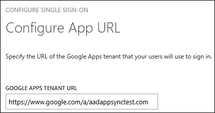
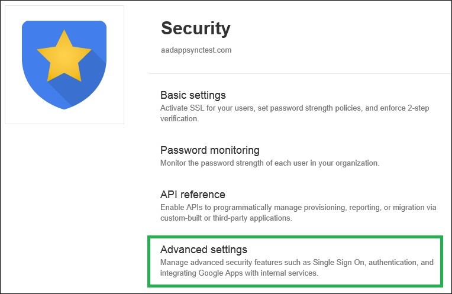

<properties umbracoNaviHide="0" pageTitle="Windows Azure AD Integration with Google Apps" metaKeywords="Windows Azure Google Apps Integration" metaDescription="Learn about integrating Windows Azure AD with Google Apps." linkid="documentation-services-identity-windows-azure-ad-integration-with-google=apps" urlDisplayName="Windows Azure AD Integration with Google Apps" headerExpose="" footerExpose="" disqusComments="0" writer="billmath" editor="lisatoft" manager="terrylan" />

The objective of this tutorial is to show the integration of Windows Azure and Google Apps. The scenario outlined in this tutorial assumes that you already have the following items:

- A valid Windows Azure subscription
- A test tenant in Googe Apps

If you don’t have a valid tenant in Google Apps yet, you can, for example, sign up for a trial account at Google Apps for Business web site.

The scenario outlined in this tutorial consists of the following building blocks:

Enabling the application integration for Google Apps
Configuring single sign-on
Enabling Google Apps API Access
Adding custom domains
Configuring user provisioning

# Enabling the application integration for Google Apps #
The objective of this section is to outline how to enable the application integration for Google Apps.

## To enable the application integration for Google Apps, perform the following steps: ##

1.  In the Windows Azure Management Portal, on the left navigation pane, click **Active Directory**.
2.  From the **Directory** list, select the directory for which you want to enable directory integration.
3.  To open the applications view, in the directory view, click **Applications** in the top menu.
4.  Click **Add** at the bottom to open the **Add Application** dialog.
5.  On the **Integrate an app with Windows Azure AD** dialog, click **Manage access to an application**.
6.  On the **Select an application** to manage page, select **Google Apps** from the list of applications.
7.  Click the **Complete** button to add the application and close the dialog.

# Configuring single sign-on #
The objective of this section is to outline how to enable users to authenticate to Google Apps with their account in Windows Azure AD using federation based on the SAML protocol.

## To configure federated single sign-on, perform the following steps: ##
<ol>
<li>In the Windows Azure Management Portal, select <strong>Active Directory</strong> in the left navigation pane to open the active directory dialog page.</li>
<li>In the directory list, select your directory to open your directory’s configuration page.</li>
<li>Select <strong>APPLICATIONS</strong> from the top level menu.</li>
<li>From the list of applications, select <strong>Google Apps</strong> to open the google apps configuration dialog.</li>
<li>To open the <strong>CONFIGURE SINGLE SIGN-ON</strong> dialog, click <strong>Configure single sign-on.</strong>

</li>

<li>On the Select the single sign-on mode for this app dialog page, select Users authenticate with their account in Windows Azure AD as MODE, and then click the Next button.

</li>
<li>On the <strong>Configure App URL</strong> dialog page, in the <strong>GOOGLE APPS TENANT URL</strong> textbox, type the Google Apps tenant URL, and then click the <strong>Next</strong> button.

</li>
<li>On the <strong>Configure single sign-on at Google Apps</strong> dialog page perform the following steps, and then click the <strong>Complete</strong> button.
		<ul>
 		<li>Click <strong>Download certificate</strong>, and then save the certificate as <strong>c:\googleapps.cer</strong>.</li>
		<li>Open the Google Apps login page, and then sign-on

</li>

		<li>On the <strong>Admin console</strong>, click Security

</li>
</ul>

If the Security icon is not visible, you should click More controls on the bottom of the page.

</li>
<li>On the <strong>Security</strong> page, click <strong>Advanced</strong> settings.
</li>
<li>In the <strong>Advanced</strong> settings section of the page, select <strong>Set up single sign-on</strong>.
</li>
<li>On the Set up single sign-on page, perform the following steps:

	<ul>
		<li>Select <strong>Enable Single Sign-on</strong>.</li>

		<li>On the <strong>Configure single sign-on at Google Apps</strong> page in the Windows Azure AD Portal, copy the <strong>SINGLE SIGN-ON URL</strong>, and then paste it into the related textbox on the <strong>Security page</strong> in the Google Apps <strong>Admin console</strong>.</li>

		<li>On the <strong>Configure single sign-on at Google Apps</strong> page in the Windows Azure AD Portal, copy the <strong>Single sign-out service URL</strong>, and then paste it into the related textbox on the <strong>Security</strong> page in the Google Apps <strong>Admin console</strong>.</li>

		<li>On the <strong>Configure single sign-on at Google Apps</strong> page in the Windows Azure AD Portal, copy the <strong>Change password URL</strong>, and then paste it into the related textbox on the <strong>Security</strong> page in the Google Apps <strong>Admin console</strong>.</li>

		<li>Click the <strong>Browse</strong> button to locate the <strong>Verification certificate</strong>, and then click Upload.</li>
		<li>Click <strong>Save</strong> changes.</li>
</ul>
</li>
<li>On the <strong>Configure single sign-on at Google Apps</strong> page in the Windows Azure AD Portal, click the Complete button.</li>
</ol>
You can now go to the [Access Panel](https://login.microsoftonline.com/login.srf?wa=wsignin1.0&rpsnv=2&ct=1384289458&rver=6.1.6206.0&wp=MCMBI&wreply=https:%2F%2Faccount.activedirectory.windowsazure.com%2Flanding.aspx%3Ftarget%3D%252fapplications%252fdefault.aspx&lc=1033&id=500633) and test single sign-on to Google Apps.

# Enabling Google Apps API Access #
When integrating Windows Azure Active Directory with Google Apps for user provisioning, you must enable API access for your tenant in Google Apps.

## To enable Google Apps API access ##
<ol>
<li>Sing-on to your Google Apps tenant.</li>
<li>In the <strong>Admin console</strong>, click <strong>Security</strong>.

 

	If the Security icon is not visible, click More controls at the bottom of the Admin console.</li>
<li>On the Security page, click <strong>API reference</strong> to open the related configuration dialog page.</li>
<li>Select <strong>Enable API access</strong>.

</li>
</ol>
