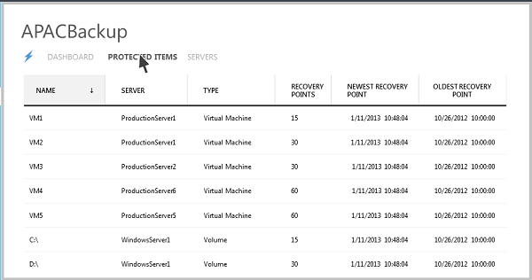

<properties linkid="manage-dataservices-recoveryservices-backup" urlDisplayName="Windows Azure Backup" pageTitle="Configure Windows Azure Recovery Services to quickly and easily back-up Windows Server" metaKeywords="Windows Azure Backup, Online Backup, back-up service" metaDescription="Use Windows Azure Backup to help you protect important server data offsite with automated backups to Windows Azure, where they are available for easy data restoration." metaCanonical="" umbracoNaviHide="0" disqusComments="1" writer="starra" editor="tysonn" manager="cynthn" /> 

<h1>Configure Windows Azure Recovery Services to quickly and easily back-up Windows Server</h1>

To backup files and data from your Windows Server in Windows Azure, you must create a backup vault in the geographic region where you want to store the data. This tutorial will walk you through the creation of the vault you will use to store backups, the uploading of a certificate to the vault, the installation of a backup agent, and an overview of the backup management tasks available through the management portal.

 
<h2>Before you begin</h2> 

To successfully complete this tutorial you must have 
an X.509 v3 certificate to register your servers with Recovery Services vaults.  The certificate must have a key length of at least 2048 bits and should reside in the Personal certificate store of your Local Computer. When the certificate is installed on your server, it should contain the private key of the certificate. To upload to the certificate to the Windows Azure Management Portal, you must export the public key as a .cer format file.
 

You can either use:
 
<ul>
<li>Your own self-signed certificate created using makecert tool, OR</li> 

<li>Any valid SSL certificate issued by a Certificate Authority (CA) that is trusted by Microsoft and whose root certificates are distributed via the Microsoft Root Certificate Program. For more information about this program see <a><href>http://support.microsoft.com/kb/931125</href></a>.</li>
</ul> 

Some other attributes which you need to ensure on the certificates are:
 

<ul>
<li>Has a valid ClientAuthentication EKU</li>

<li>Is currently valid with a validity period that does not exceed 3 years</li>  
</ul>

To use your own self-signed certificate, follow these steps: 

<ol>
<li>Download Certificate Creation Tool (makecert.exe) from <a><href>http://gallery.technet.microsoft.com/Certificate-Creation-tool-5b7c054d</href></a></li>  

<li>Open Command Prompt (cmd.exe) with Administrator privileges and run the following command, replacing <i>CertificateName</i> with the name of your certificate : 
<code>
makecert.exe -R -PE -N CN=CertificateName -SS my -SR localmachine -EKU 1.3.6.1.5.5.7.3.2 –len 2048 “CertificateName.cer”</code></li>
</ol>

If you will be registering a different server than the one you used to make the certificate, you need to export the .pfx file (that contains the private key), copy it to the other server and import it to that server’s Personal certificate store. 

 

<h2>Create a backup vault</h2>

1. Sign in to the [Management Portal](https://manage.windowsazure.com).

2. Click **Recovery Services**, then click **Create New**,  point to **Backup Vault**, and then click **Quick Create**.

	

3. In **Name**, enter a friendly name to identify the backup vault.

4. In **Region**, select the geographic region for the backup vault.  

5. In **Subscription**, enter the Windows Azure subscription that you want to use the backup vault with. 

6. Click **Create Backup vault**.

	It can take a while for the backup vault to be created. To check the status, you can monitor the notifications at the bottom of the portal. After the backup vault has been created, a message will tell you that the vault has been successfully created and it will be listed in the resources for Recovery Services as **Online**. 

	

<h2>Upload a certificate</h2>
1. Sign in to the [Management Portal](https://manage.windowsazure.com).

2. Click **Recovery Services**, then click the name of backup vault that will be identified by the certificate and then click **Manage certificate**.
	
	
3. In the **Manage Certificate** dialog click Browse Your Computer to locate the .cer file to use with this backup vault.
<h2>Download and install a backup agent</h2>
1. Sign in to the [Management Portal](https://manage.windowsazure.com).

2. Click **Recovery Services**, then click the name of backup vault to view the vault dashboard.

3. Click **Install Agent** 
	
	
4. You will be presented with a dialog where you can choose which agent to download:
	* Agent for Windows Server 2012 and System Center 2012 SP1 - Data Protection Manager
	* Agent for Windows Server 2012 Essentials
5. Select the appropriate agent. You will be redirected to the Microsoft Download Center to download the agent software. For more information see:

	* [Install Windows Azure Backup Agent for Windows Server 2012 and System Center 2012 SP1 - Data Protection Manager](http://technet.microsoft.com/en-us/library/hh831761.aspx#BKMK_installagent)
	* [Install Windows Azure Backup Agent for Windows Server 2012 Essentials](http://technet.microsoft.com/en-us/library/jj884318.aspx)

Once the agent is installed you can use the appropriate local management interface (such as the Microsoft Management Console snap-in, System Center Data Protection Manager Console, or Windows Server Essentials Dashboard) to configure the backup policy for the server.  

<h2>Manage backup vaults and servers</h2>
1. Sign in to the [Management Portal](https://manage.windowsazure.com).

2. Click **Recovery Services**, then click the name of backup vault to view the vault dashboard. From here you can perform the following tasks:
	* **Manage certificate**. Used to update the certificate previously uploaded.
	* **Delete**. Deletes the current backup vault. If a backup vault is no longer being used, you can delete it to free up storage space. **Delete** is only enabled after all registered servers have been deleted from the vault. 

3. Click **Protected Items** to view the items that have been backed up from the servers. This list is for information purposes only.  

4. Click **Servers** to view the names of the servers that are register to this vault. From here you can perform the following tasks:
	* **Allow Re-register**. When this option is selected for a server you can use the Registration Wizard in the agent to register the server with the backup vault a second time. You might need to re-register due to an error in the certificate or if a server had to be rebuilt. Re-registration is allowed only once per server name.
	* **Delete**. Deletes a server from the backup vault. All of the stored data associated with the server is deleted immediately.

		
<h2>Next steps</h2>

- To learn more about Windows Azure Recovery Services, see [Recovery Services Overview](http://go.microsoft.com/fwlink/p/?LinkId=290950). 

- Visit the [Recovery Services Forum](http://go.microsoft.com/fwlink/p/?LinkId=290933).

