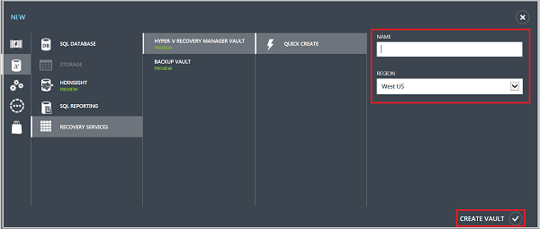
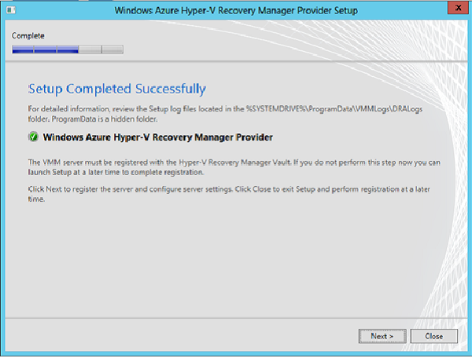
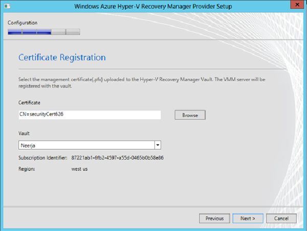
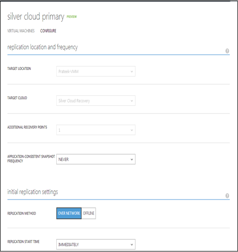
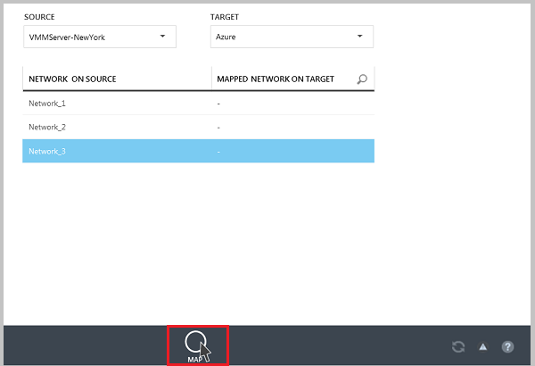
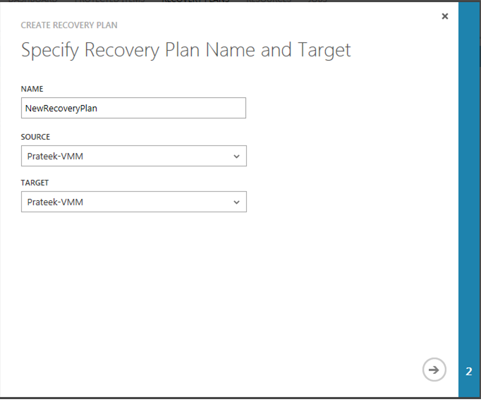
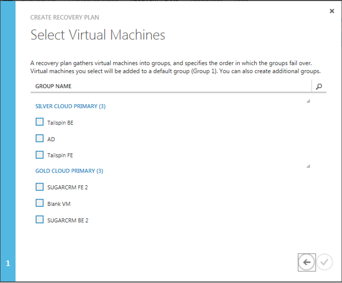
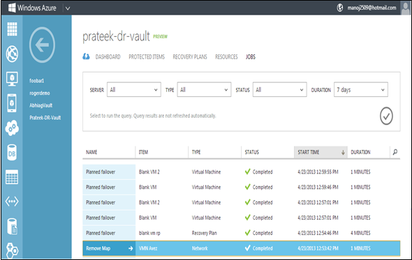

<properties linkid="configure-hyper-v-recovery-vault" urlDisplayName="configure-hyper-v-recovery-vault" pageTitle="Configure Windows Azure Recovery Services to provide a Hyper-V recovery environment" metaKeywords="hyper-v recovery, disaster recovery" metaDescription="Windows Azure Hyper-V Recovery Manager can help you protect important services by coordinating the replication and recovery of System Center 2012 private clouds at a secondary location." metaCanonical="" umbracoNaviHide="0" disqusComments="1" writer="starra" editor="tysonn" manager="cynthn" />

 

<h1>Configure Windows Azure Hyper-V Recovery Manager</h1>

 

Windows Azure Hyper-V Recovery Manager coordinates, orchestrates, and manages the protection and failover of Hyper-V virtual machines located in clouds on Virtual Machine Manager (VMM) servers running on System Center 2012 Service Pack One (SP1) or System Center 2012 R2.

<h2>Before you begin</h2> 

 
To successfully complete this tutorial you need the following:

<UL>
<LI>A Windows Azure account that has the Windows Azure Recovery Services feature enabled.</LI>
	<UL>
	<LI>If you don't have an account, you can create a free trial account in just a couple of minutes. For details, see <a href="/en-us/pricing/free-trial/">Windows Azure Free Trial</a>.</LI>
	<LI>If you have an existing account but need to enable the Windows Azure Recovery Services preview, see <a href="/en-us/develop/net/tutorials/create-a-windows-azure-account/#enable" target="_blank">Enable Windows Azure preview features</a>.</LI>
	</UL>
<LI>At least two VMM servers running System Center 2012 SP1 or System Center 2012 R2, located in different datacenters.</LI>
<LI>At least one cloud configured on the source VMM server you want to protect, and one cloud on the destination VMM server that you want to use for protection and recovery.</LI>
<LI>One or more virtual machines located in the source cloud that you want to protect.</LI>
<LI>Verify that VM networks are configured on the source VMM server you want to protect, and that corresponding VM networks are created on the destination VMM server. Ensure that the networks are connected to appropriate source and destination clouds.</LI>
<LI>A management certificate (.cer and .pfx files) that you will upload to the Hyper-V Recovery vault. Note that:</LI>
	<UL>
	<LI>You can use any valid SSL certificate that is issued by a Certification Authority (CA)  that is trusted by Microsoft (and whose root certificates are distributed via the Microsoft Root Certificate Program). Alternatively you can use a self-signed certificate that you create using the Makecert.exe tool.</LI>
	<LI>The certificate should be an x.509 v3 certificate.</LI>
	<LI>The key length should be at least 2048 bits.</LI>
	<LI>The certificate must have a valid ClientAuthentication EKU.</LI>
	<LI>The certificate should be currently valid with a validity period that does not exceed 3 years.</LI>
	<LI>The certificate should reside in the Personal certificate store of your Local Computer.</LI>
	<LI>The private key should be included during installation of the certificate.</LI>
	<LI>To upload to the certificate to the vault, you must export it as a .cer format file that contains the public key.</LI>
	<LI>Each Hyper-V Recovery vault only has a single .certificate associated with it at any one time. You can upload a certificate to overwrite the current certificate associated with the vault at any time.</LI>
	</UL>
</UL>

<h2>Tutorial steps</h2> 

This tutorial walks you through the steps to configure protection for Hyper-V virtual machines in VMM clouds, as follows:

<UL>
<LI><a href="#createcert">Step 1: Configure certificate settings</a>—Configure the certificate settings required to complete the walkthrough.</LI>
<LI><a href="#vault">Step 2: Create a vault</a>—Create a Hyper-V Recovery Manager vault in Windows Azure, and add one or more VMM servers to it.</LI>
<LI><a href="#upload">Step 3: Upload a certificate</a>—Upload a certificate (.cer) to the Hyper-V Recovery Manager vault.</LI>
<LI><a href="#download">Step 4: Download, install, and register</a>—Download and install the Hyper-V Recovery Manager provider on VMM servers you want to protect. Then register VMM servers with the vault.</LI>
<LI><a href="#clouds">Step 5: Configure cloud protection</a>—Configure protection settings for VMM clouds.</LI>
<LI><a href="#networks">Step 6: Map networks</a>—Map networks on source and target VMM servers.</LI>
<LI><a href="#virtualmachines">Step 7: Enable virtual machine protection</a>—Enable protection for Hyper-V virtual machines located in the VMM clouds.</LI>
<LI><a href="#recovery plans">Step 8: Configure recovery plans</a>—Create recovery plans that group together virtual machines and specify the order in which they fail over. Then customize and run the recovery plans as required.</LI>
<LI><a href="#jobs">Step 9: Monitor</a>—Monitor settings, status, and progress using the <b>Jobs</b> and <b>Dashboard</b> tabs.</LI>
</UL>
 <h2>Configure certificates</h2>

Certificates are used in Hyper-V Recovery Manager to encrypt communication between VMM servers and the Windows Azure Hyper-V Recovery Manager service, and to register VMM servers with Hyper-V Recovery Manager vaults. Configuring a certificate as follows:

<OL>
<LI><b>Obtain a certificate</b>—A management certificate (.cer) must be uploaded to the Hyper-V Recovery Manager vault. For this purpose, you can do either of the following:</LI>
<UL>
<LI>Create a self-signed certificate using the makecert tool,</LI>
<LI>Use any valid SSL certificate issued by a CA trusted by Microsoft, whose root certificates are distributed via the Microsoft Root Certificate Program. For more information about this program, see Microsoft article <a href="http://go.microsoft.com/fwlink/p/?LinkId=294666">Windows Root Certificate Program members</a>.</LI>
</UL>

<LI><b>Export the certificate</b>—On the server on which the certificate was created, you export the .cer file as a .pfx file (containing the private key). This .pfx file will be uploaded to VMM servers when you install the Hyper-V Recovery Manager provider on those servers, and is used to register the servers with the vault.</LI>
<LI><b>Import the certificate</b>—After export of the .pfx file is complete, you import it to the Personal certificate store on each VMM server that contains virtual machines you want to protect.</LI>
</OL>

Use the following procedures to perform these actions.

<h3>To obtain a self-signed certificate (.cer)</h3>

If you want to use a self-signed certificate, create one as follows:

<ol>
<li>Obtain the Makecert tool as described in  <a href="http://msdn.microsoft.com/en-us/library/windows/desktop/aa386968(v=vs.85).aspx">MakeCert</a>. Note that when installing the Windows SDK, you can limit the installation to install makecert.exe only by selecting the option <b>Tools</b> under <b>.Net Development</b> and leaving everything else unchecked.</li>  
<li>Open Command Prompt (cmd.exe) with Administrator privileges and run the following command, replacing <i>CertificateName</i> with the name of your certificate and specifying the actual expiration date of your certificate after -e:
<code>
makecert.exe -r -pe -n CN=CertificateName -ss my -sr localmachine -eku 1.3.6.1.5.5.7.3.2 -len 2048 -e 01/01/2016 CertificateName.cer</code></li>
</ol>

The certificate will be created and stored in the same location.

<h3>To export a certificate</h3>

On the server on which you ran makecert.exe, complete the steps in this procedure to export the .cer file in .pfx format.

<ol>
<li>From the Start screen type mmc.exe to start the Microsoft Management Console (MMC).</li>
<li>On the <b>File</b> menu, click <b>Add/Remove Snap-in</b>. The Add or Remove Snap-ins dialog box appears.</li>
<li>In <b>Available snap-ins</b>, click <b>Certificates</b>, and then click <b>Add</b>.</li>
<li>Select <b>Computer account</b>, and then click <b>Next</b>.</li>
<li>Select <b>Local computer</b>, and then click <b>Finish</b>.</li>
<li>In the MMC, in the console tree, expand <b>Certificates</b>, and then expand <b>Personal</b>.</li>
<li>In the details pane, click the certificate you want to manage.</li>
<li>On the <b>Action</b> menu, point to <b>All Tasks</b>, and then click <b>Export</b>. The Certificate Export Wizard appears. Click <b>Next</b>.</li>
<li>On the <b>Export Private Key</b> page, click <b>Yes</b>, export the private key. Click <b>Next</b>. Note that this is only required if you want to export the private key to other servers after the installation.</li>
<li>On the <b>Export File Format</b> page, select <b>Personal Information Exchange – PKCS #12 (.PFX)</b>. Click <b>Next</b>.</li>
<li>On the <b>Password</b> page, type and confirm the password that is used to encrypt the private key. Click <b>Next</b>.</li>
<li>Follow the pages of the wizard to export the certificate in .pfx format.</li>
</ol>

<h3>To import a certificate (.pfx)</h3>

After exporting the server, copy it to the VMM server you want to register, and then import it as follows. Note that if you ran MakeCert.exe on a VMM server, you do not need to import the certificate on that server.

 
<ol>
<li>Copy the private-key (.pfx) certificate files to a location on the local server.</li>
<li>In the Certificates MMC snap-in select <b>Computer account</b> and click <b>Next</b>.</li>
<li>Select <b>Local Computer</b> and click <b>Finish</b>. You are returned to the Add/Remove Snap-in dialog box, click <b>OK</b>. </li>
<li>In the MMC, expand <b>Certificates</b>, right-click <b>Personal</b>, point to <b>All Tasks</b>, and then click <b>Import</b> to start the Certificate Import Wizard.</li>
<li>On the <b>Certificate Import Wizard Welcome</b> page, click
> <b>Next</b>.</li>
<li>On the <b>File to Import</b> page, click <b>Browse</b> and locate the folder that contains the .pfx certificate file that contains the certificate that you want to import. Select the appropriate file, and then click <b>Open</b>.</li>
<li>On the <b>Password</b> page, in the <b>Password</b> box, type the password for the private-key file that you specified in the previous procedure and then click <b>Next</b>.</li>
<li>On the <b>Certificate Store</b> page, select <b>Place all certificates in the following store</b>, click <b>Browse</b>, select the <b>Personal</b> store, click <b>OK</b>, and then click <b>Next</b>.</li>
<li>On the <b>Completing the Certificate Import Wizard</b> page, click <b>Finish</b>.</li>
</ol>

After the import, you will be able to select the certificate when you run the Register Server Wizard as part of the Hyper-V Recovery Manager provider Setup.

 <h2>Create a vault</h2>

1. Sign in to the [Management Portal](https://manage.windowsazure.com).

	

2. Click **Data Services**, then click **Recovery Services**. If you have not signed up for the Recovery Services preview, the vault options will be grayed out. To register for the preview, click **Preview Program**. 

	

3. Click **Recovery Services**, then click **Create New**,  point to **Hyper-V Recovery Manager Vault**, and then click **Quick Create**.
	
	

3. In **Name**, enter a friendly name to identify the vault.

4. In **Region**, select the geographic region for the vault. Three regions are supported for the limited preview.  

5. Click **Create vault**.

To check status, you can monitor the notifications at the bottom of the portal. After the vault has been created, a message will tell you that the vault has been successfully created, and it will be listed in the resources for Recovery Services as **Online**.

 <h2>Upload a certificate</h2>

1.In Recovery Services, open the required vault.

2. Click the Quick Start icon to open the Quick Start page.

	

2. Click **Manage Certificate**.

	

3. In the **Manage Certificate** dialog click **Browse Your Computer** to locate the .cer file to upload to the vault.

	

You can also upload and manage certificates from the **Dashboard** tab for the vault. To do this, click **Recovery Services**, and click the vault name. On the **Dashboard** tab, click **Manage Certificate**.

  

 <h2>Download and install the provider</h2>
Install the Hyper-V Recovery Manager provider  on each VMM server that contains virtual machines you want to protect. Providers are accessed on the Windows Azure Download Center, and have their own setup process. When setup runs the provider is installed, and the VMM server is registered with the vault, as follows:

1. On the **Quick Start** page, click **Download Provider**. On the VMM server, run Setup to start the installation wizard. 

	

2. Follow the steps to complete the provider installation.

	

3. After the provider installation is complete, follow the wizard steps to register the VMM server with the vault.
4. On the Internet Connection page, specify how the provider running on the VMM server connects to the Internet. The provider can use the default Internet connection settings, or click <b>Use a proxy server for Internet requests</b> to specify that the provider should use custom settings.
	
	

5. On the Certificate Registration page, select the .pfx file that corresponds to the .cer that you uploaded to the vault. The private key of the certificate is used to register the VMM server to the vault. Follow the wizard steps to complete the certificate registration. The friendly name you specify for the VMM server is the name used to identify the server on the <b>Servers</b> tab.

	

	

Metadata from the VMM server is retrieved by Hyper-V Recovery Manager, in order to orchestrate failover and recovery. After a server has been successfully registered its friendly name will be displayed in the Hyper-V Recovery Manager vault, in the Servers page, on the <B>Resources</B> tab.

<h2>Configure clouds for protection</h2>
After VMM servers are registered, all clouds configured on the servers are displayed in the vault.

To configure clouds for protection, do the following: 

1. On the Quick Start page, click **Configure Protection Settings**.
2. In the **Protected Items** list, select the cloud that you want to configure and drill down to the **Configuration** tab.

	

3. In **Target Location**, specify the VMM server that manages the cloud which will be used for recovery.
4. In **Target Cloud**, specify the target cloud that will be used for failover of virtual machines in the source cloud.
5. In **Copy Frequency**, specify how frequency data should be synchronized between source and target locations. This setting is only relevant for VMM servers running on System Center 2012 R2.
6. In **Additional Recovery Points**, specify where multiple recovery points containing one or more snapshots should be kept.
7. In **Application-Consistent Snapshot Frequency**, specify how often to create snapshots.These snapshots use Volume Shadow Copy Service (VSS) to ensure that applications are in a consistent state when the snapshot is taken.  Note that taking snapshots of applications running on source virtual machines will impact performance.
8. In **Data Transfer Compression**, specify whether replicated data that is transferred should be compressed. 
9. In **Port**, modify the port number on which the source and target host computers listen for replication traffic. For example,  you might modify the setting if you want to apply QoS network bandwidth throttling for replication traffic. 
10. In **Initial Replication Settings**, specify how the initial replication of data from source to target locations will be handled, before regular replication starts. 
	- **Over the network**—Copying data over the network can be time-consuming and resource-intensive. We recommend that you use this option if the cloud contains virtual machines with relatively small virtual hard disks, and if the primary VMM server is connected to the secondary VMM server over a connection with wide bandwidth. You can specify that the copy should start immediately, or select a time. If you use network replication, we recommend that you schedule it during off-peak hours.
	- **Offline**—This method specifies that the initial replication will be performed using external media. This method is useful if you want to avoid degradation in network performance, or for geographically remote locations. To use this method you specify the export location on the source cloud, and the import location on the target cloud. When you enable protection for a virtual machine, the virtual hard disk is copied to the specified export location. You send it to the target site, and copy it to the import location. The system copies the imported information to the replica virtual machines.

<h3>Offline replication prerequisites</h3>

Note the following prerequisites for offline replication:

- On the source server, give full control NTFS & Share permissions to the VMM service  on the export path. On the target server, give these permissions to the VMM service account on the import path.
- If the path is shared, Administrator, Power User, Print Operator, or Server Operator group membership is required for the VMM service account  —on the remote machine on which the path is shared. This applies to both the import and export paths.
- If you are using any Run As Accounts to add hosts, give read & write permissions to the Run As Accounts in VMM, on the import & export path.
- In Active Directory, enable and configured constrained delegation on each host to trust the remote machine (with import/export path) to use any authentication protocol with allowed services as cifs.
- The import and export shares should not be located on any computer used as a host, because loopback configuration is not supported by Hyper-V.

<h3>Settings after configuring protection</h3>
After you configure a cloud, all clusters and host servers that are configured in the source and target clouds are configured for replication. Specifically, the following are configured:

- Firewall rules used by Hyper-V Replica 
- Ports for replication traffic are opened
- Certificates required for replication are installed
- Hyper-V Replica settings are configured

Cloud settings can be modified and saved on the **Configure** tab. Note the following:

- We recommend that you select a target cloud that meets recovery requirements for the virtual machines you will protect. 
- A cloud can only belong to a single cloud mapping — either as a primary or a target cloud.
- After saving the cloud configuration, to modify the target location or target cloud you must remove the cloud configuration, and then reconfigure the cloud.

<h2>Configure networks</h2>

On the **Networks** tab you configure mapping between VM networks on source and target VMM servers. Network mapping ensures that failed over virtual machines are connected to appropriate networks after the failover. Network mapping is also used during placement of a replica virtual machine. Replica virtual machines are placed on hosts that can access the VM networks. 

We recommend you map networks as follows: 

- Map networks used by each cloud that is configured for protection.
- Perform network mapping before enabling virtual machines for protection, because mapping is used during placement of replica virtual machines. Mapping will work correctly if configure after enabling protection, but it might require migration of some replica virtual machines.  

To map networks, do the following:

1. On the Quick Start page, click **Configure Network Mapping**.

4. Select the source VMM server and then the target VMM server. The list of source networks and their associated target networks are displayed. A blank value is shown for networks that are not mapped.

5. Select an item from **Network on source** and then click **Map**. The service detects the VM networks on the target server and displays them.  

	

7. In the dialog that is displayed, select the required VM network from the target VMM server.
 

8. Click the information icon next to the source and target network names to view the subnets and type for each network.

	When you select a target network, the protected clouds that use the source network are displayed. Availability of target networks associated with the clouds used for protection is also displayed. We recommend that you select a target network that is available to all clouds used for protection.

8. Click the checkmark to complete the mapping process. A job starts to track the mapping progress. This can be viewed on the **Jobs** tab.

	This will connect any existing replica virtual machines corresponding to the virtual machines connected to the source VM network to the target VM network. This will also connect new replica virtual machines that are created after enabling replication on the virtual machines connected to the source VM network to the target VM network.

<h3>Modify network mappings</h3>
Network mappings can be modified on the **Networks** tab. Note the following:
<UL>
<LI>If you unmap a selected mapping, the mapping is removed and the replica virtual machines are disconnected from the network they were connected to at the time of mapping.</LI>
<LI>When you modify a selected mapping, changes are updated, and the replica virtual machines are connected to the new network settings provided.</LI>
</UL>

<h2>Enable protection for virtual machines</h2>

After servers, clouds, and networks are configured correctly, you can enable virtual machines in the cloud for recovery and failover. Protection is enabled in the VMM console, by right-clicking each virtual machine you want to protect and selecting <b>Enable Recovery</b>.

After the enable recovery action starts successfully, you will be able to view the virtual machines in the virtual machines list of your cloud. You can view the progress of the enable recovery action in the <B>Jobs</B> tab.

<h2>Create recovery plans</h2>
A recovery plan groups virtual machines together for the purposes of failover and recovery, and specifies the order in which the grouped virtual machines should fail over. You can customize recovery plans to include automatic scripts that run as part of the recovery plan, or add a prompt to wait for confirmation of a manual action. To create a recovery plan do the following: 

1. On the Quick Start page, click **Create Recovery Plan**.
2. Specify a name for the recovery plan, and the source and target VMM servers. Note that source servers must have virtual machines that are enabled for failover and recovery.

	
3. In the Select Virtual Machines page, select virtual machines to add to the recovery plan. These are added to the recovery plan default group-(Group 1)

	

After creating a recovery plan, you can perform the following actions:

- Customize additional recovery plans. You can add new groups to a recovery plan, or add virtual machines to a group. You can define custom actions in the form of scripts and manual actions that are completed before and after specified groups. Group names are incremental. After the default recovery plan Group 1, you create Group 2, then Group 3 etc. Virtual machines fail over according to group order.
- Perform failover on a recovery plan.
- Customize a recovery plan.
- Delete a recovery plan.

<h2>Customize recovery plans</h2>

1. On the **Recovery Plans** tab, click the required recovery plan. 
2. You can customize the recovery plan as follows:

	<ul>
	<li><b>Add new groups</b>—You can add a new empty group to the plan. You can create up to seven groups. </li>
	<li><b>Add virtual machines to a group</b>—Only virtual machines that are not currently in the recovery plan are available to add. A virtual machine can be added to multiple recovery plans, but can only appear once in each plan.</li>
	<li><b>Add a script</b>—You can optionally add scripts to run before or after a specific group. When a script is added, a new set of actions for the group is created. For example a set of pre-steps for Group 1 will be created with the name: Group 1: Pre-steps. All pre-steps will be listed inside this set. To add a script to a recovery plan, do the following:</li>
		<ol>
		<li>Create the script, verify it works as expected, and place it at location \VMM_Server_Name\MSSCVMMLibrary on the source and target VMM servers.</li>
		<li>In the <b>Script Location</b> text box, type in the relative path to the share. For example, if the share is located at \\VMM_Server_Name\MSSCVMMLibrary\Scripts\Script.PS1, specify the path: \Scripts\Script.PS1.</li>
		</ol>
	<li><b>Move the script position</b>—Use the <b>Script</b> command button to move the position of the script up or down, and specify at which point in the recovery plan it will run.</li>
	<li><b>Add a manual action</b>—You can optionally add manual actions to run before or after a selected group. Specify a name and a list of instructions for the action. You can specify whether the action should be included in a test failover, planned failover, unplanned failover, or in a combination of these. Use the Manual Action command button to specify the point at which the manual action will run. When the recovery plan runs, it will stop at the point that the manual action should be run, and a dialog will appear that allows you to specify that the manual action was completed.</li>
	<li><b>Move custom steps or manual actions up or down</b>—You can reorder steps in a recovery plan by moving them up or down.</li> 
	<li><b>Remove or move virtual machines</b>You can remove virtual machines from a recovery plan, or move them to a different group.</li>
	<li><b>Delete groups</b>—When a group is deleted, the groups below it are moved up. For example if you delete Group 2, then Group 3 becomes Group 2. You cannot delete the default group — Group 1. Deleting a group also deletes the pre and post custom actions steps if any are configured.</li>
	</ul>

<h3>Script requirements</h3>
- Scripts should be written using Windows PowerShell.
- Scripts in a recovery plan run in the context of the VMM Service account. Ensure that the script is tested to run at the VMM service account privilege level.
- If there is an exception in the script, the script stops running, and shows the task as failed. Ensure that you use try-catch blocks, so that the exceptions are handled gracefully. If an error does occur any remaining part of the script will not run. If this occurs, fix the script, make sure it runs as expected, and then rerun the recovery plan.

<h2>Run recovery plans</h2>
Recovery plans can run as part of a proactive test or planned failover, or during an unplanned failover.

<h3>Test failover</h3>

Use this method to fail over a complete recovery plan in a test environment. A test failover is useful to verify that your recovery plan and virtual machine failover strategy are working as expected.  Test failover simulates your failover and recovery mechanism in an isolated network. 

<h4>Before you start</h4>
When a test failover is triggered, you are requested to specify how test virtual machines should be connected to networks after the failover. 
<UL>
<LI>We recommend that you create a separate  logical network  that is not used in production for this purpose.</LI>
<LI>If you are using a VLAN-based logical network, ensure that the network sites you add to the logical network are isolated. </LI>
<LI>If you are using a Windows Network Virtualization-based logical network, Hyper-V Recovery Manager will automatically create isolated VM networks.</LI>
</UL>

<h4>Run a test failover</h4>
Run a test failover for a recovery plan as follows:

<OL>
<LI>On the <b>Recovery Plans</b> tab, select the required recovery plan.</LI>
<LI>To initiate the failover, click the <b>Test Failover</b> button.</LI>
<LI>On the Confirm Test Failover page, specify how virtual machines should be connected to networks after the test failover, as follows:</LI>
<UL>
<LI><b>Don't use</b>—Select this setting to specify that VM networks should not be used in the test failover. Use this option if you want to test individual virtual machines rather than your network configuration. It also provides a quick glance of how test failover functionality works. Test virtual machines will not be connected to networks after a failover.</LI>
<LI><b>Create automatically</b>—Select this setting to specify that Hyper-V Recovery Manager should automatically create VM network based on the setting you specify in Logical Network, and its related network sites. Use this option if the recovery plan uses more than one VM network. In the case of Windows Network Virtualization networks, this option can be used to automatically create VM networks with the same settings (subnets and IP address pools) of those in the network of the replica virtual machine. These VM networks are cleaned up automatically after the test failover is complete.</LI>
<LI><b>Use existing</b>—Use this option if you have already created and isolated a VM network to use for test failover. After the failover all test virtual machines used in the test failover will be connected to the network specified in **VM Network**.</LI>
</UL>
</OL>

After the test failover is complete, do the following:

<OL>
<LI>Verify that the virtual machines start successfully.</LI>
<LI>Click <b>Notes</b> to record and save any observations associated with the test failover.</LI>
<LI>After verifying that virtual machines start successfully, complete the test failover to clean up the isolated environment. If you selected to automatically create VM networks, clean up deletes all the test virtual machines and test networks.</LI>
</OL>

Note the following:

- On the Confirm Test Failover page, details of the VMM server on which the test virtual machines will be created is displayed.  
- You can follow the progress of test failover jobs on the <b>Jobs</b> tab. 

<h3>Planned failover</h3>
Use a planned failover to perform a complete failover and recovery of virtual machines in your recovery plans in a proactive, planned manner. This type of failover provides a real validation of your environment, and ensure that unreplicated changes are applied to the replica virtual machine with no data loss. Run a planned failover for a recovery plan as follows:

<OL>
<LI>On the <b>Recovery Plans</b> tab, select the required recovery plan.</LI>
<LI>To initiate the failover, click the <b>Failover</b> button, and then click <b>Planned Failover</b>.</LI>
<LI>To ensure no data loss, the first step in the recovery plan for a planned failover is to shut down the virtual machines.</LI>
<LI>On the Confirm Planned Failover page, verify the failover direction. If previous failovers have worked as expected, and all of the virtual machines servers are located on either the source or target location, the failover direction details are for information only. If however virtual machines are active on both the source and target locations, the <b>Change Direction</b> button will appear. Use this button to change and specify the direction in which the failover should occur.</LI>
</OL>

After process is complete, verify that planned failover has worked as expected. Then do the following:

<OL>
<LI>After the failover the virtual machines are in a commit pending state. Click <b>Commit</b> to commit the failover. Note that this is only required if your configuration uses multiple recovery points. After you commit any additional recovery points that are configured for a virtual machine are removed. </LI>
<LI>Click <b>Reverse Replicate</b> to begin reverse replication. After the failover, the virtual machines start up and are running at the secondary site. However, they are not protected or replicating. When you enable reverse replication, all the virtual machines in the recovery plan that are waiting for reverse replication in order to be protected will begin replicating.</LI>
</OL>
	

Note the following:

- You can follow the progress of planned failover jobs on the <b>Jobs</b> tab. Note that the commit and reverse replication actions trigger separate jobs.
- If an error occurs in the failover (either on a virtual machine or in a script included in the recovery plan), the planned failover of a recovery plan will stop. You can reinitiate the failover for the other virtual machines.

<h3>Unplanned failover</h3>

Use an unplanned failover to fail over virtual machines in a reactive manner when a primary site becomes inaccessible due to an unexpected incident such as a power outage or virus attack. Even if errors occur during an unplanned failover, the recovery plan runs until complete. Run an unplanned failover for a recovery plan as follows:

<OL>
<LI>On the <b>Recovery Plans</b> tab, select the required recovery plan.</LI>
<LI>To initiate the failover, click the <b>Failover</b> button, and then click <b>Unplanned Failover</b>.</LI>
<LI>On the Confirm Planned Failover page, verify the failover direction. If previous failovers have worked as expected, and all of the virtual machines servers are located on either the source or target location, the failover direction details are for information only. If however virtual machines are active on both the source and target locations, the <b>Change Direction</b> button will appear. Use this button to change and specify the direction in which the failover should occur.</LI>
<LI>Specify the data that should be used for the unplanned failover—As follows:</LI>
	<UL>
	<LI><b>Failover and attempt to replicate the latest data changes</b>—Use this option when you anticipate a disaster, or if you want to try to synchronize your latest data changes. With this option enabled, Hyper-V Recovery Manager makes a best effort attempt to shut down the protected virtual machines and synchronize the data so that the latest version of the data will be failed over.</LI>
	<LI><b>Failover without attempting to replicate the latest data changes</b>—Use this option if the primary site is inaccessible, and you want to quickly recover to the secondary site without the latest changes. If you select to failover without replicating the latest data changes, then the failover will be from the latest available recovery point for the virtual machine.</LI>
	</UL>
</OL>

After the process is complete, do the following:

<OL>
<LI>After the failover the virtual machines are in a <B>commit pending</B> state. Click <b>Commit</b> to commit the failover.  After you commit any additional recovery points that are configured for a virtual machine are removed.</LI>
<LI>After failing over, when the primary site comes up with same underlying infrastructure, you can click <b>Reverse Replicate</b> to  start replicating again. This ensures that all the data is replicated back to the primary site, and that the virtual machine is ready for failover again. Reverse replication after an unplanned failover incurs an overhead in data transfer. The transfer will use the same method that is configured for initial replication settings for the cloud.</LI>
</OL>

You can follow the progress of unplanned failover jobs on the <b>Jobs</b> tab. Note that the commit and reverse replication actions trigger separate jobs.

<h2>Using the Jobs tab and Dashboard</h2>

<h3>Jobs</h3>
The <b>Jobs</b> tab displays the main tasks performed by the Hyper-V Recovery vault, including configuring protection for a cloud; enabling and disabling protection for a virtual machine; running a failover (planned, unplanned, or test); committing an unplanned failover; and configuring reverse replication. The **Jobs** tab provides the following information:
<UL>
<LI><b>Name</b>—The job name</LI>
<LI><b>Item</b>—The name of the cloud, recovery plan, VMM server, or virtual machine on which the job ran.</LI>
<LI><b>Status</b>—Job status</LI>
<LI><b>Type</b>-Job type</LI>
<LI><b>Started At</b>—When the job started</LI>
<LI><b>Task Time</b>—The job duration</LI>
</UL>

You can drill down to the details of a job, to see the specific tasks and actions associated with the job, and their status. This is useful to check whether jobs complete as expected, and for troubleshooting if required.
	

- Jobs errors can be viewed in **Error Details**. The error description can be copied to the clipboard for troubleshooting.

<h4>Run a job query</h4>

You can run queries to retrieve jobs that match specified criteria, including:
	- Jobs that ran on a specific VMM server.
	- Jobs that were performed on a specific cloud, virtual machine, network, recovery plan in a cloud, or on all of these.
	- Jobs that happened during a specific time range.

To run a job query do the following:
<OL>
<LI>Open the <b>Jobs</b> tab</LI>
<LI>In <b>Server</b>, specify the VMM server on which the job ran</LI>
<LI>In <b>Type</b>, specify whether the job was performed on a cloud, virtual machine, network, or recovery plan in a cloud.</LI>
<LI>In <b>Status</b>, specify the job status.</LI>
<LI>In <b>Duration</b>, specify the time range in which the job occurred.</LI>
</OL>

<h3>Dashboard</h3>

The <b>Dashboard</b> tab provides a quick overview of Hyper-V Recovery Manager usage in your organization.  It provides a centralized gateway to view virtual machines protected by Hyper-V Recovery Manager vaults. The Dashboard provided the following functionality:

<UL>
<LI><b>Usage Overview</b>—Shows the number of virtual machines that have protection managed by Hyper-V Recovery.</LI>
<LI><b>Quick Glance</b>—Displays crucial configuration information for recovery services and the Hyper-V Recovery Manager vault. It tells you whether the vault is online, which certificate is assigned to it, when the certificate expires, and subscription details for the service.</LI>
<LI><b>Jobs</b>—Shows jobs that have succeeded or failed in the last 24 hours, or jobs that are in progress or waiting for action.</LI>
<LI><b>Manage certificate</b>—Click to modify the certificate settings for a vault.</LI>
<LI><b>Hyper-V Recovery Manager provider</b>—Click to download the provider for installation on a VMM server.</LI>
<LI><b>Delete</b>—Click to delete a vault if required.</LI>
</UL>

In addition, the dashboard shows information about issues with VMM server connections, and issues with cloud configuration settings or synchronization of virtual machine replication. You can drill down for more details of an issue, to view jobs associated with the issue, or to try to resynchronize.

<h2>Next steps</h2>

 Visit the [Windows Azure Recovery Services Forum]( http://go.microsoft.com/fwlink/?LinkId=313628). Note that the forum is only open to customers who signed up for the Hyper-V Recovery Manager preview. Forum details are provided in the mail you received after sign up.
