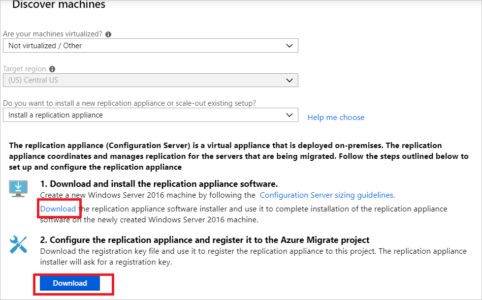

# Migrate machines as physical servers to Azure

This article shows you how to migrate machines as physical servers to Azure by using the Migration and modernization tool. Migrating machines by treating them as physical servers is useful in many scenarios:

- Migrate on-premises physical servers.
- Migrate virtual machines (VMs) virtualized by platforms such as Xen and KVM.
- Migrate Hyper-V or VMware VMs, if you're unable to use the standard migration process for [Hyper-V](tutorial-migrate-hyper-v.md) or [VMware](server-migrate-overview.md) migration.
- Migrate VMs running in private clouds.
- Migrate VMs running in public clouds, such as Amazon Web Services (AWS) or Google Cloud Platform (GCP).

This tutorial is the third in a series that demonstrates how to assess and migrate physical servers to Azure. In this tutorial, you learn how to:

> [!div class="checklist"]
> * Prepare to use Azure with the Migration and modernization tool.
> * Check requirements for machines you want to migrate. Prepare a machine for the Azure Migrate and Modernize replication appliance that's used to discover and migrate machines to Azure.
> * Add the Migration and modernization tool in the Azure Migrate and Modernize hub.
> * Set up the replication appliance.
> * Install the Mobility service on machines you want to migrate.
> * Enable replication.
> * Run a test migration to make sure everything's working as expected.
> * Run a full migration to Azure.

> [!NOTE]
> Tutorials show you the simplest deployment path for a scenario so that you can quickly set up a proof of concept. Tutorials use default options where possible and don't show all possible settings and paths. For detailed instructions, review the how-to articles for Azure Migrate and Modernize.

If you don't have an Azure subscription, create a [free account](https://azure.microsoft.com/pricing/free-trial/) before you begin.

## Prerequisites

Before you begin this tutorial, you should:

- [Review](./agent-based-migration-architecture.md) the migration architecture.
- [Review](../site-recovery/migrate-tutorial-windows-server-2008.md#limitations-and-known-issues) the limitations related to migrating Windows Server 2008 servers to Azure.

> [!NOTE]
> If you're planning to upgrade your Windows operating system, Azure Migrate and Modernize might download the Windows SetupDiag utility for error details in case upgrade fails. Ensure that the VM created in Azure after the migration has access to [SetupDiag](https://go.microsoft.com/fwlink/?linkid=870142). If there's no access to SetupDiag, you might not be able to get detailed OS upgrade failure error codes but the upgrade can still proceed.

## Prepare Azure

Prepare Azure for migration with the Migration and modernization tool.

Task | Details
--- | ---
Create an Azure Migrate project | Your Azure account needs Contributor or Owner permissions to [create a new project](./create-manage-projects.md).
Verify permissions for your Azure account | Your Azure account needs permissions to create a VM and write to an Azure managed disk.

### Assign permissions to create a project

1. In the Azure portal, open the subscription and select **Access control (IAM)**.
1. In **Check access**, find the relevant account and select it to view permissions.
1. You should have **Contributor** or **Owner** permissions.
    - If you just created a free Azure account, you're the owner of your subscription.
    - If you're not the subscription owner, work with the owner to assign the role.

### Assign Azure account permissions

Assign the VM Contributor role to the Azure account. This role provides permissions to:

- Create a VM in the selected resource group.
- Create a VM in the selected virtual network.
- Write to an Azure managed disk.

### Create an Azure network

> [!IMPORTANT]
> Virtual networks are a regional service, so make sure you create your virtual network in the desired target Azure region. For example, if you're planning on replicating and migrating VMs from your on-premises environment to the East US Azure Region, your target virtual network *must be created* in the East US Region. To connect virtual networks in different regions, see [Virtual network peering](../virtual-network/virtual-network-peering-overview.md).

[Set up](../virtual-network/manage-virtual-network.yml#create-a-virtual-network) an Azure virtual network. When you replicate to Azure, Azure VMs are created and joined to the Azure virtual network that you specified when you set up migration.

## Prepare for migration

To prepare for physical server migration, you need to verify the physical server settings and prepare to deploy a replication appliance.

### Check machine requirements for migration

Make sure machines comply with requirements for migration to Azure.

> [!NOTE]
> When you migrate physical machines, the Migration and modernization tool uses the same replication architecture as agent-based disaster recovery in Azure Site Recovery. Some components share the same code base. Some content might link to Site Recovery documentation.

1. [Verify](migrate-support-matrix-physical-migration.md#physical-server-requirements) physical server requirements.
1. Verify that on-premises machines that you replicate to Azure comply with [Azure VM requirements](migrate-support-matrix-physical-migration.md#azure-vm-requirements).
1. Some changes are needed on VMs before you migrate them to Azure:

    - For some operating systems, Azure Migrate and Modernize makes these changes automatically.
    - Make these changes before you begin migration. If you migrate the VM before you make the change, the VM might not boot up in Azure.
Review [Windows](prepare-for-migration.md#windows-machines) and [Linux](prepare-for-migration.md#linux-machines) changes you need to make.

### Prepare a machine for the replication appliance

The Migration and modernization tool uses a replication appliance to replicate machines to Azure. The replication appliance runs the following components:

- **Configuration server**: The configuration server coordinates communications between on-premises and Azure and manages data replication.
- **Process server**: The process server acts as a replication gateway. It receives replication data and optimizes that data with caching, compression, and encryption. Then it sends the data to a cache storage account in Azure.

To prepare for appliance deployment:

- You prepare a machine to host the replication appliance. [Review](migrate-replication-appliance.md#appliance-requirements) the machine requirements.
- The replication appliance uses MySQL. Review the [options](migrate-replication-appliance.md#mysql-installation) for installing MySQL on the appliance.
- Review the Azure URLs required for the replication appliance to access [public](migrate-replication-appliance.md#url-access) and [government](migrate-replication-appliance.md#azure-government-url-access) clouds.
- Review [port](migrate-replication-appliance.md#port-access) access requirements for the replication appliance.

> [!NOTE]
> The replication appliance shouldn't be installed on a source machine that you want to replicate or on the Azure Migrate: Discovery and assessment appliance you might have installed before.

## Set up the replication appliance

The first step of migration is to set up the replication appliance. To set up the appliance for physical server migration, download the installer file for the appliance. Then run it on the [machine you prepared](#prepare-a-machine-for-the-replication-appliance). After you install the appliance, register it with the Migration and modernization tool.

### Download the replication appliance installer

1. In the Azure Migrate project, select **Servers** > **Migration and modernization** > **Discover**.

    

1. In **Discover machines** > **Are your machines virtualized?**, select **Not virtualized/Other**.
1. In **Target region**, select the Azure region to which you want to migrate the machines.
1. Select **Confirm that the target region for migration is region-name**.
1. Select **Create resources** to create a Site Recovery vault in the background.
    - If you already set up migration with the Migration and modernization tool, the target option can't be configured because resources were set up previously.
    - You can't change the target region for this project after selecting this button.
    - All subsequent migrations are to this region.
    
     > [!NOTE]
     > If you selected private endpoint as the connectivity method for the Azure Migrate project when it was created, the Recovery Services vault is also configured for private endpoint connectivity. Ensure that the private endpoints are reachable from the replication appliance. [Learn more](troubleshoot-network-connectivity.md).

1. In **Do you want to install a new replication appliance?**, select **Install a replication appliance**.
1. In **Download and install the replication appliance software**, download the appliance installer and the registration key. You need the key to register the appliance. The key is valid for five days after it was downloaded.

    

1. Copy the appliance setup file and key file to the Windows Server 2016 machine you created for the appliance.

1. After the installation finishes, the Appliance configuration wizard launches automatically. (You can also launch the wizard manually by using the `cspsconfigtool` shortcut that was created on the appliance desktop.) In this tutorial, we manually install the Mobility service on the source VMs to be replicated. You need to create a dummy account in this step to proceed. For your dummy account, use "guest" as the friendly name, "username" as the username, and "password" as the password for the account. You use this dummy account in the Enable Replication stage.

1. After the appliance restarts after setup, in **Discover machines**, select the new appliance in **Select Configuration Server**. Then select **Finalize registration**. The **Finalize registration** step performs a couple of final tasks to prepare the replication appliance.

    

The mobility service agent must be installed on the servers to get them discovered by using the replication appliance. Discovered machines appear in **Azure Migrate: Server Migration**. As VMs are discovered, the **Discovered servers** count rises.


> [!NOTE]
> We recommend that you perform discovery and assessment prior to the migration by using the Azure Migrate: Discovery and assessment tool, a separate lightweight Azure Migrate appliance. You can deploy the appliance as a physical server to continuously discover servers and performance metadata. For detailed steps, see [Discover physical servers](tutorial-discover-physical.md).

## Install the Mobility service agent

A Mobility service agent must be preinstalled on the source physical machines to be migrated before you can start replication. The approach you choose to install the Mobility service agent might depend on your organization's preferences and existing tools. The "push" installation method built into Site Recovery isn't currently supported. Approaches you might want to consider:

- [System Center Configuration Manager](../site-recovery/vmware-azure-mobility-install-configuration-mgr.md)
- [Azure Arc for servers and custom script extensions](../azure-arc/servers/overview.md)
- [Install Mobility agent for Windows](../site-recovery/vmware-physical-mobility-service-overview.md#install-the-mobility-service-using-command-prompt-classic)
- [Install Mobility agent for Linux](../site-recovery/vmware-physical-mobility-service-overview.md#linux-machine-1)

1. Extract the contents of the installer tarball to a local folder (for example, */tmp/MobSvcInstaller*) on the machine:

    ```
    mkdir /tmp/MobSvcInstaller
    tar -C /tmp/MobSvcInstaller -xvf <Installer tarball>
    cd /tmp/MobSvcInstaller
    ```
1. Run the installer script:

    ```
    sudo ./install -r MS -v VmWare -q -c CSLegacy
    ```
1. Register the agent with the replication appliance:

    ```
    /usr/local/ASR/Vx/bin/UnifiedAgentConfigurator.sh -i <replication appliance IP address> -P <Passphrase File Path> -c CSLegacy
    ```

## Replicate machines

Now, select machines for migration.

> [!NOTE]
> You can replicate up to 10 machines together. If you need to replicate more, replicate them simultaneously in batches of 10.

1. In the Azure Migrate project, select **Servers** > **Migration and modernization** > **Replicate**.

    :::image type="content" source="./media/tutorial-migrate-physical-virtual-machines/select-replicate.png" alt-text="Screenshot that shows selecting Replicate.":::

1. In **Replicate**, > **Source settings** > **Are your machines virtualized?**, select **Physical or other (AWS, GCP, Xen, etc.)**.
1. In **On-premises appliance**, select the name of the Azure Migrate appliance that you set up.
1. In **Process Server**, select the name of the replication appliance.
1. In **Guest credentials**, select the dummy account created previously during the [replication installer setup](#download-the-replication-appliance-installer) to install the Mobility service manually. (Push installation isn't supported.) Then select **Next: Virtual machines**.

    :::image type="content" source="./media/tutorial-migrate-physical-virtual-machines/source-settings.png" alt-text="Screenshot that shows source settings.":::

1. In **Virtual machines**, in **Import migration settings from an assessment?**, leave the default setting **No, I'll specify the migration settings manually**.
1. Check each VM you want to migrate. Then select **Next: Target settings**.

    :::image type="content" source="./media/tutorial-migrate-physical-virtual-machines/select-vms-inline.png" alt-text="Screenshot that shows selecting VMs." lightbox="./media/tutorial-migrate-physical-virtual-machines/select-vms-expanded.png":::

1. In **Target settings**, select the subscription and target region to which you'll migrate. Specify the resource group in which the Azure VMs will reside after migration.
1. In **Virtual Network**, select the Azure virtual network/subnet to which the Azure VMs will be joined after migration.
1. In **Cache storage account**, keep the default option to use the cache storage account that's automatically created for the project. Use the dropdown list if you want to specify a different storage account to use as the cache storage account for replication. <br/>

    >[!NOTE]
    > - If you selected private endpoint as the connectivity method for the Azure Migrate project, grant the Recovery Services vault access to the cache storage account. [Learn more](migrate-servers-to-azure-using-private-link.md#grant-access-permissions-to-the-recovery-services-vault).
    > - To replicate by using Azure ExpressRoute with private peering, create a private endpoint for the cache storage account. [Learn more](migrate-servers-to-azure-using-private-link.md#create-a-private-endpoint-for-the-storage-account-1).

1. In **Availability options**, select:
    -  **Availability Zone**: Pins the migrated machine to a specific availability zone in the region. Use this option to distribute servers that form a multinode application tier across availability zones. If you select this option, you need to specify the availability zone to use for each of the selected machines on the **Compute** tab. This option is only available if the target region selected for the migration supports availability zones.
    -  **Availability Set**: Places the migrated machine in an availability set. The target resource group that was selected must have one or more availability sets in order to use this option.
    - **No infrastructure redundancy required**: Select this option if you don't need either of the availability configurations for the migrated machines.

1. In **Disk encryption type**, select:
    - Encryption-at-rest with platform-managed key.
    - Encryption-at-rest with customer-managed key.
    - Double encryption with platform-managed and customer-managed keys.

   > [!NOTE]
   > To replicate VMs with customer-managed keys, you need to [create a disk encryption set](../virtual-machines/disks-enable-customer-managed-keys-portal.yml) under the target resource group. A disk encryption set object maps managed disks to an Azure Key Vault instance that contains the customer-managed key to use for server-side encryption.

1. In **Azure Hybrid Benefit**:

    - Select **No** if you don't want to apply Azure Hybrid Benefit. Then select **Next**.
    - Select **Yes** if you have Windows Server machines that are covered with active Software Assurance or Windows Server subscriptions, and you want to apply the benefit to the machines you're migrating. Then select **Next**.

    :::image type="content" source="./media/tutorial-migrate-physical-virtual-machines/target-settings.png" alt-text="Screenshot that shows Target settings.":::

1. In **Compute**, review the VM name, size, OS disk type, and availability configuration (if selected in the previous step). VMs must conform with [Azure requirements](migrate-support-matrix-physical-migration.md#azure-vm-requirements).
    - **VM size**: If you're using assessment recommendations, the VM size dropdown list shows the recommended size. Otherwise, Azure Migrate and Modernize picks a size based on the closest match in the Azure subscription. Alternatively, pick a manual size in **Azure VM size**.
    - **OS disk**: Specify the OS (boot) disk for the VM. The OS disk is the disk that has the operating system bootloader and installer.
    - **Availability Zone**: Specify the availability zone to use.
    - **Availability Set**: Specify the availability set to use.

1. In **Disks**, specify whether the VM disks should be replicated to Azure. Select the disk type (standard SSD/HDD or premium managed disks) in Azure. Then select **Next**.
    - You can exclude disks from replication.
    - If you exclude disks, they won't be present on the Azure VM after migration.

    :::image type="content" source="./media/tutorial-migrate-physical-virtual-machines/disks-inline.png" alt-text="Screenshot that shows the Disks tab in the Replicate dialog." lightbox="./media/tutorial-migrate-physical-virtual-machines/disks-expanded.png":::

1. In **Tags**, choose to add tags to your VMs, disks, and NICs.

    :::image type="content" source="./media/tutorial-migrate-physical-virtual-machines/tags-inline.png" alt-text="Screenshot that shows the tags tab in the Replicate dialog." lightbox="./media/tutorial-migrate-physical-virtual-machines/tags-expanded.png":::

1. In **Review and start replication**, review the settings and select **Replicate** to start the initial replication for the servers.

> [!NOTE]
> You can update replication settings any time before replication starts. Select **Manage** > **Replicating machines**. Settings can't be changed after replication starts.

## Track and monitor

- When you select **Replicate**, a Start Replication job begins.
- After the Start Replication job finishes successfully, the machines begin their initial replication to Azure.
- After initial replication finishes, delta replication begins. Incremental changes to on-premises disks are periodically replicated to the replica disks in Azure.

You can track job status in the portal notifications.

You can monitor replication status by selecting **Replicating servers** in **Azure Migrate: Server Migration**.


## Run a test migration

When delta replication begins, you can run a test migration for the VMs before you run a full migration to Azure. We highly recommend that you do this step at least once for each machine before you migrate it.

- Running a test migration checks that migration works as expected, without affecting the on-premises machines, which remain operational and continue replicating.
- Test migration simulates the migration by creating an Azure VM using replicated data. (The test usually migrates to a nonproduction virtual network in your Azure subscription.)
- You can use the replicated test Azure VM to validate the migration, perform app testing, and address any issues before full migration.

To do a test migration:

1. In **Migration goals**, select **Servers** > **Migration and modernization** > **Test migrated servers**.

    :::image type="content" source="./media/tutorial-migrate-physical-virtual-machines/test-migrated-servers.png" alt-text="Screenshot that shows Test migrated servers.":::

1. Right-click the VM you want to test and select **Test migrate**.

    :::image type="content" source="./media/tutorial-migrate-physical-virtual-machines/test-migrate-inline.png" alt-text="Screenshot that shows the result after selecting Test migrate." lightbox="./media/tutorial-migrate-physical-virtual-machines/test-migrate-expanded.png":::

1. In **Test Migration**, select the Azure virtual network in which the Azure VM will be located after the migration. We recommend that you use a nonproduction virtual network.
1. You can upgrade the Windows Server OS during test migration. To upgrade, select the **Upgrade available** option. In the pane that appears, select the target OS version that you want to upgrade to and select **Apply**. [Learn more](how-to-upgrade-windows.md).
1. The Test Migration job starts. Monitor the job in the portal notifications.
1. After the migration finishes, view the migrated Azure VM in **Virtual Machines** in the Azure portal. The machine name has the suffix **-Test**.
1. After the test is finished, right-click the Azure VM in **Replicating machines** and select **Clean up test migration**.

    :::image type="content" source="./media/tutorial-migrate-physical-virtual-machines/clean-up-inline.png" alt-text="Screenshot that shows Clean up test migration." lightbox="./media/tutorial-migrate-physical-virtual-machines/clean-up-expanded.png":::

    > [!NOTE]
    > You can now register your servers running SQL Server with SQL VM RP to take advantage of automated patching, automated backup, and simplified license management by using the SQL IaaS Agent Extension.
    >- Select **Manage** > **Replicating servers** > **Machine containing SQL server** > **Compute and Network** and select **yes** to register with SQL VM RP.
    >- Select **Azure Hybrid Benefit for SQL Server** if you have SQL Server instances that are covered with active Software Assurance or SQL Server subscriptions and you want to apply the benefit to the machines you're migrating.

## Migrate VMs

After you verify that the test migration works as expected, you can migrate the on-premises machines.

1. In the Azure Migrate project, select **Servers, databases, and web apps** > **Migration and modernization** > **Replicating servers**.

    

1. In **Replicating machines**, right-click the VM and select **Migrate**.
1. In **Migrate** > **Shut down virtual machines and perform a planned migration with no data loss**, select **No** > **OK**.

    > [!NOTE]
    > For minimal data loss, we recommend that you bring the application down manually as part of the migration window. (Don't let the applications accept any connections.) Then initiate the migration. The server needs to be kept running so that remaining changes can be synchronized before the migration is finished.

1. You can upgrade the Windows Server OS during migration. To upgrade, select the **Upgrade available** option. In the pane that appears, select the target OS version that you want to upgrade to and select **Apply**. [Learn more](how-to-upgrade-windows.md).
1. A migration job starts for the VM. Track the job in Azure notifications.
1. After the job finishes, you can view and manage the VM from the **Virtual Machines** page.

## Complete the migration

1. After the migration is finished, right-click the VM and select **Stop replication**. This action:
    - Stops replication for the on-premises machine.
    - Removes the machine from the **Replicating servers** count in the Migration and modernization tool.
    - Cleans up replication state information for the machine.
1. Verify and [troubleshoot any Windows activation issues on the Azure VM](/troubleshoot/azure/virtual-machines/troubleshoot-activation-problems).
1. Perform any post-migration app tweaks, such as updating host names, database connection strings, and web server configurations.
1. Perform final application and migration acceptance testing on the migrated application now running in Azure.
1. Cut over traffic to the migrated Azure VM instance.
1. Remove the on-premises VMs from your local VM inventory.
1. Remove the on-premises VMs from local backups.
1. Update any internal documentation to show the new location and IP address of the Azure VMs.

## Post-migration best practices

- For increased resilience:
    - Keep data secure by backing up Azure VMs by using the Azure Backup service. [Learn more](../backup/quick-backup-vm-portal.md).
    - Keep workloads running and continuously available by replicating Azure VMs to a secondary region with Site Recovery. [Learn more](../site-recovery/azure-to-azure-tutorial-enable-replication.md).
- For increased security:
    - Lock down and limit inbound traffic access with [Microsoft Defender for Cloud - Just-in-time administration](../security-center/security-center-just-in-time.md).
    - Manage and govern updates on Windows and Linux machines with [Azure Update Manager](../update-manager/overview.md).
    - Restrict network traffic to management endpoints with [network security groups](../virtual-network/network-security-groups-overview.md).
    - Deploy [Azure Disk Encryption](../virtual-machines/disk-encryption-overview.md) to help secure disks and keep data safe from theft and unauthorized access.
    - Read more about [securing IaaS resources](https://azure.microsoft.com/services/virtual-machines/secure-well-managed-iaas/)and [Microsoft Defender for Cloud](https://azure.microsoft.com/services/security-center/).
- For monitoring and management:
    - Consider deploying [Microsoft Cost Management](../cost-management-billing/cost-management-billing-overview.md) to monitor resource usage and spending.

## Next steps

Investigate the [cloud migration journey](/azure/architecture/cloud-adoption/getting-started/migrate) in the Cloud Adoption Framework for Azure.
