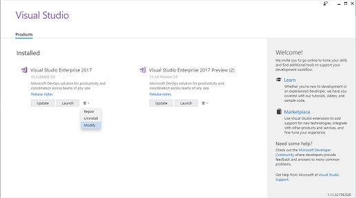
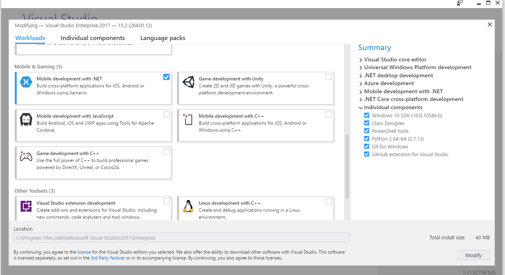
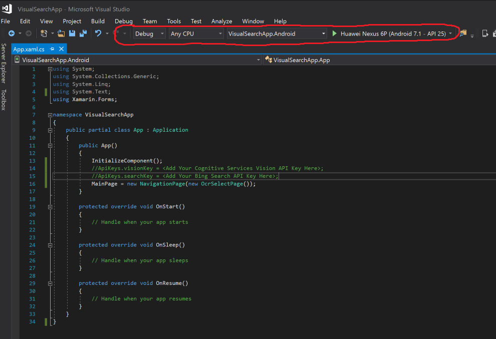
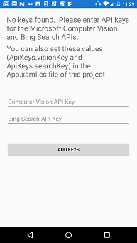
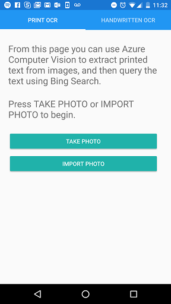
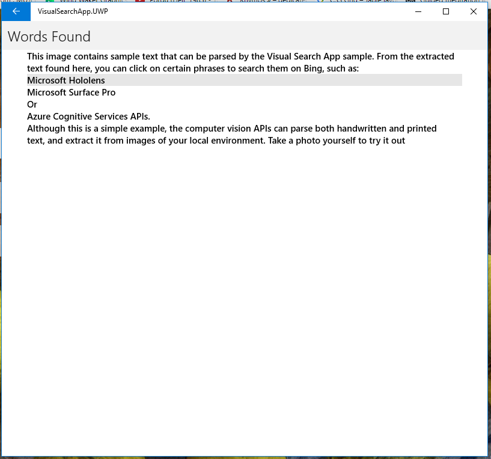
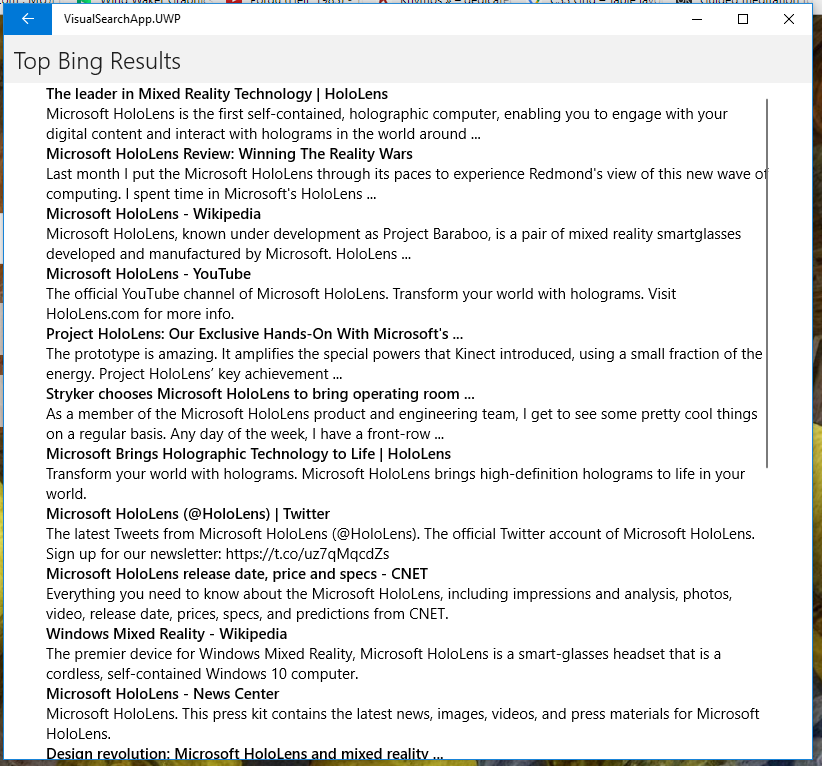
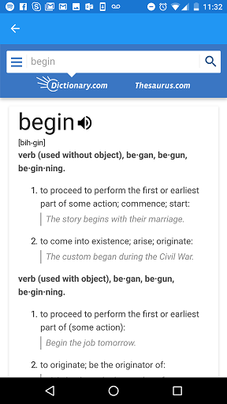

# Bing Web Search And Computer Vision API Tutorial: 
This tutorial explores the Azure Computer Vision and Bing Web Search API endpoints, and how can be used to build a basic visual search application in Xamarin.Forms.  Overall, this tutorial covers the following topics: 
* Setting up your system for Xamarin.Forms development
* Using the Xamarin Media Plugin to capture and import image data in a Xamarin.Forms application
* Formatting images and parsing text from them using the Azure Computer Vision APIs
* Structuring and sending text-based requests to the Bing Web Search API
* Parsing responses from the Bing Web Search and Computer Vision APIs with the NewtonSoft JSON parser (with LINQ and model object deserialization)
* Integrating these APIs into a C# based Xamarin.Forms application 

## Prerequisites
### Platform Requirements
This example was developed in Xamarin.Forms using [Visual Studio 2017 Enterprise Edition](https://www.visualstudio.com/downloads/).  This guide covers the basics of setting up and developing with Xamarin in Visual Studio.  For more information, you can consult the [Xamarin documentation](https://developer.xamarin.com/guides/cross-platform/getting_started/)  on the subject.

### Imported Libraries:  
This app makes use of the following libraries:
* [Xamarin Media Plugin](https://blog.xamarin.com/getting-started-with-the-media-plugin-for-xamarin/)
* [NewtonSoft JSON parser](http://www.newtonsoft.com/json)
* [Xamarin Forms Samples Image Resizer](https://github.com/xamarin/xamarin-forms-samples/tree/master/XamFormsImageResize)

The Xamarin Media Plugin and the NewtonSoft JSON parser can be installed with the NuGet package manager. The Xamarin.Forms image resizer class can be found within the linked Xamarin.Forms reference guide.

### Azure Services
This application utilizes resources from the following libraries:
* [Bing Web Search API](https://azure.microsoft.com/en-us/services/cognitive-services/bing-web-search-api/) 
*  [Azure Computer Vision API](https://azure.microsoft.com/en-us/services/cognitive-services/computer-vision/).  

For a 30-day trial key, see [this page](https://azure.microsoft.com/en-us/try/cognitive-services/).  For more information about attaining keys for professional use, see [Pricing](http://www.google.com).

### Legal: 
This application uses resources that require users to follow a few specific legal guidelines.  Before deploying an application based on this codebase, familiarize yourself with the following guidelines:  
* Web Search API:
    * Use of the Bing Web Search API requires adherence to the Bing Web Search [Use and Display Requirements](https://docs.microsoft.com/en-us/azure/cognitive-services/Bing-Web-Search/UseAndDisplayRequirements).  
* Computer Vision API: 
    * Microsoft receives the images that you upload to the Computer Vision APIs and may use them to improve their systems.  By submitting an image, you confirm that you have followed our [Developer Code of Conduct](https://azure.microsoft.com/en-us/support/legal/developer-code-of-conduct/).  
* ImageResizer.cs file:
    * The ImageResizer.cs file falls within an Apache 2.0 license.  You can attain a copy of this license at [http://www.apache.org/licenses/LICENSE-2.0](http://www.apache.org/licenses/LICENSE-2.0)
* General License: 
    * XamFormsVisualSearch is an open source application registered under the [MIT Open Source License](https://microsoft.mit-license.org/).  You can use it as a reference or template when building own applications utilizing the Microsoft Computer Vision and Web Search APIs. 

## Environment Setup  
### Installing Xamarin  
With Visual Studio 2017 installed, open the Visual Studio Installer, select the hamburger menu associated with your Visual Studio installation, and select "Modify."
 

Now, scroll down to Mobile & Gaming, and make sure that you've enabled "Mobile Development with .NET"

Now, click "Modify" in the bottom right corner of the window, and wait for Xamarin to install.

## Building and running the sample app
### Step 0: Download the sample
The sample can be found at [XamFormsVisualSearch](https://github.com/Azure-Samples/XamFormsVisualSearch). You can download it using Visual Studio or directly from GitHub.

### Step 1: Install the sample
In Visual Studio, open *XamFormsVisualSearch\VisualSearchApp.sln*.  It may take a few moments to initialize all of the required components. 

### Step 2: Build the sample
Press **Ctrl+Shift+B**, or click **Build** on the ribbon menu, then select **Build Solution**.  This builds the solution for all available platforms.  If you wish to compile and test code for iOS while using a windows machine, you can reference [this guide](https://developer.xamarin.com/guides/ios/getting_started/installation/windows/") for help.

### Step 3: Configure your deployment
Before running the application, you need to select a target Configuration, Platform, and Project.  Xamarin.Forms applications compile to native code for Windows, Android, and iOS.  This guide includes screenshots from the Windows compilation of the codebase.  However, all compilations are functionally equivalent.  

### Step 4: Run the app
1) After the build is complete and your target platform is selected, click the **Start** button in the toolbar or press **F5**.  This deploys your solution to your target platform.  

2) The application should launch and open to the following page (defined in the codebase at *AddKeysPage.xaml*, and referenced in this guide as the Add Keys Page).    Here you can input your Azure Computer Vision and Bing Web Search API keys.  If you would like to skip this page in later compilations, you can manually add your keys in the *App.xaml.cs* page of the codebase. 

3) Adding a set of working Azure keys takes you to the following page (defined in the codebase at *OcrSelectPage.xaml*, and referenced in this guide as the OCR Select Page).   Here you can either import or capture a new photo and then pass that photo to the Print or Handwritten OCR service for processing. 

4) The next screen displays the text extracted by the Azure Computer Vision API (defined in the codebase at *OcrResultsPage.xaml*, and referenced in this guide as the OCR Results Page).    Here you can select a line from the parsed text to find Bing search results for that content, or you can use the navigation bar to return to the OCR Select Page.

5) Selecting an item from the OCR Results Page takes you to the following screen (defined in the codebase at *WebResultsPage.xaml*, and referenced in this guide as the Web Results Page)   
Here you can see the results of querying the Bing Web Search API using the extracted text and open the linked pages within the application.  As before, you can also use the navigation bar to return to the OCR Results Page. 

6) Finally, selecting an item from the Web Results Page opens a WebView showing the content at that Bing result.  

From here, you can interact with the website as if it were loaded within a standard browser, or use the navigation bar to return to the Web Results Page. 

Note the Handwritten OCR endpoint is in preview, and although functional at the time of this guide's writing, its outputs and functionality are subject to change.  Additionally, Microsoft receives the images that you upload and may use them to improve the Computer Vision API and related services.  By submitting an image, you confirm that you have followed our Developer Code of Conduct.  

## Review and Learn:
Now that we have a functioning application, let's jump in and explore exactly how it utilizes resources from the Azure toolkit.  Whether you're using this sample as a starting point for your own application or simply as a reference for the Cognitive Services APIs, it is valuable to walk through the application screen by screen and examine exactly how it works.

### Add Keys Page
The Add Keys Page is where the user inputs their Azure API keys to be tested and set for later use. The UI for this page is defined in *AddKeysPage.xaml*, and its primary logic is defined in *AddKeysPage.xaml.cs*.  While the specific parameters of each request are discussed in later files, this is a great place to establish the basic structure for how the Azure endpoints can be reached from a C# codebase.  Throughout this sample, the basic structure of this interaction is as follows: 
1) Establish the root URI for each endpoint in a reusable location
2) Initialize *HttpResponseMessage* and *HttpClient* objects from *System.Net.Http*
3) Attach any desired headers (defined in each endpoint's API reference) to your HttpClient object
4) Attach any additional desired parameters to your endpoint URI
5) Send a POST or GET request with your data
6) Check that the response was successful
7) Pass on the response for further parsing
 
Step 1 is carried out in the first few lines of our class.  Here, we initialize our endpoint URIs as constants to be accessed later.

    public partial class AddKeysPage : ContentPage
	{
        // booleans set when the keys are proven to work
        private bool computerVisionKeyWorks = false;
        private bool bingSearchKeyWorks = false;

        // URIs of the endpoints used in the test requests
        private const string ocrUri = "https://westcentralus.api.cognitive.microsoft.com/vision/v1.0/ocr?";
        private const string searchUri = "https://api.cognitive.microsoft.com/bing/v5.0/search?";
        //CLASS CONTINUES BELOW

Steps 2 through 6 are then executed within their respective functions.  In the context of the key entry page, we're only checking to see if the Http request returned a 401 error, which would indicate that the API key was invalid.  In later functions, further checking and unpacking of the http response is done.  The function that checks the validity of the Bing Search API key follows:

        // send a test GET request to see if the Bing Search API key is functional
        async Task CheckBingSearchKey(object sender = null, EventArgs e = null)
        {
            HttpResponseMessage response;
            HttpClient SearchApiClient = new HttpClient();

            SearchApiClient.DefaultRequestHeaders.Add("Ocp-Apim-Subscription-Key", BingSearchKeyEntry.Text);
            var searchQuery = searchUri + "q=test";

            response = await SearchApiClient.GetAsync(searchQuery);
            if ((int)response.StatusCode != 401)
            {
                BingSearchKeyEntry.BackgroundColor = Color.Green;
                ApiKeys.bingSearchKey = BingSearchKeyEntry.Text;
                bingSearchKeyWorks = true;
            }
            else
            {
                BingSearchKeyEntry.BackgroundColor = Color.Red;
                bingSearchKeyWorks = false;
            }
        }

### OCR Select Page:
The OCR Select Page has two main roles.  First, it is where the user selects what kind of OCR they intend to perform with their target photo.  Second, it is where the user captures or imports the image that they wish to process.  This second task is traditionally cumbersome in a cross-platform application, as different logic has to be written for photo capture and import photos per platform.  However with the Xamarin Media Plugin, this can all be done with a few lines of code in the shared codebase.  

The following function provides an example of how to use the Xamarin Media Plugin for photo capture.  In it, we:
1) Ensure that a camera is available on the current device
2) Initialize a new StoreCameraMediaOptions object and use it to set where we want to save our captured image
3) Take an image, save it to the specified location, and attain a MediaFile object containing the image data.
4) Unpack the MediaFile into a byte array
5) Return the byte array for further processing 

Here's the function that uses the Xamarin Media Plugin for photo capture:

    // Uses the Xamarin Media Plugin to take photos using the native camera application
    async Task<byte[]> TakePhoto()
    {
        MediaFile photoMediaFile = null;
        byte[] photoByteArray = null;

        if (CrossMedia.Current.IsCameraAvailable)
        {
            var mediaOptions = new StoreCameraMediaOptions
            {
                Directory = "ScannedPhotos",
                Name = $"{DateTime.UtcNow}.jpg"
            };
            photoMediaFile = await CrossMedia.Current.TakePhotoAsync(mediaOptions);
            photoByteArray = MediaFileToByteArray(photoMediaFile);
        }
        else
        {
            Device.BeginInvokeOnMainThread(() => {
                DisplayAlert("Error", "No camera found", "OK");
            });
        }

        return photoByteArray;
    }

And here's the utility function used to convert a MediaFile into a byte array: 

    byte[] MediaFileToByteArray(MediaFile photoMediaFile)
    {
        using (var memStream = new MemoryStream())
        {
            photoMediaFile.GetStream().CopyTo(memStream);
            return memStream.ToArray();
        }
    }

The photo import utility works in a similar way, and can be found in *OcrSelectPage.xaml.cs*

### OCR Results Page
The OCR Results Page is where the actual text extraction is carried out through calling the standard and handwritten OCR endpoints.  These two APIs work differently, so it's valuable to step through each of the functions that call them.   

First, we establish the URIs that we'll be using to access the endpoints.  This is defined in the following code.  If you would like to learn more about the parameters attached to these URIs, you can learn more from the [Print Optical Character Recognition API Reference](https://westus.dev.cognitive.microsoft.com/docs/services/56f91f2d778daf23d8ec6739/operations/56f91f2e778daf14a499e1fc), and the [Handwritten Optical Character Recognition API Reference](https://westus.dev.cognitive.microsoft.com/docs/services/56f91f2d778daf23d8ec6739/operations/587f2c6a154055056008f200).  These pages explicitly define what can be added both to the headers and to the URIs of these requests.  

    /* This is the url that will be passed into the POST request for parsing printed text.  It's parameters are as follows:
        * [language = en] Tells the system to look for english printed text.  Other options are unk (unknown), and a series of other languages listed on the API reference site.
        * [detectOrientation = True] This allows the system to attempt to rotate the photo to improve parse results.
        * 
        * [Note] This API is only available on Azure servers in the following domains: westus, eastus2, westcentralus, westeurope, souteheastasia. 
        * [API Reference] https://westus.dev.cognitive.microsoft.com/docs/services/56f91f2d778daf23d8ec6739/operations/56f91f2e778daf14a499e1fc
        */
    public const string ocrUri = "https://westcentralus.api.cognitive.microsoft.com/vision/v1.0/ocr?language=en&detectOrientation=true";

    /* This is the url that will be passed into the POST request for parsing handwritten text.  Its parameters are as follows:
        * [handwriting = True] This tells the system to try to parse handwritten text from the image.  If set to False, this API will perform processing similar to the print OCR endpoint. 
        * 
        * [Note] This API is only available on Azure servers in the following domains: westus, eastus2, westcentralus, westeurope, souteheastasia. 
        * [API Reference] https://westus.dev.cognitive.microsoft.com/docs/services/56f91f2d778daf23d8ec6739/operations/587f2c6a154055056008f200
        */
    public const string handwritingUri = "https://westcentralus.api.cognitive.microsoft.com/vision/v1.0/recognizeText?handwriting=true";

The first API function is *FetchPrintedWordList*, which uses the Azure Computer Vision OCR endpoint to parse printed text from images.  It is defined as follows:

    // Uses the Microsoft Computer Vision OCR API to parse printed text from the photo set in the constructor
    async Task<ObservableCollection<string>> FetchPrintedWordList()
    {
        ObservableCollection<string> wordList = new ObservableCollection<string>();
        if (photo != null)
        {
            HttpResponseMessage response = null;
            using (var content = new ByteArrayContent(photo))
            {
                // The media type of the body sent to the API. "application/octet-stream" defines an image represented as a byte array
                content.Headers.ContentType = new MediaTypeHeaderValue("application/octet-stream");
                response = await VisionApiClient.PostAsync(ocrUri, content);
            }

            if (response != null)
            {
                string ResponseString = await response.Content.ReadAsStringAsync();
                JObject json = JObject.Parse(ResponseString);
                IEnumerable<JToken> lines = json.SelectTokens("$.regions[*].lines[*]");
                foreach (JToken line in lines)
                {
                    IEnumerable<JToken> words = line.SelectTokens("$.words[*].text");
                    wordList.Add(string.Join(" ", words.Select(x=> x.ToString())));
                }
            }
        }

        if (!wordList.Any())
        {
            Device.BeginInvokeOnMainThread(async () =>
            {
                await DisplayAlert("Error", "No words found.", "OK");
                await Task.Delay(TimeSpan.FromSeconds(0.1d));
                await Navigation.PopAsync(true);
            });
        }

        return wordList;
    }

The second API function is *FetchHandwrittenWordList*, which uses the Azure Computer Vision Handwritten OCR endpoint to parse handwritten text from images.  It is defines as follows:

    // Uses the Microsoft Computer Vision Handwritten OCR API to parse handwritten text from the photo set in the constructor
    async Task<ObservableCollection<string>> FetchHandwrittenWordList()
    {
        ObservableCollection<string> wordList = new ObservableCollection<string>();
        if (photo != null)
        {
            HttpResponseMessage response = null;
            // The handwritten text API requires an image under 4MB, so this function is called to downscale the image
            photo = await ImageResizer.ResizeImage(photo, 2048, 2048);
            using (var content = new ByteArrayContent(photo))
            {
                // The media type of the body sent to the API. "application/octet-stream" defines an image represented as a byte array
                content.Headers.ContentType = new MediaTypeHeaderValue("application/octet-stream");
                response = await VisionApiClient.PostAsync(handwritingUri, content);
            }

            IEnumerable<string> values;
            string statusUri = string.Empty;
            if (response.Headers.TryGetValues("Operation-Location", out values))
            {
                statusUri = values.FirstOrDefault();
                
                // Open a new thread to intermittently ping the statusUri endpoint and wait for processing to finish
                JObject obj = await FetchResultFromStatusUri(statusUri);

                IEnumerable<JToken> strings = obj.SelectTokens("$.recognitionResult.lines[*].text");
                foreach (string s in strings)
                {
                    wordList.Add((string)s);
                }
            }
        }
        if (!wordList.Any())
        {
            Device.BeginInvokeOnMainThread(async () =>
            {
                await DisplayAlert("Error", "No words found.", "OK");
                await Task.Delay(TimeSpan.FromSeconds(0.1d));
                await Navigation.PopAsync(true);
            });
        }

        return wordList;
    }

Unlike the standard OCR endpoint, the Handwritten OCR endpoint returns an HTTP 202 response, which signals that processing has begun server-side, but requires that the user to check in later for a final respone.  This is handled by the following function, which spins up a new thread to wait and occasionally check for a finished parse.

    async Task<JObject> FetchResultFromStatusUri(string statusUri)
    {
        JObject obj = null;
        int timeoutcounter = 0;
        HttpResponseMessage response = await VisionApiClient.GetAsync(statusUri);
        string responseString = await response.Content.ReadAsStringAsync();
        obj = JObject.Parse(responseString);

        while ((!((string)obj.SelectToken("status")).Equals("Succeeded")) && (timeoutcounter++ < 60))
        {
            await Task.Delay(1000);
            response = await VisionApiClient.GetAsync(statusUri);
            responseString = await response.Content.ReadAsStringAsync();
            obj = JObject.Parse(responseString);
        }
        return obj;
    } 

# TODO:
* Comment on the use of SelectTokens to find content, and link to the NewtonSoft Docs.  
    * Found @ <http://www.newtonsoft.com/json/help/html/SelectToken.htm>
    * Note that later, an alternative object deserializing method is used to obtain a richer set of data per object

### WebResultsPage

**Description of WebResultsPage**
* Is a Xamarin.Forms ContentPage, which contains a listview presenting all of the words extracted from a given image
* Uses the Web Search API:
    * General description: <https://azure.microsoft.com/en-us/services/cognitive-services/bing-web-search-api/>
    * API Reference: <https://docs.microsoft.com/en-us/rest/api/cognitiveservices/bing-web-api-v5-reference>
    * Page ranking tutorial: <https://docs.microsoft.com/en-us/azure/cognitive-services/bing-web-search/csharp-ranking-tutorial> 

### Opening a Webview

**Example of opening a webview**

**Commentary on other things that could be done with the same content**
* Comment that you could swap out standard for Bing Custom Search
* Highlight that the same structure could be applied to the Bing Image Search "Image Insights" section for reverse image lookup and simple object recognition
* Spellchecking can be easily applied with the extra function that was written (removed from current Git commit)
