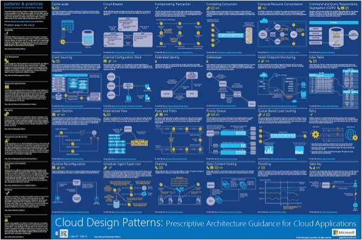
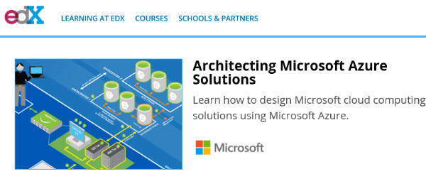
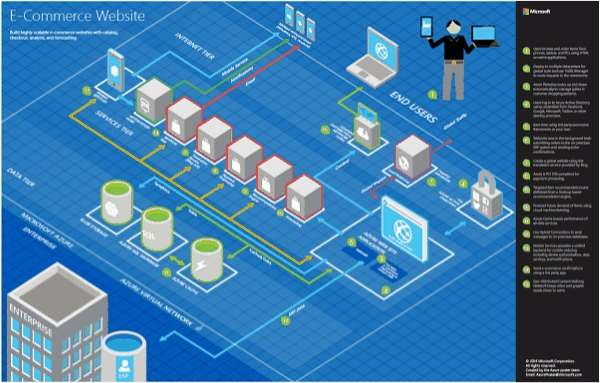
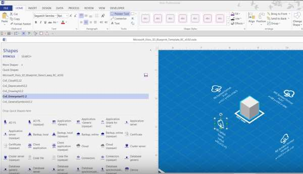
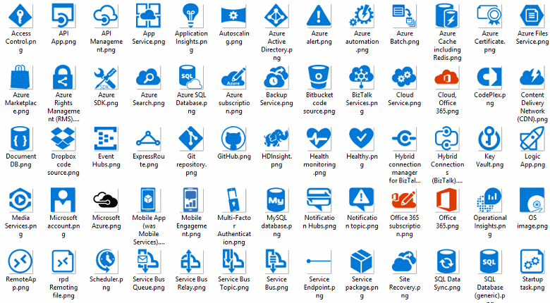
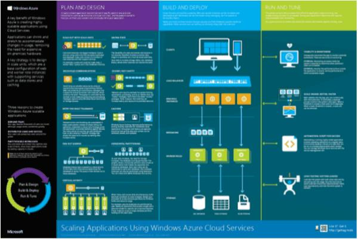

<properties 
	pageTitle="Application Architecture on Microsoft Azure | Microsoft Azure" 
	description="Architecture overview that covers common design patterns" 
	services="" 
	documentationCenter="" 
	authors="Rboucher" 
	manager="jwhit" 
	editor="mattshel"/>

<tags 
	ms.service="multiple" 
	ms.workload="na" 
	ms.tgt_pltfrm="na" 
	ms.devlang="na" 
	ms.topic="article" 
	ms.date="05/19/2016" 
	ms.author="robb"/>

#Application Architecture on Microsoft Azure
Resources for building applications that use Microsoft Azure. This includes tools to help you draw diagrams to visually describe software systems. 

##Design patterns poster

Microsoft patterns & practices has published the book [Cloud Design Patterns](http://msdn.microsoft.com/library/dn568099.aspx) which is available both on MSDN and in PDF download. There is also a large format poster available which lists all the patterns. 

##Microsoft architecture certification course

Microsoft just released a new architecture course supporting Microsoft certification exam 70-534. It's [available for free on EDX.ORG](https://www.edx.org/course/architecting-microsoft-azure-solutions-microsoft-dev205x).  It uses the new [3D Blueprint Visio Template](#3d-blueprint-visio-template). 

##Microsoft architecture Blueprints

Microsoft publishes a set of high level [architecture blueprints](http://aka.ms/azblueprints) showing how to build specific types of systems using Microsoft products. 

Each blueprint includes a

- Flat **2D Visio** 2003-based file that you can download and modify 
- Colorful **3D perspective PDF** file to introduce the blueprint to less technical audiences
- **Video** that walks through the 3D version. 

The Blueprints use the [Cloud and Enterprise Symbol Set](#symbol-and-icon-sets).   

##3D Blueprint Visio template

The 3D versions of the [Microsoft Architecture Blueprints](http://aka.ms/azblueprints) were initially created in a non-Microsoft tool. A new Visio 2013 (and later) template shipped on Aug 5, 2015 as part of a [Microsoft Architecture certification course distributed on EDX.ORG](#microsoft-architecture-certification-course). 

The template is also available outside the course. 

- [View the training video](http://aka.ms/3dBlueprintTemplateVideo) first so you know what it can do   
- Download the [Microsoft 3d Blueprint Visio Template](http://aka.ms/3DBlueprintTemplate)
- Download the [Cloud and Enterprise Symbols](#drawing-symbol-and-icon-sets) to use with the 3D template. 

Email us at [CnESymbols@microsoft.com](mailto:CnESymbols@microsoft.com) for specific questions not answered by the training materials or to give feedback. Usability is one of the primary goals of the template so let us know what's good and what gets in the way.

##Drawing symbol and icon sets 

[View the Visio and symbols training video](http://aka.ms/CnESymbolsVideo) and then [download the Cloud and Enterprise Symbol set](http://aka.ms/CnESymbols) to help create technical materials that describe Azure, Windows Server, SQL Server and more. You can use the symbols in architecture diagrams, training materials, presentations, datasheets, infographics, whitepapers and even 3rd party books if the book trains people to use Microsoft products. However, they are not meant for use in user interfaces.

The CnE symbols are in Visio and PNG formats. Additional instructions on how to use the PNGs in PowerPoint are included in the set. 

The symbol set ships quarterly and is updated as new services are released. 

Additional symbols for Microsoft Office and related technologies are available in the [Microsoft Office Visio stencil](http://www.microsoft.com/en-us/download/details.aspx?id=35772), though they are not optimized for architectural diagrams like the CnE set is.   

**Feedback:** If you've used the CnE symbols, fill out the short 5 question [survey](http://aka.ms/azuresymbolssurveyv2) or email us at [CnESymbols@microsoft.com](mailto:CnESymbols@microsoft.com) for specific questions and issues. We’d like to know what you think, including positive feedback so we know to continue to invest time in them. 

##Architecture Infographics

Microsoft publishes several architecture related posters/infographics. They include [Building Real-World Cloud Applications](https://azure.microsoft.com/documentation/infographics/building-real-world-cloud-apps/) and [Scaling with Cloud Services](https://azure.microsoft.com/documentation/infographics/cloud-services/) . 

