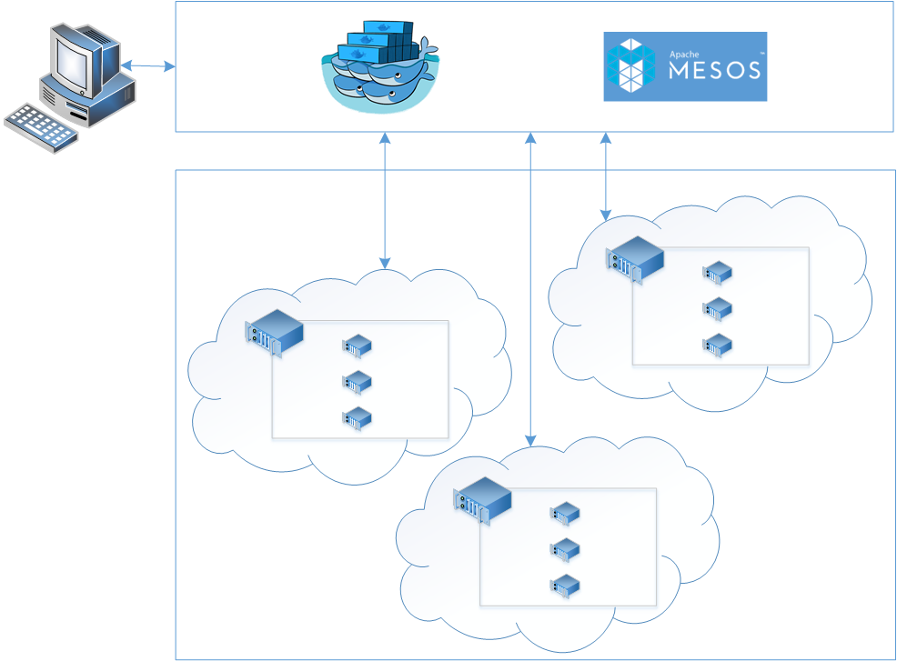

<properties
   pageTitle="Azure Container Service Introduction | Microsoft Azure"
   description="Azure Container Service (ACS) provides a way to simplify the creation, configuration, and management of a cluster of virtual machines that are preconfigured to run containerized applications."
   services="virtual-machines"
   documentationCenter=""
   authors="rgardler"
   manager="nepeters"
   editor=""
   tags="acs, azure-container-service"
   keywords="Docker, Containers, Micro-services, Mesos, Azure"/>
   
<tags
   ms.service="virtual-machines"
   ms.devlang="na"
   ms.topic="home-page"
   ms.tgt_pltfrm="na"
   ms.workload="na"
   ms.date="12/02/2015"
   ms.author="rogardle"/>

# Azure Container Service Introduction

> [AZURE.VIDEO azurecon-2015-deep-dive-on-the-azure-container-service-with-mesos]

Azure Container Service (ACS) provides a way to simplify the creation,
configuration, and management of a cluster of virtual machines that are
preconfigured to run containerized applications. Using an optimized
configuration of popular open-source scheduling and orchestration tools,
ACS enables you to use your existing skills or draw upon a large and
growing body of community expertise to deploy and manage container-based
applications on Microsoft Azure.

ACS leverages Docker to ensure that your application containers are
fully portable. It also supports your choice of Marathon, Chronos and
Apache Mesos or Docker Swarm to ensure that these applications can be
scaled to thousands, even tens of thousands of containers.

The Azure Container Service enables you to take advantage of the
enterprise grade features of Azure while still maintaining application
portability, including at the orchestration layers.

While the service is in preview, we ask that those interested in testing
the service [self-nominate](http://aka.ms/acspreview). Once preview access has been provided, an email will be sent with further details including deployment templates and getting started instructions. In order to use the service, you will need an Azure subscription, if you don’t have one yet, then why not sign up for a
[free
trial](http://www.windowsazure.com/en-us/pricing/free-trial/?WT.mc_id=AA4C1C935)?

Using Azure Container Service
-----------------------------

Our goal with the Azure Container Service is to provide a container
hosting environment, using open source tools and technologies, which are
popular among our customers today. To this end, we expose the standard
API endpoints for Docker and your chosen orchestrator. Using these
endpoints you can leverage any software that is capable of talking to
those endpoints. For example, in the case of the Docker Swarm endpoint
you might choose to use Docker Compose, while for Apache Mesos you may
choose to use the DCOS CLI.

Creating a Docker Cluster Using Azure Container Service
-------------------------------------------------------

Once you have [requested](http://aka.ms/acspreview) and been granted access to
the preview, you can use one of a number of Azure Resource Manager
templates that allow you to deploy your first cluster through the Azure
Portal. Using these templates, you can quickly create a service and
start deploying applications to it straight away. To get started you
only need to decide on the size of your cluster and whether you want to
use Docker Swarm or Apache Mesos to manage your applications.

You can also [use the command line](/documentation/articles/resource-group-template-deploy/)
to create Azure Container Services using these same templates. Once you
are familiar with the structure of these templates you will be able to
write your own and fully automate the creation of an Azure Container
Service cluster.

Full documentation and support will be provided to preview participants
and will be published here once the service is opened to the public.

Deploying an Application
------------------------

During preview we provide a choice of either Docker Swarm or Apache
Mesos (with DCOS Marathon and DCOS Chronos frameworks)
for orchestration. 

### Using Apache Mesos

Apache Mesos is an open source project housed at the Apache Software
Foundation. It lists some of the [biggest names in
IT](http://mesos.apache.org/documentation/latest/powered-by-mesos/) as
users and contributors.

Mesos packs an impressive features set.

-   Scalability to 10,000s of nodes

-   Fault-tolerant replicated master and slaves using ZooKeeper

-   Support for Docker containers

-   Native isolation between tasks with Linux Containers

-   Multi-resource scheduling (memory, CPU, disk, and ports)

-   Java, Python and C++ APIs for developing new parallel applications

-   Web UI for viewing cluster state

Mesos has support for a large number of
[frameworks](http://mesos.apache.org/documentation/latest/frameworks/)
that can be used for scheduling workloads on the Azure Container
Service. By default, ACS includes the Marathon and Chronos frameworks.

#### Using Marathon and Chronos

Marathon is a cluster-wide init and control system for services in
cgroups or, in the case of ACS, Docker containers. It is an ideal
partner to Chronos, a fault tolerant job scheduler for Mesos which
handles dependencies and time based schedules.

Marathon and Chronos provide a Web UI from which you can deploy your
applications. You will access this at an URL that looks something like
`http://DNS\_PREFIX.REGION.cloudapp.azure.com`
where DNS\_PREFIX and REGION are both defined at deployment time. Of
course, you can also provide your own DNS name.

You can also use the REST APIs for communicating with Marathon and
Chronos. There are a number of client libraries available for each tool,
covering a variety of languages and, of course, you can use the HTTP
protocol in any language. In addition, many popular DevOps tools provide
support for these schedulers. This provides maximum flexibility for your
operations team when working with an ACS cluster.

Full documentation and support will be provided to preview participants
and will be published here once the service is opened to the public.

### Using Docker Swarm

Docker Swarm provides native clustering for Docker. Because Docker Swarm
serves the standard Docker API, any tool that already communicates with
a Docker daemon can use Swarm to transparently scale to multiple hosts
on Azure Container Service. 

Supported tools for managing containers on a Swarm cluster include, but are not limited
to, the following:

-   Dokku

-   Docker CLI and Docker Compose

-   Krane

-   Jenkins

Full documentation and support will be provided to preview participants
and will be published here once the service is opened to the public.

Gaining Access
--------------

While the service is in preview we ask that those interested testing the
service [self-nominate](http://aka.ms/acspreview). You will first need an Azure
Subscription, if you don’t have one yet then why not sign up for a [free
trial](http://www.windowsazure.com/en-us/pricing/free-trial/?WT.mc_id=AA4C1C935)?
