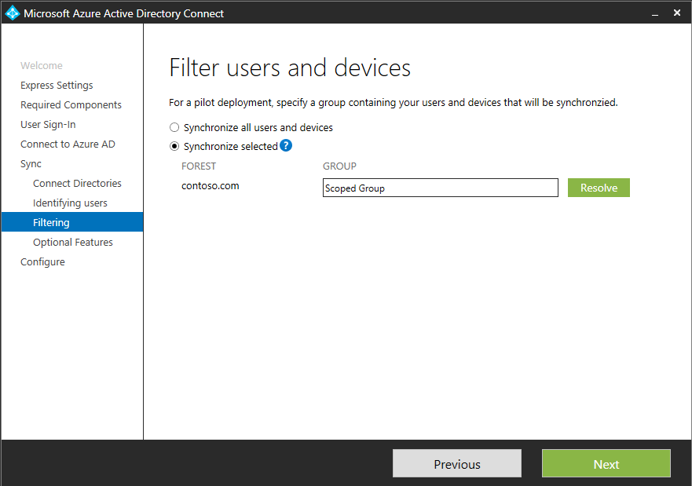
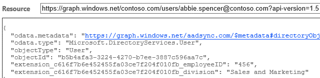
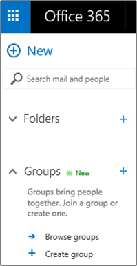
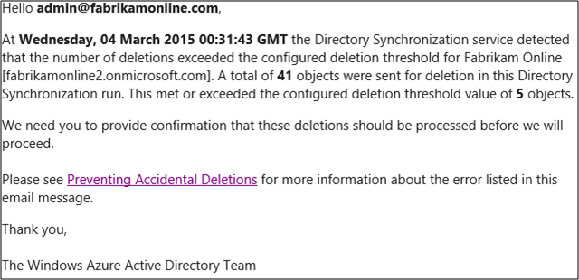
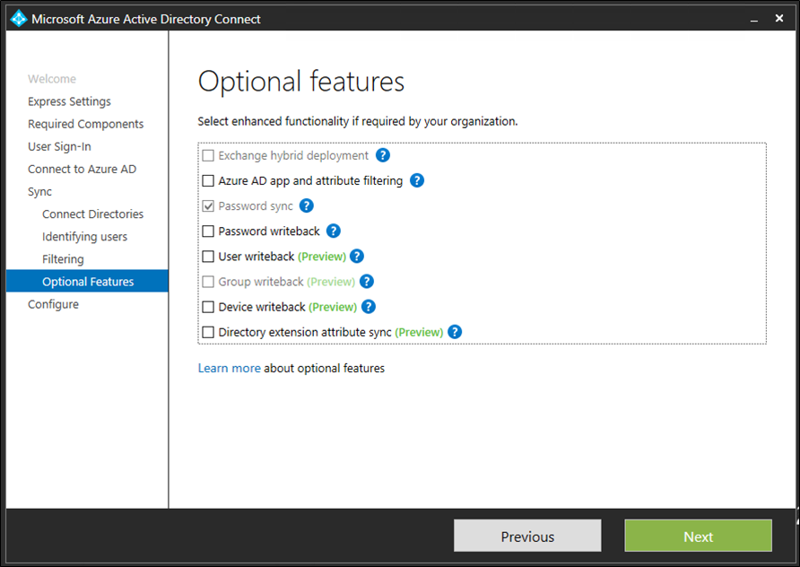

<properties 
	pageTitle="Custom installation Azure AD Connect" 
	description="This document details the custom installation options for Azure AD Connect." 
	services="active-directory" 
	documentationCenter="" 
	authors="billmath" 
	manager="terrylan" 
	editor="lisatoft"/>

<tags 
	ms.service="azure-active-directory-connect" 
	ms.workload="identity" 
	ms.tgt_pltfrm="na" 
	ms.devlang="na" 
	ms.topic="article" 
	ms.date="04/02/2015" 
	ms.author="billmath"/>

# Custom installation of Azure AD Connect

<a href="active-directory-aadconnect/" title="What is It" class="current">What is It</a>
<a href="active-directory-aadconnect-how-it-works/" title="How it Works">How it Works</a>
<a href="active-directory-aadconnect-get-started/" title="Getting Started">Getting Started</a>
<a href="active-directory-aadconnect-whats-next/" title="Whats Next">Whats Next</a>
<a href="active-directory-aadconnect-learn-more/" title="Learn More">Learn More</a>

The following documentation provides information on using the custom installation option for Azure AD Connect.  You can use this option if you have additional configuration options or need optional features that are not covered in the express installation.

For information on an Express Installation see [Express Installation](active-directory-aadconnect-get-started/#express-installation-of-azure-ad-connect).

## New features available in Azure AD Connect
The following is information on some of the new features that are now available in Azure AD Connect that are not currently available with Azure AD Sync.

### Sync filtering  based on groups
It is already possible to filter which objects should be synchronized to Azure AD by using Domain/OU filtering and attribute filtering. Azure AD Connect introduces the possibility to also filter on group membership. This is particularly useful for a small pilot where only a small set of users and groups from the on-premises AD DS should be in Azure AD. 

To use this feature, in the customized path you will see this page: 

Add the name of the group containing the users and groups. Only members of this group will be synchronized to Azure AD.
### Directory Extension attribute sync
With directory extensions you can extend the schema in Azure AD with custom attributes added by your organization or other attributes in Active Directory. To use this feature select “Directory Extension attribute sync” on the “Optional Features” page. This will give you this page where you can select your additional attributes.

Only single-valued attributes are supported and the value cannot be longer than 250 characters. The metaverse and Azure AD schema will be extended with the attributes selected. In Azure AD a new application is added with the attributes.

These attributes will now be available through Graph:

### User writeback
User writeback allows you to take a user created in Azure AD (through the portal, graph, PowerShell, or any other method) and write the user back to on-premises ADDS. To enable the feature, select “User writeback” on the optional features page. You will now be presented with the location where you want these users to be created. The default configuration will create all users in one location in ADDS.

The users will be created with a random password so you have to reset the password in AD DS for the user to actually be able to login.

### Group writeback
The option for group writeback in optional features will allow you to writeback “Groups in Office 365” to a forest with Exchange installed. This is a new group type which is always mastered in the cloud. You can find this in outlook.office365.com or on myapps.microsoft.com as shown here:

This group will be represented as a distribution group in on-premises AD DS. Your on-premises Exchange server must be on Exchange 2013 cumulative update 8 (released in March 2015) to recognize this new group type.

**Note**
<li>The address book attribute is currently not populated. The easiest is to find the address book property from another group in your org and populate this outside the sync engine.</li>
<li>Only forests with the Exchange schema are valid targets for groups. If no Exchange was detected, then group writeback will not be possible to enable.</li>
<li>The Group writeback feature does not currently handle security groups or distribution groups.</li> 

More information can be found [here](http://blogs.office.com/2014/09/25/delivering-first-chapter-groups-office-365/ ). 

###Device writeback
The device writeback feature will allow you take a device registered in the cloud, for example in Intune, and have it in AD DS for conditional access. To enable the feature, AD DS must be prepared. If you install AD FS and the device registration service (DRS), DRS provides PowerShell cmdlets to prepare AD for device writeback. If you do not have DRS installed, then you can run C:\Program Files\Microsoft Azure Active Directory Connect\AdPrep\AdSyncAdPrep.psm1 as an enterprise admin.

### Device sync
If you enable the feature device sync then your Windows 10 devices which are domain joined will be synchronized to Azure AD. Unless you are part of the Windows 10 pre-release program and have been instructed by Microsoft to enable this feature, leave this option unselected.

### Staging mode
With staging mode the process to setup a new sync server in parallel with an existing server is possible. It is only supported to have one sync server connected to one directory in the cloud. But if we want to move from another server, for example one running DirSync, then we can enable Azure AD Connect in staging mode. When enabled the sync engine will import and synchronize data as normal, but it will not export anything to Azure AD and will turn off password sync and password writeback. 

While in staging mode, it is possible to make required changes to the sync engine and review what is about to be exported. When the configuration looks good, run the installation wizard again and disable staging mode. This will enable data to be exported to Azure AD. Make sure to disable the other server at the same time so only one server is actively exporting.

### Preventing accidental deletions
When installing Azure AD Connect the feature preventing accidental deletions will be enabled by default and configured to not allow an export with more than 500 deletes. The 500 is a default value and can be changed. With this feature enabled, if there are too many deletes, the export will not continue and you will receive an email like this:

If this was unexpected, then investigate and take any corrective actions. 

To temporarily disable this protection and let these deletes go through, run:
Disable-ADSyncExportDeletionThreshold

To re-enable the protection or to change the default threshold setting, run:
Enable-ADSyncExportDeletionThreshold

## Sync services optional configurations
When you install the synchronization services, you can leave the optional configuration section unchecked and Azure AD Connect will set everything up automatically.  This includes setting up a SQL Server 2012 Express instance and creating the appropriate groups and assigning them permissions.  If you wish to change the defaults you can use the table below to understand the optional configuration options that are available.

Optional Configuration  | Description 
------------- | ------------- |
SQL Server Name  |Allows you to specify the SQL Server name and the instance name.  Choose this option if you already have ad database server that you would like to use.
Service Account  |By default Azure AD Connect will create a service account for the synchronization services to use.  The problem that arises is that the password is generated automatically and unknown to the person installing Azure AD Connect.  In most scenarios this is okay but if you wish to do some advanced configurations such as scoping the organizational units that are synchronized, you will want to create an account and choose your own password.  |
Permissions | By default Azure AD Connect will create four groups when the synchronization services are installed.  These groups are: Administrators group, Operators group, Browse group, and the Password Reset Group.  If you wish to specify your own groups you can do so here.
Import settings  |Use this option if you are importing configuration information from DirSync of Azure AD Sync.|

## Custom installation

With the custom installation you can select several different options.  The following table describes the wizard pages that are available when selecting the custom installation option.

Page Name    | Description
-------------------    | ------------- | 
User Sign-In|On this page you can choose whether to use Password Synchronization, Federation with AD FS or neither.
Connect to your directories|On this page you can add one or more directories that you would like to synchronize with.
Sync Filtering| Here you can determine whether you want to synchronize all users and groups or whether you want to specify one group per directory and only synchronize them.
On-Premises Identities|Here you can specify that users either exist only once in all of the directories that were added in the Connect to your directories page or that they exist in multiple directories.  If users exist in multiple directories, you will have to choose an attribute that uniquely identifies these users in the directories.  For example, the mail attribute, ObjectSID, or SAMAccountName are all common attributes used to uniquely identify users.
Azure Identities|On this page you specify the source anchor that you want to use for identity federation.
Option Features|Use the table below for a brief description of the optional features that you can select from.

Optional Features      | Description
-------------------    | ------------- | 
Exchange Hybrid Deployment |The Exchange Hybrid Deployment feature allows for the co-existence of Exchange mailboxes both on-premises and in Azure by synchronizing a specific set of attributes from Azure AD back into your on-premises directory.
Azure AD app and attribute filtering|By enabling Azure AD app and attribute filtering, the set of synchronized attributes can be tailored to a specific set on a subsequent page of the wizard.  This opens two additional configuration pages in the wizard.  
Password writeback|By enabling password writeback, password changes that originate with Azure AD will be written back to your on-premises directory.
User writeback|By enabling user writeback, users created in Azure AD will be written back to your on-premises directory.  This opens an additional configuration page in the wizard.  
Device Sync|By enabling device sync, device configuration can be written to in Azure AD.
Directory extension attribute sync|By enabling directory extensions attribute sync, attributes specified will be synced to Azure AD.  This opens an additional configuration page in the wizard.  

For additional configuration options such as changing the default configuration, using the Synchronization Rules Editor and Declarative Provisioning see [Manage Azure AD Connect](active-directory-aadconnect-whats-next.md)

**Additional Resources**

* [Use your on-premises identity infrastructure in the cloud](active-directory-aadconnect.md)
* [How Azure AD Connect works](active-directory-aadconnect-how-it-works.md)
* [Whats Next with Azure AD Connect](active-directory-aadconnect-whats-next.md)
* [Learn More](active-directory-aadconnect-learn-more.md)
* [Azure AD Connect on MSDN](https://msdn.microsoft.com/library/azure/dn832695.aspx)