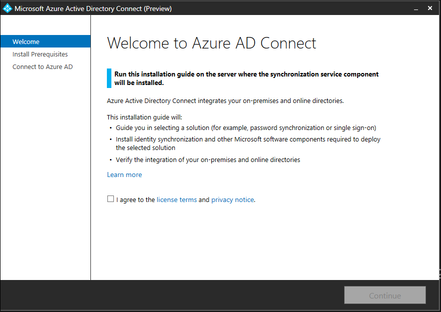
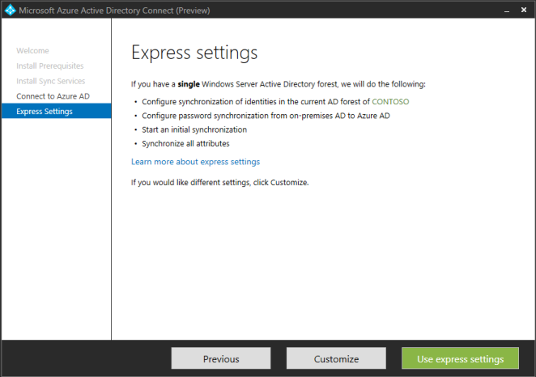

<properties 
	pageTitle="Getting Started with Azure AD Connect" 
	description="Learn how to download, install and run the setup wizard for Azure AD Connect." 
	services="active-directory" 
	documentationCenter="" 
	authors="billmath" 
	manager="terrylan" 
	editor="lisatoft"/>

<tags 
	ms.service="azure-active-directory-connect" 
	ms.workload="identity" 
	ms.tgt_pltfrm="na" 
	ms.devlang="na" 
	ms.topic="article" 
	ms.date="04/02/2015" 
	ms.author="billmath"/>

# Getting Started with Azure AD Connect

The following documentation will help you get started with Azure Active Directory Connect.

## Download Azure AD Connect

To get started using Azure AD Connect you can download the latest version using the following:  [Download Azure AD Connect Public Preview](http://connect.microsoft.com/site1164/program8612) 

## Before you install Azure AD Connect
Before you install Azure AD Connect, there are a few things that you will need.  

- An Azure subscription or an [Azure trial subscription](http://azure.microsoft.com/pricing/free-trial/)
- Azure AD Premium or an [Azure AD Premium trial](http://aka.ms/aadptrial)
- An Azure AD Global Administrator account for the Azure AD tenant you wish to integrate with
- An AD Domain Controller or member server with Windows Server 2008 or later
- An Enterprise Administrator account for you local Active Directory
- Optional:  A test user account to verify synchronization. 

If you intend to use the SSO with AD FS option you will also need the following:

- Local administrator credentials on your intended federation servers.
- Local administrator credentials on any workgroup (non-domain joined) servers on which you intend to deploy the Web Application Proxy role.
- A Windows Server 2012 R2 server for the federation server.
- A Windows Server 2012 R2 server for the Web Application Proxy.
-  a .pfx file with one SSL certificate for your intended federation service name, such as fs.contoso.com.
- the machine on which you execute the wizard must be able to connect to any other machines on which you want to install AD FS or Web Application Proxy via Windows Remote Management.

## Installing Azure AD Connect

Once you have downloaded Azure AD Connect, use the following to install Azure AD Connect.

1. Login to the server you wish to install Azure AD Connect as an Enterprise Administrator.
2. Navigate to and double-click on AzureADConnect.msi
3. Step through the wizard using either the Express or Custom settings
4. Optional:  Use your test user account to sign-in to a cloud service such as Office 365 to test.

## Sync Services Optional Configurations
When you install the synchronization services, you can leave the optional configuration section unchecked and Azure AD Connect will set everything up automatically.  This includes setting up a SQL Server 2012 Express instance and creating the appropriate groups and assigning them permissions.  If you wish to change the defaults you can use the table below to understand the optional configuration options that are available.

Optional Configuration  | Description 
------------- | ------------- |
SQL Server Name  |Allows you to specify the SQL Server name and the instance name.  Choose this option if you already have ad database server that you would like to use.
Service Account  |By default Azure AD Connect will create a service account for the synchronization services to use.  The problem that arises is that the password is generated automatically and unknown to the person installing Azure AD Connect.  In most scenarios this is okay but if you wish to do some advanced configurations such as scoping the organizational units that are synchronized, you will want to create an account and choose your own password.  |
Permissions | By default Azure AD Connect will create four groups when the synchronization services are installed.  These groups are: Administrators group, Operators group, Browse group, and the Password Reset Group.  If you wish to specify your own groups you can do so here.
Import settings  |Use this option if you are importing configuration information from DirSync of Azure AD Sync.|

## Express Installation
Selecting the Express Settings is the default option and is one of the most common scenarios.  When doing this, Azure AD Connect deploys sync with the password hash sync option. This is for a single forest only and allows your users to use their on-premises password to sign-in to the cloud.  Using the Express install will automatically kick of a synchronization once the installation is complete.  With this option there are only six short clicks to extending your on-premises directory to the cloud.

## Custom Installation

With the custom installation you can select several different options.  The following table describes the wizard pages that are available when selecting the custom installation option.

Page Name    | Description
-------------------    | ------------- | 
User Sign-In|On this page you can choose whether to use Password Synchronization, Federation with AD FS or neither.
Connect to your directories|On this page you can add one or more directories that you would like to synchronize with.
Sync Filtering| Here you can determine whether you want to synchronize all users and groups or whether you want to specify one group per directory and only synchronize them.
On-Premises Identities|Here you can specify that users either exist only once in all of the directories that were added in the Connect to your directories page or that they exist in multiple directories.  If users exist in multiple directories, you will have to choose an attribute that uniquely identifies these users in the directories.  For example, the mail attribute, ObjectSID, or SAMAccountName are all common attributes used to uniquely identify users.
Azure Identities|On this page you specify the source anchor that you want to use for identity federation.
Option Features|Use the table below for a brief description of the optional features that you can select from.

Optional Features      | Description
-------------------    | ------------- | 
Exchange Hybrid Deployment |The Exchange Hybrid Deployment feature allows for the co-existence of Exchange mailboxes both on-premises and in Azure by synchronizing a specific set of attributes from Azure AD back into your on-premises directory.
Azure AD app and attribute filtering|By enabling Azure AD app and attribute filtering, the set of synchronized attributes can be tailored to a specific set on a subsequent page of the wizard.  This opens two additional configuration pages in the wizard.  
Password writeback|By enabling password writeback, password changes that originate with Azure AD will be written back to your on-premises directory.
User writeback|By enabling user writeback, users created in Azure AD will be written back to your on-premises directory.  This opens an additional configuration page in the wizard.  
Device Sync|By enabling device sync, device configuration can be written to in Azure AD.
Directory extension attribute sync|By enabling directory extensions attribute sync, attributes specified will be synced to Azure AD.  This opens an additional configuration page in the wizard.  

For additional configuration options such as changing the default configuration, using the Synchronization Rules Editor and Declarative Provisioning see [Manage Azure AD Connect](active-directory-aadconnect-manage.md)

## Azure AD Connect Supporting Components

The following is a list of per-requisites and supporting components that Azure AD Connect will install on the server that you set Azure AD Connect up on.  This list is for a basic Express installation.  If you choose to use a different SQL Server on the Install synchronization services page then, the SQL Server 2012 components listed below are not installed. 

- Forefront Identity Manager Azure Active Directory Connector
- Microsoft SQL Server 2012 Command Line Utilities
- Microsoft SQL Server 2012 Native Client
- Microsoft SQL Server 2012 Express LocalDB
- Azure Active Directory Module for Windows PowerShell
- Microsoft Online Services Sign-In Assistant for IT Professionals
- Microsoft Visual C++ 2013 Redistribution Package

**Additional Resources**

* [Use your on-premises identity infrastructure in the cloud](active-directory-aadconnect.md)
* [How Azure AD Connect works](active-directory-aadconnect-howitworks.md)
* [Manage Azure AD Connect](active-directory-aadconnect-manage.md)
* [Azure AD Connect on MSDN](https://msdn.microsoft.com/library/azure/dn832695.aspx)
