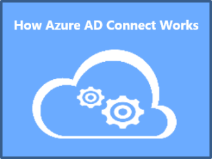
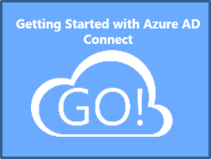
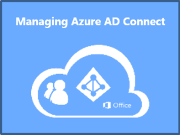
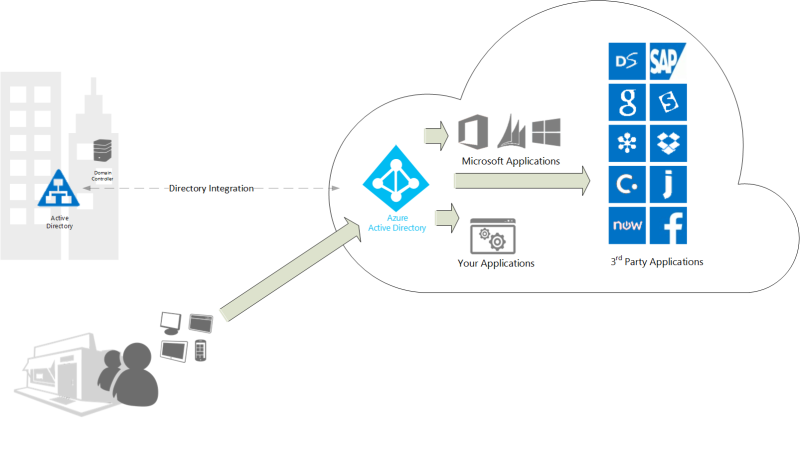

<properties 
	pageTitle="Azure Active Directory Connect - What is It?" 
	description="This is the Azure AD Connect that describes what it is and why you would use it." 
	services="active-directory" 
	documentationCenter="" 
	authors="billmath" 
	manager="terrylan" 
	editor="lisatoft"/>

<tags 
	ms.service="active-directory" 
	ms.workload="identity" 
	ms.tgt_pltfrm="na" 
	ms.devlang="na" 
	ms.topic="article" 
	ms.date="04/02/2015" 
	ms.author="billmath"/>

# Use your on-premises identity infrastructure in the cloud

<a href="/en-us/documentation/articles/active-directory-aadconnect/" title="What is It" class="current">What is It</a>
<a href="/en-us/documentation/articles/active-directory-aadconnect-how-it-works/" title="How it Works">How it Works</a>
<a href="/en-us/documentation/articles/active-directory-aadconnect-get-started/" title="Getting Started">Getting Started</a>
<a href="/en-us/documentation/articles/active-directory-aadconnect-whats-next/" title="Whats Next">Whats Next</a>
<a href="/en-us/documentation/articles/active-directory-aadconnect-learn-more/" title="Learn More">Learn More</a>

Today, users want to be able to access applications both on-premises and in the cloud.  They want to be able to do this from any device, be it a laptop, smart phone, or tablet.  In order for this to occur, you and your organization need to be able to provide a way for users access these apps.  

Also, most organizations have a lot of time and money invested in their on-premises infrastructure as well as a number of mission critical applications, so moving everything immediately to the cloud is not an option.  So moving to the cloud poses challenges and before you can take advantage of all the cloud has to offer a few things need to be considered. 

- The first is that your users and organization will need a way to authenticate.  That is, you will need to prove you are who you say you are.  One big challenge as an administrator is, how can I provide my users a common identity so that they do not have to remember multiple user names and passwords.  This can lead to additional administrative overhead which can lead to increased costs.  The benefits of moving to the cloud can be quickly offset by these increases.
- Authentication with Microsoft Azure can be accomplished in two ways, using cloud authentication or using an existing Active Directory Federation Services (AD FS) deployment for on-premises authentication.  In the past, whether you are using cloud authentication or on-premises authentication, setting this up was not a simple task.  This was true even if you already had Active Directory running in your organization and became even more difficult when you wanted to pull in non-AD directories. 

With the introduction of Azure Active Directory Connect this has all changed.  Azure AD Connect is the single tool and guided experience for connecting your on-premises directories with Azure Active Directory. Once installed the wizard deploys and configures all components required to get your directory integration up and running including sync services, password sync or AD FS, and prerequisites such as the Azure AD PowerShell module.

>[AZURE.NOTE] Azure AD Connect incorporates the components and functionality previously released as Dirsync and AAD Sync. These tools are longer being released individually, and all future improvements will be included in updates to Azure AD Connect, so that you always know where to get the most current functionality.

> Until the GA release of Azure AD Connect you can continue use Azure AD Sync for new production deployments.  To learn more about Azure AD Sync, DirSync, and FIM Sync see [Directory Integration Tools](https://msdn.microsoft.com/library/azure/dn757582.aspx).

For additional documentation click on one of the icons below.

   

  

## Why use Azure AD Connect 

Integrating your on-premises directories with Azure AD makes your users more productive by providing a common identity for accessing both cloud and on-premises resources.  With this integration users and organizations can take advantage of the following:
	
* Organizations can provide users with a common hybrid identity across on-premises or cloud-based services leveraging Windows Server Active Directory and then connecting to Azure Active Directory. 
* Administrators can provide conditional access based on application resource, device and user identity, network location and multifactor authentication
* Users can leverage their common identity through accounts in Azure AD to Office 365, Intune, SaaS apps and third-party applications.  
* Developers can build applications that leverage the common identity model, integrating applications into Active Directory on-premises or Azure for cloud-based applications

Azure AD Connect makes this integration easy and simplifies the management of your on-premises and cloud identity infrastructure.

----------------------------------------------------------------------------------------------------------
## Download Azure AD Connect

To get started using Azure AD Connect you can download the latest version using the following:  [Download Azure AD Connect Public Preview](http://connect.microsoft.com/site1164/program8612) 

----------------------------------------------------------------------------------------------------------

## Recent updates

**Azure AD Connect Public Preview March 2015 Update** - March 2015

An update for Azure AD Connect Public Preview is now available.  This update adds Sync filtering, directory extension attribute sync, user/group/device writeback and more.  See the documentation in the download for all of the new changes.  To download the March 2015 update see [Download Azure AD Connect Public Preview](http://connect.microsoft.com/site1164/program8612) 

**Azure AD Connect in Public Preview** - December 2014

Back in August I posted a blog announcing the beta release of Azure AD Connect. Since then we have received a lot of feedback and made improvements in AAD Connect and AAD Sync, including multi forest support and password write back. [Read more](http://blogs.technet.com/b/ad/archive/2014/12/15/azure-ad-connect-one-simple-fast-lightweight-tool-to-connect-active-directory-and-azure-active-directory.aspx) 

**Introducing Azure AD Connect** - August 2014

We've heard consistent feedback that integrating your on premises identities with Azure AD is harder than it should be.  There are too many pages of documentation to read, too many different tools to download and configure, and far too much on premises hardware required.  We agree! [Read more](http://blogs.technet.com/b/ad/archive/2014/08/04/connecting-ad-and-azure-ad-only-4-clicks-with-azure-ad-connect.aspx)

**Additional Resources**

* [How Azure AD Connect works](active-directory-aadconnect-how-it-works.md)
* [Getting started with Azure AD Connect](active-directory-aadconnect-get-started.md)
* [Whats Next with Azure AD Connect](active-directory-aadconnect-whats-next.md)
* [Learn More](active-directory-aadconnect-learn-more.md)
* [Azure AD Connect on MSDN](https://msdn.microsoft.com/library/azure/dn832695.aspx)

