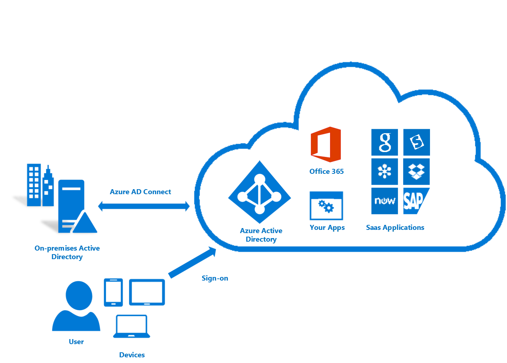

<properties 
	pageTitle="Use your on-premises identity infrastructure in the cloud." 
	description="This is the Azure AD Connect that describes what it is and why you would use it." 
	services="active-directory" 
	documentationCenter="" 
	authors="billmath" 
	manager="terrylan" 
	editor="bryanla"/>

<tags 
	ms.service="active-directory" 
	ms.workload="identity" 
	ms.tgt_pltfrm="na" 
	ms.devlang="na" 
	ms.topic="article" 
	ms.date="05/28/2015" 
	ms.author="billmath"/>

# Use your on-premises identity infrastructure in the cloud

<a href="../active-directory-aadconnect/" title="What is It" class="current">What is It</a>
<a href="../active-directory-aadconnect-how-it-works/" title="How it Works">How it Works</a>
<a href="../active-directory-aadconnect-get-started/" title="Getting Started">Getting Started</a>
<a href="../active-directory-aadconnect-whats-next/" title="What's Next">What's Next</a>
<a href="../active-directory-aadconnect-learn-more/" title="Learn More">Learn More</a>

Today, users want to be able to access applications both on-premises and in the cloud.  They want to be able to do this from any device, be it a laptop, smart phone, or tablet.  In order for this to occur, you and your organization need to be able to provide a way for users access these apps, however moving entirely to the cloud is not always an option.  

With the introduction of Azure Active Directory Connect providing access to these apps and moving to the cloud has never been easier.  Azure AD Connect provides the following benefits:

- Your users can sign on with a common identity both in the cloud and on-premises.  They don't need to remember multiple passwords or accounts and administrators don't have to worry about the additional overhead multiple accounts can bring.
- A single tool and guided experience for connecting your on-premises directories with Azure Active Directory. Once installed the wizard deploys and configures all components required to get your directory integration up and running including sync services, password sync or AD FS, and prerequisites such as the Azure AD PowerShell module.

## Why use Azure AD Connect 

Integrating your on-premises directories with Azure AD makes your users more productive by providing a common identity for accessing both cloud and on-premises resources.  With this integration users and organizations can take advantage of the following:
	
* Organizations can provide users with a common hybrid identity across on-premises or cloud-based services leveraging Windows Server Active Directory and then connecting to Azure Active Directory. 
* Administrators can provide conditional access based on application resource, device and user identity, network location and multifactor authentication
* Users can leverage their common identity through accounts in Azure AD to Office 365, Intune, SaaS apps and third-party applications.  
* Developers can build applications that leverage the common identity model, integrating applications into Active Directory on-premises or Azure for cloud-based applications

Azure AD Connect makes this integration easy and simplifies the management of your on-premises and cloud identity infrastructure.

----------------------------------------------------------------------------------------------------------
## Download Azure AD Connect

To get started using Azure AD Connect you can download the latest version using the following:  [Download Azure AD Connect](http://go.microsoft.com/fwlink/?LinkId=615771) 

----------------------------------------------------------------------------------------------------------

## Recent updates

**Azure AD Connect General Availability** - June 2015

Azure AD Connect has hit General Availability!  This update adds Sync filtering, directory extension attribute sync, user/group/device writeback and more.  For more information see [Read more](http://connect.microsoft.com/site1164/program8612) 

**Azure AD Connect Public Preview March 2015 Update** - March 2015

An update for Azure AD Connect Public Preview is now available.  This update adds Sync filtering, directory extension attribute sync, user/group/device writeback and more.  See the documentation in the download for all of the new changes.  To download the March 2015 update see [Download Azure AD Connect Public Preview](http://connect.microsoft.com/site1164/program8612) 

**Azure AD Connect in Public Preview** - December 2014

Back in August I posted a blog announcing the beta release of Azure AD Connect. Since then we have received a lot of feedback and made improvements in AAD Connect and AAD Sync, including multi forest support and password write back. [Read more](http://blogs.technet.com/b/ad/archive/2014/12/15/azure-ad-connect-one-simple-fast-lightweight-tool-to-connect-active-directory-and-azure-active-directory.aspx) 

**Introducing Azure AD Connect** - August 2014

We've heard consistent feedback that integrating your on premises identities with Azure AD is harder than it should be.  There are too many pages of documentation to read, too many different tools to download and configure, and far too much on premises hardware required.  We agree! [Read more](http://blogs.technet.com/b/ad/archive/2014/08/04/connecting-ad-and-azure-ad-only-4-clicks-with-azure-ad-connect.aspx)

