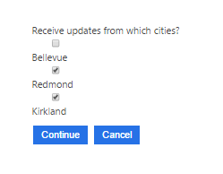
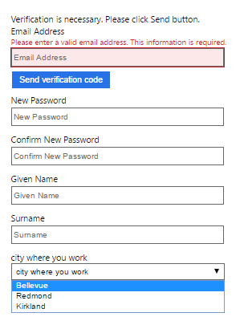

---
title: Modify sign up in custom policies and configure self asserted provider | Microsoft Docs
description: A walkthrough on adding claims to sign up and configure the user input
services: active-directory-b2c
author: davidmu1
manager: mtillman

ms.service: active-directory
ms.workload: identity
ms.topic: conceptual
ms.date: 04/29/2017
ms.author: davidmu
ms.component: B2C
---
# Azure Active Directory B2C: Modify sign up to add new claims and configure user input.

[!INCLUDE [active-directory-b2c-advanced-audience-warning](../../includes/active-directory-b2c-advanced-audience-warning.md)]

In this article, you will add a new user provided entry (a claim) to your signup user journey.  You will configure the entry as a dropdown, and define if it is required.

## Prerequisites

* Complete the steps in the article [Getting Started with Custom Policies](active-directory-b2c-get-started-custom.md).  Test the signup/signin user journey to signup a new local account before proceeding.


Gathering initial data from your users is achieved via signup/signin.  Additional claims can be gathered later via profile edit user journeys. Anytime Azure AD B2C gathers information directly from the user interactively, the Identity Experience Framework uses its `selfasserted provider`. The steps below apply anytime this provider is used.


## Define the claim, its display name and the user input type
Lets ask the user for their city.  Add the following element to the `<ClaimsSchema>` element in the TrustFrameworkBase policy file:

```xml
<ClaimType Id="city">
  <DisplayName>city</DisplayName>
  <DataType>string</DataType>
  <UserHelpText>Your city</UserHelpText>
  <UserInputType>TextBox</UserInputType>
</ClaimType>
```
There are additional choices you can make here to customize the claim.  For a full schema, refer to the **Identity Experience Framework Technical Reference Guide**.  This guide will be published soon in the reference section.

* `<DisplayName>` is a string that defines the user-facing *label*

* `<UserHelpText>` helps the user understand what is required

* `<UserInputType>` has the following four options highlighted below:
    * `TextBox`
```xml
<ClaimType Id="city">
  <DisplayName>city where you work</DisplayName>
  <DataType>string</DataType>
  <UserHelpText>Your city</UserHelpText>
  <UserInputType>TextBox</UserInputType>
</ClaimType>
```

    * `RadioSingleSelectduration` - Enforces a single selection.
```xml
<ClaimType Id="city">
  <DisplayName>city where you work</DisplayName>
  <DataType>string</DataType>
  <UserInputType>RadioSingleSelect</UserInputType>
  <Restriction>
    <Enumeration Text="Bellevue" Value="bellevue" SelectByDefault="false" />
    <Enumeration Text="Redmond" Value="redmond" SelectByDefault="false" />
    <Enumeration Text="Kirkland" Value="kirkland" SelectByDefault="false" />
  </Restriction>
</ClaimType>
```

    * `DropdownSingleSelect` - Allows the selection of only valid value.


```xml
<ClaimType Id="city">
  <DisplayName>city where you work</DisplayName>
  <DataType>string</DataType>
  <UserInputType>DropdownSingleSelect</UserInputType>
  <Restriction>
    <Enumeration Text="Bellevue" Value="bellevue" SelectByDefault="false" />
    <Enumeration Text="Redmond" Value="redmond" SelectByDefault="false" />
    <Enumeration Text="Kirkland" Value="kirkland" SelectByDefault="false" />
  </Restriction>
</ClaimType>
```


* `CheckboxMultiSelect`
Allows for the selection of one or more values.




```xml
<ClaimType Id="city">
  <DisplayName>Receive updates from which cities?</DisplayName>
  <DataType>string</DataType>
  <UserInputType>CheckboxMultiSelect</UserInputType>
  <Restriction>
    <Enumeration Text="Bellevue" Value="bellevue" SelectByDefault="false" />
    <Enumeration Text="Redmond" Value="redmond" SelectByDefault="false" />
    <Enumeration Text="Kirkland" Value="kirkland" SelectByDefault="false" />
  </Restriction>
</ClaimType>
```

## Add the claim to the sign up/sign in user journey

1. Add the claim as an `<OutputClaim ClaimTypeReferenceId="city"/>` to the TechnicalProfile `LocalAccountSignUpWithLogonEmail` (found in the TrustFrameworkBase policy file).  Note this TechnicalProfile uses the SelfAssertedAttributeProvider.

  ```xml
  <TechnicalProfile Id="LocalAccountSignUpWithLogonEmail">
    <DisplayName>Email signup</DisplayName>
    <Protocol Name="Proprietary" Handler="Web.TPEngine.Providers.SelfAssertedAttributeProvider, Web.TPEngine, Version=1.0.0.0, Culture=neutral, PublicKeyToken=null" />
    <Metadata>
      <Item Key="IpAddressClaimReferenceId">IpAddress</Item>
      <Item Key="ContentDefinitionReferenceId">api.localaccountsignup</Item>
      <Item Key="language.button_continue">Create</Item>
    </Metadata>
    <CryptographicKeys>
      <Key Id="issuer_secret" StorageReferenceId="TokenSigningKeyContainer" />
    </CryptographicKeys>
    <InputClaims>
      <InputClaim ClaimTypeReferenceId="email" />
    </InputClaims>
    <OutputClaims>
      <OutputClaim ClaimTypeReferenceId="objectId" />
      <OutputClaim ClaimTypeReferenceId="email" PartnerClaimType="Verified.Email" Required="true" />
      <OutputClaim ClaimTypeReferenceId="newPassword" Required="true" />
      <OutputClaim ClaimTypeReferenceId="reenterPassword" Required="true" />
      <OutputClaim ClaimTypeReferenceId="executed-SelfAsserted-Input" DefaultValue="true" />
      <OutputClaim ClaimTypeReferenceId="authenticationSource" />
      <OutputClaim ClaimTypeReferenceId="newUser" />
      <!-- Optional claims, to be collected from the user -->
      <OutputClaim ClaimTypeReferenceId="givenName" />
      <OutputClaim ClaimTypeReferenceId="surName" />
      <OutputClaim ClaimTypeReferenceId="city"/>
    </OutputClaims>
    <ValidationTechnicalProfiles>
      <ValidationTechnicalProfile ReferenceId="AAD-UserWriteUsingLogonEmail" />
    </ValidationTechnicalProfiles>
    <UseTechnicalProfileForSessionManagement ReferenceId="SM-AAD" />
  </TechnicalProfile>
  ```

2. Add the claim to the AAD-UserWriteUsingLogonEmail as a `<PersistedClaim ClaimTypeReferenceId="city" />` to write the claim to the AAD directory after collecting it from the user. You may skip this step if you prefer not to persist the claim in the directory for future use.

  ```xml
  <!-- Technical profiles for local accounts -->
  <TechnicalProfile Id="AAD-UserWriteUsingLogonEmail">
    <Metadata>
      <Item Key="Operation">Write</Item>
      <Item Key="RaiseErrorIfClaimsPrincipalAlreadyExists">true</Item>
    </Metadata>
    <IncludeInSso>false</IncludeInSso>
    <InputClaims>
      <InputClaim ClaimTypeReferenceId="email" PartnerClaimType="signInNames.emailAddress" Required="true" />
    </InputClaims>
    <PersistedClaims>
      <!-- Required claims -->
      <PersistedClaim ClaimTypeReferenceId="email" PartnerClaimType="signInNames.emailAddress" />
      <PersistedClaim ClaimTypeReferenceId="newPassword" PartnerClaimType="password" />
      <PersistedClaim ClaimTypeReferenceId="displayName" DefaultValue="unknown" />
      <PersistedClaim ClaimTypeReferenceId="passwordPolicies" DefaultValue="DisablePasswordExpiration" />
      <!-- Optional claims. -->
      <PersistedClaim ClaimTypeReferenceId="givenName" />
      <PersistedClaim ClaimTypeReferenceId="surname" />
      <PersistedClaim ClaimTypeReferenceId="city" />
    </PersistedClaims>
    <OutputClaims>
      <OutputClaim ClaimTypeReferenceId="objectId" />
      <OutputClaim ClaimTypeReferenceId="newUser" PartnerClaimType="newClaimsPrincipalCreated" />
      <OutputClaim ClaimTypeReferenceId="authenticationSource" DefaultValue="localAccountAuthentication" />
      <OutputClaim ClaimTypeReferenceId="userPrincipalName" />
      <OutputClaim ClaimTypeReferenceId="signInNames.emailAddress" />
    </OutputClaims>
    <IncludeTechnicalProfile ReferenceId="AAD-Common" />
    <UseTechnicalProfileForSessionManagement ReferenceId="SM-AAD" />
  </TechnicalProfile>
  ```

3. Add the claim to the TechnicalProfile that reads from the directory when a user logs in as an `<OutputClaim ClaimTypeReferenceId="city" />`

  ```xml
  <TechnicalProfile Id="AAD-UserReadUsingEmailAddress">
    <Metadata>
      <Item Key="Operation">Read</Item>
      <Item Key="RaiseErrorIfClaimsPrincipalDoesNotExist">true</Item>
      <Item Key="UserMessageIfClaimsPrincipalDoesNotExist">An account could not be found for the provided user ID.</Item>
    </Metadata>
    <IncludeInSso>false</IncludeInSso>
    <InputClaims>
      <InputClaim ClaimTypeReferenceId="email" PartnerClaimType="signInNames" Required="true" />
    </InputClaims>
    <OutputClaims>
      <!-- Required claims -->
      <OutputClaim ClaimTypeReferenceId="objectId" />
      <OutputClaim ClaimTypeReferenceId="authenticationSource" DefaultValue="localAccountAuthentication" />
      <!-- Optional claims -->
      <OutputClaim ClaimTypeReferenceId="userPrincipalName" />
      <OutputClaim ClaimTypeReferenceId="displayName" />
      <OutputClaim ClaimTypeReferenceId="otherMails" />
      <OutputClaim ClaimTypeReferenceId="signInNames.emailAddress" />
      <OutputClaim ClaimTypeReferenceId="city" />
    </OutputClaims>
    <IncludeTechnicalProfile ReferenceId="AAD-Common" />
  </TechnicalProfile>
  ```

4. Add the `<OutputClaim ClaimTypeReferenceId="city" />` to the RP policy file SignUporSignIn.xml so this claim is sent to the application in the token after a successful user journey.

  ```xml
  <RelyingParty>
    <DefaultUserJourney ReferenceId="SignUpOrSignIn" />
    <TechnicalProfile Id="PolicyProfile">
      <DisplayName>PolicyProfile</DisplayName>
      <Protocol Name="OpenIdConnect" />
      <OutputClaims>
        <OutputClaim ClaimTypeReferenceId="displayName" />
        <OutputClaim ClaimTypeReferenceId="givenName" />
        <OutputClaim ClaimTypeReferenceId="surname" />
        <OutputClaim ClaimTypeReferenceId="email" />
        <OutputClaim ClaimTypeReferenceId="objectId" PartnerClaimType="sub"/>
        <OutputClaim ClaimTypeReferenceId="identityProvider" />
        <OutputClaim ClaimTypeReferenceId="city" />
      </OutputClaims>
      <SubjectNamingInfo ClaimType="sub" />
    </TechnicalProfile>
  </RelyingParty>
  ```

## Test the custom policy using "Run Now"

1. Open the **Azure AD B2C Blade** and navigate to **Identity Experience Framework > Custom policies**.
2. Select the custom policy that you uploaded, and click the **Run now** button.
3. You should be able to sign up using an email address.

The signup screen in test mode should look similar to this:



  The token back to your application will now include the `city` claim as shown below
```json
{
  "exp": 1493596822,
  "nbf": 1493593222,
  "ver": "1.0",
  "iss": "https://contoso.b2clogin.com/f06c2fe8-709f-4030-85dc-38a4bfd9e82d/v2.0/",
  "sub": "9c2a3a9e-ac65-4e46-a12d-9557b63033a9",
  "aud": "4e87c1dd-e5f5-4ac8-8368-bc6a98751b8b",
  "acr": "b2c_1a_trustf_signup_signin",
  "nonce": "defaultNonce",
  "iat": 1493593222,
  "auth_time": 1493593222,
  "email": "joe@outlook.com",
  "given_name": "Joe",
  "family_name": "Ras",
  "city": "Bellevue",
  "name": "unknown"
}
```

## Optional: Remove email verification from signup journey

To skip email verification, the policy author can choose to remove `PartnerClaimType="Verified.Email"`. The email address will be required but not verified, unless “Required” = true is removed.  Carefully consider if this option is right for your use cases!

Verified email is enabled by default in the `<TechnicalProfile Id="LocalAccountSignUpWithLogonEmail">` in the TrustFrameworkBase policy file in the starter pack:
```xml
<OutputClaim ClaimTypeReferenceId="email" PartnerClaimType="Verified.Email" Required="true" />
```

## Next steps

Add the new claim to the flows for social account logins by changing the TechnicalProfiles listed below. These are used by social/federated account logins to write and read the user data using the alternativeSecurityId as the locator.
```xml
<TechnicalProfile Id="AAD-UserWriteUsingAlternativeSecurityId">
<TechnicalProfile Id="AAD-UserReadUsingAlternativeSecurityId">
```
